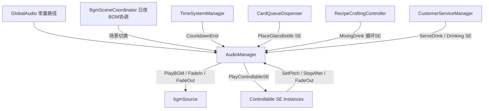
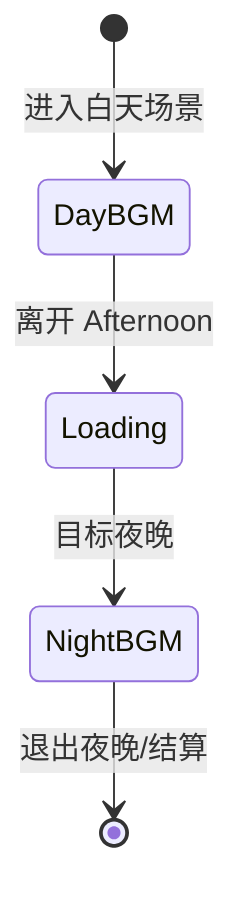
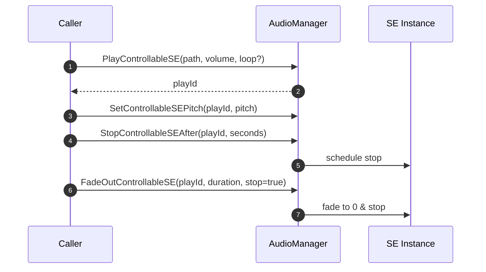
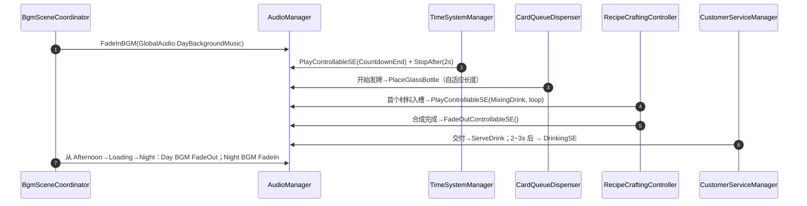

## 音频系统开发文档（BGM/SE/场景联动）

### 1. 功能概述

- 支持白天/夜晚两套 BGM，并基于场景切换淡入淡出。
- 倒计时结束、发牌摆放瓶子、调酒循环、上酒与饮用等 SE 的统一播放与控制。
- 可控音效实例：支持音高调整、延时停止与淡出，避免多个音效重叠与泄漏。

### 2. 架构图

#### 2.1 组件交互详解

- AudioManager：集中管理 BGM 与 SE（可控实例池），避免交叉干扰。
- BgmSceneCoordinator：基于场景名称分类（白天/夜晚/Loading），控制 Day→Night BGM 的淡出/淡入。
- TimeSystemManager：阶段结束前触发倒计时 SE，期间暂停计时，播放完毕后推进阶段。
- 调用方：发牌、合成、服务等系统在关键时点调用 SE 播放与停止。

#### 2.2 BGM 状态机

#### 2.3 SE 可控实例生命周期

### 3. 关键模块与职责

- AudioManager：
  - BGM：专用 `bgmSource` 渠道、`FadeInBGM(path, vol, sec)`、`FadeOutBGM(sec, stop)`。
  - SE：`PlayControllableSE(path, vol, loop)` 返回可控实例 ID；支持 `SetControllableSEPitch(id, pitch)`、`StopControllableSEAfter(id, seconds)`、`FadeOutControllableSE(id, duration, stopAndCleanup)`。
- GlobalAudio：统一音频路径常量（Resources 路径）。
- BgmSceneCoordinator（原 DaytimeBgmController 功能拓展）：按场景白名单与夜晚清单切换 BGM；从 Afternoon → Loading → Night 期间做 Day→Night 的淡出/淡入过渡。
- TimeSystemManager：在阶段结束前 1 秒触发倒计时结束 SE，播放指定时长并推进阶段。
- CardQueueDispenser：发牌开始时播放 `PlaceGlassBottle`；估计发牌窗口长度，音效短则循环，音效长则加速并在窗口末停止。
- RecipeCraftingController：首个材料进入时启动 `MixingDrink` 循环；合成完成或清空时淡出停止。
- CustomerServiceManager：交付后隐藏对话框，先播 `ServeDrink`，2-3 秒后再播一次品尝 SE；仅播放一次饮用音效。

### 4. 资源与路径规范

- 放置路径：`Assets/Resources/Audio/*.mp3`（或 \*.wav）。
- 访问方式：统一由 `GlobalAudio` 常量提供，如 `GlobalAudio.DayBackgroundMusic`。
- 命名建议：动词或语义化名称，避免同名造成引用混乱。

### 5. 接口速查表

| 类           | 方法                                                     | 说明                            |
| ------------ | -------------------------------------------------------- | ------------------------------- |
| AudioManager | FadeInBGM(path, volume, duration, loop=true)             | BGM 淡入，切换时自动 Stop/Start |
| AudioManager | FadeOutBGM(duration, stopAtEnd=true)                     | 当前 BGM 渐隐，可选择结束停止   |
| AudioManager | PlayControllableSE(path, volume, loop=false) -> id       | 播放 SE，返回实例 ID            |
| AudioManager | SetControllableSEPitch(id, pitch)                        | 调整某 SE 实例音高 0.1~3.0      |
| AudioManager | StopControllableSEAfter(id, seconds)                     | 延时停止 SE                     |
| AudioManager | FadeOutControllableSE(id, duration, stopAndCleanup=true) | 对 SE 做淡出                    |

### 6. 典型流程

### 7. 关键要点与排错

- BGM 与 SE 解耦：BGM 仅用 `bgmSource`；SE 使用可控实例池，避免互相影响。
- 防叠音：对长 SE 采用 `StopAfter` 或 `FadeOutControllableSE` 清理；发牌音效根据窗口长度自动循环或加速。
- 场景过渡：Afternoon 退出时淡出 DayBGM，Loading 中淡入 NightBGM，避免硬切。
- 计时干预：倒计时结束音效期间暂停计时，播放后再推进阶段，确保听感完整。
