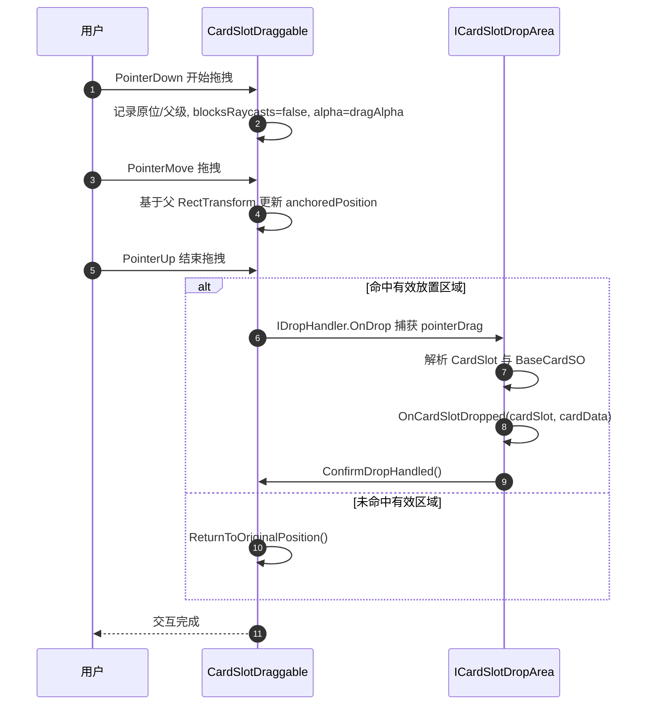
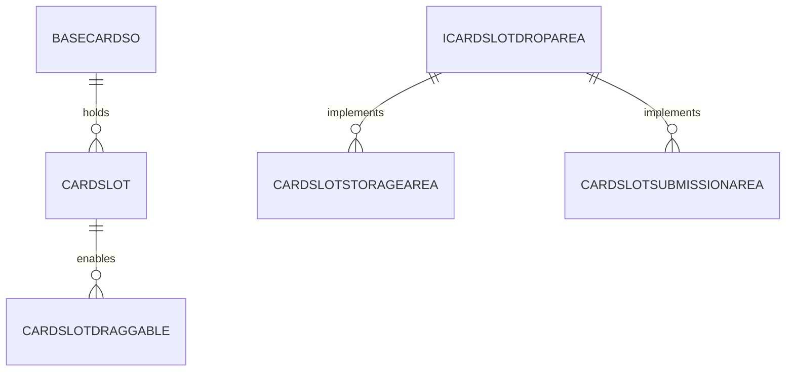
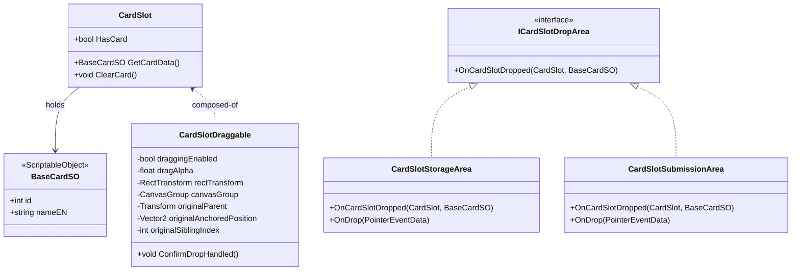

# 卡牌拖拽系统（CardSlot Drag & Drop）

本指南详细说明：在当前卡槽派发系统下，如何配置并使用新的 UI 拖拽与放置机制；并提供功能解析、安装与配置、接口与事件、扩展方式，以及时序图、ER 图、类图等图例。

### 适用范围

- 本系统面向 UI 中的卡槽 `CardSlot` 所承载的卡牌（基于 `BaseCardSO` 数据）
- 适配滚动视图与队列派发：仅当 `CardSlot.HasCard==true` 时允许拖拽
- 放置结果由实现 `ICardSlotDropArea` 的区域决定（存储、提交、销毁、回收等）

### 目录结构

- `Scripts/0_General/0_2_Card Drag&Drop/`
  - `CardSlotDraggable.cs`：给 `CardSlot` 添加 UI 拖拽行为
  - `ICardSlotDropArea.cs`：放置区域接口定义
  - `CardSlotStorageArea.cs`：存储示例区域（把卡槽作为子级挂到本区域）
  - `CardSlotSubmissionArea.cs`：提交示例区域（消费后清空并销毁卡槽）

### 安装与配置

1. 在 `CardSlot` 预制件或场景对象上添加 `CardSlotDraggable`。
2. 确保 `CardSlot` 对象包含：
   - `CardSlot`（已有）；`RectTransform`；`CanvasGroup`（若无会自动添加）
3. 在目标放置区域对象上添加下列之一：
   - `CardSlotStorageArea` 或 `CardSlotSubmissionArea`（二者均实现 `ICardSlotDropArea` 与 `IDropHandler`）
4. 场景需存在 `EventSystem`；UI 根节点需在 `Canvas` 下。

### 交互与行为

- 开始拖拽：记录原父级与 `anchoredPosition`，`blocksRaycasts=false`，`alpha=dragAlpha`，并置于最顶层显示
- 拖拽中：在父 `RectTransform` 的局部空间内，随指针移动
- 结束拖拽：
  - 若命中有效放置区域：区域负责处理数据与对象，并调用 `ConfirmDropHandled()` 阻止回位
  - 否则自动回到原父级与原位置

### 接口与事件

- `ICardSlotDropArea.OnCardSlotDropped(CardSlot, BaseCardSO)`：放置区域必须实现的回调
- `CardSlotDraggable.ConfirmDropHandled()`：由放置区域在处理完成后调用，表示放置已生效
- `CardSlot`：提供 `HasCard`、`GetCardData()`、`ClearCard()` 供拖拽及区域处理使用

### 与队列发牌系统协作

- 发牌由 `CardQueueDispenser` 负责，`CardSlot` 在 `SetCard/ ClearCard` 控制可见与数据
- `CardSlotDraggable` 仅在 `HasCard==true` 时允许拖拽，避免空槽误拖
- 放置区域可根据业务决定是否 `ClearCard()` 或直接销毁 `cardSlot.gameObject`

### 时序图（拖拽主流程）

### ER 图（核心数据关系）

### 类图（核心类型与方法）

