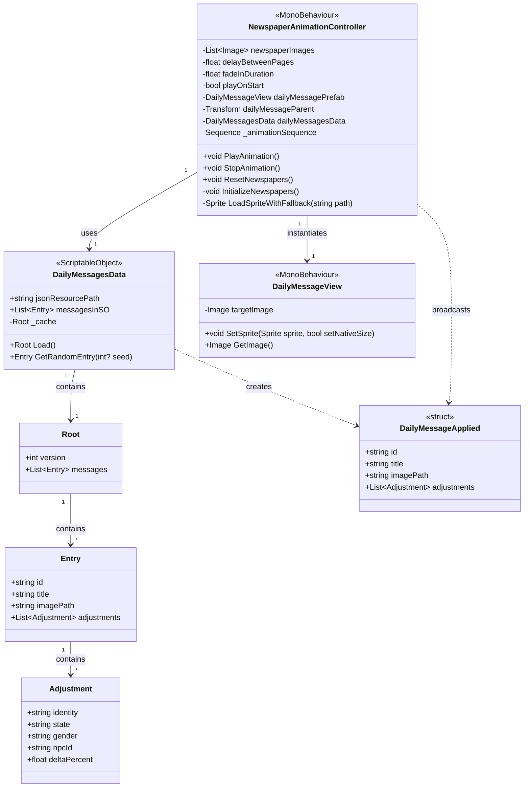
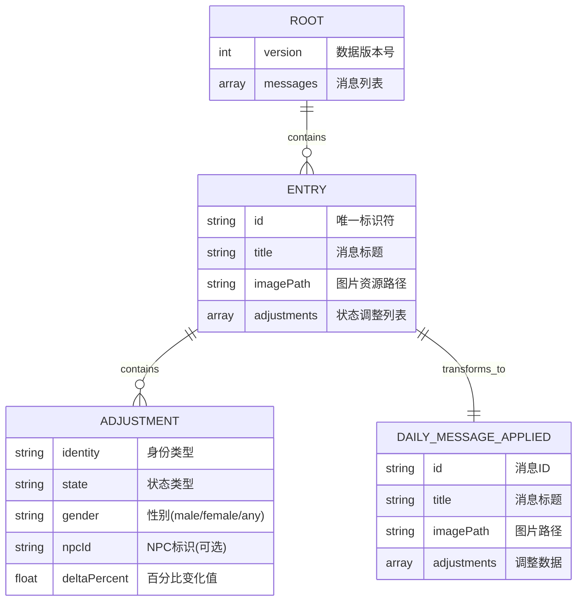
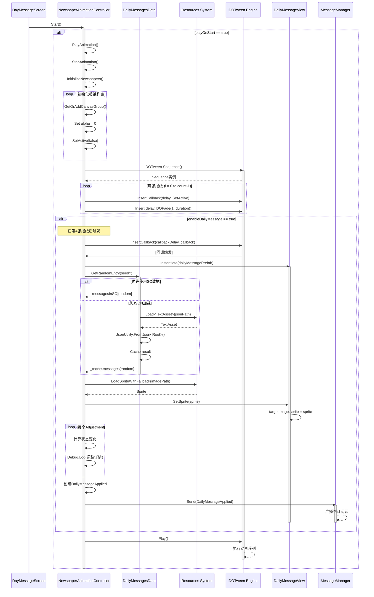
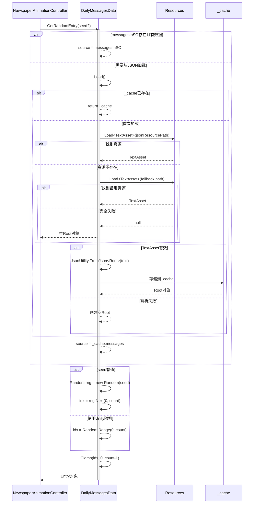
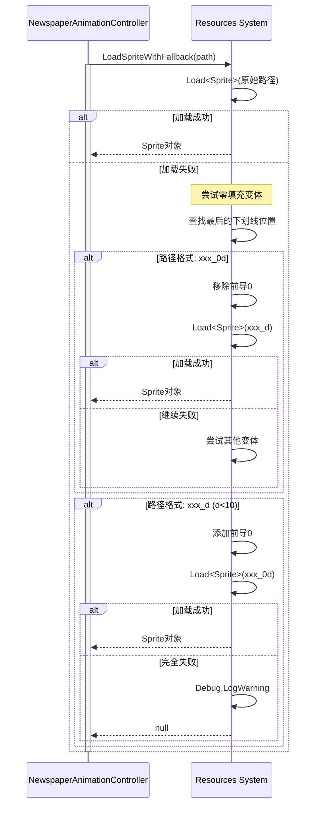

# 每日信息系统 - 开发文档

## 📋 目录

## 功能综述

每日信息系统在每个游戏日开场以 DOTween 报纸翻页动画呈现当日消息，支持来自 JSON 或 SO 的数据源与健壮的回退加载策略，并可按需选择“种子随机”或“真随机”模式；在生成视图并应用图片回退后，会通过消息系统广播当日事件影响，驱动其他模块进行相应的数值或展示更新。

- [系统概述](#系统概述)
- [架构设计](#架构设计)
- [类图](#类图)
- [数据模型 ER 图](#数据模型er图)
- [时序图](#时序图)
- [核心组件说明](#核心组件说明)
- [代码示例](#代码示例)
- [配置指南](#配置指南)
- [最佳实践](#最佳实践)

---

## 系统概述

**每日信息系统**（Daily Message System）是 Taberna-Noctis 游戏中的核心功能模块，负责在每个游戏日开始时向玩家展示当日的新闻事件。该系统通过动态报纸翻页动画呈现视觉效果，并将事件影响应用到游戏状态中。

### 主要功能

- 📰 **报纸动画展示**：通过 DOTween 实现顺序渐入的报纸翻页效果
- 📊 **数据驱动**：从 JSON 配置文件加载每日消息数据
- 🎲 **随机事件**：支持种子随机或真随机选择每日事件
- 📡 **状态广播**：通过消息系统将事件影响广播到游戏其他模块
- 🖼️ **动态 UI**：运行时生成和显示每日消息视图

### 技术栈

- **Unity Engine**：游戏引擎
- **DOTween**：动画补间引擎
- **ScriptableObject**：数据配置系统
- **MessageManager**：事件通信系统
- **Resources 系统**：资源加载

---

## 架构设计

### 设计模式

系统采用以下设计模式：

1. **MVC 模式**

   - **Model**：`DailyMessagesData` - 数据模型和业务逻辑
   - **View**：`DailyMessageView` - UI 视图组件
   - **Controller**：`NewspaperAnimationController` - 控制器和动画逻辑

2. **单一职责原则**

   - 数据加载：`DailyMessagesData`
   - UI 展示：`DailyMessageView`
   - 动画控制：`NewspaperAnimationController`

3. **观察者模式**
   - 通过`MessageManager`实现事件发布/订阅机制

### 系统架构图

```
┌─────────────────────────────────────────────┐
│          DailyMessage Scene                 │
├─────────────────────────────────────────────┤
│                                             │
│  ┌──────────────────────────────────────┐  │
│  │  NewspaperAnimationController        │  │
│  │  (控制器 + 动画编排)                  │  │
│  └──────────────┬───────────────────────┘  │
│                 │                           │
│        ┌────────┴────────┐                  │
│        │                 │                  │
│  ┌─────▼─────┐    ┌─────▼──────────┐       │
│  │ DOTween   │    │ DailyMessages  │       │
│  │ Sequence  │    │ Data (SO)      │       │
│  └───────────┘    └────────┬───────┘       │
│                             │               │
│  ┌──────────────────────────▼───────────┐  │
│  │  DailyMessageView (动态实例化)       │  │
│  └──────────────────────────────────────┘  │
│                                             │
│  ┌──────────────────────────────────────┐  │
│  │  MessageManager (事件广播)           │  │
│  └──────────────────────────────────────┘  │
└─────────────────────────────────────────────┘
```

---

## 类图



---

## 数据模型 ER 图



### 数据关系说明

1. **ROOT** - 根数据结构

   - 包含版本号和消息列表
   - 从 JSON 文件加载

2. **ENTRY** - 消息条目

   - 每个条目代表一个独立的每日事件
   - 包含显示信息（标题、图片）和游戏影响（adjustments）

3. **ADJUSTMENT** - 状态调整

   - 定义事件对游戏状态的具体影响
   - 支持按身份、状态、性别、NPC 筛选
   - deltaPercent 为正值增加，负值减少

4. **DAILY_MESSAGE_APPLIED** - 应用的消息
   - Entry 的运行时表现形式
   - 通过 MessageManager 广播到其他系统

---

## 时序图

### 1. 系统初始化与消息显示流程



### 2. 数据加载详细流程



### 3. 图片资源加载回退机制



---

## 核心组件说明

### 1. DailyMessagesData (ScriptableObject)

**职责**：数据管理和加载

#### 核心字段

```csharp
// 资源路径配置
[Header("Source JSON (Resources)")]
public string jsonResourcePath = "DailyMessage/DailyMessages"; // 不含.json扩展名

// 可选的直接数据存储
[Header("Data (filled from JSON)")]
public List<Entry> messagesInSO = new List<Entry>();

// 内部缓存
private Root _cache;
```

#### 核心方法

**Load() - 加载数据**

- 从 Resources 加载 JSON 文件
- 使用 JsonUtility 反序列化
- 实现缓存机制避免重复加载
- 支持回退路径

**GetRandomEntry(int? seed) - 获取随机条目**

- 优先使用`messagesInSO`中的数据
- 支持种子随机（可复现）
- 支持 Unity 真随机
- 返回随机选择的 Entry

#### 数据结构

```csharp
[Serializable]
public class Root
{
    public int version;              // 数据版本号
    public List<Entry> messages;     // 消息列表
}

[Serializable]
public class Entry
{
    public string id;                          // 唯一标识
    public string title;                       // 标题
    public string imagePath;                   // 图片路径 (Resources)
    public List<Adjustment> adjustments;       // 状态调整列表
}

[Serializable]
public class Adjustment
{
    public string identity;          // 身份 (如: worker, noble)
    public string state;            // 状态 (如: happiness, health)
    public string gender;           // 性别 (male/female/any)
    public string npcId;            // NPC ID (可选)
    public float deltaPercent;      // 百分比变化 (+/-)
}

[Serializable]
public struct DailyMessageApplied
{
    public string id;
    public string title;
    public string imagePath;
    public List<Adjustment> adjustments;
}
```

---

### 2. NewspaperAnimationController (MonoBehaviour)

**职责**：动画控制和消息生成

#### 配置参数

```csharp
[Title("报纸图片配置")]
[SerializeField] private List<Image> newspaperImages;  // 报纸图片列表

[Title("显示配置")]
[SerializeField] private float delayBetweenPages = 0.3f;     // 页面间延迟
[SerializeField] private float fadeInDuration = 0.5f;        // 淡入时长
[SerializeField] private bool playOnStart = true;            // 自动播放
[SerializeField] private Ease fadeEase = Ease.OutQuad;       // 缓动曲线

[Title("每日消息预制件")]
[SerializeField] private DailyMessageView dailyMessagePrefab;
[SerializeField] private Transform dailyMessageParent;
[SerializeField] private DailyMessagesData dailyMessagesData;
[SerializeField] private bool enableDailyMessage = false;
[SerializeField] private bool useSeed = false;
[SerializeField] private int seed = 0;
```

#### 核心方法

**PlayAnimation() - 播放动画**

1. 停止现有动画
2. 初始化所有报纸为不可见
3. 创建 DOTween Sequence
4. 为每张报纸添加淡入动画（延迟递增）
5. 在第 4 张报纸后生成每日消息
6. 加载图片并设置到 View
7. 广播消息影响

**LoadSpriteWithFallback(string path) - 图片加载回退**

- 尝试加载原始路径
- 支持 `_0d` ↔ `_d` 格式互换
- 处理零填充的数字后缀

**InitializeNewspapers() - 初始化报纸**

- 为每张报纸添加 CanvasGroup
- 设置 alpha 为 0
- 禁用 GameObject

---

### 3. DailyMessageView (MonoBehaviour)

**职责**：UI 视图展示

#### 核心实现

```csharp
public class DailyMessageView : MonoBehaviour
{
    [SerializeField] private Image targetImage;

    public void SetSprite(Sprite sprite, bool setNativeSize = false)
    {
        if (targetImage == null) return;
        targetImage.sprite = sprite;
        if (setNativeSize && sprite != null)
            targetImage.SetNativeSize();
        if (!targetImage.gameObject.activeSelf)
            targetImage.gameObject.SetActive(true);
    }

    public Image GetImage() => targetImage;
}
```

**特点**：

- 简单轻量的视图组件
- 仅负责 UI 展示
- 由 Controller 动态实例化
- 支持原始尺寸设置

---

## 代码示例

### 示例 1：DOTween 动画序列构建

```csharp
// 创建动画序列
_animationSequence = DOTween.Sequence();

for (int i = 0; i < newspaperImages.Count; i++)
{
    Image newspaper = newspaperImages[i];
    if (newspaper == null) continue;

    // 计算延迟时间（每张报纸递增）
    float delay = i * delayBetweenPages;

    // 获取或添加CanvasGroup
    CanvasGroup canvasGroup = GetOrAddCanvasGroup(newspaper);
    canvasGroup.alpha = 0;

    // 捕获变量避免闭包问题
    Image capturedNewspaper = newspaper;
    CanvasGroup capturedGroup = canvasGroup;

    // 在指定时间激活GameObject
    _animationSequence.InsertCallback(delay, () =>
    {
        if (capturedNewspaper != null)
        {
            capturedNewspaper.gameObject.SetActive(true);
        }
    });

    // 插入淡入动画
    _animationSequence.Insert(delay,
        capturedGroup.DOFade(1f, fadeInDuration).SetEase(fadeEase));
}

// 播放序列
_animationSequence.Play();
```

**关键点**：

- 使用`Insert()`在特定时间插入动画
- 使用`InsertCallback()`在特定时间执行回调
- 捕获循环变量避免闭包陷阱
- 使用`SetEase()`设置缓动效果

---

### 示例 2：随机消息获取

```csharp
public Entry GetRandomEntry(int? seed = null)
{
    // 优先使用SO中的数据
    List<Entry> source = (messagesInSO != null && messagesInSO.Count > 0)
        ? messagesInSO
        : null;

    // 如果SO无数据，从JSON加载
    if (source == null)
    {
        var root = Load();
        if (root.messages == null || root.messages.Count == 0)
            return null;
        source = root.messages;
    }

    // 根据是否有种子选择随机方式
    if (seed.HasValue)
    {
        // 可复现的随机
        var rng = new System.Random(seed.Value);
        int idx = rng.Next(0, source.Count);
        return source[Mathf.Clamp(idx, 0, source.Count - 1)];
    }
    else
    {
        // Unity真随机
        int idx = UnityEngine.Random.Range(0, source.Count);
        return source[Mathf.Clamp(idx, 0, source.Count - 1)];
    }
}
```

**关键点**：

- 双重数据源（SO vs JSON）
- 可选种子随机
- 安全的索引范围限制

---

### 示例 3：图片路径回退加载

```csharp
private Sprite LoadSpriteWithFallback(string path)
{
    // 1) 尝试原始路径
    var sp = Resources.Load<Sprite>(path);
    if (sp != null) return sp;

    // 2) 如果末尾为 _0d 或 _d，尝试去掉/添加前导0
    int us = path.LastIndexOf('_');
    if (us >= 0 && us < path.Length - 1)
    {
        var suffix = path.Substring(us + 1);
        if (int.TryParse(suffix, out var n))
        {
            // 格式: xxx_0d → xxx_d
            if (suffix.Length == 2 && suffix[0] == '0')
            {
                var alt = path.Substring(0, us + 1) + n.ToString();
                sp = Resources.Load<Sprite>(alt);
                if (sp != null) return sp;
            }
            // 格式: xxx_d → xxx_0d (d < 10)
            else if (suffix.Length == 1 && n < 10)
            {
                var alt = path.Substring(0, us + 1) + "0" + suffix;
                sp = Resources.Load<Sprite>(alt);
                if (sp != null) return sp;
            }
        }
    }

    Debug.LogWarning($"[Newspaper] Sprite not found. Tried: {path} and zero-padding variants.");
    return null;
}
```

**应用场景**：

- 处理不一致的资源命名
- 支持 `image_06` 和 `image_6` 双格式
- 提供友好的错误提示

---

### 示例 4：消息广播

```csharp
// 在第4张报纸后的回调中
_animationSequence.InsertCallback(callbackDelay, () =>
{
    // 实例化视图
    var parent = dailyMessageParent != null ? dailyMessageParent : transform;
    var view = Instantiate(dailyMessagePrefab, parent);
    view.gameObject.SetActive(true);

    // 获取随机条目
    var entry = dailyMessagesData.GetRandomEntry(useSeed ? (int?)seed : null);
    if (entry == null) return;

    // 加载并设置图片
    Sprite sprite = !string.IsNullOrEmpty(entry.imagePath)
        ? LoadSpriteWithFallback(entry.imagePath)
        : null;
    view.SetSprite(sprite);

    // 打印调整信息（示例：5个状态平均分配，每状态初始20%）
    if (entry.adjustments != null)
    {
        foreach (var a in entry.adjustments)
        {
            float before = 20f;
            float after = Mathf.Max(0f, before + a.deltaPercent);
            Debug.Log($"[每日消息] {entry.id}《{entry.title}》| " +
                     $"身份:{a.identity} 状态:{a.state} 性别:{a.gender} " +
                     $"NPC:{a.npcId} | 调整前后: {before:F1}% → {after:F1}% " +
                     $"(变化 {a.deltaPercent:+0.0;-0.0;0.0}%)");
        }
    }

    // 广播消息
    var payload = new DailyMessagesData.DailyMessageApplied
    {
        id = entry.id,
        title = entry.title,
        imagePath = entry.imagePath,
        adjustments = entry.adjustments
    };
    MessageManager.Send(payload);
});
```

**关键点**：

- 动态实例化视图
- 打印调试信息
- 通过 MessageManager 解耦通信

---

## 配置指南

### 1. JSON 数据配置

在`Resources/DailyMessage/DailyMessages.json`创建配置文件：

```json
{
  "version": 1,
  "messages": [
    {
      "id": "news_001",
      "title": "城市酒水税上涨",
      "imagePath": "DailyMessage/news_01",
      "adjustments": [
        {
          "identity": "worker",
          "state": "happiness",
          "gender": "any",
          "npcId": "",
          "deltaPercent": -5.0
        },
        {
          "identity": "noble",
          "state": "satisfaction",
          "gender": "any",
          "npcId": "",
          "deltaPercent": 3.0
        }
      ]
    },
    {
      "id": "news_002",
      "title": "新酒谱流行",
      "imagePath": "DailyMessage/news_02",
      "adjustments": [
        {
          "identity": "any",
          "state": "curiosity",
          "gender": "any",
          "npcId": "",
          "deltaPercent": 8.0
        }
      ]
    }
  ]
}
```

**字段说明**：

- `version`：数据版本号，用于未来升级
- `id`：唯一标识符，建议使用前缀
- `title`：标题，支持本地化
- `imagePath`：Resources 路径（无扩展名）
- `adjustments`：状态调整数组
  - `identity`：身份类型（worker/noble/any）
  - `state`：状态类型（happiness/health/satisfaction 等）
  - `gender`：性别筛选（male/female/any）
  - `npcId`：特定 NPC ID（可选）
  - `deltaPercent`：百分比变化（正负值）

---

### 2. ScriptableObject 配置

创建 DailyMessagesData 资产：

1. 右键 → Create → TN → DailyMessage → DailyMessagesData
2. 配置 JSON 路径：`DailyMessage/DailyMessages`
3. （可选）直接在`messagesInSO`中添加数据

**优先级**：

```
messagesInSO (SO直接数据) > JSON文件数据
```

---

### 3. 场景配置

在`2_DayMessageScreen`场景中：

```
NewspaperAnimationController (GameObject)
├─ Newspaper Images (List)
│  ├─ Image_01
│  ├─ Image_02
│  ├─ Image_03
│  └─ Image_04
├─ Daily Message Prefab: [DailyMessageView Prefab]
├─ Daily Message Parent: [Canvas Transform]
├─ Daily Messages Data: [DailyMessagesData SO]
└─ Settings
   ├─ Delay Between Pages: 0.3
   ├─ Fade In Duration: 0.5
   ├─ Play On Start: true
   ├─ Enable Daily Message: true
   ├─ Use Seed: false (测试时可启用)
   └─ Seed: 12345
```

---

### 4. Prefab 配置

**DailyMessageView Prefab 结构**：

```
DailyMessageView (Root)
└─ Image (UI Component)
   ├─ RectTransform (配置位置大小)
   └─ Image Component (Sprite渲染)
```

**必需组件**：

- `DailyMessageView`脚本
- 引用的`Image`组件

---

## 最佳实践

### 1. 性能优化

**缓存机制**

```csharp
// DailyMessagesData中的缓存
private Root _cache;

public Root Load()
{
    if (_cache != null) return _cache;  // 避免重复加载
    // ... 加载逻辑
}
```

**对象池（建议）**

```csharp
// 如果频繁创建DailyMessageView，考虑使用对象池
// TODO: 实现对象池避免GC
```

---

### 2. 错误处理

**资源加载**

```csharp
// 始终检查null
var ta = Resources.Load<TextAsset>(path);
if (ta == null)
{
    Debug.LogWarning($"TextAsset not found: {path}");
    // 尝试备用路径或返回默认值
}
```

**JSON 解析**

```csharp
try
{
    _cache = JsonUtility.FromJson<Root>(ta.text);
}
catch (Exception e)
{
    Debug.LogError($"JSON parse error: {e.Message}");
    _cache = new Root { version = 1, messages = new List<Entry>() };
}
```

---

### 3. 调试技巧

**启用种子随机**

```csharp
// 在Inspector中设置
useSeed = true;
seed = 12345;  // 每次运行获得相同结果
```

**日志输出**

```csharp
// 详细的调整日志
Debug.Log($"[每日消息] {entry.id}《{entry.title}》| " +
         $"身份:{a.identity} 状态:{a.state} | " +
         $"变化: {a.deltaPercent:+0.0;-0.0;0.0}%");
```

**预览 JSON 数据**

```csharp
// 在Load()方法中添加预览
if (_cache.messages.Count == 0)
{
    string preview = ta.text.Length > 200
        ? ta.text.Substring(0, 200) + "..."
        : ta.text;
    Debug.LogWarning($"Loaded JSON but empty. Preview:\n{preview}");
}
```

## 附录

### A. 依赖项

- **DOTween** (v1.x+)：动画引擎
- **Unity UI** (UGUI)：UI 系统
- **TextMeshPro** (可选)：文本渲染

### B. 相关文件路径

```
Assets/
├── Scripts/2_DayMessageScreen/
│   ├── DailyMessagesData.cs
│   ├── DailyMessageView.cs
│   └── NewspaperAnimationController.cs
├── Resources/DailyMessage/
│   ├── DailyMessages.json
│   ├── news_01.png
│   └── news_02.png
├── Prefabs/
│   └── DailyMessageView.prefab
└── Scenes/
    └── 2_DayMessageScreen.unity
```

### C. 消息类型定义

```csharp
// 游戏中可能的身份类型
public enum Identity
{
    Any,
    Worker,
    Noble,
    Merchant,
    Criminal
}

// 可能的状态类型
public enum State
{
    Happiness,
    Health,
    Satisfaction,
    Curiosity,
    Stress,
    Wealth
}

// 性别类型
public enum Gender
{
    Any,
    Male,
    Female
}
```

---

## 总结

每日信息系统是一个设计良好的模块化系统，具有以下特点：

✅ **数据驱动**：JSON 配置便于策划调整  
✅ **可扩展性**：清晰的接口和消息系统  
✅ **动画效果**：流畅的 DOTween 动画  
✅ **容错处理**：完善的错误处理和回退机制  
✅ **调试友好**：详细的日志和种子随机支持

该系统为游戏的每日事件提供了稳定的基础，并可轻松扩展到其他类似场景。

---

**文档版本**：1.0  
**最后更新**：2025-10-15  
**项目**：Taberna-Noctis
