\<Taberna Noctis\> \-- (夜之小酒馆)

**游戏简介:**

《Taberna
Noctis》是一款单人开发的横板扁平风模拟经营 × 料理卡牌游戏。画面以简洁色块、俐落线条与柔和渐变构成，呈现出现代感十足的深夜酒馆.

在游戏中, 白天你需要在酒馆中进行进货,备货, 准备好一切晚上经营的所有需要,
然后可以研发菜单, 丰富自己店内酒饮的种类,
通过不同材料的混搭获得不同的效果,
然后从中挑选出最适合当天晚上顾客喜欢的类型上架菜单进行销售

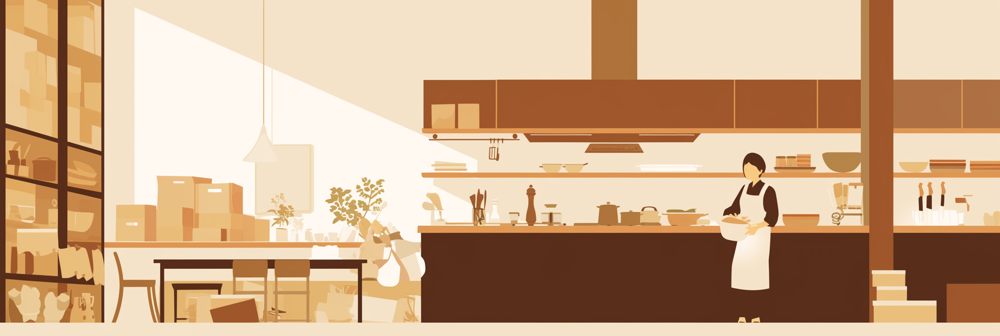
在游戏中, 晚上你则是一位资深的调酒师,
根据白天研发的酒饮种类总含有的不同效果,不同数值,
为不同状态的顾客提供相应的酒饮满足他们的心情需求,
当顾客满意后将会为你的酒馆增加评价分数.
当在一定时间内达到一定的分数即可获得评选星级酒馆,
并获得一定的资金奖励和特殊酒饮配方

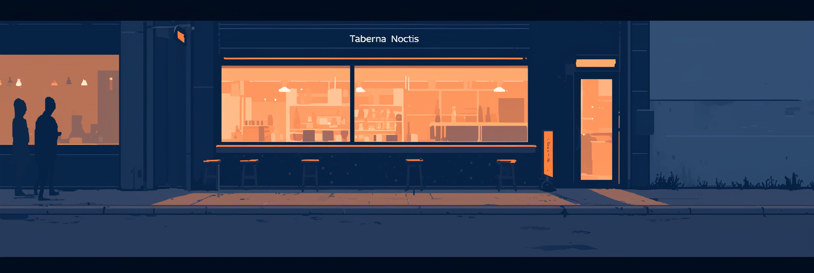

**灵感来源:**

| 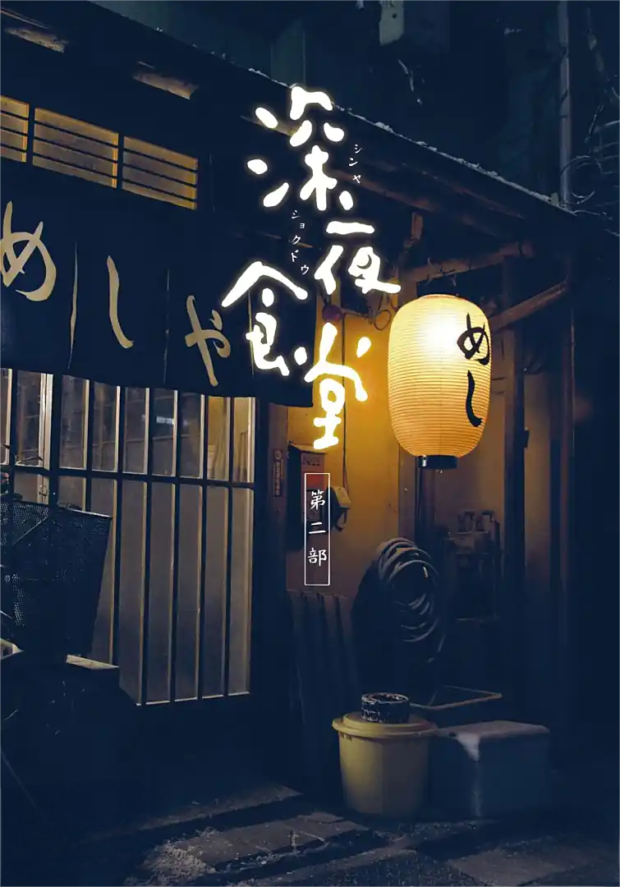 _灵感点 1_ |  _灵感点 2_ | 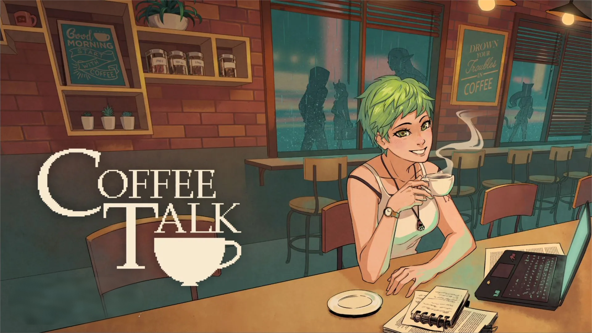 _灵感点 3_ |     |
| :----------------------------------------------: | :----------------------------------------------: | :----------------------------------------------: | :-: |

组合式灵感来源

1.  **深夜治愈系叙事**

《深夜食堂》×《Midnight Diner》

------以"一杯酒一个故事"的单元剧结构，为每位顾客留下微小却深刻的人生切片。

2.  **极简横板经营节奏**

《Mini Metro》×《Good Pizza, Great Pizza》

------横向空间一眼看完，进货---备货---上架---服务的循环在一条时间轴内完成，零学习成本。

3.  **卡牌式调酒策略**

《Slice & Dice》×《Coffee Talk》

------把"配方"抽象成卡牌数值（甜度、酒精度、风味标签），顾客状态=敌人
Buff，调酒=出牌解谜。

4.  **现代扁平视觉符号**

Dropbox 2018 品牌插画系统

------限定 16
色以内、禁用渐变与投影，直接给出了如何在不失温度的情况下保持极简配色的方法论。

**故事背景:**

在霓虹从不熄灭的未来都市"新宵京"，由于高压力的生活社会环境，人们的生活压力极大。你受不了在公司中漫无天日的工作，受老板和上司的欺压决定辞职学习一些技术成为了一位调酒师并接手一家专为打工人开放的小酒馆，为顾客提供能够缓解生活压力的酒饮。酒馆位于一条安静的街道，　很多时候都像是每一个疲惫的打工人一个温暖的港湾，为他们提供减轻压力的小小帮助。

这家酒馆位于一处不算偏僻的街道，店外面的灯牌与一张写着「Taberna
Noctis」的金属铭牌，却能在夜里把整条街染成低饱和的靛青。人们说，那颜色像凌晨四点的系统更新条，缓慢却笃定地把"崩溃"覆盖成"重启"

条例规定：

• 营业时间 23:00--05:00；

• 顾客从店外面走到吧台，向你描述自己的心情状况；

• 需要根据自己的现有的材料为顾客量心打造一款酒饮减少他的压力；

在吧台中你摆放了一系列的制作材料、一本小小配方小册和一份简单的菜单，菜单上有根据上一任老板写下的一些酒饮的名字，你可以根据现有的材料制作出顾客心意的酒饮。

顾客弹出对话框描述今天的心情，然后调酒师需要根据心情调配酒品。

你根据排列组合把对应材料划入摇壶------

蓝色 = 压力／抑郁，粉色 = 疲惫，青色 = 焦虑，红色＝急躁

摇出的鸡尾酒就正好能够对应顾客的心情，等顾客喝完后她的心情会变得好受些，　然后留下费用离开，并给出一个评价分数。

每天的白天则是店休日，每次晚上开店时，你都会用刮刀把前一天的酒饮菜单刮去，写出根据当天进货时材料得到的酒饮，像给城市的零部件更换当天到货的新润滑剂。

每天白天，你会选择在起床后就进入后厨进行进货，采购今天晚上需要的材料；有时你会看看新闻了解今天发生了什么。然后根据今天的情况调整进货的材料，并根据小配方册选出适合今天心情状态的饮品。

每卖出一杯酒，进度条就向前推进。你从不解释进度条的真实长度，

只在每次打烊后，把最后一滴酒倒进水槽。

水流冲走残渣，也冲走城市 0.01% 的崩溃。

然后你把窗擦净，像把代码回滚到零，

等待下一位顾客，用不同的饮品重新编译人们的夜晚。

**游戏玩法：**

白天：

玩家会进入后方的厨房开始清点材料同时出现一个进货界面，根据你拥有的金钱以及看到的一些新闻信息来决定需要购买什么样的材料，购买材料后可以选择研发饮品，通过添加三样不同的材料制作出饮品。饮品的效果将会由添加材料的先后顺序，添加的份量来决定饮品中对应材料的不同效果

夜晚：

夜晚酒馆开始营业，调酒师需要等待顾客的到来。当顾客出现在界面时，会显示他现在的状态＜忙碌的＞＜急躁的＞＜烦闷的＞＜挑剔的＞＜友好的＞。　调酒师需要根据你的配方挑选出最适合他们的饮品。因为每种饮品的材料间的差异化导致每种饮品的效果不同，顾客则会根据自己恢复的心情值来给出金钱------饮品费用+小费（小费就是根据当前增加的心情值（心情增量"ΔM 可正可负）\*一个倍率增加），如果时降低心情值则不好减少总的金额。

**用例图（Use Case）**

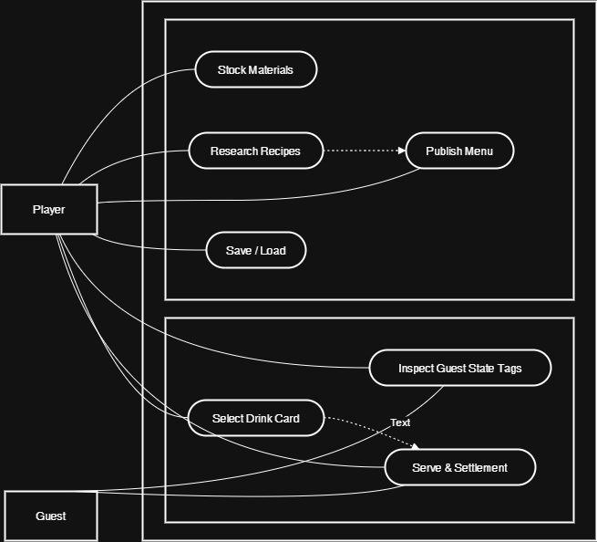

**卡牌交互时序图（Sequence）**

**夜晚出杯状态机（State Machine）**

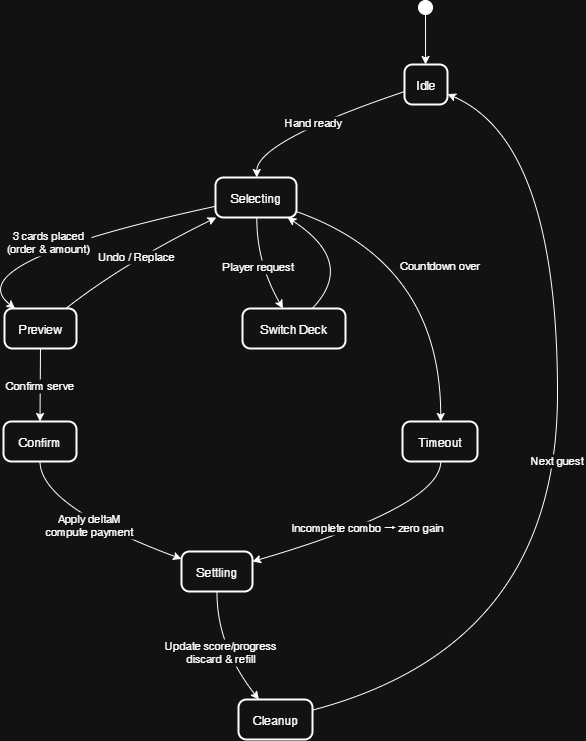

**一天流程：**

- 开始新的一天：查看昨夜结算（资金、评价、解锁配方）→ 浏览今日新闻/提示，获取顾客偏好线索；
- 白天（进货与研发）：清点库存与资金 → 打开进货界面采购材料 → 选择三种材料并设定顺序/份量进行研发 → 形成候选菜单并筛选出今晚的上架饮品；
- 夜晚（营业 180 秒）：顾客每 25~35 秒到店，展示状态与身份倍率 → 依据配方或临时组合调酒出杯，提高顾客心情 → 结算付费并推进进度条；
- 打烊：汇总当晚收益、评价与解锁内容 → 刮除旧菜单，为次日重新上架做准备，存档。

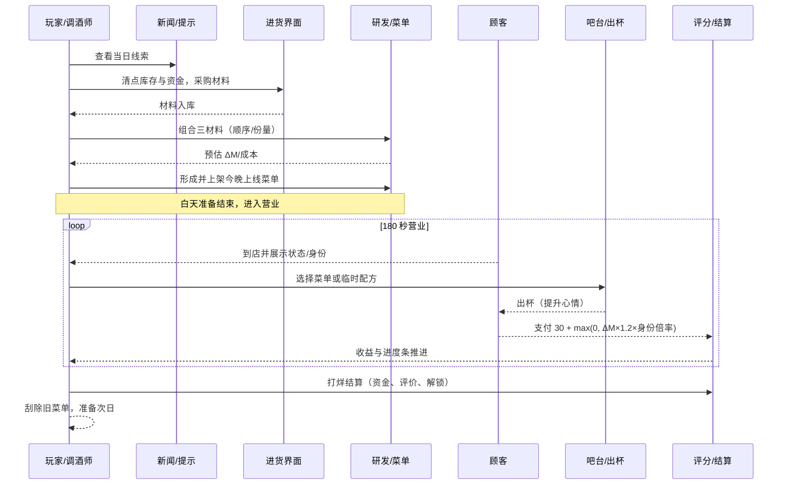

**数值设计：**

通用常量

• 初始金钱：500

• 单局营业时长（夜晚）：180 秒（现实 3 分钟）

• 顾客生成间隔：25\~35 秒随机

• 顾客基础付费：30 （假设饮品费）

• 小费倍率：1.2（心情增量 ≥1 时触发，向下取整）

初始心情值表格

---

    状态／身份     公司职员    小领导     自由职业者    暴发户    大学生

    ＜忙碌的＞        3           4           5            6         6

    ＜急躁的＞        2           3           4            5         5

    ＜烦闷的＞        4           3           3            4         4

    ＜挑剔的＞        4           5           4            6         3

    ＜友好的＞        7           8           8            8         9

---

16 种材料以及 8 种鸡尾酒的数值设计

酒类及材料信息表

---

**序号** **材料中文名** **忙碌** **急躁** **烦闷** **挑剔** **友好** **单价**

      1            金酒            0          -1         0          +2         +1         25

      2           伏特加           -1         -1         +1         0          0          20

      3           白朗姆           -1         0          0          -1         +2         22

      4           龙舌兰           -1         -2         -1         +1         0          24

      5         波本威士忌         +2         0          -1         -1         +1         30

      6         黑麦威士忌         +2         -1         0          +1         0          32

      7          干味美思          0          0          -1         +2         0          18

      8          甜味美思          0          +1         0          +2         +1         18

      9         橙皮利口酒         0          -1         0          +1         +2         15

      10          金巴利           0          +2         -1         +2         -1         20

      11       安高天娜苦精        +1         +1         -1         +1         0          5

      12          单糖浆           -1         +1         +1         0          +1         3

      13           青柠            -2         -1         +1         +1         0          4

      14           柠檬            -2         -1         0          0          +1         4

      15          苏打水           -2         +1         +2         0          +1         2

      16           可乐            -1         +1         +2         -1         +2         3

---

鸡尾酒信息表

---

        **鸡尾酒名**         **忙碌**   **急躁**   **烦闷**   **挑剔**   **友好**   **成本**   **售价**

       Martini 马天尼           +1         -2         -2         +4         +1         48         72

      Manhattan 曼哈顿          +3         0          -1         +4         +1         55         82

     Old Fashioned 古典         +2         +2         -1         0          +2         38         57

     Margarita 玛格丽特         -4         -4         0          +3         +2         46         69

       Daiquiri 戴基里          -4         -2         +1         +1         +3         29         43

Moscow Mule 莫斯科骡子 -5 -1 +3 +1 +1 31 46

      Negroni 尼格罗尼          +1         +3         -2         +5         0          63         94

     Cuba Libre 自由古巴        -4         +1         +2         -2         +4         32         48

---

身份倍率：

公司职员 1.0 / 小领导 1.2 / 自由职业者 1.1 / 暴发户 1.5 / 大学生 0.9

饮品效果计算公式

- 计算每材料"S ｅｑｕｅｎｃｅ值" = 强度 × 顺序权重

- 汇总三种材料的同类方向值，得到最终"心情增量"ΔM（可正可负）

- 结算

  顾客最终心情 = 初始心情 + ΔM

  付费 = 饮品价格（假设３０） + max(0, ΔM × 小费倍率 × 身份倍率)

**ER 图（数据模型）**

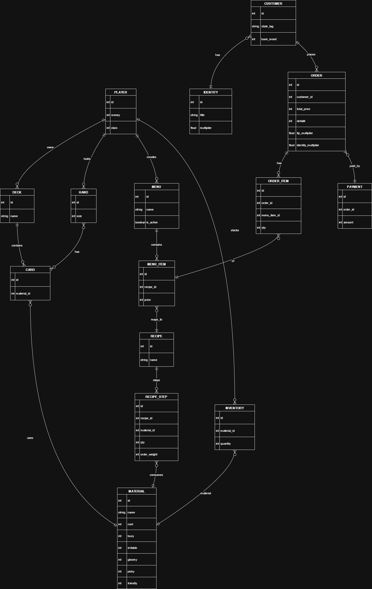

**美术设计：**

## 材料设计

|           _金酒 (GIN)_          |        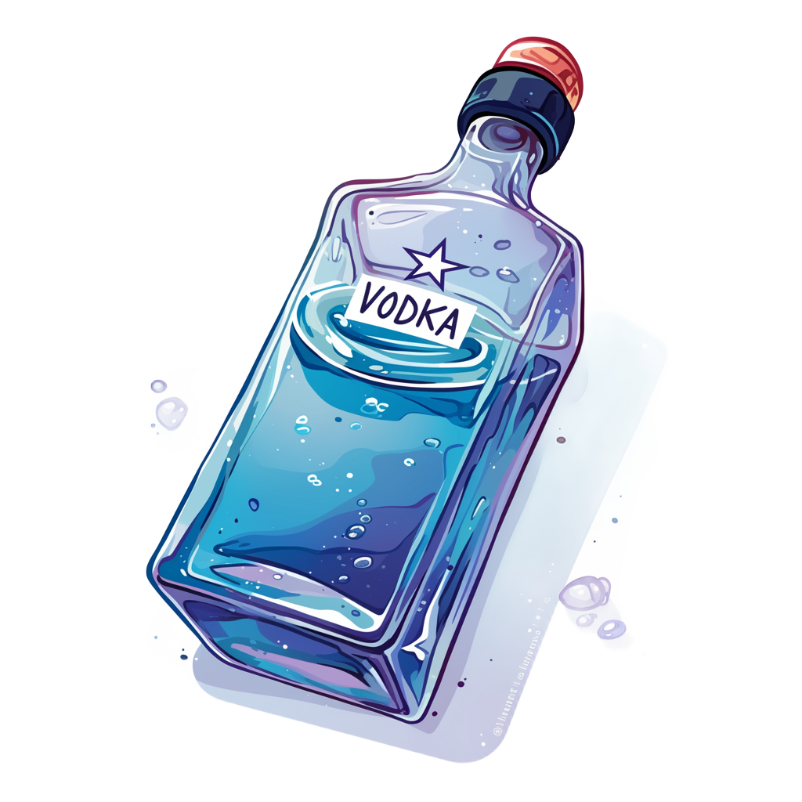 _伏特加 (VODKA)_        |           _龙舌兰 (TEQUILA)_          |  _波本威士忌 (BOURBON)_ |
| :------------------------------------------------------------------: | :------------------------------------------------------------------------: | :--------------------------------------------------------------------------------: | :--------------------------------------------------------------------------: |
|  _黑麦威士忌 (RYE)_ |  _橙皮利口酒 (CITRUS)_ | 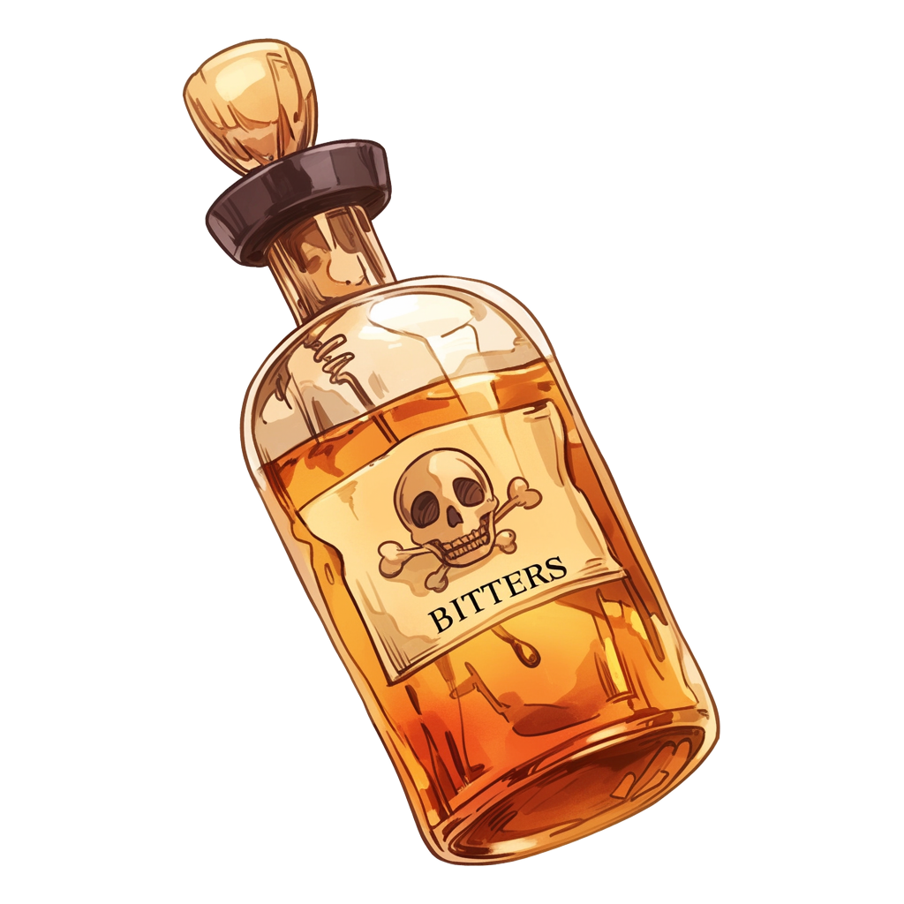 _安高天娜苦精 (BITTERS)_ |        _金巴利 (CAMPARI)_       |
|     _干味美思 (DRY)_    |      _甜味美思 (SWEET)_     |                   _单糖浆_                  |                  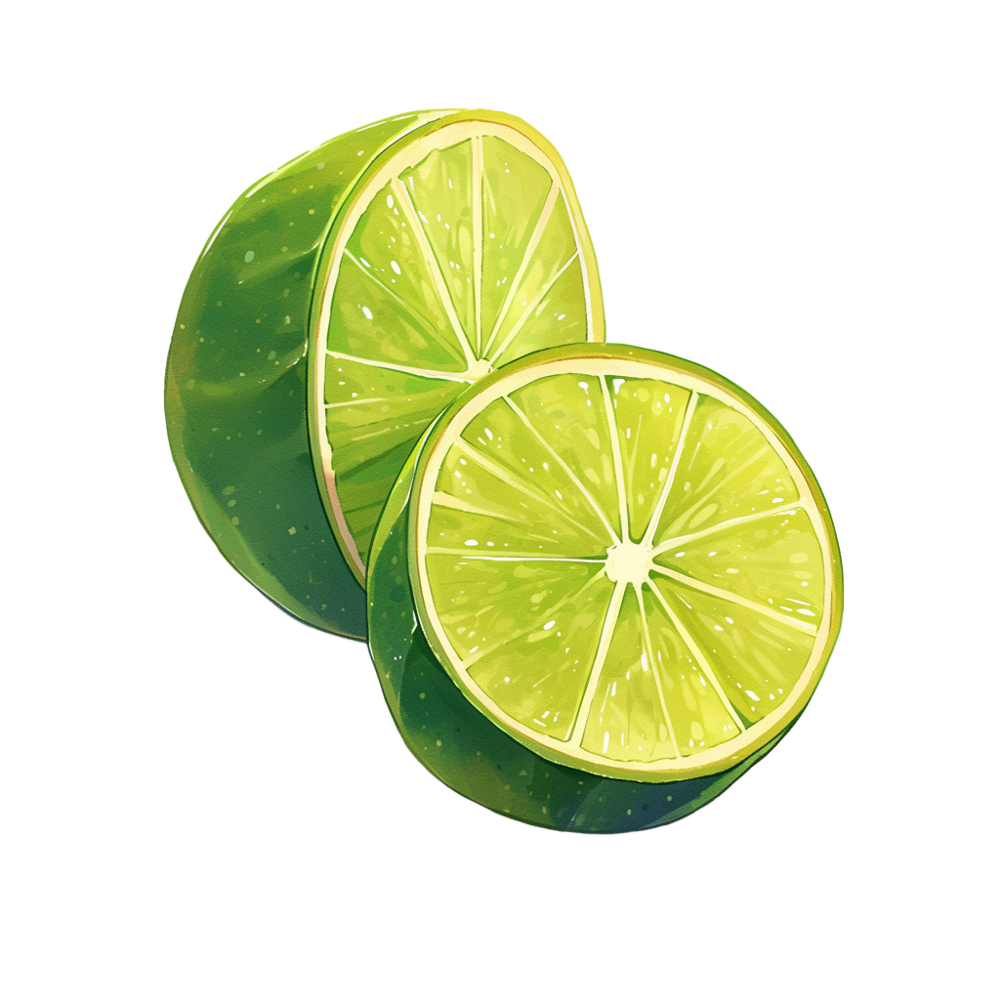 _青柠_                  |
|               _柠檬_              |         _苏打水 (SODA)_         |                                                                                    |                                                                              |

## 鸡尾酒设计

|              _马天尼 (Martini)_              |  _玛格丽特 (Margarita)_ |         _曼哈顿 (Manhattan)_        |      _戴基里 (Daiquiri)_     |
| :----------------------------------------------------------------------------------: | :-----------------------------------------------------------------: | :-------------------------------------------------------------------------: | :------------------------------------------------------------------: |
|              _古典 (Old Fashioned)_              |   _尼格罗尼 (Negroni)_  |  _莫斯科骡子 (Moscow Mule)_ |  _自由古巴 (Cuba Libre)_ |
|  _不可描述之物 (特制神秘鸡尾酒)_ |                                                                     |                                                                             |                                                                      |
