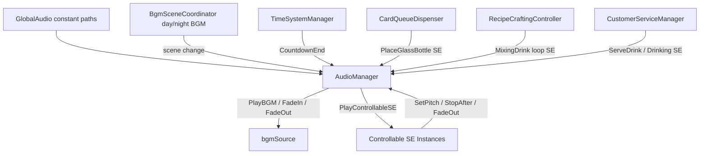
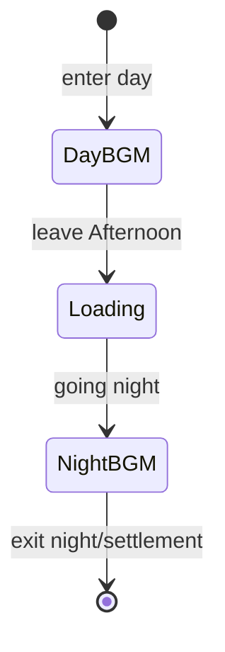
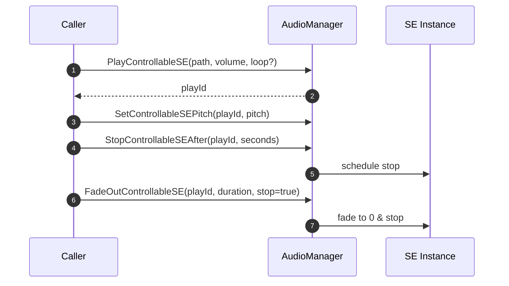

## Audio System Dev Guide (BGM/SE/Scene Coordination)

### 1. Overview

- Day/Night dual BGM with scene-driven fade in/out.
- Unified playback/control for SE: countdown end, dealing bottle placement, mixing loop, serving & drinking.
- Controllable SE instances: pitch, delayed stop, fade-out to avoid overlaps/leaks.

### 2. Architecture



#### 2.1 Component Interaction

- AudioManager: centralize BGM/SE (controllable pool) to avoid cross-interference.
- BgmSceneCoordinator: classify scenes (day/night/loading) and control Day→Night fade.
- TimeSystemManager: triggers countdown SE before phase ends; pauses timer; advances after playback.
- Callers: dealing, crafting, service call SE at key moments.

#### 2.2 BGM State Machine



#### 2.3 Controllable SE Lifecycle



### 3. Key Modules & Responsibilities

- AudioManager:
  - BGM: dedicated `bgmSource`; `FadeInBGM(path, vol, sec)`, `FadeOutBGM(sec, stop)`
  - SE: `PlayControllableSE(path, vol, loop)` returns instance ID; supports `SetControllableSEPitch(id, pitch)`, `StopControllableSEAfter(id, seconds)`, `FadeOutControllableSE(id, duration, stopAndCleanup)`
- GlobalAudio: constant resource paths (Resources)
- BgmSceneCoordinator (ex DaytimeBgmController): switch BGM by day/night lists; Day→Night fade across Afternoon→Loading→Night
- TimeSystemManager: play countdown end SE 1s before phase change and then advance
- CardQueueDispenser: on dealing start play `PlaceGlassBottle`; estimate window; loop if short, speed up and stop at window end if long
- RecipeCraftingController: on first material start `MixingDrink` loop; fade out on result/clear
- CustomerServiceManager: hide dialogue after delivery; play `ServeDrink`; after 2–3s play one drinking SE

### 4. Assets & Paths

- Location: `Assets/Resources/Audio/*.mp3` (or \*.wav)
- Access: via `GlobalAudio` constants, e.g., `GlobalAudio.DayBackgroundMusic`
- Naming: semantic/verb names; avoid duplicates

### 5. API Quick Reference

| Class        | Method                                                   | Note                              |
| ------------ | -------------------------------------------------------- | --------------------------------- |
| AudioManager | FadeInBGM(path, volume, duration, loop=true)             | BGM fade-in; Stop/Start on switch |
| AudioManager | FadeOutBGM(duration, stopAtEnd=true)                     | Fade current BGM; optional stop   |
| AudioManager | PlayControllableSE(path, volume, loop=false) -> id       | Play SE; return instance ID       |
| AudioManager | SetControllableSEPitch(id, pitch)                        | Adjust pitch 0.1–3.0              |
| AudioManager | StopControllableSEAfter(id, seconds)                     | Delayed stop                      |
| AudioManager | FadeOutControllableSE(id, duration, stopAndCleanup=true) | Fade out SE                       |

### 6. Typical Flow

```mermaid
sequenceDiagram
    autonumber
    participant Scene as BgmSceneCoordinator
    participant AM as AudioManager
    participant T as TimeSystemManager
    participant D as CardQueueDispenser
    participant R as RecipeCraftingController
    participant C as CustomerServiceManager

    Scene->>AM: FadeInBGM(GlobalAudio.DayBackgroundMusic)
    T->>AM: PlayControllableSE(CountdownEnd) + StopAfter(2s)
    D->>AM: Start dealing → PlaceGlassBottle (adaptive)
    R->>AM: First material → PlayControllableSE(MixingDrink, loop)
    R->>AM: On result → FadeOutControllableSE()
    C->>AM: Serve: ServeDrink
    C->>AM: After 2-3s: DrinkingSE
    Scene->>AM: Afternoon→Loading→Night: DayBGM FadeOut; NightBGM FadeIn
```

### 7. Key Points & Troubleshooting

- Decouple BGM/SE: BGM uses only `bgmSource`; SE uses controllable pool
- Anti-overlap: use `StopAfter`/`FadeOutControllableSE` for long SE; adaptive dealing SE loop/speed policy
- Scene transition: fade DayBGM out at Afternoon end; fade NightBGM in during Loading
- Timer control: pause during countdown SE; advance after playback for complete UX
