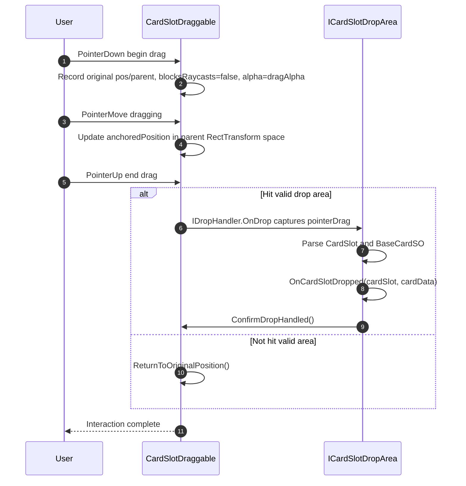
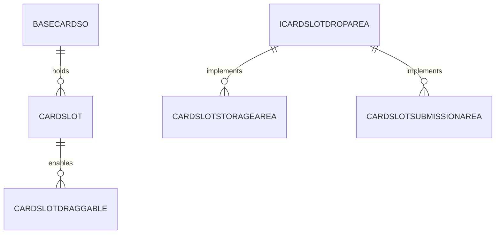
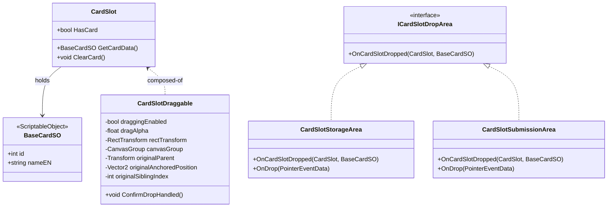

# Card Slot Drag & Drop System (CardSlot Drag & Drop)

This guide explains in detail how to configure and use the new UI drag-and-drop mechanism under the current card slot dispatch system; it provides feature analysis, installation and setup, interfaces and events, extension patterns, as well as sequence diagrams, ER diagrams, and class diagrams.

## Feature Overview

The Card Slot Drag & Drop system provides a plug-and-play drag interaction for `CardSlot`, centered around begin/drag/end three states and a unified event contract (`OnCardSlotDropped`, `ConfirmDropHandled`) to decouple interaction from business logic; it integrates with the dealing queue, storage and submission areas. When not hitting a valid area it auto-returns; when hit it consumes or stores according to the area policy. The sequence/ER/class diagrams support quick integration and troubleshooting.

### Scope

- Targets UI `CardSlot` that holds a card (based on `BaseCardSO` data)
- Adapts to scroll views and queued dealing: dragging is allowed only when `CardSlot.HasCard == true`
- Drop result is decided by areas implementing `ICardSlotDropArea` (storage, submission, destroy, recycle, etc.)

### Directory Structure

- `Scripts/0_General/0_2_Card Drag&Drop/`
  - `CardSlotDraggable.cs`: add UI drag behavior to `CardSlot`
  - `ICardSlotDropArea.cs`: drop area interface
  - `CardSlotStorageArea.cs`: storage example area (attach the slot as a child under this area)
  - `CardSlotSubmissionArea.cs`: submission example area (consume then clear and destroy the slot)

### Installation & Setup

1. Add `CardSlotDraggable` on the `CardSlot` prefab or scene object.
2. Ensure the `CardSlot` object contains:
   - `CardSlot` (existing); `RectTransform`; `CanvasGroup` (auto-added if missing)
3. On the target drop area, add one of:
   - `CardSlotStorageArea` or `CardSlotSubmissionArea` (both implement `ICardSlotDropArea` and `IDropHandler`)
4. Scene must have an `EventSystem`; UI root must be under a `Canvas`.

### Interaction & Behavior

- Begin drag: record original parent and `anchoredPosition`, set `blocksRaycasts=false`, `alpha=dragAlpha`, and bring to front
- Dragging: move in parent `RectTransform` local space following the pointer
- End drag:
  - If hit a valid drop area: the area handles data and object, then calls `ConfirmDropHandled()` to stop return
  - Else: automatically return to original parent and position

### Interfaces & Events

- `ICardSlotDropArea.OnCardSlotDropped(CardSlot, BaseCardSO)`: required callback for drop areas
- `CardSlotDraggable.ConfirmDropHandled()`: invoked by area after handling to confirm the drop took effect
- `CardSlot`: exposes `HasCard`, `GetCardData()`, `ClearCard()` for drag/drop logic

### Collaboration with Dealing Queue System

- Dealing is managed by `CardQueueDispenser`; `CardSlot` controls visibility and data with `SetCard/ClearCard`
- `CardSlotDraggable` allows drag only when `HasCard == true` to avoid empty-slot drags
- Areas can choose to call `ClearCard()` or directly destroy `cardSlot.gameObject`

### Sequence Diagram (Drag Main Flow)

### ER Diagram (Core Data Relationships)

### Class Diagram (Core Types & Methods)

