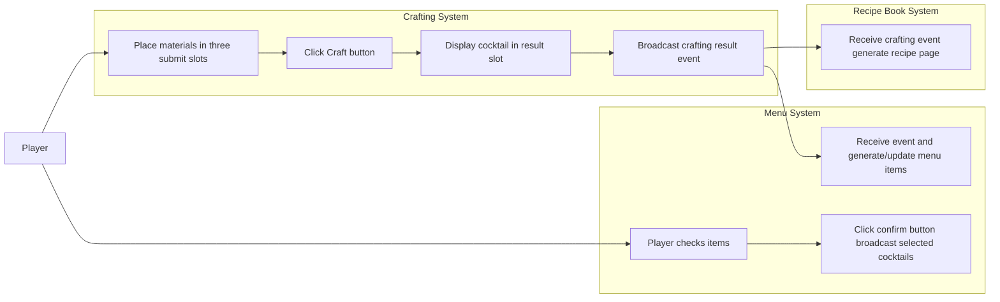
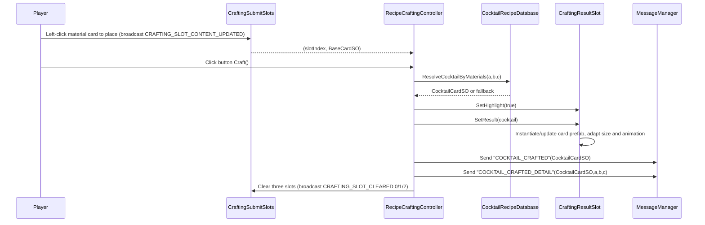
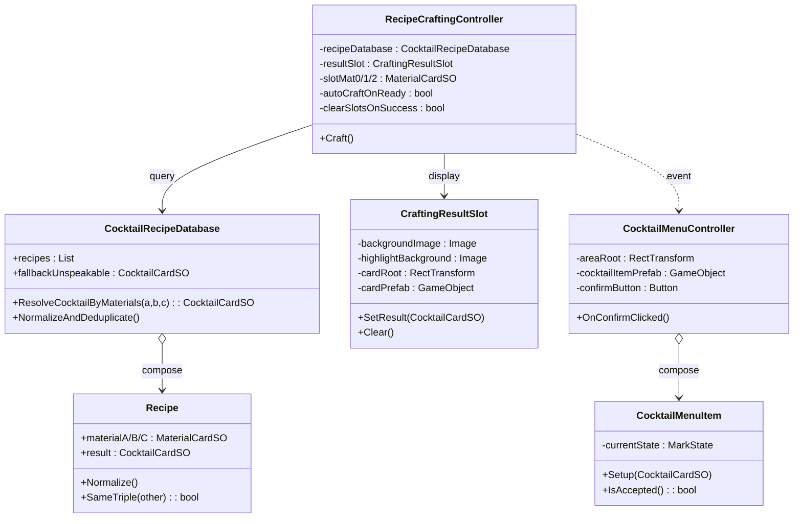
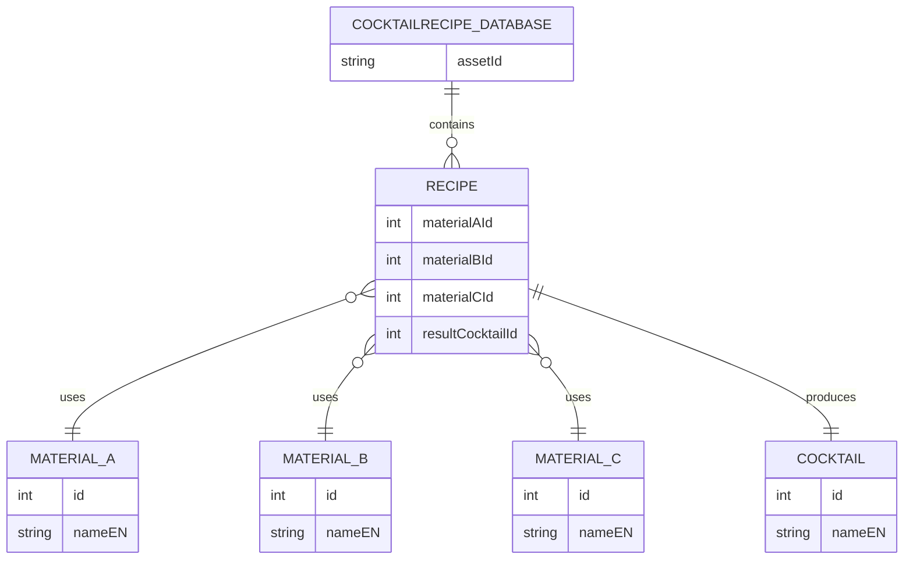

## Crafting System Design Document

### Overview

- Goal: Based on three material cards (MaterialCardSO), match through recipe database (CocktailRecipeDatabase) to produce cocktail cards (CocktailCardSO), display in result slot (CraftingResultSlot), and broadcast messages to other systems (menu/recipe book, etc.).
- Components: Submit slot broadcast → Crafting controller → Recipe database → Result slot display → Message broadcast (COCKTAIL_CRAFTED/COCKTAIL_CRAFTED_DETAIL).

### Feature Summary

The crafting system matches three material cards through the recipe database to generate cocktail cards, displaying results safely and controllably in the result slot. The system listens to submit slot changes and triggers Craft() via button, supports fallback recipes, English name and category display, size adaptation and fly-to-menu animations, while broadcasting data to downstream modules like menu and recipe book via COCKTAIL_CRAFTED/COCKTAIL_CRAFTED_DETAIL events, achieving end-to-end R&D—display—cataloging integration.

### Use Case Diagram



### Sequence Diagram (One Crafting)



### Class Diagram (Core)



### ER Diagram (Data Relations)



### Key Code (Code References)

- RecipeCraftingController.Craft: Button-triggered crafting, result display and message broadcast

```77:127:Scripts/0_General/0_2_Card Drag&Drop/RecipeCraftingController.cs
    // Can be bound to UI button
    public void Craft()
    {
        if (recipeDatabase == null)
        {
            Debug.LogWarning("[RecipeCraftingController] Recipe database not specified");
            return;
        }
        if (!AllFilled())
        {
            Debug.LogWarning("[RecipeCraftingController] Less than 3 materials, cannot craft");
            return;
        }

        var cocktail = recipeDatabase.ResolveCocktailByMaterials(slotMat0, slotMat1, slotMat2);
        if (cocktail == null)
        {
            Debug.LogWarning("[RecipeCraftingController] No cocktail matched and no fallback set");
            return;
        }

        if (resultSlot != null)
        {
            resultSlot.SetHighlight(true);
            resultSlot.SetResult(cocktail);
        }
        Debug.Log($"[RecipeCraftingController] Crafting result: {cocktail.nameEN} (ID:{cocktail.id})");

        // Broadcast: crafting success (cocktail only)
        MessageManager.Send<CocktailCardSO>("COCKTAIL_CRAFTED", cocktail);
        // Broadcast: crafting success (with recipe material details)
        MessageManager.Send<(CocktailCardSO cocktail, MaterialCardSO a, MaterialCardSO b, MaterialCardSO c)>(
            "COCKTAIL_CRAFTED_DETAIL",
            (cocktail, slotMat0, slotMat1, slotMat2)
        );
        // Console summary
        var tags = (cocktail.tags != null && cocktail.tags.Length > 0) ? string.Join("/", cocktail.tags) : "-";
        Debug.Log($"[Crafted] {cocktail.nameEN} | Category={cocktail.category} | Tags={tags} | Price=${cocktail.price} | Cost=${cocktail.cost} | Profit=${cocktail.profit}");

        // Clear three slots after successful crafting if needed
        if (clearSlotsOnSuccess)
        {
            MessageManager.Send<int>(MessageDefine.CRAFTING_SLOT_CLEARED, 0);
            MessageManager.Send<int>(MessageDefine.CRAFTING_SLOT_CLEARED, 1);
            MessageManager.Send<int>(MessageDefine.CRAFTING_SLOT_CLEARED, 2);
            // Sync local records
            slotMat0 = null;
            slotMat1 = null;
            slotMat2 = null;
        }
    }
```

- CocktailRecipeDatabase.ResolveCocktailByMaterials: Three-material matching with fallback

```93:115:Scripts/0_General/0_11_Cardsystem/CocktailRecipeDatabase.cs
    /// <summary>
    /// Find cocktail based on 3 material SOs, return fallback if not found (nullable).
    /// </summary>
    public CocktailCardSO ResolveCocktailByMaterials(MaterialCardSO a, MaterialCardSO b, MaterialCardSO c)
    {
        int idA = a != null ? a.id : int.MaxValue;
        int idB = b != null ? b.id : int.MaxValue;
        int idC = c != null ? c.id : int.MaxValue;
        if (idA > idB) { (a, b) = (b, a); (idA, idB) = (idB, idA); }
        if (idB > idC) { (b, c) = (c, b); (idB, idC) = (idC, idB); }
        if (idA > idB) { (a, b) = (b, a); }

        for (int i = 0; i < recipes.Count; i++)
        {
            var r = recipes[i];
            if (r == null || r.result == null) continue;
            int ra = r.materialA != null ? r.materialA.id : -1;
            int rb = r.materialB != null ? r.materialB.id : -1;
            int rc = r.materialC != null ? r.materialC.id : -1;
            if (ra == idA && rb == idB && rc == idC)
            {
                return r.result;
            }
        }
        return fallbackUnspeakable;
    }
```

- CraftingResultSlot.SetResult: Instantiate/update prefab, external text and animation

```93:118:Scripts/0_General/0_2_Card Drag&Drop/CraftingResultSlot.cs
    public void SetResult(CocktailCardSO cocktail)
    {
        currentCocktail = cocktail;
        if (cocktail == null)
        {
            HideCard();
            return;
        }

        EnsureCardInstance();
        ResetCardTransform();
        UpdateCardVisual(cocktail);
        ShowCard();
        FitCardWithinBackground();
        TryApplyBarMaterialOverride();

        // External name text (optional)
        if (resultNameText != null)
        {
            // Always display English name
            resultNameText.text = cocktail.nameEN;
        }

        // Animation
        PlayFlyToMenuAnim();
    }
```

- CocktailMenuController.OnConfirmClicked: Collect checked items and broadcast menu confirmation

```149:167:Scripts/0_General/0_11_Cardsystem/CocktailMenuController.cs
    private void OnConfirmClicked()
    {
        if (areaRoot == null) return;
        var items = areaRoot.GetComponentsInChildren<CocktailMenuItem>(true);
        var list = new System.Collections.Generic.List<CocktailCardSO>();
        for (int i = 0; i < items.Length; i++)
        {
            var it = items[i];
            if (it != null && it.IsAccepted() && it.GetData() != null)
            {
                list.Add(it.GetData());
            }
        }
        if (list.Count > 0)
        {
            MessageManager.Send(System.String.Intern("COCKTAIL_MENU_CONFIRMED"), list);
            Debug.Log($"[CocktailMenu] Confirmed selection, {list.Count} items: " + string.Join(", ", list.ConvertAll(x => x.nameEN)));
        }
    }
```

- MessageDefine (Related message keys)

```45:52:Scripts/0_General/0_0_MessageSystem/MessageDefine.cs
    // ====== Card Interaction/Crafting ======
    public static readonly string CARD_CLICKED = "CARD_CLICKED";             // Carries BaseCardSO
    public static readonly string CRAFTING_SLOT_FILLED = "CRAFTING_SLOT_FILLED"; // Carries (int slotIndex, int materialId)
    public static readonly string CRAFTING_SLOT_CLEARED = "CRAFTING_SLOT_CLEARED"; // Carries int slotIndex
    public static readonly string CRAFTING_READY = "CRAFTING_READY";         // Carries List<int> 3 material IDs
    public static readonly string CRAFTING_RESULT = "CRAFTING_RESULT";       // Carries CocktailCardSO
    public static readonly string CRAFTING_SLOT_CONTENT_UPDATED = "CRAFTING_SLOT_CONTENT_UPDATED"; // Carries (int slotIndex, BaseCardSO card)
```

```56:58:Scripts/0_General/0_0_MessageSystem/MessageDefine.cs
    // ====== Menu Selection Confirmation ======
    public static readonly string COCKTAIL_MENU_CONFIRMED = "COCKTAIL_MENU_CONFIRMED"; // Carries List<CocktailCardSO>
```

### Events & Payloads

- "COCKTAIL_CRAFTED": Payload CocktailCardSO
- "COCKTAIL_CRAFTED_DETAIL": Payload (CocktailCardSO cocktail, MaterialCardSO a, MaterialCardSO b, MaterialCardSO c)
- MessageDefine.CRAFTING_SLOT_CONTENT_UPDATED: Payload (int slotIndex, BaseCardSO card)
- MessageDefine.CRAFTING_SLOT_CLEARED: Payload int slotIndex
- MessageDefine.COCKTAIL_MENU_CONFIRMED: Payload List<CocktailCardSO>

### Scene Wiring (Summary)

- Attach `RecipeCraftingController` to crafting panel: bind `recipeDatabase`, `resultSlot`, check `clearSlotsOnSuccess`.
- Create button `CraftButton` → OnClick bind `RecipeCraftingController.Craft()`.
- Result slot `CraftingResultSlot`: configure background, highlight, `cardRoot`, card prefab or Resources path.
- Menu `CocktailMenuController`: configure `areaRoot`, `cocktailItemPrefab`, `confirmButton`.

### FAQ (Common Issues)

- Result card exceeds background: Enable "auto-fit to background size" in `CraftingResultSlot`.
- Background color invalid: Prioritize `CardDisplay` settings on card prefab; fallback to manual theme color logic if none.
- Duplicate recipe pages: `FormulaBookController` uses deduplication set to ensure unique numbering and odd/even page layout.
