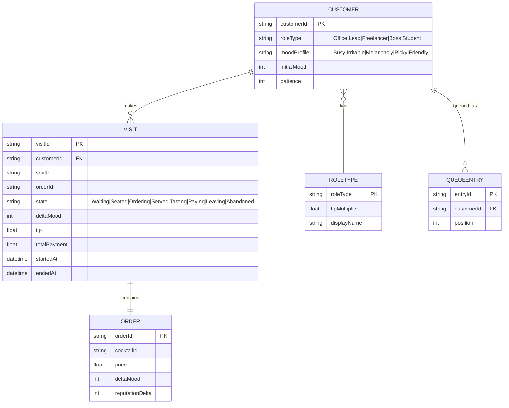
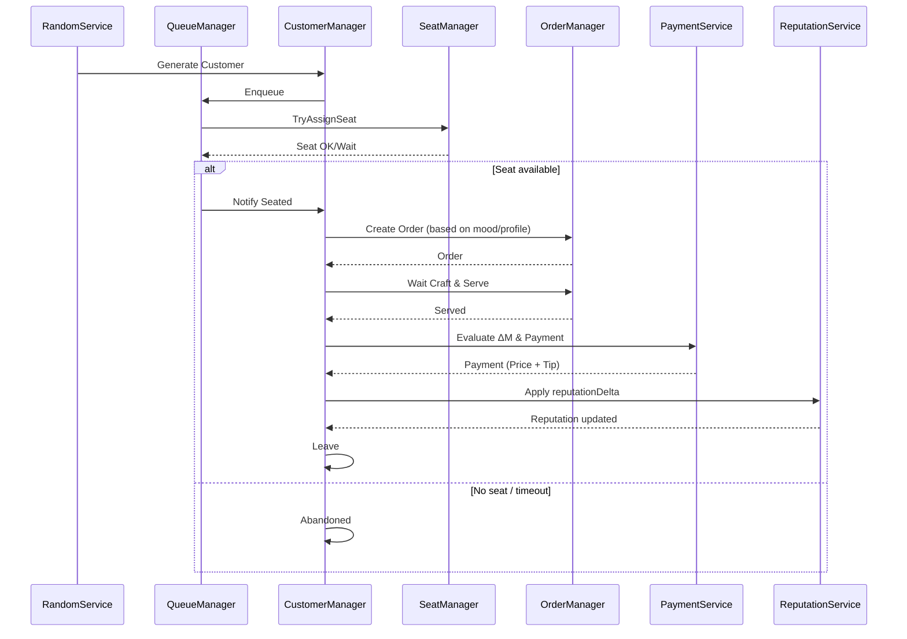
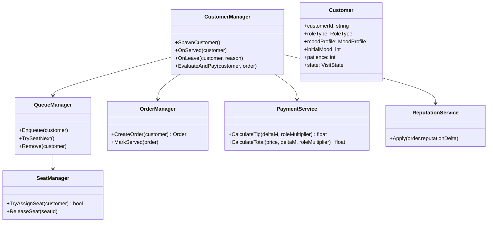
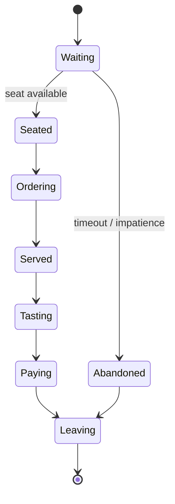
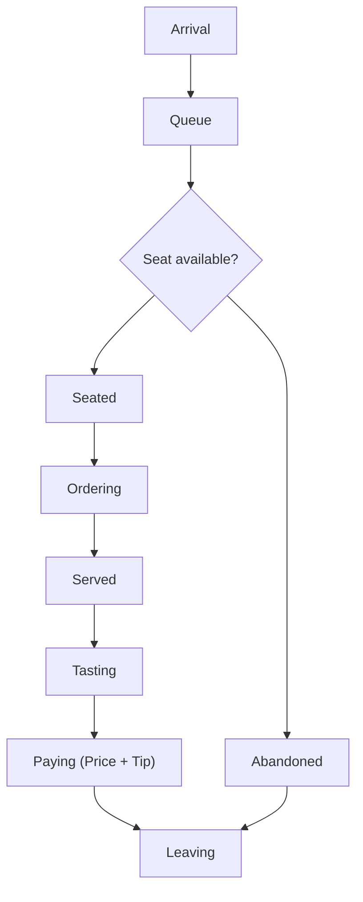

# Customer System Development Document

## Feature Overview

The Customer System drives the full lifecycle: Arrive → Queue → Seat → Order/Craft → Serve → Taste → Settle → Leave. It orchestrates with the Queue system, Card/Recipe systems, Settlement and Reputation systems, while integrating decoupled with Random and Save systems. It supports five mood states (Busy, Irritable, Melancholy, Picky, Friendly), role multipliers (Office Worker/Team Lead/Freelancer/Boss/College Student), abandonment/timeout handling, and dual-channel feedback via Reputation.

---

## ER Diagram (Entities & Relations)



---

## Sequence Diagram (One Complete Service)



---

## Class Diagram (Core Responsibilities)



---

## State Diagram (Customer/Visit)



---

## Activity Diagram (Arrival → Settlement)



---

## Code Snippets & Function Analysis (C#)

> Formula aligned with design docs: Payment = DrinkPrice + max(0, ΔM × 1.2 × RoleMultiplier)

```csharp
public sealed class PaymentService
{
    private readonly float tipBaseMultiplier = 1.2f;

    public float CalculateTip(int deltaM, float roleMultiplier)
    {
        float tip = deltaM * tipBaseMultiplier * roleMultiplier;
        return tip > 0 ? tip : 0f;
    }

    public float CalculateTotal(float drinkPrice, int deltaM, float roleMultiplier)
    {
        return drinkPrice + CalculateTip(deltaM, roleMultiplier);
    }
}
```

- Notes: Tip never negative; role multiplier only scales tip.

```csharp
public sealed class CustomerManager : MonoBehaviour
{
    [SerializeField] private QueueManager queueManager;
    [SerializeField] private SeatManager seatManager;
    [SerializeField] private OrderManager orderManager;
    [SerializeField] private PaymentService paymentService;
    [SerializeField] private ReputationService reputationService;

    public Customer SpawnCustomer(CustomerArchetype archetype)
    {
        var c = CustomerFactory.Create(archetype);
        queueManager.Enqueue(c);
        seatManager.TryAssignSeat(c);
        return c;
    }

    public void OnServed(Customer c)
    {
        var order = orderManager.GetActiveOrder(c);
        int deltaM = order.deltaMood; // from recipe system
        float roleMul = RoleConfig.GetMultiplier(c.roleType);
        float total = paymentService.CalculateTotal(order.price, deltaM, roleMul);
        Economy.AddMoney(total);
        reputationService.Apply(order.reputationDelta);
        c.state = VisitState.Paying;
    }
}
```

- Notes:
  - ΔM from card/recipe system; reputationDelta applied to bar reputation.
  - Orchestration only; logic decoupled.

```csharp
public sealed class QueueManager
{
    private readonly Queue<Customer> line = new();

    public void Enqueue(Customer c) => line.Enqueue(c);

    public bool TrySeatNext()
    {
        if (line.Count == 0) return false;
        var peek = line.Peek();
        if (SeatManager.Instance.TryAssignSeat(peek))
        {
            line.Dequeue();
            return true;
        }
        return false;
    }
}
```

- Notes: Seating separated from queueing; no dequeue on failed seating; retry when seats free.

---

## Integration with Other Systems

- Random: use `RandomService` for arrivals (daily-stable or true-random) without polluting global state.
- Save: serialize aggregated `Visit` data at phase transitions and day-end for stable recovery.
- Card/Recipe: provides `deltaMood` (ΔM), `price`, and `reputationDelta`.
- Reputation: `ReputationService.Apply(reputationDelta)` drives long-term feedback.

---

## Configuration Suggestions

- Role multipliers: Office 1.0, Lead 1.2, Freelancer 1.1, Boss 1.5, Student 0.9
- Mood states: Busy / Irritable / Melancholy / Picky / Friendly
- Patience/timeout thresholds: affect abandonment probability and satisfaction cap
- Concurrent seats/service stations: affect throughput

---

## Test Checklist

- Boundary: ΔM > 0 vs ΔM ≤ 0 payment outcomes
- Abandon vs seating race (multiple queued with seat release)
- Arrival consistency under true-random vs daily-stable
- Save/Load restores lifecycle states correctly

---

**Document Version**: v1.0  
**Last Updated**: 2025-10-30
