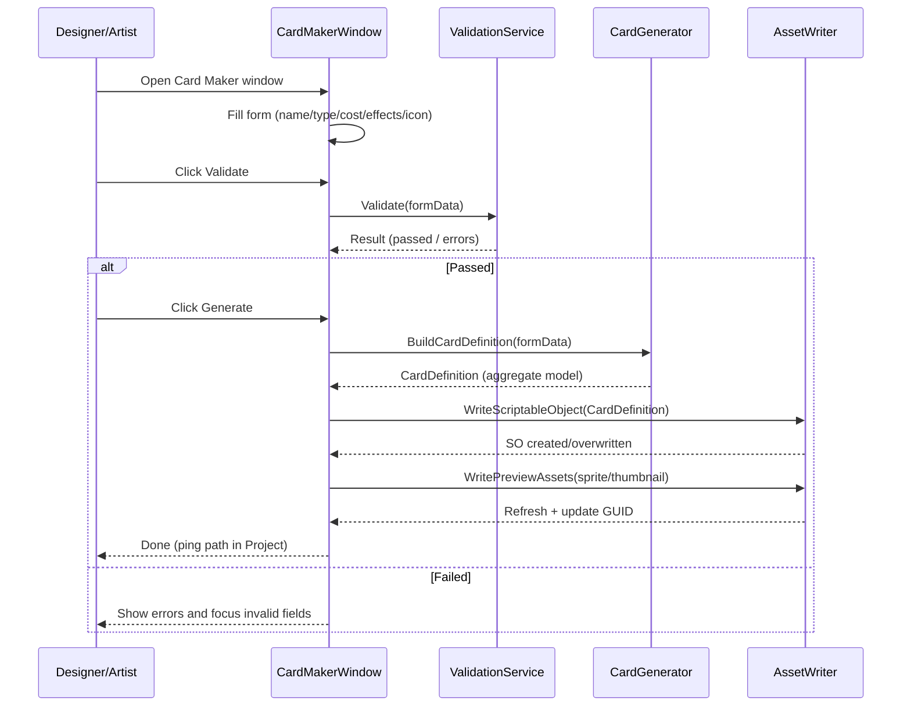
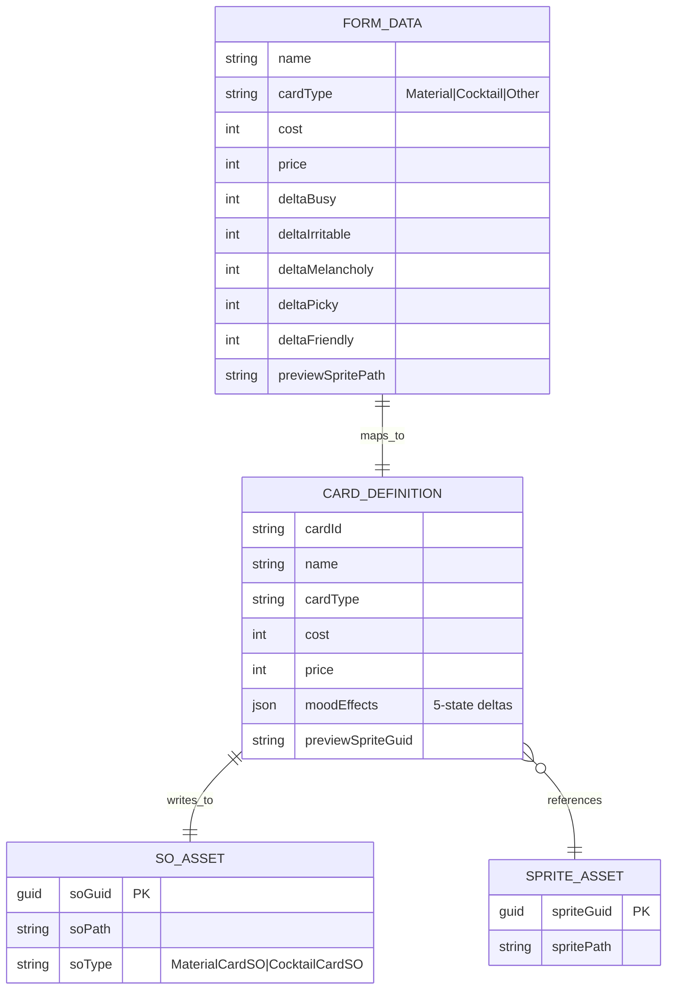
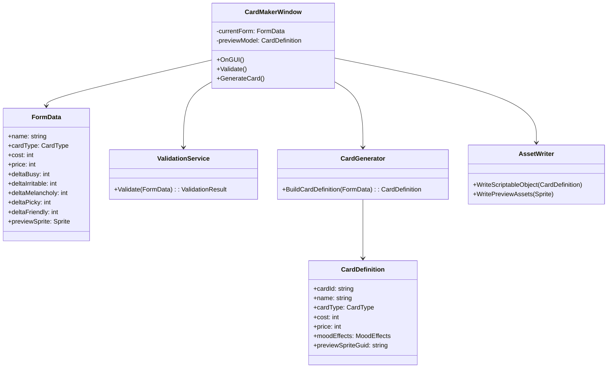

# Card Maker (Editor) Script Documentation

## Feature Overview

The Card Maker is a Unity Editor tool for efficiently creating and maintaining card data (e.g., Material/Cocktail/effect configs). Core goals:

- Enter card metadata through forms (name, type, cost, price, effects, etc.).
- One-click generate/update ScriptableObjects (e.g., `MaterialCardSO`, `CocktailCardSO`) and related assets (icons, previews).
- Instant preview (card face/aggregated values) with validations (required fields, ranges, reference validity).
- Unified storage path and naming conventions for traceability and versioning.

---

## Sequence Diagram (Open → Validate → Generate SO → Write Assets)



---

## ER Diagram (Editor Data ↔ Assets)



---

## Class Diagram (Core Components)



---

## UI ↔ Code Mapping

- Name (TextField `Name`)

  - Binds: `FormData.name`
  - Purpose: sets `CardDefinition.name`; affects SO filename and `cardId` generation.

- Type (EnumField `Card Type`)

  - Binds: `FormData.cardType`
  - Purpose: choose `MaterialCardSO` vs `CocktailCardSO`; toggles conditional fields (e.g., recipe-related).

- Cost/Price (IntegerField `Cost/Price`)

  - Binds: `FormData.cost` / `FormData.price`
  - Purpose: economy parameters; validate `cost >= 0`, `price >= cost`.

- Five-state Effects (IntegerField `Busy/Irritable/Melancholy/Picky/Friendly`)

  - Binds: `FormData.delta*`
  - Purpose: map to `CardDefinition.moodEffects`; support range checks and sum hints.

- Preview Sprite (ObjectField `Sprite`)

  - Binds: `FormData.previewSprite`
  - Purpose: `AssetWriter.WritePreviewAssets` writes and references; store GUID in `CardDefinition.previewSpriteGuid`.

- Validate button

  - Calls: `ValidationService.Validate(form)`
  - On fail: show errors inline; focus the first invalid input.

- Generate button
  - Calls: `CardGenerator.BuildCardDefinition(form)` → `AssetWriter.WriteScriptableObject(def)` → `WritePreviewAssets(sprite)`
  - Result: highlight target asset path in Project; provide Ping/Open shortcuts.

---

## Code Snippets (C#)

> Note: Snippets illustrate organization and call flow; align concrete types with your project.

```csharp
// Validation: required fields and ranges
public static class ValidationService
{
    public static ValidationResult Validate(FormData data)
    {
        var result = new ValidationResult();
        if (string.IsNullOrWhiteSpace(data.name))
            result.AddError("Name", "Name is required");
        if (data.cost < 0) result.AddError("Cost", "Cost must be non-negative");
        if (data.price < data.cost) result.AddError("Price", "Price should not be lower than cost");
        // Mood clamping (align with design constraints)
        if (Mathf.Abs(data.deltaBusy) > 10) result.AddError("Busy", "> 10 out of range");
        // ... more rules ...
        return result;
    }
}
```

```csharp
// Generator: Form → Aggregate model
public static class CardGenerator
{
    public static CardDefinition BuildCardDefinition(FormData f)
    {
        return new CardDefinition
        {
            cardId = GenerateStableId(f.name),
            name = f.name,
            cardType = f.cardType,
            cost = f.cost,
            price = f.price,
            moodEffects = new MoodEffects
            {
                Busy = f.deltaBusy,
                Irritable = f.deltaIrritable,
                Melancholy = f.deltaMelancholy,
                Picky = f.deltaPicky,
                Friendly = f.deltaFriendly,
            },
            previewSpriteGuid = f.previewSprite != null ? AssetDatabase.AssetPathToGUID(AssetDatabase.GetAssetPath(f.previewSprite)) : string.Empty
        };
    }
}
```

```csharp
// Writer: Create/overwrite ScriptableObject and assets
public static class AssetWriter
{
    public static void WriteScriptableObject(CardDefinition def)
    {
        var folder = $"Assets/GameData/Cards/{def.cardType}";
        if (!AssetDatabase.IsValidFolder(folder))
        {
            var root = "Assets/GameData/Cards";
            if (!AssetDatabase.IsValidFolder(root)) AssetDatabase.CreateFolder("Assets", "GameData");
            if (!AssetDatabase.IsValidFolder(root + "/Cards")) AssetDatabase.CreateFolder("Assets/GameData", "Cards");
            AssetDatabase.CreateFolder("Assets/GameData/Cards", def.cardType.ToString());
        }
        var soPath = $"{folder}/{Sanitize(def.name)}.asset";
        // Create or overwrite by type
        ScriptableObject so = CreateOrLoadSO(def, soPath);
        EditorUtility.SetDirty(so);
        AssetDatabase.SaveAssets();
        AssetDatabase.Refresh();
    }
}
```

---

## Development & Maintenance Notes

- Centralize validations in `ValidationService` to avoid scattered checks.
- Keep `CardGenerator` pure (form → model), no I/O side effects.
- Normalize asset paths/naming/overwrite policy in `AssetWriter`.
- Separate preview model from form data; avoid allocations and GC spikes in `OnGUI`.
- Log key actions (create/overwrite) for review and traceability.

---

**Document Version**: v1.0  
**Last Updated**: 2025-10-30
