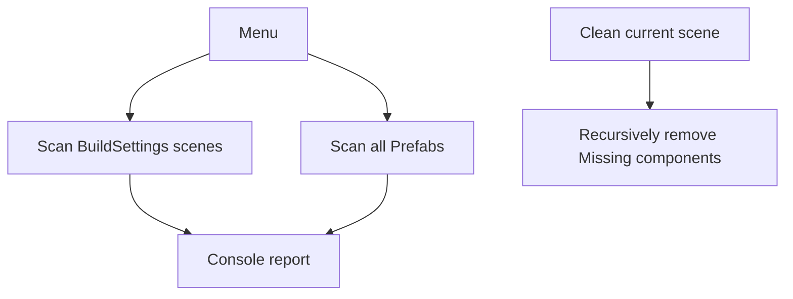

## Editor Tools & Diagnostics (Full Guide)

### 1. Styling & Dependencies

- UITK unified style:
  - Prefer `Assets/Editor/UITK/EditorColors.uss`, compatible fallbacks `Assets/Scripts/Editor/UITK/` and `Assets/Scripts/0_Editor/UITK/`.
  - All windows implement a 3-stage fallback in `CreateGUI()`/`TryAttachStyle()` to avoid color loss after path migration.
- Plugins: Some windows optionally use Odin (enhanced UI). Fall back to native UI if missing.

### 2. Tools List & Details

#### 2.1 Message System Monitor & Console (MessageSystemWindow)

- Menu: 自制工具/消息系统/消息系统
- Purpose:
  - Monitor subscriptions and live logs for string-key and typed channels.
  - Send test messages (string/int/float), view logs, export JSON.
- Areas:
  - Subscriptions (key/type lists, counts, clear per-key)
  - Send (string-key & typed channels)
  - Log (filter, sorting, column resize, export JSON)
- Note:
  - Style classes: `app-root`, `section`, `section-title`, `btn-*`.

#### 2.2 NPC Manager (NpcManagerWindow)

- Menu: 自制工具/人物设计/NPC 管理器
- Purpose:
  - Browse/search `NpcCharacterData`; show details & portraits; quick-locate assets.
  - If Odin is present, inspect objects with Odin.
- Areas:
  - Left list (refresh, context menu: locate/copy portrait path/open portrait)
  - Right detail & portrait view
- Tech:
  - Create temporary Texture2D from `Resources` Sprite for UI display
  - Reflect to call Odin `InspectObject` when available

#### 2.3 Scene Sequence Manager (SceneSequenceWindow)

- Menu: 自制工具/场景/场景顺序管理器
- Purpose:
  - Visualize Build Settings scenes; add/insert/delete/move and apply to BuildSettings.
  - Auto-play scenes (interval, loop; progress as opened).
- Areas:
  - Toolbar (refresh/apply/add/insert/autoplay)
  - List (in-build, name, path, open/move/delete)
- Note:
  - Enhanced style loading prefers Editor/ path first.

#### 2.4 Random Monitor (RandomMonitorWindow)

- Menu: 自制工具/随机系统/随机数监控器
- Purpose:
  - Preview daily/persistent RNG samples and histograms; support consuming state.
  - Load/init RNG state (ES3) and clear specific streams.
- Areas:
  - Inputs (playerId, stream key, daily/persistent, UTC date, sample count, consume)
  - Actions (load/preview/histogram/clear)
  - Visualization: chips bars, 10-bin histogram
- Tech:
  - `UnityRandomStream` & `IRandomSource`; daily seed based on (playerId, date, key)

#### 2.5 Customer Arrival Monitor (CustomerMonitorWindow)

- Menu: 自制工具/人物设计/顾客到来监控器
- Purpose:
  - Monitor customer queues and current service state; force enqueue and clear cooldown pool.
- Areas:
  - Toolbar (refresh/clear/export/force enqueue/clear cooldown/auto refresh/search)
  - Main: left queues (with cooldown hints), right current service panel, bottom stats
- Tech:
  - Reflect to read `CustomerSpawnManager` private cooldowns/demands and in-service customers
  - Export CSV

#### 2.6 Save Viewer (SaveViewerWindow)

- Menu: 自制工具/保存系统/存档监控器
- Purpose:
  - View slots 1..3 existence, key fields, JSON; auto-refresh on save/load events
  - Delete selected slot; clean all save files
- Areas:
  - Header (save path, auto refresh & interval, refresh now)
  - Slot list & selector; right JSON preview
- Tech:
  - Use Odin lists/read-only views when available; UITK as primary UI

#### 2.7 Missing Scripts Scan & Clean (MissingScriptsScanner)

- Menu:
  - 自制工具/诊断/扫描缺失脚本: scan all BuildSettings scenes and all prefabs; print hierarchy paths
  - 自制工具/诊断/清理当前场景缺失脚本: remove Missing components in current scene
- Usage:
  1. Scan first; locate key scenes (Start/Save/Day/Afternoon/Night/Settlement/Congratulation)
  2. Reattach required runtime scripts; use clean for leftovers
  3. Save scene and rebuild to verify

##### 2.7.1 Flowchart

#### 2.8 Batch Character Tools

- NpcCharacterSoGenerator (if present):
  - Generate `NpcCharacterData` ScriptableObjects in batch from external config; fill fields in batch
  - Note: depends on headers and resource path conventions; backup before running
- CharacterRoleSOGeneratorWindow (if present):
  - Batch-create and organize role/career SOs

### 3. Styling Notes

- Common classes:
  - `app-root`: window root (background/padding)
  - `section` / `section-title`: section container/title
  - `btn` + `btn-primary/secondary/success/warn/danger/ghost`
- If colors fail, ensure `Assets/Editor/UITK/EditorColors.uss` exists; or copy styles there

### 4. FAQ

- Build errors with Editor API: ensure all editor scripts are under `Editor/` and runtime scenes have no editor-only components
- Styles not applied: check 3-stage fallback paths and filenames; see console for path load errors
- Blank window (rare): ensure `CreateGUI()` is called in `OnEnable()`; try Close/Open
