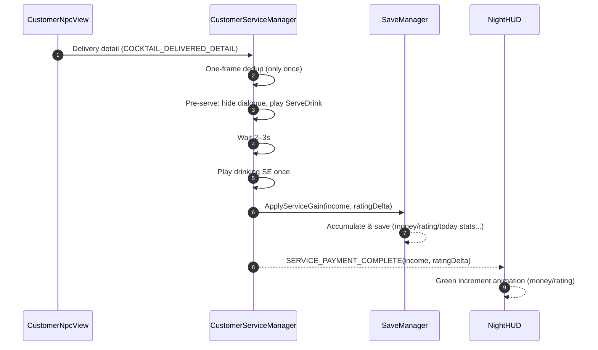
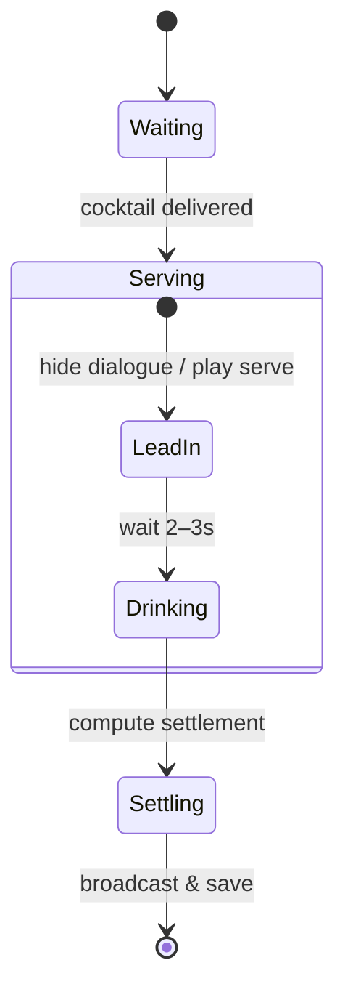
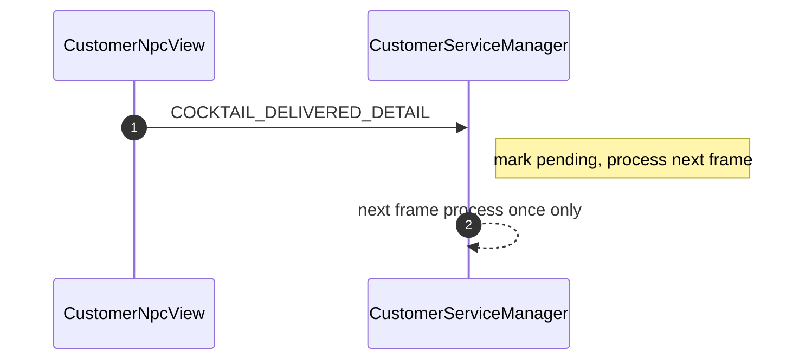

## Night Customer Service & Settlement Dev Guide

### 1. Overview

- Dragging a cocktail onto a customer counts as delivery; flow: pre-serve → drink → settle.
- One-frame delay dedup ensures a single settlement per delivery.
- Settlement accumulates instantly into save (money, rating, today income/customer count, etc.) and triggers HUD green increment via messages.

### 2. Events & Messages

| Key                       | Payload                                    | Description                                     |
| ------------------------- | ------------------------------------------ | ----------------------------------------------- |
| COCKTAIL_DELIVERED_DETAIL | struct/class (customerId, cocktail, state) | Delivery detail (for log/debug/preview)         |
| SERVICE_PAYMENT_COMPLETE  | (income:int, ratingDelta:int)              | Final settlement (HUD uses for green increment) |
| RECIPE_DISCOVERED         | recipeId:string                            | First-time craft/service records recipe         |

### 3. Flow

#### 3.1 Service State Machine

#### 3.2 One-Frame Dedup (Sequence)

### 4. Calculations & Display

- Identity multiplier, mood and tip:
  - Mood (signed) affects tip (below 0 clamp to 0).
  - Price × identity multiplier + tip = final income.
- Text format:
  - Use `FormatSigned(v)` for +5/-2/0 formatting.
- HUD timing:
  - Preview (if any) uses DELIVERED_DETAIL; real animation & totals rely on SERVICE_PAYMENT_COMPLETE.

#### 4.1 Variables & Formula

| Var         | Meaning                                            |
| ----------- | -------------------------------------------------- |
| price       | Base price (CocktailCardSO)                        |
| identityMul | Identity multiplier (NpcCharacterData)             |
| moodDelta   | Mood delta (signed)                                |
| tip         | Tip, `max(0, moodDelta)` or as designed            |
| finalIncome | `price * identityMul + tip` (floor/round per impl) |

### 5. Save Integration

- Save instantly after each service via `SaveManager.ApplyServiceGain(income, ratingDelta)` to avoid data loss.
- Recipe record: call `SaveManager.DiscoverRecipe(cocktail)` on the real settlement path; use `cocktail.id.ToString()` as stable ID and persist UI resource paths (cocktail/material images).

### 6. Audio & Interaction

- After delivery:
  - Hide NPC dialogue → play `GlobalAudio.ServeDrink`.
  - Wait 2–3s → play `Drinking` SE once only.
- UI interaction:
  - During dealing, `CardDispenseRuntime` locks globally; `SkipButtonLocker`/`CardInputLocker` subscribe queue events for visibility/enabling.

### 7. Troubleshooting

- No HUD increment: check `SERVICE_PAYMENT_COMPLETE` and ensure increment texts are `SetActive(true)` before play.
- Double settlement: verify one-frame dedup handles only once; avoid listening to legacy/new events simultaneously.
- Save not updated: ensure `ApplyServiceGain` called, ES3 writes okay, and settlement panel not double-counting.
