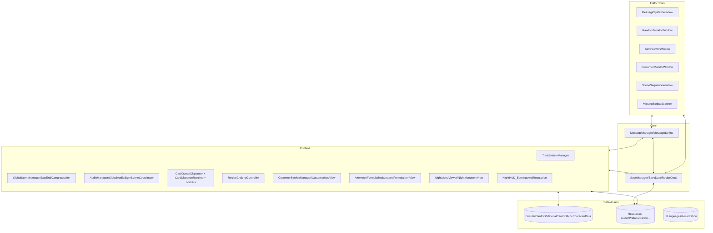
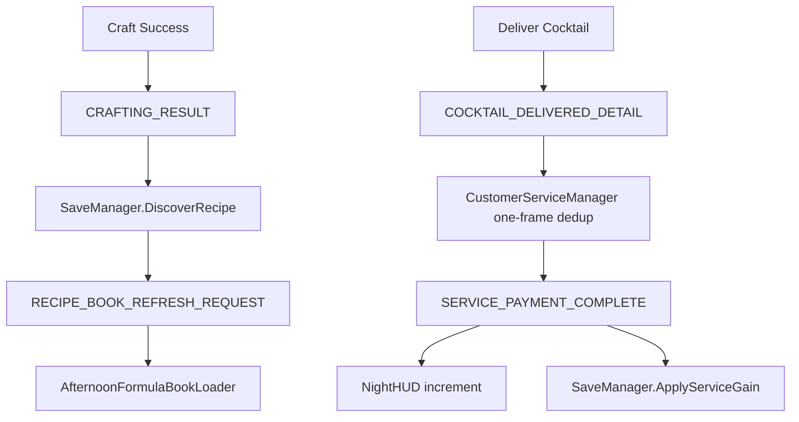
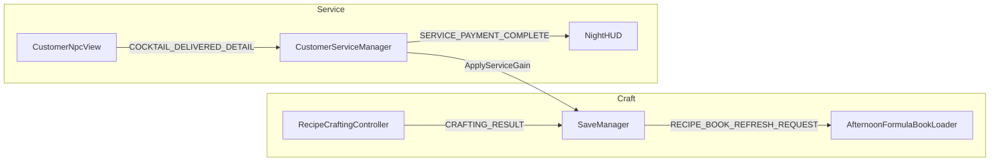
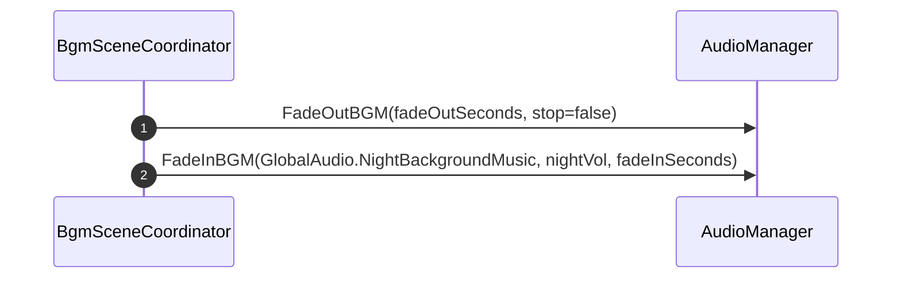
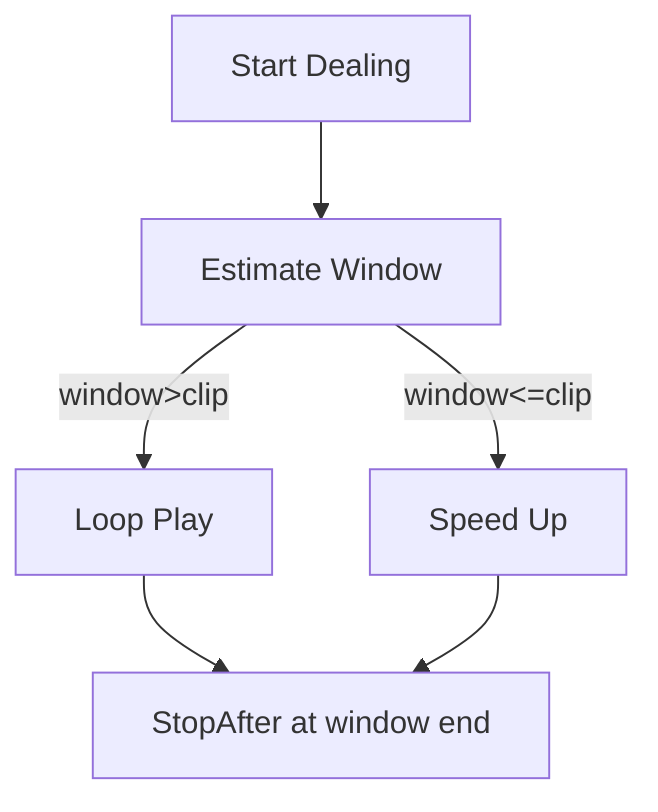
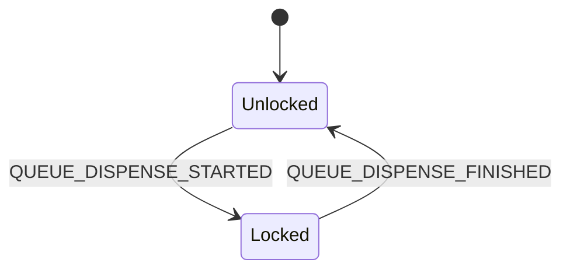
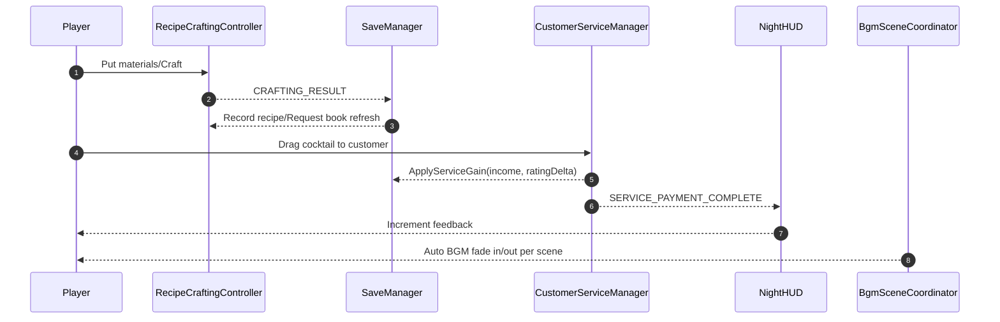
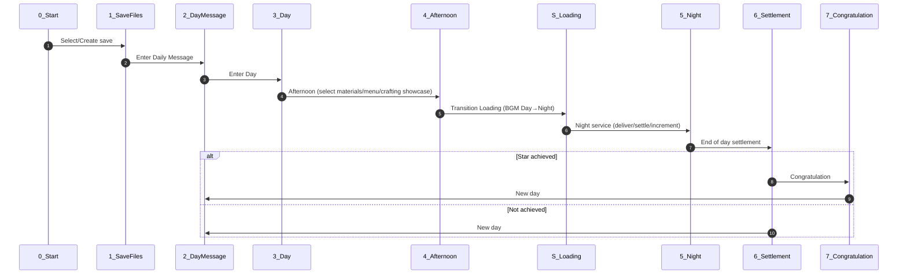

## Full Project Development Guide (Technical Implementation)

> This document covers overall architecture, runtime systems, data/message contracts, key script entry points, build standards, and troubleshooting. Use together with topic docs: AudioSystem_DevDoc.md, NightCustomerService_DevDoc.md, RecipeBookAndNightMenu_DevDoc.md, EditorTools_AndDiagnostics_DevDoc.md, etc.

### 0. Goals & Scope

- Align developer understanding and conventions to reduce coupling and improve maintainability.
- Provide end-to-end flow charts, message/data lists, key code indexes, and troubleshooting methods.

### 1. Architecture Overview

### 1.1 Gameplay-to-System Mapping

| Gameplay Element         | Systems/Scripts                              | Key Messages                                        | Save Fields                                 | Scenes                                     |
| ------------------------ | -------------------------------------------- | --------------------------------------------------- | ------------------------------------------- | ------------------------------------------ |
| Save select/new          | SaveManager, SaveViewerWindow                | SAVE_LOADED / SAVE_COMPLETED                        | saveSlotID, saveSlotName                    | 1_SaveFilesScreen                          |
| Daily message            | TimeSystemManager                            | PHASE_CHANGED                                       | currentDay, daySubPhase                     | 2_DayMessageScreen                         |
| Day prep/purchase        | SaveManager, Resources                       | MENU_REFRESH_REQUEST                                | todayPurchasedItems, todayStockingCompleted | 3_DayScreen                                |
| Afternoon crafting       | RecipeCraftingController, AudioManager       | CRAFTING_RESULT, COCKTAIL_CRAFTED_DETAIL            | unlockedRecipes[*]                          | 4_AfternoonScreen                          |
| Day→Night BGM transition | BgmSceneCoordinator, AudioManager            | -                                                   | -                                           | S_LoadingScreen                            |
| Night service            | CustomerServiceManager, CustomerNpcView      | COCKTAIL_DELIVERED_DETAIL, SERVICE_PAYMENT_COMPLETE | currentMoney, todayIncome, cumulativeScore  | 5_NightScreen                              |
| Night menu               | NightMenuViewer, NightMenuItemView           | MENU_REFRESH_REQUEST                                | currentMenuRecipeIDs                        | 5_NightScreen                              |
| HUD increments           | NightHUD_EarningsAndReputation               | SERVICE_PAYMENT_COMPLETE                            | currentMoney, cumulativeScore               | 5_NightScreen                              |
| Settlement and star      | DayEndScreen, CongratulationScreenController | DAY_COMPLETED                                       | starRating, highestStarRatingAchieved       | 6_SettlementScreen, 7_CongratulationScreen |

> Formula Book (AfternoonFormulaBookLoader/FormulaItemView) shows only `unlockedRecipes` with `recorded=true`, ordered by `orderIndex`.

### 2. Key Directory Structure

- `Scripts/0_General/...`: Core/common (messages, save, time, audio, cards).
- `Scripts/3_DayScreen`: Day (formula book).
- `Scripts/4_AfternoonScreen`: Afternoon.
- `Scripts/5_NightScreen`: Night (customers, menu, HUD).
- `Scripts/6_SettlementScreen`: Settlement.
- `Scripts/7_CongratulationScreen`: Congratulation.
- `Editor/*`: All editor windows/tools (must be under Editor).
- `Resources/*`: Runtime-loaded audio, prefabs, sprites, data.
- `Documents/*`: Development docs and design notes.

### 3. Runtime Systems

#### 3.1 Message Bus (Decoupling)

- Core: `MessageManager`, `MessageDefine`.
- Convention: string keys and typed channels in parallel; add constants in `MessageDefine`.
- Key messages (partial):
  - Settlement: `SERVICE_PAYMENT_COMPLETE(income:int, ratingDelta:int)`.
  - Crafting: `CRAFTING_RESULT(Cocktail)`, `RECIPE_DISCOVERED(recipeId)`, `RECIPE_BOOK_REFRESH_REQUEST`.
  - Queue: `QUEUE_DISPENSE_STARTED/FINISHED`.
  - Time: `PHASE_CHANGED`, `DAY_COMPLETED`.

##### 3.1.1 Event Flow

##### 3.1.2 Data ↔ Message (Selected)

#### 3.2 Save System

- Core: `SaveManager`, `SaveData`, `RecipeData`.
- Policy: accumulate and persist at settlement time (money/rating/today stats) to avoid loss; clear menu daily; formula book keeps only crafted recipes.
- Key methods:
  - `ApplyServiceGain(income, ratingDelta)` accumulate instantly.
  - `DiscoverRecipe(CocktailCardSO)` first record, assign `orderIndex`, persist UI paths, and broadcast refresh.

#### 3.3 Time/Phase

- Core: `TimeSystemManager`.
- Feature: day/afternoon/night phases; play `CountdownEnd` at 1s remaining (pause → play → advance).

#### 3.4 Scene Management

- Core: `GlobalSceneManager` (existing), `DayEndScreen`, `CongratulationScreenController`.
- Flow: Afternoon end → Loading → Night; After night settlement → optional `Congratulation` (new star) → DayMessage starts next day.

#### 3.5 Audio (BGM/SE)

- Core: `AudioManager`, `GlobalAudio`, `BgmSceneCoordinator` (day/night BGM coordination).
- Capability: independent BGM source with fade; controllable SE instances (pitch, delayed stop, fade out).
- Touchpoints:
  - Dealing: `CardQueueDispenser` adaptive `PlaceGlassBottle`.
  - Crafting: `RecipeCraftingController` loop `MixingDrink` on first material; fade out on result.
  - Service: `CustomerServiceManager` `ServeDrink` then one `Drinking` after 2~3s.

##### 3.5.1 BGM Coordination (Afternoon→Loading→Night)

##### 3.5.2 Dealing SE Adaptation (Window Length)

#### 3.6 Cards/Dealing & Interaction Lock

- Core: `CardQueueDispenser`, `CardDispenseRuntime`, `CardInputLocker`, `SkipButtonLocker`.
- Rule: global `IsLocked` while dealing; UI visibility/enable subscribed to queue messages; auto-show on finish.

##### 3.6.1 Lock State

#### 3.7 Crafting

- Core: `RecipeCraftingController`, `CocktailRecipeDatabase` (SO).
- Events: send `CRAFTING_RESULT` and `COCKTAIL_CRAFTED_DETAIL` on output; drive save recipe record and book refresh.

#### 3.8 Formula Book (Afternoon)

- `AfternoonFormulaBookLoader` reads `unlockedRecipes(recorded=true)` and instantiates `Formula.prefab` by `orderIndex`.
- `FormulaItemView` loads image/text from `RecipeData` paths.

#### 3.9 Night Menu

- `NightMenuViewer` parses `SaveData.currentMenuRecipeIDs` to `CocktailCardSO` and displays prefabs; `Show/Hide/Toggle` exposed.
- `NightMenuItemView` binds image, name, and five status values (separate TMPs).

#### 3.10 HUD (Night Increments)

- `NightHUD_EarningsAndReputation` listens to `SERVICE_PAYMENT_COMPLETE` and plays green increment animation; totals always visible.

#### 3.11 Customer Service (Night Settlement)

- Core: `CustomerServiceManager`, `CustomerNpcView`.
- Strategy:
  - One-frame dedup to avoid double settlement.
  - Real flow: pre-serve (hide dialogue/play serve) → wait → one drink → settlement → save → HUD.

### 4. Gameplay Loop (Player → Systems → Save → Feedback)

### 4. ScriptableObject Overview

- `CocktailCardSO`, `MaterialCardSO`: static data for cocktails/materials.
- `NpcCharacterData`: NPC static data (identity multiplier, states, portrait path, etc.).
- `RecipeData` (save): `recorded/orderIndex/image path/material names & image paths`.

### 5. Editor Tools (Quick Table)

| Tool                  | Menu                             | Purpose                                 |
| --------------------- | -------------------------------- | --------------------------------------- |
| MessageSystemWindow   | 自制工具/消息系统/消息系统       | Subscribe/Send/Log/Export               |
| RandomMonitorWindow   | 自制工具/随机系统/随机数监控器   | Daily/persistent RNG, histogram, ES3    |
| SaveViewerWindow      | 自制工具/保存系统/存档监控器     | Slots, JSON, delete/clean               |
| CustomerMonitorWindow | 自制工具/人物设计/顾客到来监控器 | Queue/service state, force enqueue, CD  |
| SceneSequenceWindow   | 自制工具/场景/场景顺序管理器     | BuildSettings visualize & autoplay      |
| MissingScriptsScanner | 自制工具/诊断/扫描/清理缺失脚本  | Scan all scenes & prefabs / clean scene |

> See `EditorTools_AndDiagnostics_DevDoc.md` for details and styling notes.

### 6. Non-Design Tech Docs (Index)

- Audio (BGM/SE/Controllable SE/Scene coordination): `Documents/AudioSystem_DevDoc.md`
- Night Customer Service & Settlement: `Documents/NightCustomerService_DevDoc.md`
- Recipe Book & Night Menu Persistence: `Documents/RecipeBookAndNightMenu_DevDoc.md`
- Editor Tools & Diagnostics: `Documents/EditorTools_AndDiagnostics_DevDoc.md`
- Random: `Documents/RandomSystem_DevDoc.md`
- Scene Management: `Documents/SceneManager_DevDoc.md`
- Save System: `Documents/SaveSystem_DevDoc.md`
- Message System: `Documents/MessageSystem_DevDoc.md`

### 6. Audio & Asset Rules

- All runtime audio under `Resources/Audio`, referenced via `GlobalAudio` constants.
- Sprites/Prefabs must be loadable via `Resources.Load` (stable paths, consistent naming).

### 7. Localization & Assets

- `I2Languages.asset` exists; all UI text should use I2.
- Formula book UI text from `RecipeData` or `CocktailCardSO`.

### 8. Third-Party (Major Only)

- `Easy Save 3` (ES3), `DOTween` (Demigiant), `I2 Localization`, `Febucci`, `ParadoxNotion`, `Infinity Code`, `Sirenix Odin` (optional), `ConsolePro`, etc.

### 9. Startup Flow (Backbone)

### 10. Messages & Data (Selected)

- Settlement: `SERVICE_PAYMENT_COMPLETE(int income, int ratingDelta)` → HUD increment & Save.
- Crafting: `CRAFTING_RESULT(CocktailCardSO)` → Save.DiscoverRecipe → `RECIPE_BOOK_REFRESH_REQUEST`.
- Dealing: `QUEUE_DISPENSE_STARTED/FINISHED` → lock input/UI visibility/SE.
- Time: `PHASE_CHANGED`; countdown end SE handled by TimeSystem.

### 11. Key Code Index

- Messages: `Scripts/0_General/0_0_MessageSystem/*`
- Save: `Scripts/0_General/0_7_SaveSystem/*`
- Time: `Scripts/0_General/0_4_TimeSystem/TimeSystemManager.cs`
- Audio: `Scripts/0_General/0_8_AudioSystem/*`
- Dealing: `Scripts/0_General/0_11_Cardsystem/*`
- Crafting: `Scripts/0_General/0_2_Card Drag&Drop/RecipeCraftingController.cs`
- Night: `Scripts/5_NightScreen/*`
- Formula Book: `Scripts/3_DayScreen/*`
- Editor: `Editor/*`

### 12. Build & Release

- All editor code must be under `Editor/`; runtime scenes must not mount editor-only components.
- If build errors or stuck at Loading:
  1. Run “自制工具/诊断/扫描缺失脚本” and clean Missing components in scenes.
  2. Verify Build Settings scene order is complete.
  3. Check Player.log for stack traces.
  4. Verify key managers (Time/Audio/Scene/Service) are mounted in target scenes.

### 13. Debug & Troubleshooting

- Use `MessageSystemWindow` to verify key messages are fired.
- Use `SaveViewerWindow` to observe save fields (money/rating/today stats).
- `RandomMonitorWindow` to verify daily RNG streams and avoid bias.
- `CustomerMonitorWindow` for queue/service/cooldown tracking.

### 14. Coding Conventions

- Naming: avoid 1–2 letter names; functions as verbs; variables as nouns; express intent.
- Control flow: prefer guard clauses/early return; avoid excessive try/catch.
- Comments: write only non-obvious maintenance-critical notes (edges/perf/security).
- Asset paths: centralize in constants (e.g., `GlobalAudio`), avoid magic strings.

### 15. Document Index

- Audio: `Documents/AudioSystem_DevDoc.md`
- Night Service & Settlement: `Documents/NightCustomerService_DevDoc.md`
- Recipe Book & Night Menu: `Documents/RecipeBookAndNightMenu_DevDoc.md`
- Editor Tools & Diagnostics: `Documents/EditorTools_AndDiagnostics_DevDoc.md`

### 16. Changelog (Excerpt)

- Added interaction lock during dealing and adaptive dealing SE.
- Settlement persists instantly; fixed duplicate settlement.
- Independent BGM channel with day/night fade transitions.
- Formula book shows only recorded recipes and keeps order.
- Unified Editor window styling (Editor/ → Scripts/Editor → Scripts/0_Editor fallback chain).
