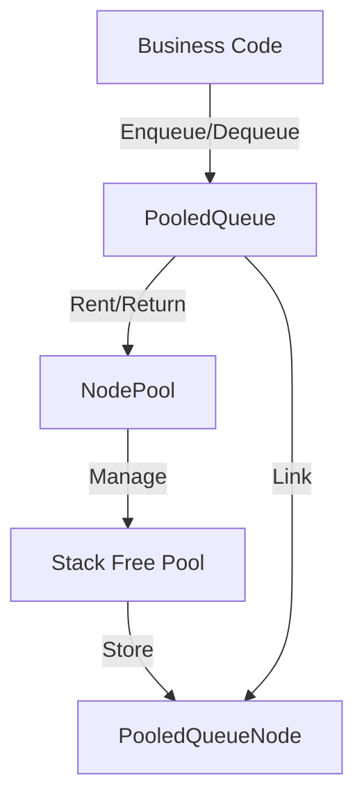

## Pooled Queue System Development Document (Zero GC + Dynamic Capacity)

### Feature Overview

The pooled queue implements O(1) enqueue/dequeue with near-zero GC using reusable nodes. It supports prewarming and pool statistics, provides common APIs like Enqueue/TryDequeue/TryPeek/Clear/Count, can be a drop-in replacement for Queue<T> in event, networking, and command scenarios, and helps pinpoint performance/leak issues via runtime logs and the Profiler.

### Goals & Features

- **Zero GC**: Reuse nodes via an object pool to avoid frequent allocations and frees
- **High performance**: O(1) enqueue/dequeue, linked-list based
- **Dynamic capacity**: No need for large preallocated arrays; capacity grows on demand
- **Simple API**: Clean Enqueue/TryDequeue/Clear interface
- **Stats & monitoring**: Built-in node pool stats for performance analysis
- **Type safety**: Generic design supporting both value and reference types

### Architecture (Logic)



### Core Components

#### 1. PooledQueueNode<T> (Linked List Node)

**Responsibilities**:

- Store the queue element value
- Maintain the Next pointer of the linked list
- Provide Reset method to clear state

**Design Notes**:

- `sealed class` to avoid virtual dispatch overhead
- Call `Reset()` before returning to the pool to clear references and prevent memory leaks

```csharp
internal sealed class PooledQueueNode<T>
{
    public T Value;
    public PooledQueueNode<T> Next;

    public void Reset()
    {
        Value = default;
        Next = null;
    }
}
```

#### 2. NodePool<T> (Node Object Pool)

**Responsibilities**:

- Manage node creation, rent, and return
- Prewarm to reduce runtime allocation
- Statistics (created/rented/returned/peak)

**Core APIs**:

```csharp
PooledQueueNode<T> Rent()         // Get a node from the pool
void Return(PooledQueueNode<T>)   // Return a node to the pool
void Prewarm(int count)           // Prewarm: pre-create nodes
PoolStats GetStats()              // Get statistics
```

**Key Implementation**:

```23:48:Scripts/0_General/0_5_QueueSystem/NodePool.cs
// ... fields ...

/// <summary>
/// Construct node pool
/// </summary>
/// <param name="initialCapacity">Initial capacity (prewarmed nodes)</param>
public NodePool(int initialCapacity = 16)
{
    _initialCapacity = initialCapacity;
    _pool = new Stack<PooledQueueNode<T>>(initialCapacity);
    Prewarm(initialCapacity);
}

/// <summary>
/// Rent a node from pool
/// - If empty, create a new node (dynamic expansion)
/// </summary>
public PooledQueueNode<T> Rent()
{
    _totalRented++;

    if (_pool.Count > 0)
    {
        return _pool.Pop();
    }

    // Pool empty, create a new node (one-time GC; will be reused thereafter)
    _totalCreated++;
    return new PooledQueueNode<T>();
}
```

#### 3. PooledQueue<T> (Queue Class)

**Responsibilities**:

- Maintain head/tail pointers of the linked list
- Offer queue operation APIs
- Manage node lifecycle

**Core APIs**:

```csharp
void Enqueue(T item)              // O(1) enqueue
bool TryDequeue(out T result)     // O(1) dequeue
bool TryPeek(out T result)        // Peek head
void Clear()                      // Clear queue
int Count { get; }                // Element count
bool IsEmpty { get; }             // Is empty
```

**Enqueue Implementation** (O(1), zero GC):

```43:65:Scripts/0_General/0_5_QueueSystem/PooledQueue.cs
/// <summary>
/// Enqueue: append item to the tail
/// - Time complexity: O(1)
/// - Space complexity: O(1) (node reuse, virtually no GC)
/// </summary>
public void Enqueue(T item)
{
    // Rent a node from pool
    var newNode = _nodePool.Rent();
    newNode.Value = item;
    newNode.Next = null;

    if (_tail != null)
    {
        // Non-empty queue, link to tail
        _tail.Next = newNode;
        _tail = newNode;
    }
    else
    {
        // Empty queue, new node is both head and tail
        _head = newNode;
        _tail = newNode;
    }

    _count++;
}
```

**Dequeue Implementation** (O(1), auto return node):

```67:94:Scripts/0_General/0_5_QueueSystem/PooledQueue.cs
/// <summary>
/// Dequeue: try remove and return head element
/// - Time complexity: O(1)
/// - Node automatically returned to pool
/// </summary>
/// <param name="result">Dequeued element (if success)</param>
/// <returns>Whether dequeued successfully</returns>
public bool TryDequeue(out T result)
{
    if (_head == null)
    {
        // Empty queue
        result = default;
        return false;
    }

    // Take head element
    result = _head.Value;
    var oldHead = _head;

    // Move head pointer
    _head = _head.Next;
    if (_head == null)
    {
        // Queue emptied, clear tail pointer
        _tail = null;
    }

    // Return node to pool
    _nodePool.Return(oldHead);
    _count--;
    return true;
}
```

### Usage Guide

#### Basic Usage

```csharp
// 1. Create queue (optional prewarm)
var queue = new PooledQueue<int>(initialPoolCapacity: 100);

// 2. Enqueue
queue.Enqueue(10);
queue.Enqueue(20);
queue.Enqueue(30);

// 3. Peek head (without removal)
if (queue.TryPeek(out int value))
{
    Debug.Log($"Head: {value}"); // 10
}

// 4. Dequeue (recommended: zero GC)
while (queue.TryDequeue(out int item))
{
    ProcessItem(item);
}

// 5. Clear
queue.Clear();
```

#### Performance Tips

**Prewarm pool (avoid runtime allocation)**:

```csharp
// Prewarm at scene load
var queue = new PooledQueue<PlayerAction>(initialCapacity: 50);
queue.PrewarmPool(additionalCapacity: 100); // total 150 prewarmed nodes

// Subsequent enqueue/dequeue almost no GC
for (int i = 0; i < 100; i++)
{
    queue.Enqueue(new PlayerAction { /* ... */ });
}
```

**Avoid foreach (prefer while loop)**:

```csharp
// ❌ Not recommended: foreach creates iterator GC
foreach (var item in queue)
{
    Process(item);
}

// ✅ Recommended: zero GC
while (queue.TryDequeue(out var item))
{
    Process(item);
}
```

**Batch operation pattern**:

```csharp
// Scenarios: event queue, command queue, message queue
public class EventQueue
{
    private PooledQueue<GameEvent> _events = new PooledQueue<GameEvent>(200);

    public void EnqueueEvent(GameEvent evt) => _events.Enqueue(evt);

    public void ProcessAllEvents()
    {
        // Zero-GC batch processing
        while (_events.TryDequeue(out var evt))
        {
            evt.Execute();
        }
    }
}
```

### Performance Analysis

#### Time Complexity

| Operation  | Time | Notes                    |
| ---------- | ---- | ------------------------ |
| Enqueue    | O(1) | Insert at tail           |
| TryDequeue | O(1) | Remove from head         |
| TryPeek    | O(1) | Read head value          |
| Clear      | O(n) | Return all nodes to pool |
| Count      | O(1) | Field access             |

#### GC Comparison

**Standard Queue<T> (allocates GC)**:

```csharp
var queue = new Queue<int>();
for (int i = 0; i < 1000; i++)
{
    queue.Enqueue(i); // Internal array growth triggers GC
}
// Profiler: GC.Alloc ≈ 8KB+
```

**PooledQueue<T> (zero GC)**:

```csharp
var queue = new PooledQueue<int>(1000); // prewarm
for (int i = 0; i < 1000; i++)
{
    queue.Enqueue(i); // node reuse, no growth
}
// Profiler: GC.Alloc ≈ 0B (after prewarm)
```

#### Viewing Statistics

```csharp
var stats = queue.GetPoolStats();
Debug.Log(stats);
// Example:
// [NodePool] Pool size: 95, Created: 100, Rented: 250, Returned: 245, Peak: 100, Active: 5
```

### Typical Use Cases

#### 1. Game Event Queue

```csharp
public class GameEventQueue
{
    private PooledQueue<IGameEvent> _eventQueue = new PooledQueue<IGameEvent>(50);

    public void EnqueueEvent(IGameEvent evt) => _eventQueue.Enqueue(evt);

    public void Update()
    {
        // Process all events per frame (zero GC)
        while (_eventQueue.TryDequeue(out var evt))
        {
            evt.Execute();
        }
    }
}
```

#### 2. Network Message Buffer

```csharp
public class NetworkMessageBuffer
{
    private PooledQueue<NetworkPacket> _receiveQueue = new PooledQueue<NetworkPacket>(200);

    public void OnReceive(NetworkPacket packet)
    {
        _receiveQueue.Enqueue(packet); // Network thread enqueue
    }

    public void ProcessMessages()
    {
        // Main thread batch processing (zero GC)
        int processedCount = 0;
        const int maxPerFrame = 10;

        while (processedCount < maxPerFrame && _receiveQueue.TryDequeue(out var packet))
        {
            HandlePacket(packet);
            processedCount++;
        }
    }
}
```

#### 3. Object Recycle Queue

```csharp
public class EntityRecycler
{
    private PooledQueue<Entity> _recycleQueue = new PooledQueue<Entity>(100);

    public void ScheduleRecycle(Entity entity)
    {
        _recycleQueue.Enqueue(entity);
    }

    public void LateUpdate()
    {
        // Deferred recycle (avoid iteration-removal conflicts)
        while (_recycleQueue.TryDequeue(out var entity))
        {
            entity.ReturnToPool();
        }
    }
}
```

### Notes & Boundaries

#### Thread Safety

- ⚠️ **Not thread-safe**: PooledQueue is not safe for concurrent access
- For multithreading, use `lock` or `ConcurrentQueue<T>` (with extra GC)

```csharp
// Thread-safe wrapper (example)
public class ThreadSafePooledQueue<T>
{
    private PooledQueue<T> _queue = new PooledQueue<T>();
    private readonly object _lock = new object();

    public void Enqueue(T item)
    {
        lock (_lock) { _queue.Enqueue(item); }
    }

    public bool TryDequeue(out T result)
    {
        lock (_lock) { return _queue.TryDequeue(out result); }
    }
}
```

#### Memory Management

- **Prewarm capacity**: Set based on peak demand to avoid runtime growth
- **Cleanup timing**: Call `Clear()` on scene unload to return all nodes
- **Leak detection**: Check `GetPoolStats().ActiveNodes` for unreclaimed nodes

```csharp
// Cleanup on scene unload
private void OnDestroy()
{
    var stats = _queue.GetPoolStats();
    if (stats.ActiveNodes > 0)
    {
        Debug.LogWarning($"There are {stats.ActiveNodes} active nodes not returned; possible memory leak");
    }
    _queue.Clear();
}
```

#### Performance Trade-offs

- **Prewarm vs Dynamic Expansion**:
  - Prewarm: one-time GC at startup, zero allocation afterwards
  - Dynamic: allocate on demand, lower initial memory, minor GC possible
- **Recommendation**: Prewarm for high-frequency queues (events/messages); dynamic for low-frequency

### Editor Tools

#### Runtime Monitoring (optional)

```csharp
#if UNITY_EDITOR
[ContextMenu("Log queue detail")]
public void LogDebugInfo()
{
    Debug.Log($"Queue: {_queue}");
    Debug.Log($"NodePool: {_queue.GetPoolStats()}");
}
#endif
```

#### Profiler Integration

In Unity Profiler, inspect:

- **Memory.GC.Alloc**: should be 0 (after prewarm)
- **Custom markers**: use `Profiler.BeginSample("PooledQueue.Enqueue")`

### Tests & Verification

#### Unit Tests (examples)

```csharp
[Test]
public void PooledQueue_EnqueueDequeue_ShouldMaintainOrder()
{
    var queue = new PooledQueue<int>(10);

    queue.Enqueue(1);
    queue.Enqueue(2);
    queue.Enqueue(3);

    Assert.IsTrue(queue.TryDequeue(out int v1));
    Assert.AreEqual(1, v1);
    Assert.IsTrue(queue.TryDequeue(out int v2));
    Assert.AreEqual(2, v2);
    Assert.IsTrue(queue.TryDequeue(out int v3));
    Assert.AreEqual(3, v3);
    Assert.IsFalse(queue.TryDequeue(out _));
}

[Test]
public void PooledQueue_BatchOperations_ShouldHaveZeroGC()
{
    var queue = new PooledQueue<int>(1000);
    queue.PrewarmPool(1000);

    long gcBefore = GC.GetTotalMemory(true);

    for (int i = 0; i < 1000; i++)
    {
        queue.Enqueue(i);
    }
    while (queue.TryDequeue(out _)) { }

    long gcAfter = GC.GetTotalMemory(false);
    long allocated = gcAfter - gcBefore;

    Assert.IsTrue(allocated < 100, $"Expected near-zero GC, actual: {allocated}B");
}
```

### References

- Unity Collections: `https://docs.unity3d.com/Packages/com.unity.collections@latest`
- Object Pooling Pattern: `https://en.wikipedia.org/wiki/Object_pool_pattern`
- C# Stack<T> docs: `https://docs.microsoft.com/en-us/dotnet/api/system.collections.generic.stack-1`
