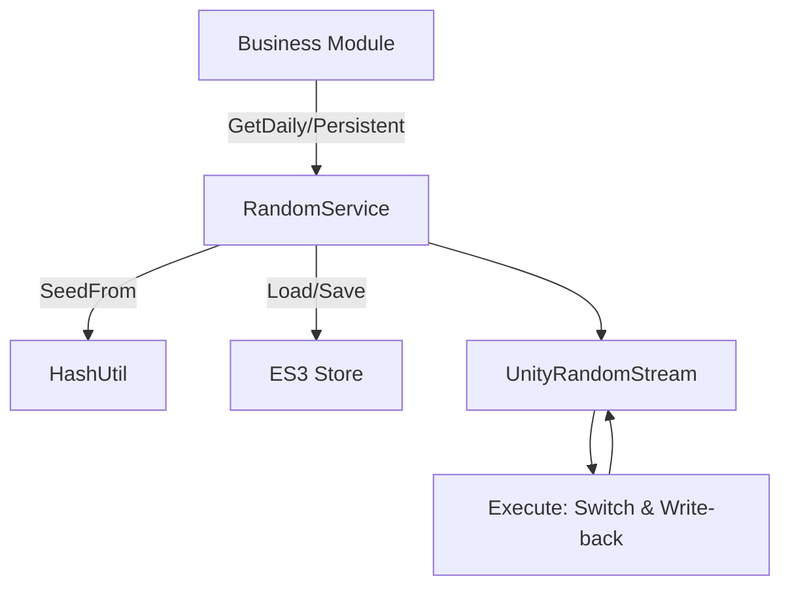
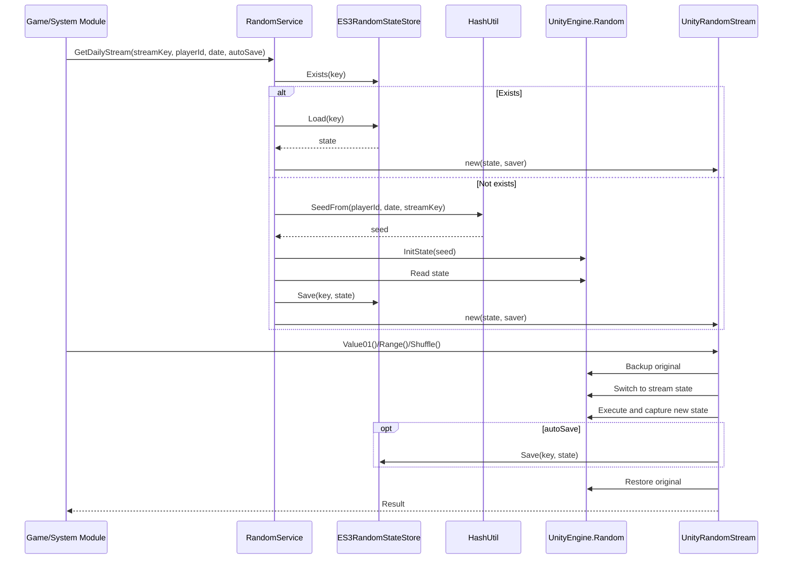
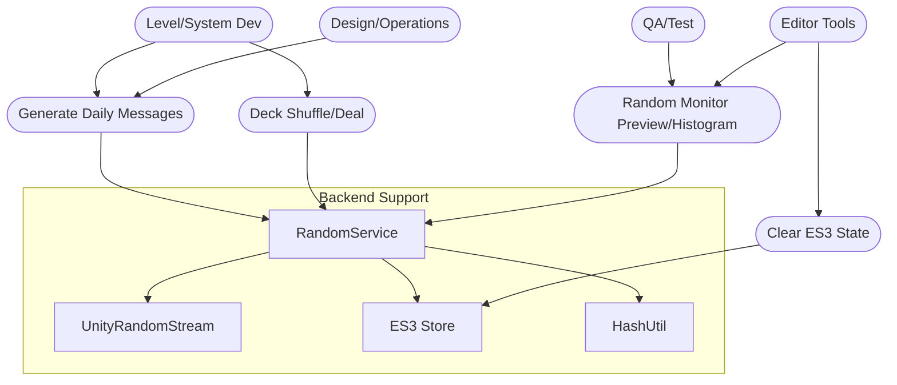
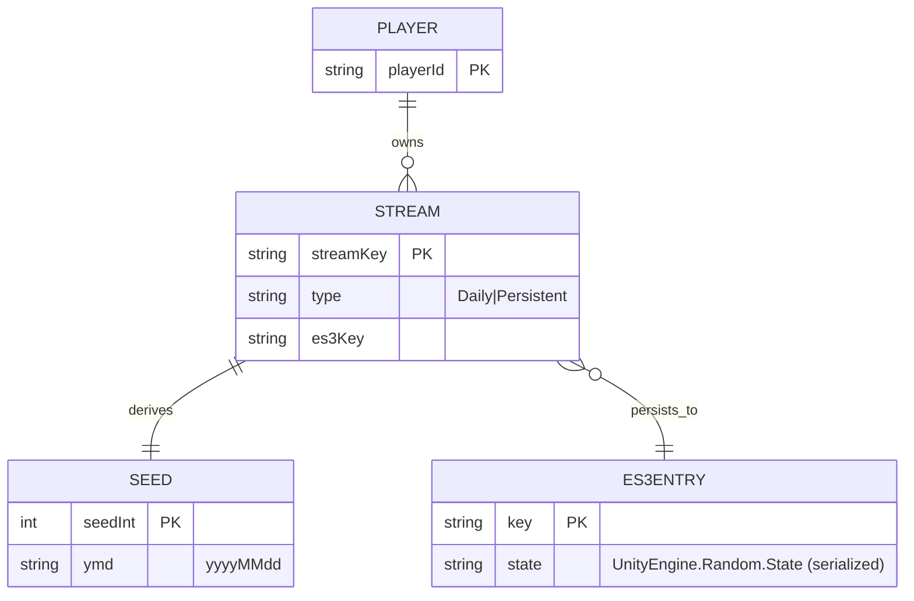

## Random System Development Document (Daily Stable + ES3 Persistence)

### Feature Overview

The random system provides two modes: "Daily Stable" and "True Random". It exposes unified interfaces for Range/Shuffle/Deal/Pick/Weighted via `IRandomSource`, and persists `UnityEngine.Random.State` using ES3 to enable state continuity. It restores the global random state before and after each call to avoid pollution. With monitors and histograms, it balances production unpredictability with QA reproducibility.

### Goals & Features

- **Daily Stable**: Stable results by `playerId + date + streamKey`; changes across days.
- **Multi-stream Isolation**: Independent streams per business use case, no interference.
- **Persistable**: Save/restore `UnityEngine.Random.State` via ES3.
- **No Global Pollution**: Restore global `UnityEngine.Random.state` around each call.
- **Common APIs**: Range, shuffle, deal (no replacement), weighted pick.

### Architecture (Logic)



### Mermaid Legend

#### Sequence: Get daily stream and sample once (branch: exists / not exists)



#### Use Cases: Typical Interactions



#### ER Diagram: Core Entities



### Key Data

- **Seed**: `SeedFrom(playerId, date, streamKey)` outputs `int`.
- **State Storage Key**:
  - Daily: `rng/daily/{playerId}/{yyyyMMdd}/{streamKey}`
  - Persistent: `rng/persistent/{playerId}/{streamKey}`
- **State Type**: `UnityEngine.Random.State` (Unity-serializable).

### Interfaces & Implementations (Code References)

- IRandomSource (unified API)

```1:18:Scripts/0_General/0_4_RandomSystem/IRandomSource.cs
namespace TabernaNoctis.RandomSystem
{
    public interface IRandomSource
    {
        int Range(int minInclusive, int maxExclusive);
        float Range(float minInclusive, float maxInclusive);
        float Value01();
        void Shuffle<T>(IList<T> list);
        List<T> Deal<T>(IList<T> deck, int count, bool removeFromSource = false);
        T PickOne<T>(IList<T> list);
        T PickWeighted<T>(IList<T> items, IList<float> weights);
    }
}
```

- RandomService (get daily/persistent stream and handle ES3)

```17:33:Scripts/0_General/0_4_RandomSystem/RandomService.cs
public IRandomSource GetDailyStream(string streamKey, string playerId, DateTime? date = null, bool autoSave = true)
{
    DateTime d = date ?? DateTime.Now;
    string es3Key = "rng/daily/" + (playerId ?? string.Empty) + "/" + d.ToString("yyyyMMdd") + "/" + (streamKey ?? string.Empty);

    if (_store.Exists(es3Key))
    {
        var st = _store.Load(es3Key);
        return new UnityRandomStream(st, autoSave ? (s => _store.Save(es3Key, s)) : null);
    }
    else
    {
        var st = CreateStateFromSeed(HashUtil.SeedFrom(playerId, d, streamKey));
        _store.Save(es3Key, st);
        return new UnityRandomStream(st, autoSave ? (s => _store.Save(es3Key, s)) : null);
    }
}
```

- HashUtil (FNV-1a 32-bit simplified)

```7:21:Scripts/0_General/0_4_RandomSystem/HashUtil.cs
public static int SeedFrom(string playerId, DateTime date, string streamKey)
{
    string s = (playerId ?? string.Empty) + "|" + date.ToString("yyyyMMdd") + "|" + (streamKey ?? string.Empty);
    unchecked
    {
        const uint offset = 2166136261u;
        const uint prime = 16777619u;
        uint hash = offset;
        for (int i = 0; i < s.Length; i++)
        {
            hash ^= s[i];
            hash *= prime;
        }
        return (int)hash;
    }
}
```

- UnityRandomStream (execute without global pollution)

```151:165:Scripts/0_General/0_4_RandomSystem/UnityRandomStream.cs
private void Execute(Action action)
{
    var original = UnityEngine.Random.state;
    try
    {
        UnityEngine.Random.state = _state;
        action();
        _state = UnityEngine.Random.state;
        _autoSaver?.Invoke(_state);
    }
    finally
    {
        UnityEngine.Random.state = original;
    }
}
```

- ES3 store for `Random.State`

```7:20:Scripts/0_General/0_4_RandomSystem/ES3RandomStateStore.cs
public bool Exists(string key) { return ES3.KeyExists(key); }
public void Save(string key, UnityEngine.Random.State state) { ES3.Save(key, state); }
public UnityEngine.Random.State Load(string key) { return ES3.Load<UnityEngine.Random.State>(key); }
```

### Typical Usage

- Daily messages (daily stable)

```csharp
var rng = RandomService.Instance.GetDailyStream("DailyMessage", playerId);
var msg = rng.PickOne(messagePool);
```

- Card deck (persistent stream across sessions)

```csharp
var rng = RandomService.Instance.GetPersistentStream("CardDeck", playerId, autoSave:true);
rng.Shuffle(deck);
var hand = rng.Deal(deck, 5, removeFromSource:true);
```

### Editor Tool (Monitor)

- Path: `Custom Tools/Random System/Random Monitor`
- Features: Load/init streams, preview consumed/unconsumed, histogram, clear ES3 state, UTC toggle.
- Style: depends on `Scripts/0_Editor/UITK/EditorColors.uss`, window `RandomMonitorWindow.cs`.

### Design Notes & Boundaries

- `UnityEngine.Random` is static and main-thread bound; for parallel/Jobs, consider a custom PRNG (`IRandomSource` implementation).
- Float upper bounds are inclusive; differs from `System.Random` (see Unity docs).
- Time zone: local date by default; use UTC for cross-region consistency if needed.
- Performance: `autoSave` can be disabled; batch saves later.

### Tests

- Same `playerId + yyyyMMdd + streamKey` yields identical output for the same day; different across days or IDs.
- Multiple business streams in parallel are independent and non-interfering.
- After process restart, ES3 correctly restores and continues stream state.
- Validate shuffle uniformity and weighted picks (can use histograms).

### Recent Updates (2025-10)

- **New True Random mode (default)**: When not explicitly requiring "Daily Stable", use multi-entropy seed to avoid fixed sequences caused by editor `UnityEngine.Random` reset on each Play.
  - Entropy: `DateTime.Now.Ticks` + `Guid.NewGuid()` + `UnityEngine.Random.value`, XOR to `combinedSeed`, then sample via `System.Random(combinedSeed)`.
  - Pros: Different results each run, even same slot same day; no pollution of global `UnityEngine.Random.state`.
- **Keep Daily Stable (optional for reproducibility/QA)**: When `useSeed=true`, use `finalSeed = seed + slotHash + currentDay * 1000`; `slotHash` from `SaveManager.CurrentSlotID`, ensuring different sequences per save slot.
- **Observability**: Added logs in Newspaper controller to distinguish "seeded" vs "true random" modes.

#### Key Snippets (Code References)

- True random entropy and pick (`DailyMessagesData.GetRandomEntry(seed:null)`):

```121:133:Scripts/2_DayMessageScreen/DailyMessagesData.cs
// Use System.Random with multiple entropy sources to ensure dynamic randomness
// Entropy: timestamp + Guid + Unity random value; avoids Editor reset issue
int timeSeed = (int)(System.DateTime.Now.Ticks & 0x7FFFFFFF);
int guidSeed = System.Guid.NewGuid().GetHashCode();
int unitySeed = (int)(UnityEngine.Random.value * int.MaxValue);
int combinedSeed = timeSeed ^ guidSeed ^ unitySeed;

var rng = new System.Random(combinedSeed);
int idx = rng.Next(0, source.Count);
lastSelectedIndex = Mathf.Clamp(idx, 0, source.Count - 1);

Debug.Log($"[DailyMessagesData] True-random selection: index={lastSelectedIndex}, entropy={combinedSeed}");
return source[lastSelectedIndex];
```

- Daily stable/true random switch and logs (`NewspaperAnimationController`):

```106:121:Scripts/2_DayMessageScreen/NewspaperAnimationController.cs
// Mixed seed from current day + save slot ID; ensures per-day and per-slot differences
int currentDay = TimeSystemManager.Instance != null ? TimeSystemManager.Instance.CurrentDay : 1;
string slotId = SaveManager.Instance != null ? SaveManager.Instance.CurrentSlotID : "1";
int slotHash = string.IsNullOrEmpty(slotId) ? 0 : slotId.GetHashCode();
int finalSeed = useSeed ? (seed + slotHash + currentDay * 1000) : 0;

if (useSeed)
{
    Debug.Log($"[Newspaper] Seeded random: base={seed}, slotHash={slotHash}, day={currentDay}, finalSeed={finalSeed}");
}
else
{
    Debug.Log($"[Newspaper] True-random mode (timestamp+Guid+Unity.Random)");
}

var entry = dailyMessagesData.GetRandomEntry(useSeed ? (int?)finalSeed : null);
```

- Expose current save slot ID (`SaveManager`):

```17:19:Scripts/0_General/0_6_SaveSystem/SaveManager.cs
// ====== Public Property ======
public string CurrentSlotID => _currentSlotID;
```

#### Usage Suggestions

- **Production**: Keep `useSeed=false` (default) for maximum unpredictability.
- **QA/Repro**: Set `useSeed=true`, provide `seed` and fix `slotId` and `day` for reproducibility.
- **Monitoring**: Use logs to confirm mode and key parameters (slotHash, day, finalSeed/combinedSeed).

### References

- Unity 2022.3 Random API: `https://docs.unity3d.com/2022.3/Documentation/ScriptReference/Random.html`
