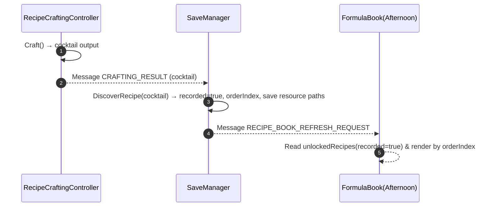
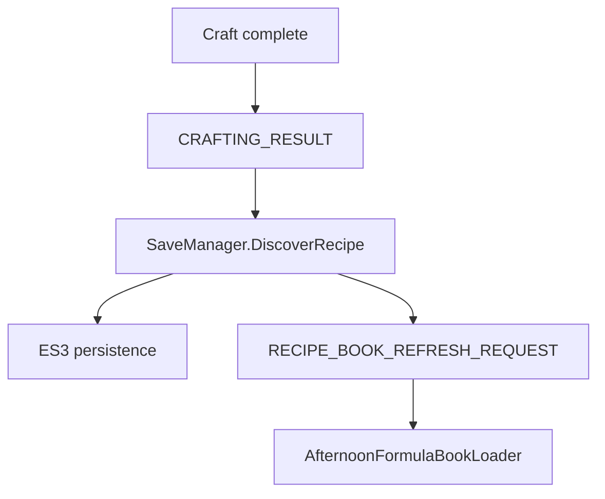

## Recipe Book & Night Menu Persistence Dev Guide

### 1. Overview

- Show only cocktails that the player has crafted; persist order and UI resource paths across days.
- Night menu reads selected recipe IDs of the day and displays as card items (image/name/five stats).

### 2. Data Model

| Field               | Type     | Description                                        |
| ------------------- | -------- | -------------------------------------------------- |
| recipeId            | string   | stable ID via `CocktailCardSO.id.ToString()`       |
| recorded            | bool     | recorded (crafted at least once)                   |
| orderIndex          | int      | display order in the book (assigned when unlocked) |
| cocktailSpritePath  | string   | Resources path for cocktail image                  |
| materialNames       | string[] | three material names (for UI)                      |
| materialSpritePaths | string[] | Resources paths for the three material images      |

> Note: defined on `RecipeData`; list stored in `SaveData.unlockedRecipes`.

### 3. Recipe Recording Flow



#### 3.1 Data Flow (Craft → Save → Book)



### 4. Formula Book UI (Afternoon)

- `AfternoonFormulaBookLoader`:
  - Get `unlockedRecipes` from `SaveManager`, filter `recorded=true`, order by `orderIndex`.
  - Instantiate `Formula.prefab`, attach `FormulaItemView`, call `Apply(RecipeData)`.
- `FormulaItemView`:
  - Load images via `Resources.Load<Sprite>(path)` and fill `Image`/`TMP_Text`.

### 5. Night Menu UI (Night)

- `NightMenuViewer`:
  - Parse `SaveData.currentMenuRecipeIDs` to `CocktailCardSO` (direct map or `Resources.LoadAll` fallback).
  - Instantiate `NightMenu.cardItemPrefab` (with `NightMenuItemView`) to display items; panel `Show/Hide/Toggle` and `refreshOnShow`.
- `NightMenuItemView`:
  - Bind image, name and five statuses (Busy/Irritable/Melancholy/Picky/Friendly) to separate TMPs, render with `FormatSigned`.

#### 5.1 Menu Parsing Steps

1. Read IDs from `SaveData.currentMenuRecipeIDs`.
2. Try direct map id→`CocktailCardSO` from `cocktailCatalog`; otherwise fallback to `Resources.LoadAll`.
3. For each `CocktailCardSO`, instantiate `cardItemPrefab` and call `NightMenuItemView.Apply`.
4. If `refreshOnShow` is true, re-render list on `ShowMenuPanel()`.

#### 5.2 Example JSON (Snippet)

```json
{
  "unlockedRecipes": [
    {
      "recipeId": "101",
      "recorded": true,
      "orderIndex": 0,
      "cocktailSpritePath": "Sprites/UI/Cocktails/Martini",
      "materialNames": ["Gin", "Vermouth", "Olive"],
      "materialSpritePaths": [
        "Sprites/UI/Materials/Gin",
        "Sprites/UI/Materials/Vermouth",
        "Sprites/UI/Materials/Olive"
      ]
    }
  ],
  "currentMenuRecipeIDs": ["101", "205", "307"]
}
```

### 6. Save Interaction

- `SaveManager.DiscoverRecipe(CocktailCardSO)`:
  - First record `recorded=true`, assign `orderIndex = unlockedRecipes.Count`.
  - Persist UI image paths and material info; broadcast `RECIPE_BOOK_REFRESH_REQUEST`.
- Daily menu:
  - `SaveData.currentMenuRecipeIDs` holds the selected recipes of the day; cleared after settlement; re-select next day.

### 7. Troubleshooting

- Empty book on Day 2: ensure CRAFTING_RESULT is sent; `DiscoverRecipe` uses `cocktail.id.ToString()`; UI resource paths persisted.
- Missing images: verify `cocktailSpritePath/materialSpritePaths` are valid Resources paths; `Resources.Load<Sprite>()` returns non-null.
- Night menu shows only IDs: ensure `NightMenuViewer.cardItemPrefab` is the card prefab (with `NightMenuItemView`) and fields are bound.
