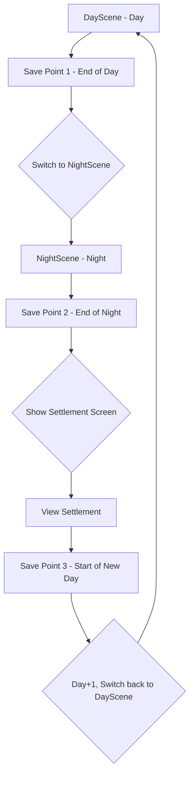
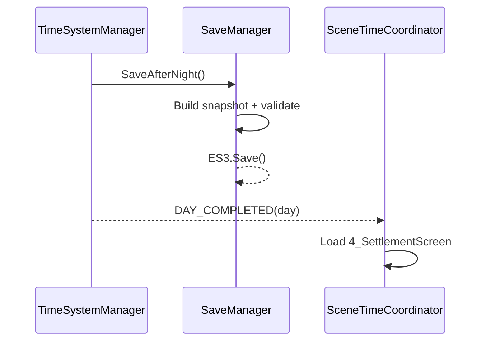
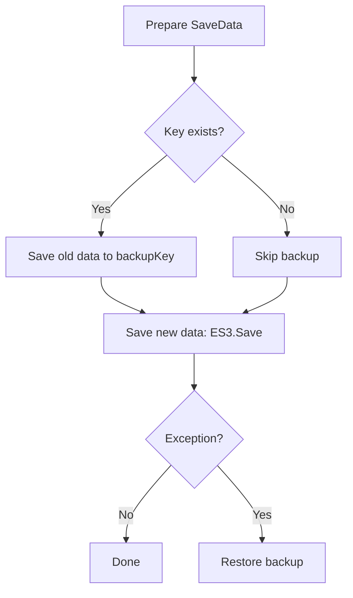
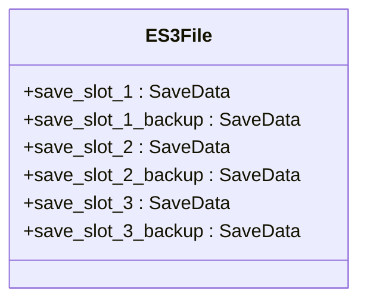
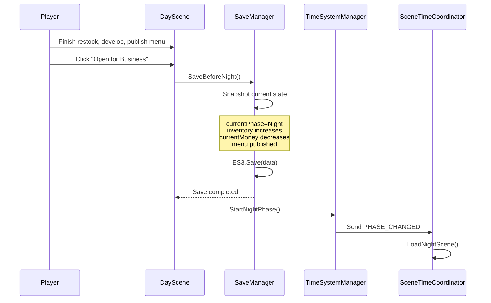
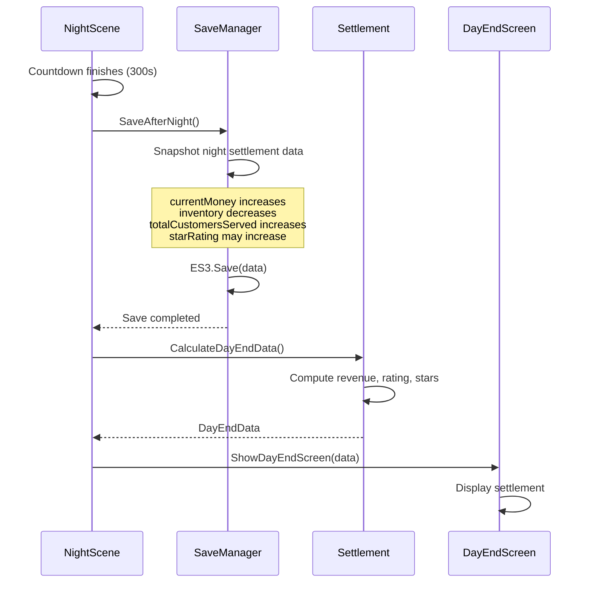
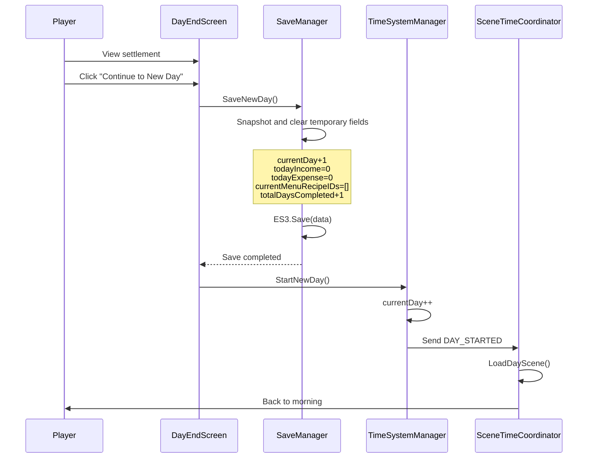

# Save System Development Document

**Project: Taberna Noctis**  
**Version: v1.0**  
**Last Updated: 2025-10-09**

---

## Feature Overview

The save system automatically creates snapshots and persists them to ES3 at three critical points: end of Day, end of Night, and start of a New Day. It provides unified key naming, backup and rollback, version upgrade, and data validation to ensure state consistency while minimizing player operations. It also offers a Save Slot UI for key info display and read/write, and decouples integration with other systems via messages like SAVE_COMPLETED and SAVE_LOADED.

## 📋 Table of Contents

1. [System Overview](#system-overview)
2. [Auto-Save Mechanism](#auto-save-mechanism)
3. [Save Data Structure](#save-data-structure)
4. [The Three Save Points](#the-three-save-points)
5. [Data Change Tracking](#data-change-tracking)
6. [Save Manager Design](#save-manager-design)
7. [Save UI Design](#save-ui-design)
8. [Technical Implementation Notes](#technical-implementation-notes)
9. [Implementation Checklist](#implementation-checklist)

---

## System Overview

### Design Goals

- ✅ Fully automatic saves, no manual operation required
- ✅ Auto-save at three key moments (end of Day, end of Night, start of New Day)
- ✅ Save data integrity guaranteed
- ✅ Support multiple save slots (3–5)
- ✅ Save list displays key info (day, money, star rating, play time)
- ✅ Persistence based on Easy Save 3

### Core Concept

> "Invisible saves, resume anytime"  
> Players need not worry about losing progress. The system auto-saves at key moments so the game can resume from a valid position at any time.

---

## Auto-Save Mechanism

### Three Auto-Save Moments



### Additional Diagrams

#### 1) Save Call Sequence (End of Night → Settlement)



#### 2) Data Write & Backup Flow



#### 3) Slot/Key Structure



### Detailed Timing Notes

| Save Point                        | Trigger                                                | Scene State                                                  | Saved Content                                                                                                                                | Overwritten Fields                                                            |
| --------------------------------- | ------------------------------------------------------ | ------------------------------------------------------------ | -------------------------------------------------------------------------------------------------------------------------------------------- | ----------------------------------------------------------------------------- |
| **Save Point 1**<br>End of Day    | Player clicks "Open for Business"<br>Day → Night       | - Restocking done<br>- Recipes developed<br>- Menu published | - Inventory increases (purchases)<br>- Money decreases (expenses)<br>- New recipes unlocked<br>- Menu list                                   | `currentPhase`<br>`inventory`<br>`currentMoney`<br>`unlockedRecipes`          |
| **Save Point 2**<br>End of Night  | Night countdown reaches 0 (300s)<br>Night → Settlement | - Customers served<br>- Revenue settled<br>- Rating tallied  | - Money increases (revenue)<br>- Inventory decreases (consumption)<br>- Total customers<br>- Cumulative rating<br>- Star rating may increase | `currentMoney`<br>`inventory`<br>`totalCustomersServed`<br>`starRating`       |
| **Save Point 3**<br>New Day Start | Click "Continue to New Day"<br>Settlement → Day        | - Settlement viewed<br>- Prepare next day                    | - **Day+1**<br>- Reset all today\* fields<br>- Clear menu<br>- Completed days +1                                                             | **`currentDay`**<br>`todayIncome`<br>`todayExpense`<br>`currentMenuRecipeIDs` |

---

## Save Data Structure

### Full Structure (SaveData.cs)

```csharp
[System.Serializable]
public class SaveData
{
    // ========== Meta ==========
    public string saveSlotID;              // Unique slot ID: "save_slot_1"
    public string saveSlotName;            // Slot display name: "Save 1"
    public string lastSaveDateTime;        // Last save time: "2025-01-15 20:30:45"
    public double totalPlayTimeSeconds;    // Accumulated real play time (seconds)
    public int saveVersion = 1;            // Save version (compatibility)

    // ========== Timeline ==========
    public int currentDay = 1;             // Current day index
    public TimePhase currentPhase;         // Current phase
    public DaySubPhase daySubPhase;        // Day subphase
    public int clockHour;                  // Game clock hour
    public int clockMinute;                // Game clock minute
    public float phaseRemainingTime;       // Remaining time in phase

    // ========== Economy ==========
    public int currentMoney;               // Current money
    public int totalEarnedMoney;           // Total earned (including already spent)
    public int totalSpentMoney;            // Total spent
    public int todayIncome;                // Today's income
    public int todayExpense;               // Today's expense

    // ========== Reputation ==========
    public int starRating;                 // Star rating (0–5)
    public float cumulativeScore;          // Cumulative score
    public int totalCustomersServed;       // Total customers served
    public int todayCustomersServed;       // Customers served today
    public float todayAverageScore;        // Today's average score

    // ========== Inventory ==========
    public Dictionary<string, int> inventory;
    // Example: {"GIN": 5, "VODKA": 3, ...}

    // ========== Recipes ==========
    public List<RecipeData> unlockedRecipes;   // Unlocked recipes
    public List<string> currentMenuRecipeIDs;  // Current menu items
    public int totalRecipesCreated;            // Total recipes developed

    // ========== Daily-temporary (reset each day) ==========
    public List<string> todayPurchasedItems;   // Purchases today
    public int todayRecipesCreated;            // Recipes developed today
    public bool todayStockingCompleted;        // Restocking completed flag
    public bool todayMenuSelected;             // Menu published flag

    // ========== Progress Flags ==========
    public bool tutorialCompleted;             // Tutorial completed
    public int totalDaysCompleted;             // Days completed
    public int highestStarRatingAchieved;      // Highest star rating achieved

    // ========== Achievements/Unlocks ==========
    public List<string> unlockedAchievements;  // Unlocked achievements
    public List<string> specialRecipes;        // Special recipes (star rewards)

    // ========== Stats ==========
    public Dictionary<string, int> customerTypeCount; // Service count by customer type
    public int consecutivePerfectDays;         // Consecutive perfect days
    public int maxConsecutivePerfectDays;      // Max consecutive perfect days
}
```

### Data Classification Diagram

```
SaveData Categories
├── 🔵 Persistent Accumulators (monotonic)
│   ├── totalEarnedMoney
│   ├── totalSpentMoney
│   ├── totalCustomersServed
│   ├── totalRecipesCreated
│   ├── unlockedRecipes
│   ├── unlockedAchievements
│   └── maxConsecutivePerfectDays
│
├── 🟢 Game State (mutates)
│   ├── currentMoney
│   ├── inventory
│   ├── starRating
│   ├── currentDay
│   ├── currentPhase
│   └── clockHour/clockMinute
│
└── 🟡 Daily Temporary (reset each day)
    ├── todayIncome
    ├── todayExpense
    ├── todayCustomersServed
    ├── todayAverageScore
    ├── todayPurchasedItems
    ├── todayRecipesCreated
    └── currentMenuRecipeIDs
```

---

## The Three Save Points

### Save Point 1: End of Day → Before Night

#### Trigger

```csharp
// DaySceneController.cs
public void OnOpenShopClicked()
{
    // 1. Ensure menu is selected
    if (!MenuManager.Instance.HasMenuSelected())
    {
        ShowWarning("Please publish at least one drink!");
        return;
    }

    // 2. Trigger save
    SaveManager.Instance.SaveBeforeNight();

    // 3. Switch to night
    TimeSystemManager.Instance.StartNightPhase();
}
```

#### Data Changes

| Field                    | Change        | Reason                | Example                       |
| ------------------------ | ------------- | --------------------- | ----------------------------- |
| `currentPhase`           | ✅ Update     | Enter Night           | Morning/Afternoon → Night     |
| `clockHour`              | ✅ Update     | Jump hour             | 18 → 19                       |
| `clockMinute`            | ✅ Update     | Reset minute          | Any → 0                       |
| `currentMoney`           | ✅ Decrease   | Purchasing expense    | 1000 → 750                    |
| `inventory["GIN"]`       | ✅ Increase   | Buy materials         | 5 → 10                        |
| `inventory["VODKA"]`     | ✅ Increase   | Buy materials         | 3 → 8                         |
| `totalSpentMoney`        | ✅ Accumulate | Record expense        | 5000 → 5250                   |
| `todayExpense`           | ✅ Fill       | Record today expense  | 0 → 250                       |
| `unlockedRecipes`        | ✅ Maybe add  | New recipe developed  | [1,2] → [1,2,3]               |
| `currentMenuRecipeIDs`   | ✅ Fill       | Publish menu          | [] → ["recipe_1", "recipe_3"] |
| `todayRecipesCreated`    | ✅ Fill       | Count developed today | 0 → 2                         |
| `todayStockingCompleted` | ✅ true       | Restocking done       | false → true                  |
| `todayMenuSelected`      | ✅ true       | Menu published        | false → true                  |

#### Flow



---

### Save Point 2: End of Night → Before Settlement

#### Trigger

```csharp
// NightPhaseController.cs
void Update()
{
    if (nightTimer <= 0 && !isNightEnding)
    {
        isNightEnding = true;
        EndNightPhase();
    }
}

private void EndNightPhase()
{
    // 1. Trigger save
    SaveManager.Instance.SaveAfterNight();

    // 2. Show settlement UI
    DayEndData endData = CalculateDayEndData();
    UIManager.Instance.ShowDayEndScreen(endData);
}
```

#### Data Changes

| Field                                | Change        | Reason                   | Example        |
| ------------------------------------ | ------------- | ------------------------ | -------------- |
| `clockHour`                          | ✅ Update     | Advance to late night    | 19 → 3         |
| `currentMoney`                       | ✅ Increase   | Night revenue            | 750 → 1200     |
| `inventory["GIN"]`                   | ✅ Decrease   | Crafting consumption     | 10 → 5         |
| `inventory["VODKA"]`                 | ✅ Decrease   | Crafting consumption     | 8 → 3          |
| `totalEarnedMoney`                   | ✅ Accumulate | Record revenue           | 10000 → 10450  |
| `todayIncome`                        | ✅ Fill       | Record today's income    | 0 → 450        |
| `totalCustomersServed`               | ✅ Increase   | Cumulative customers     | 120 → 135      |
| `todayCustomersServed`               | ✅ Fill       | Today customers          | 0 → 15         |
| `cumulativeScore`                    | ✅ Accumulate | Cumulative score         | 850.5 → 965.8  |
| `todayAverageScore`                  | ✅ Compute    | Today's average          | 0 → 7.68       |
| `starRating`                         | ✅ Maybe up   | Rating threshold reached | 2 → 3          |
| `customerTypeCount["Office Worker"]` | ✅ Increase   | Type stats               | 45 → 52        |
| `consecutivePerfectDays`             | ✅ Update     | +1 on perfect else 0     | 2 → 3 or 2 → 0 |

#### Flow



---

### Save Point 3: Start of New Day

#### Trigger

```csharp
// DayEndScreen.cs
public void OnContinueButtonClicked()
{
    // 1. Trigger save (Day+1, clear temporary data)
    SaveManager.Instance.SaveNewDay();

    // 2. Advance to new day
    TimeSystemManager.Instance.StartNewDay();

    // 3. Close settlement and load DayScene
    CloseScreen();
}
```

#### Data Changes (Resets)

| Field                    | Change       | Reason              | Example                      |
| ------------------------ | ------------ | ------------------- | ---------------------------- |
| **`currentDay`**         | ✅ **+1**    | **New day**         | **5 → 6**                    |
| `currentPhase`           | ✅ Reset     | Back to Morning     | Night → Morning              |
| `daySubPhase`            | ✅ Reset     | Back to Stocking    | Any → MorningStocking        |
| `clockHour`              | ✅ Reset     | Reset clock hour    | 3 → 8                        |
| `clockMinute`            | ✅ Reset     | Reset minute        | Any → 0                      |
| `phaseRemainingTime`     | ✅ Reset     | Full morning time   | 0 → 180                      |
| `todayIncome`            | ✅ **Zero**  | Clear daily data    | 450 → 0                      |
| `todayExpense`           | ✅ **Zero**  | Clear daily data    | 250 → 0                      |
| `todayCustomersServed`   | ✅ **Zero**  | Clear daily data    | 15 → 0                       |
| `todayAverageScore`      | ✅ **Zero**  | Clear daily data    | 7.68 → 0                     |
| `todayPurchasedItems`    | ✅ **Clear** | Reset purchase list | ["GIN","VODKA"] → []         |
| `todayRecipesCreated`    | ✅ **Zero**  | Clear daily data    | 2 → 0                        |
| `todayStockingCompleted` | ✅ Reset     | Reset flag          | true → false                 |
| `todayMenuSelected`      | ✅ Reset     | Reset flag          | true → false                 |
| `currentMenuRecipeIDs`   | ✅ **Clear** | Clear menu          | ["recipe_1","recipe_3"] → [] |
| `totalDaysCompleted`     | ✅ **+1**    | Days completed      | 4 → 5                        |

#### Flow



---

## Data Change Tracking

### Overwrite Matrix

| Field                    | Save 1<br>Day → Night | Save 2<br>Night → Settlement | Save 3<br>Settlement → New Day | Type |
| ------------------------ | --------------------- | ---------------------------- | ------------------------------ | ---- |
| **Core Progress**        |                       |                              |                                |      |
| `currentDay`             | ❌ No change (5)      | ❌ No change (5)             | ✅ **+1** (5→6)                | 🔵   |
| `totalDaysCompleted`     | ❌ No change (4)      | ❌ No change (4)             | ✅ **+1** (4→5)                | 🔵   |
| `currentPhase`           | ✅ Morning→Night      | ✅ Night→Settlement          | ✅ Settlement→Morning          | 🔵   |
| `clockHour`              | ✅ 18→19              | ✅ 19→3                      | ✅ 3→8                         | 🔵   |
| **Economy**              |                       |                              |                                |      |
| `currentMoney`           | ✅ Decrease (expense) | ✅ Increase (revenue)        | ❌ No change                   | 🟢   |
| `totalEarnedMoney`       | ❌ No change          | ✅ Accumulate                | ❌ No change                   | 🔵   |
| `totalSpentMoney`        | ✅ Accumulate         | ❌ No change                 | ❌ No change                   | 🔵   |
| `todayIncome`            | ❌ 0                  | ✅ Fill                      | ✅ **Zero**                    | 🟡   |
| `todayExpense`           | ✅ Fill               | ❌ No change                 | ✅ **Zero**                    | 🟡   |
| **Inventory**            |                       |                              |                                |      |
| `inventory`              | ✅ Increase (restock) | ✅ Decrease (consumption)    | ❌ No change                   | 🟢   |
| **Recipes**              |                       |                              |                                |      |
| `unlockedRecipes`        | ✅ Maybe add          | ❌ No change                 | ❌ No change                   | 🔵   |
| `currentMenuRecipeIDs`   | ✅ Fill               | ❌ No change                 | ✅ **Clear**                   | 🟡   |
| `totalRecipesCreated`    | ✅ Accumulate         | ❌ No change                 | ❌ No change                   | 🔵   |
| `todayRecipesCreated`    | ✅ Fill               | ❌ No change                 | ✅ **Zero**                    | 🟡   |
| **Reputation**           |                       |                              |                                |      |
| `totalCustomersServed`   | ❌ No change          | ✅ Increase                  | ❌ No change                   | 🔵   |
| `todayCustomersServed`   | ❌ 0                  | ✅ Fill                      | ✅ **Zero**                    | 🟡   |
| `cumulativeScore`        | ❌ No change          | ✅ Accumulate                | ❌ No change                   | 🔵   |
| `starRating`             | ❌ No change          | ✅ Maybe increase            | ❌ No change                   | 🟢   |
| **Flags**                |                       |                              |                                |      |
| `todayStockingCompleted` | ✅ true               | ❌ No change                 | ✅ Reset false                 | 🟡   |
| `todayMenuSelected`      | ✅ true               | ❌ No change                 | ✅ Reset false                 | 🟡   |

### Data Lifecycle (Within a Day)

```
Day 5 start (Save 3)
    ↓
┌─────────────────────────────────────┐
│ todayIncome = 0                     │
│ todayExpense = 0                    │
│ todayCustomersServed = 0            │
│ currentMenuRecipeIDs = []           │
│ todayStockingCompleted = false      │
└─────────────────────────────────────┘
    ↓ Daytime operations (restock, develop, publish)
    ↓
Save 1 (End of Day)
    ↓
┌─────────────────────────────────────┐
│ todayExpense = 250                  │  ← filled
│ currentMenuRecipeIDs = [R1, R2]     │  ← filled
│ todayStockingCompleted = true       │  ← updated
│ todayMenuSelected = true            │  ← updated
│ inventory increases, money decreases│
└─────────────────────────────────────┘
    ↓ Night operations (serve customers)
    ↓
Save 2 (End of Night)
    ↓
┌─────────────────────────────────────┐
│ todayIncome = 450                   │  ← filled
│ todayCustomersServed = 15           │  ← filled
│ todayAverageScore = 7.68            │  ← computed
│ inventory decreases, money increases│
│ totalCustomersServed += 15          │  ← accumulate
│ starRating may increase             │
└─────────────────────────────────────┘
    ↓ View settlement
    ↓
Save 3 (New Day, Day 6)
    ↓
┌─────────────────────────────────────┐
│ currentDay = 6 (Day+1)              │  ← key
│ todayIncome = 0                     │  ← zero
│ todayExpense = 0                    │  ← zero
│ todayCustomersServed = 0            │  ← zero
│ currentMenuRecipeIDs = []           │  ← clear
│ todayStockingCompleted = false      │  ← reset
│ totalDaysCompleted = 5 (+1)         │  ← accumulate
└─────────────────────────────────────┘
    ↓ Loop continues…
```

---

## Save Manager Design

### SaveManager Core

```csharp
public class SaveManager : MonoBehaviour
{
    public static SaveManager Instance;

    // === Config ===
    [SerializeField] private int maxSaveSlots = 3;
    private const string SAVE_KEY_PREFIX = "save_slot_";

    // === Active Save ===
    private SaveData currentSaveData;
    private string currentSlotID;

    // === Core APIs ===
    public void SaveBeforeNight();         // Save Point 1
    public void SaveAfterNight();          // Save Point 2
    public void SaveNewDay();              // Save Point 3

    public void LoadSaveSlot(string slotID);
    public SaveData GenerateSaveData();
    public List<SaveSlotInfo> GetAllSaveSlots();
    public void DeleteSaveSlot(string slotID);
}
```

### Save Methods Example

```csharp
// Save Point 1: End of Day
public void SaveBeforeNight()
{
    SaveData data = GenerateSaveData();

    // Ensure timeline data
    data.currentPhase = TimePhase.Night;
    data.clockHour = 19;
    data.clockMinute = 0;

    // Validate integrity
    Debug.Assert(data.todayExpense > 0, "There should be daytime expense");
    Debug.Assert(data.currentMenuRecipeIDs.Count > 0, "Menu should be published");

    // Meta
    data.lastSaveDateTime = DateTime.Now.ToString("yyyy-MM-dd HH:mm:ss");
    data.totalPlayTimeSeconds += TimeSystemManager.Instance.TotalPlayTime;

    // Persist
    SaveToFile(data);

    // Notify
    MessageManager.Send(MessageDefine.SAVE_COMPLETED);
}

// Save Point 2: End of Night
public void SaveAfterNight()
{
    SaveData data = GenerateSaveData();

    data.clockHour = 3;
    data.clockMinute = 0;

    // Validate
    Debug.Assert(data.todayIncome > 0, "There should be night income");
    Debug.Assert(data.todayCustomersServed > 0, "Customers should have been served");

    data.lastSaveDateTime = DateTime.Now.ToString("yyyy-MM-dd HH:mm:ss");
    data.totalPlayTimeSeconds += TimeSystemManager.Instance.TotalPlayTime;

    SaveToFile(data);
    MessageManager.Send(MessageDefine.SAVE_COMPLETED);
}

// Save Point 3: New Day Start
public void SaveNewDay()
{
    SaveData data = GenerateSaveData();

    // Reset timeline
    data.currentPhase = TimePhase.Morning;
    data.clockHour = 8;
    data.clockMinute = 0;
    data.phaseRemainingTime = 180f;

    // Clear daily-temporary
    data.todayIncome = 0;
    data.todayExpense = 0;
    data.todayCustomersServed = 0;
    data.todayAverageScore = 0;
    data.todayPurchasedItems.Clear();
    data.todayRecipesCreated = 0;
    data.todayStockingCompleted = false;
    data.todayMenuSelected = false;
    data.currentMenuRecipeIDs.Clear();

    // Accumulate progress
    data.totalDaysCompleted = data.currentDay - 1;

    data.lastSaveDateTime = DateTime.Now.ToString("yyyy-MM-dd HH:mm:ss");
    data.totalPlayTimeSeconds += TimeSystemManager.Instance.TotalPlayTime;

    SaveToFile(data);
    MessageManager.Send(MessageDefine.SAVE_COMPLETED);
}
```

### Easy Save 3 Integration

```csharp
private void SaveToFile(SaveData data)
{
    string key = SAVE_KEY_PREFIX + currentSlotID;

    try
    {
        // Use Easy Save 3
        ES3.Save(key, data);

        Debug.Log($"[SaveManager] Saved: {key}, Day={data.currentDay}, " +
                  $"Money={data.currentMoney}, Star={data.starRating}");
    }
    catch (System.Exception e)
    {
        Debug.LogError($"[SaveManager] Save failed: {e.Message}");
    }
}

private SaveData LoadFromFile(string slotID)
{
    string key = SAVE_KEY_PREFIX + slotID;

    if (!ES3.KeyExists(key))
    {
        Debug.LogWarning($"[SaveManager] Save not found: {key}");
        return null;
    }

    try
    {
        SaveData data = ES3.Load<SaveData>(key);

        // Version compatibility
        if (data.saveVersion < CURRENT_SAVE_VERSION)
        {
            data = UpgradeSaveData(data);
        }

        return data;
    }
    catch (System.Exception e)
    {
        Debug.LogError($"[SaveManager] Load failed: {e.Message}");
        return null;
    }
}
```

---

## Save UI Design

### Save Slot Card Layout

```
┌─────────────────────────────────────────────────────┐
│  Save 1                               [Occupied]    │
│  ━━━━━━━━━━━━━━━━━━━━━━━━━━━━━━━━━━━━━━━━━━━━━━━  │
│                                                     │
│  📅 Day 5 Night 21:35                                │
│  ⏱️ Play Time: 1h 23m                               │
│  💰 Current Money: 1,250                             │
│  ⭐ Star Rating: ★★★☆☆ (3 stars)                     │
│  📝 Last Saved: 2025-01-15 20:30                     │
│                                                     │
│  ┌──────────────┐  ┌──────────────┐               │
│  │  Load        │  │  Delete      │               │
│  └──────────────┘  └──────────────┘               │
└─────────────────────────────────────────────────────┘
```

### SaveSlotUI Component

```csharp
public class SaveSlotUI : MonoBehaviour
{
    [SerializeField] private TextMeshProUGUI slotNameText;
    [SerializeField] private TextMeshProUGUI dayText;
    [SerializeField] private TextMeshProUGUI playTimeText;
    [SerializeField] private TextMeshProUGUI moneyText;
    [SerializeField] private TextMeshProUGUI starText;
    [SerializeField] private TextMeshProUGUI lastSaveText;
    [SerializeField] private Button loadButton;
    [SerializeField] private Button deleteButton;

    private SaveData saveData;

    public void Initialize(SaveData data)
    {
        saveData = data;

        // Format
        dayText.text = FormatDayPhase();
        playTimeText.text = FormatPlayTime();
        moneyText.text = $"{saveData.currentMoney:N0}";
        starText.text = FormatStars();
        lastSaveText.text = saveData.lastSaveDateTime;

        loadButton.onClick.AddListener(OnLoadClicked);
        deleteButton.onClick.AddListener(OnDeleteClicked);
    }

    private string FormatDayPhase()
    {
        string phase = saveData.currentPhase switch
        {
            TimePhase.Morning => "Morning",
            TimePhase.Afternoon => "Afternoon",
            TimePhase.Night => "Night",
            _ => string.Empty
        };
        return $"Day {saveData.currentDay} {phase} " +
               $"{saveData.clockHour:D2}:{saveData.clockMinute:D2}";
    }

    private string FormatPlayTime()
    {
        TimeSpan time = TimeSpan.FromSeconds(saveData.totalPlayTimeSeconds);
        return $"{time.Hours}h {time.Minutes}m";
    }

    private string FormatStars()
    {
        string filled = new string('★', saveData.starRating);
        string empty = new string('☆', 5 - saveData.starRating);
        return $"{filled}{empty} ({saveData.starRating})";
    }
}
```

---

## Technical Implementation Notes

### Data Integrity Validation

```csharp
public bool ValidateSaveData(SaveData data)
{
    // 1. Time validity
    if (data.clockHour < 0 || data.clockHour > 23)
    {
        Debug.LogError("Clock hour out of range");
        return false;
    }

    // 2. Economy sanity
    if (data.currentMoney < 0)
    {
        Debug.LogError("Money cannot be negative");
        return false;
    }

    // 3. Day count
    if (data.currentDay < 1)
    {
        Debug.LogError("Day must be ≥ 1");
        return false;
    }

    if (data.totalDaysCompleted >= data.currentDay)
    {
        Debug.LogError("Completed days cannot be ≥ current day");
        return false;
    }

    // 4. Star rating range
    if (data.starRating < 0 || data.starRating > 5)
    {
        Debug.LogError("Star rating out of range");
        return false;
    }

    // 5. Non-negative inventory
    foreach (var item in data.inventory)
    {
        if (item.Value < 0)
        {
            Debug.LogError($"Negative quantity for {item.Key}");
            return false;
        }
    }

    return true;
}
```

### Save Backup Mechanism

```csharp
private void SaveToFile(SaveData data)
{
    string key = SAVE_KEY_PREFIX + currentSlotID;
    string backupKey = key + "_backup";

    try
    {
        // 1) Backup old save first
        if (ES3.KeyExists(key))
        {
            SaveData oldData = ES3.Load<SaveData>(key);
            ES3.Save(backupKey, oldData);
        }

        // 2) Save new data
        ES3.Save(key, data);

        Debug.Log($"[SaveManager] Saved: {key}");
    }
    catch (System.Exception e)
    {
        Debug.LogError($"[SaveManager] Save failed, attempting restore: {e.Message}");

        // 3) On failure, restore backup
        if (ES3.KeyExists(backupKey))
        {
            SaveData backup = ES3.Load<SaveData>(backupKey);
            ES3.Save(key, backup);
            Debug.Log("[SaveManager] Backup restored");
        }
    }
}
```

### Save Version Upgrade

```csharp
private const int CURRENT_SAVE_VERSION = 2;

private SaveData UpgradeSaveData(SaveData oldData)
{
    int oldVersion = oldData.saveVersion;

    // v1 → v2: add new fields
    if (oldVersion < 2)
    {
        oldData.todayIncome = 0;
        oldData.todayExpense = 0;
        oldData.consecutivePerfectDays = 0;
        oldData.saveVersion = 2;

        Debug.Log($"[SaveManager] Save upgraded: v{oldVersion} → v2");
    }

    // Future upgrades...

    return oldData;
}
```

---

## Implementation Checklist

### Phase 1: SaveData Structure

- [ ] Create SaveData.cs

  - [ ] Define all fields
  - [ ] Add [System.Serializable]
  - [ ] Implement ValidateSaveData()

- [ ] Create RecipeData.cs (recipe structure)

  - [ ] ID, name, materials, effects

- [ ] Create DayEndData.cs (settlement data)
  - [ ] Today income, served, average score, star rewards

### Phase 2: SaveManager Core

- [ ] Implement SaveManager.cs

  - [ ] Singleton
  - [ ] Easy Save 3 integration
  - [ ] SaveBeforeNight()
  - [ ] SaveAfterNight()
  - [ ] SaveNewDay()
  - [ ] GenerateSaveData() snapshot
  - [ ] LoadSaveSlot() read
  - [ ] DeleteSaveSlot() delete

- [ ] Backup mechanism

  - [ ] Backup old data before save
  - [ ] Restore on failure

- [ ] Version compatibility
  - [ ] Save versioning
  - [ ] UpgradeSaveData() logic

### Phase 3: Save UI

- [ ] Create SaveSlotUI.cs

  - [ ] Display info
  - [ ] Format day/time/money/stars
  - [ ] Load/Delete actions

- [ ] Create SaveSlotsScreen.cs

  - [ ] Load save list
  - [ ] New save button
  - [ ] Slot limit management

- [ ] UI Art Assets
  - [ ] Slot background
  - [ ] Star icons (★/☆)
  - [ ] Button styles

### Phase 4: System Integration

- [ ] TimeSystemManager integration

  - [ ] Trigger SaveManager at three save points

- [ ] Save on scene switch

  - [ ] DaySceneController → SaveBeforeNight()
  - [ ] NightPhaseController → SaveAfterNight()
  - [ ] DayEndScreen → SaveNewDay()

- [ ] Message system

  - [ ] SAVE_REQUESTED
  - [ ] SAVE_COMPLETED
  - [ ] SAVE_LOADED

- [ ] Test Cases
  - [ ] Save → Exit → Load → Continue
  - [ ] Multi-slot test
  - [ ] Delete test
  - [ ] Version upgrade test

---

## Appendix

### Save File Location

**Windows**:

```
%APPDATA%/../LocalLow/YourCompany/TabernaNoctis/SaveFiles/
```

**Mac**:

```
~/Library/Application Support/YourCompany/TabernaNoctis/SaveFiles/
```

### Debug Tools

```csharp
#if UNITY_EDITOR
[ContextMenu("Debug: Print Save Info")]
private void DebugPrintSaveData()
{
    if (currentSaveData == null) return;

    Debug.Log($"========== Save Info ==========");
    Debug.Log($"Day: {currentSaveData.currentDay}");
    Debug.Log($"Phase: {currentSaveData.currentPhase}");
    Debug.Log($"Money: {currentSaveData.currentMoney}");
    Debug.Log($"Stars: {currentSaveData.starRating}");
    Debug.Log($"Inventory: {string.Join(", ", currentSaveData.inventory)}");
    Debug.Log($"============================");
}

[ContextMenu("Debug: Clear All Saves")]
private void DebugClearAllSaves()
{
    for (int i = 1; i <= maxSaveSlots; i++)
    {
        string key = SAVE_KEY_PREFIX + i;
        if (ES3.KeyExists(key))
        {
            ES3.DeleteKey(key);
        }
    }
    Debug.Log("[SaveManager] Cleared all saves");
}
#endif
```

---
