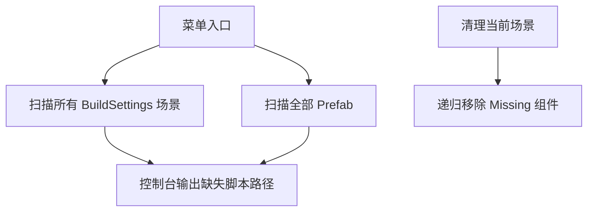

## 编辑器工具与诊断（完整说明）

### 1. 风格与依赖

- UITK 统一样式：
  - 优先 `Assets/Editor/UITK/EditorColors.uss`，兼容 `Assets/Scripts/Editor/UITK/` 与 `Assets/Scripts/0_Editor/UITK/` 回退路径。
  - 所有窗口在 `CreateGUI()`/`TryAttachStyle()` 中均已实现三段回退链，避免路径迁移导致颜色失效。
- 插件：部分窗口支持 Odin（存在时启用增强 UI），不存在时回退到原生 UI。

### 2. 工具清单与详情

#### 2.1 消息系统监控与操作台（MessageSystemWindow）

- 菜单：自制工具/消息系统/消息系统
- 作用：
  - 监控消息总线（字符串 Key 通道与类型通道）的订阅情况与实时消息日志。
  - 发送测试消息（string/int/float），查看日志并导出 JSON。
- 核心区域：
  - 订阅概览（Key 列表与 Type 列表，显示订阅数并可清空某 Key）。
  - 发送区（字符串 Key 通道与类型通道）。
  - 日志区（可筛选 Channel/Type、排序列宽拖拽、导出 JSON）。
- 注意：
  - 颜色样式类：`app-root`、`section`、`section-title`、`btn-*`。

#### 2.2 NPC 管理器（NpcManagerWindow）

- 菜单：自制工具/人物设计/NPC 管理器
- 作用：
  - 浏览与检索 `NpcCharacterData`；显示详细信息与立绘；快速定位项目资源。
  - 若安装 Odin，可用 Odin 打开对象进行深入检视。
- 核心区域：
  - 左侧列表（支持刷新、下拉菜单：定位资源/复制立绘路径/打开立绘）。
  - 右侧详情与立绘展示。
- 技术点：
  - 立绘从 `Resources` 的 Sprite 临时拉出 Texture2D 以适配 UI 显示。
  - 反射调用 Odin 的 `InspectObject`（若存在）。

#### 2.3 场景顺序管理器（SceneSequenceWindow）

- 菜单：自制工具/场景/场景顺序管理器
- 作用：
  - 可视化 Build Settings 场景；支持添加/插入/删除/上移下移，并一键应用到 BuildSettings。
  - 支持自动播放场景（可设置间隔、循环，随打开推进）。
- 核心区域：
  - 顶部工具区（刷新、应用、添加/插入、自动播放控制）。
  - 列表区（参与构建、名称、路径、打开/移动/删除）。
- 注意：
  - 已增强样式加载优先 Editor/ 路径。

#### 2.4 随机数监控器（RandomMonitorWindow）

- 菜单：自制工具/随机系统/随机数监控器
- 作用：
  - 预览每日流/持久流的随机数样本与直方图；支持是否“消耗状态”。
  - 加载/初始化随机流状态（ES3 持久化），清除指定流的 ES3 状态。
- 核心区域：
  - 输入参数（玩家 ID、流 Key、每日/持久、UTC 日期、采样数量、消耗开关）。
  - 操作按钮（加载/预览/直方图/清除状态）。
  - 可视化：chips 采样条带、10 bins 直方图。
- 技术点：
  - `UnityRandomStream` 与 `IRandomSource`；每日流种子基于(玩家 ID, 日期, 流 Key)。

#### 2.5 顾客到来监控器（CustomerMonitorWindow）

- 菜单：自制工具/人物设计/顾客到来监控器
- 作用：
  - 运行期监控顾客队列与当前服务状态；支持强制随机入队与清空冷却池。
- 核心区域：
  - 工具栏（刷新、清除、导出、强制入队、清空冷却池、自动刷新、搜索）。
  - 主内容：左侧队列列表（带冷却提示）、右侧当前服务面板、底部统计。
- 技术点：
  - 通过反射读取 `CustomerSpawnManager` 私有冷却池/需求与服务中顾客信息。
  - 导出 CSV。

#### 2.6 存档监控器（SaveViewerWindow）

- 菜单：自制工具/保存系统/存档监控器
- 作用：
  - 查看 1..3 槽位的存档存在性、关键字段与 JSON；监听保存/加载事件自动刷新。
  - 支持删除所选槽位、清理全部存档文件。
- 核心区域：
  - 头部（存档文件路径、自动刷新与间隔、立即刷新）。
  - 槽位列表与选择器；右侧 JSON 预览。
- 技术点：
  - 若 Odin 存在，使用 Odin 列表与只读视图；UITK 作为主 UI。

#### 2.7 缺失脚本扫描与清理（MissingScriptsScanner）

- 菜单：
  - 自制工具/诊断/扫描缺失脚本：扫描所有 BuildSettings 场景与全部 Prefab，输出缺失脚本的层级路径与位置。
  - 自制工具/诊断/清理当前场景缺失脚本：移除当前打开场景中的 Missing 脚本组件。
- 使用建议：
  1. 先扫描，定位关键场景（Start/Save/Day/Afternoon/Night/Settlement/Congratulation）。
  2. 对于必须脚本，请手动补挂正确运行时脚本；对于无用残留，使用“清理当前场景缺失脚本”。
  3. 清理后保存场景、重新构建验证。

##### 2.7.1 流程图

#### 2.8 角色脚本批量工具

- NpcCharacterSoGenerator（若存在于项目）：
  - 作用：从外部配置批量生成 `NpcCharacterData` ScriptableObject，或做字段填充的批处理。
  - 注意：依赖外部表头字段与资源路径约定，运行前请备份。
- CharacterRoleSOGeneratorWindow（若存在于项目）：
  - 作用：角色身份/职业相关 SO 的批量创建与组织。

### 3. 样式说明

- 常用类：
  - `app-root`：窗口根样式（背景、内边距）。
  - `section`/`section-title`：分区容器与标题。
  - `btn` + `btn-primary/secondary/success/warn/danger/ghost`：按钮与主题色。
- 若颜色失效，请确认 `Assets/Editor/UITK/EditorColors.uss` 是否存在；或将样式复制到该目录。

### 4. 常见问题

- 构建报 Editor API 错误：确保所有编辑器脚本位于 `Editor/` 目录，且运行时场景未挂载 Editor-only 组件。
- 样式不生效：检查三段回退链路径与文件名；或控制台是否有路径加载失败日志。
- 运行期窗口空白（少见）：确认 `CreateGUI()` 是否在 `OnEnable()` 中被调用，或尝试 `Close` 再 `Open`。
