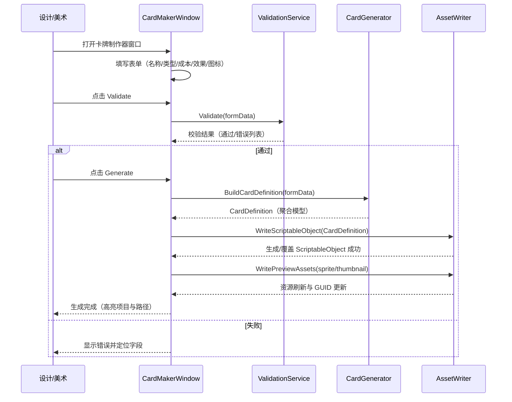
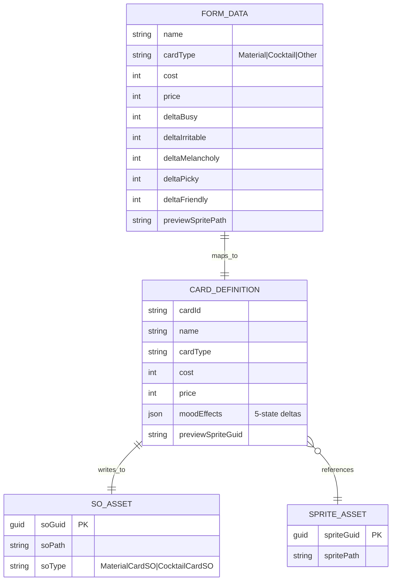
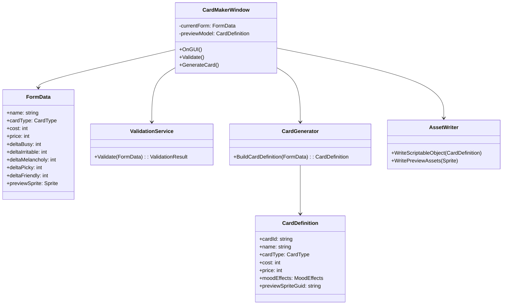

# 卡牌制作器（Editor）脚本文档

## 功能概述

卡牌制作器是基于 Unity Editor 的制作工具，用于高效创建与维护卡牌数据（如材料卡/鸡尾酒卡/效果配置等）。其核心目标：

- 以表单方式录入卡牌元数据（名称、类型、成本、售价、效果等）。
- 一键生成/更新 ScriptableObject（如 `MaterialCardSO`、`CocktailCardSO`）与关联资源（图标、预览）。
- 即时预览（卡面/数值聚合），并进行校验（字段必填、数值边界、引用有效性）。
- 统一存储路径与命名规范，保证数据可追溯与可版本化管理。

---

## 时序图（从打开窗口到写入资源）



---

## ER 图（编辑器数据与资源关系）



---

## 类图（核心组件职责）



---

## 界面与代码对应分析（UI ↔ 字段/方法）

- 名称（TextField `Name`）

  - 绑定：`FormData.name`
  - 用途：生成 `CardDefinition.name`，影响 SO 文件名与 `cardId` 生成。

- 类型（EnumField `Card Type`）

  - 绑定：`FormData.cardType`
  - 用途：决定写入 `MaterialCardSO` 或 `CocktailCardSO`，并切换可见字段（如配方项）。

- 成本/售价（IntegerField `Cost/Price`）

  - 绑定：`FormData.cost` / `FormData.price`
  - 用途：用于经济系统参数；校验`cost >= 0`、`price >= cost`。

- 五状态效果（IntegerField `Busy/Irritable/Melancholy/Picky/Friendly`）

  - 绑定：`FormData.delta*`
  - 用途：映射到 `CardDefinition.moodEffects`；支持范围校验与总和提示。

- 预览图（ObjectField `Sprite`）

  - 绑定：`FormData.previewSprite`
  - 用途：`AssetWriter.WritePreviewAssets` 写入与引用，更新 GUID 存入 `CardDefinition.previewSpriteGuid`。

- Validate 按钮

  - 调用：`ValidationService.Validate(form)`
  - 失败：在字段下方显示错误，聚焦第一个无效输入。

- Generate 按钮
  - 调用：`CardGenerator.BuildCardDefinition(form)` → `AssetWriter.WriteScriptableObject(def)` → `WritePreviewAssets(sprite)`。
  - 结果：在 Project 视图高亮目标资源路径，并提供 “Ping”/“Open” 快捷操作。

---

## 代码片段（关键逻辑示例，C#）

> 说明：以下片段仅演示编辑器脚本的组织与调用流程，实际类型名需与工程保持一致。

```csharp
// 验证服务：字段与数值边界
public static class ValidationService
{
    public static ValidationResult Validate(FormData data)
    {
        var result = new ValidationResult();
        if (string.IsNullOrWhiteSpace(data.name))
            result.AddError("Name", "名称不能为空");
        if (data.cost < 0) result.AddError("Cost", "成本不能为负");
        if (data.price < data.cost) result.AddError("Price", "售价不应低于成本");
        // 心情数值合理性（范围可按策划约束）
        if (Mathf.Abs(data.deltaBusy) > 10) result.AddError("Busy", ">10 超范围");
        // ... 其他规则 ...
        return result;
    }
}
```

```csharp
// 生成器：表单→聚合模型
public static class CardGenerator
{
    public static CardDefinition BuildCardDefinition(FormData f)
    {
        return new CardDefinition
        {
            cardId = GenerateStableId(f.name),
            name = f.name,
            cardType = f.cardType,
            cost = f.cost,
            price = f.price,
            moodEffects = new MoodEffects
            {
                Busy = f.deltaBusy,
                Irritable = f.deltaIrritable,
                Melancholy = f.deltaMelancholy,
                Picky = f.deltaPicky,
                Friendly = f.deltaFriendly,
            },
            previewSpriteGuid = f.previewSprite != null ? AssetDatabase.AssetPathToGUID(AssetDatabase.GetAssetPath(f.previewSprite)) : string.Empty
        };
    }
}
```

```csharp
// 写入器：生成/覆盖 ScriptableObject 与资源
public static class AssetWriter
{
    public static void WriteScriptableObject(CardDefinition def)
    {
        var folder = $"Assets/GameData/Cards/{def.cardType}";
        if (!AssetDatabase.IsValidFolder(folder))
        {
            var root = "Assets/GameData/Cards";
            if (!AssetDatabase.IsValidFolder(root)) AssetDatabase.CreateFolder("Assets", "GameData");
            if (!AssetDatabase.IsValidFolder(root + "/Cards")) AssetDatabase.CreateFolder("Assets/GameData", "Cards");
            AssetDatabase.CreateFolder("Assets/GameData/Cards", def.cardType.ToString());
        }
        var soPath = $"{folder}/{Sanitize(def.name)}.asset";
        // 根据类型创建或覆盖
        ScriptableObject so = CreateOrLoadSO(def, soPath);
        EditorUtility.SetDirty(so);
        AssetDatabase.SaveAssets();
        AssetDatabase.Refresh();
    }
}
```

---

## 开发与维护建议

- 将校验逻辑集中于 `ValidationService`，避免分散判断。
- `CardGenerator` 仅做“表单 → 模型”的纯转换，无 I/O。
- `AssetWriter` 统一资产路径、命名与覆盖策略，避免散落写盘。
- 预览模型与表单数据分离，OnGUI 中避免重复分配与 GC 峰值。
- 对关键行为（生成/覆盖）输出可读日志，利于版本回溯与 Code Review。

---

**文档版本**：v1.0  
**最后更新**：2025-10-30
