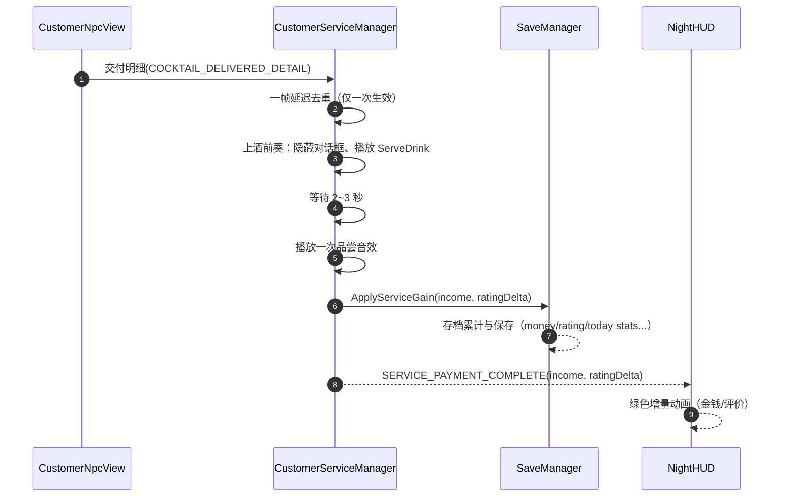
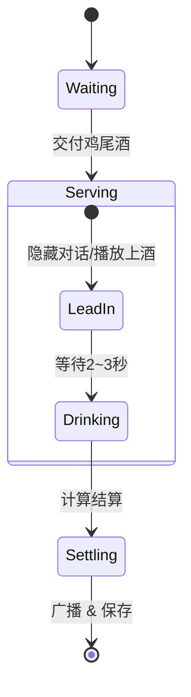
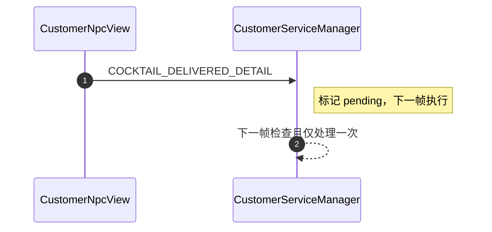

## 夜间顾客服务与结算流程开发文档

### 1. 功能概述

- 将拖拽到顾客上的鸡尾酒视为交付；进入上酒前奏 → 饮用 → 结算。
- 采用“一帧延迟”策略去重，确保一次交付只结算一次。
- 结算即时累加到存档（金钱、评价、今日收入/顾客数等），并通过消息驱动 HUD 动画显示绿色增量。

### 2. 事件与消息

| Key                       | 载荷                                       | 说明                                           |
| ------------------------- | ------------------------------------------ | ---------------------------------------------- |
| COCKTAIL_DELIVERED_DETAIL | 结构体/类（含顾客 ID、鸡尾酒信息、状态等） | 顾客接收鸡尾酒的明细（用于日志/调试/前置预览） |
| SERVICE_PAYMENT_COMPLETE  | (income:int, ratingDelta:int)              | 最终结算完成（HUD 使用此事件做绿色增量）       |
| RECIPE_DISCOVERED         | recipeId:string                            | 首次合成/服务时记录配方，触发配方书刷新        |

### 3. 流程图

#### 3.1 服务状态机

#### 3.2 一帧延迟去重（时序）

### 4. 计算要点与显示

- 身份倍率、心情与小费：
  - 心情（正负）影响小费（小于 0 则记为 0）。
  - 价格 × 身份倍率 + 小费 = 最终收入。
- 文本符号格式：
  - 使用 `FormatSigned(v)` 统一正负显示（如 +5/-2/0）。
- HUD 时机：
  - 预览（如有）用 DELIVERED_DETAIL；实际动画与累计显示依赖 SERVICE_PAYMENT_COMPLETE。

#### 4.1 变量与公式表

| 变量        | 含义                                                   |
| ----------- | ------------------------------------------------------ |
| price       | 基础售价（来自 CocktailCardSO）                        |
| identityMul | 身份倍率（来自 NpcCharacterData）                      |
| moodDelta   | 心情变化（正负）                                       |
| tip         | 小费，`max(0, moodDelta)` 或按设计定制                 |
| finalIncome | `price * identityMul + tip`（向下取整/四舍五入按实现） |

### 5. 与存档系统的集成

- 即时保存：每次服务后调用 `SaveManager.ApplyServiceGain(income, ratingDelta)`，避免意外挂起导致数据丢失。
- 配方记录：在真实结算路径中调用 `SaveManager.DiscoverRecipe(cocktail)`；使用 `cocktail.id.ToString()` 作为稳定 ID，并保存 UI 所需的资源路径（鸡尾酒/材料图片）。

### 6. 音频与交互

- 交付后：
  - 隐藏 NPC 台词框 → 播放 `GlobalAudio.ServeDrink`。
  - 随机等待 2~3 秒 → 播一次 `Drinking` 音效（只播放一次）。
- UI 交互：
  - 发牌期间由 `CardDispenseRuntime` 全局锁定交互；`SkipButtonLocker`/`CardInputLocker` 订阅队列事件控制显隐与禁用。

### 7. 排错建议

- HUD 无增量：确认是否收到 `SERVICE_PAYMENT_COMPLETE`，并且增量文本在播放前 `SetActive(true)`。
- 重复结算：检查“一帧延迟去重”逻辑是否只对一次交付触发；避免同时监听旧新事件造成二次入账。
- 存档未累计：确认 `ApplyServiceGain` 是否被调用、ES3 是否正常写入、结算面板是否再叠加旧逻辑（二次计算）。
