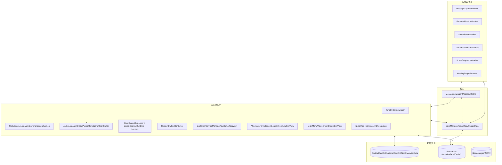
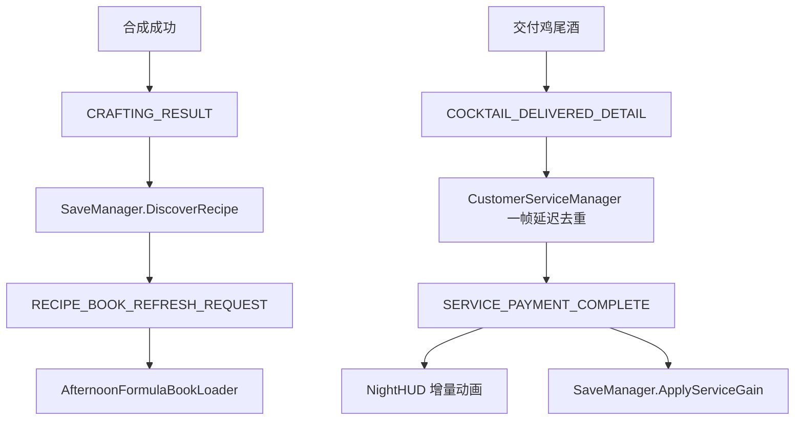
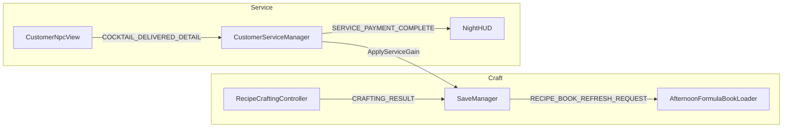
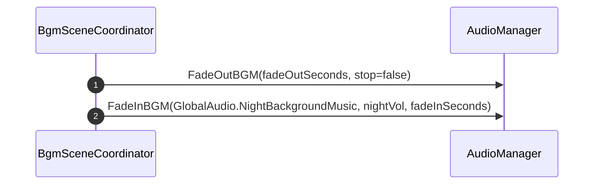
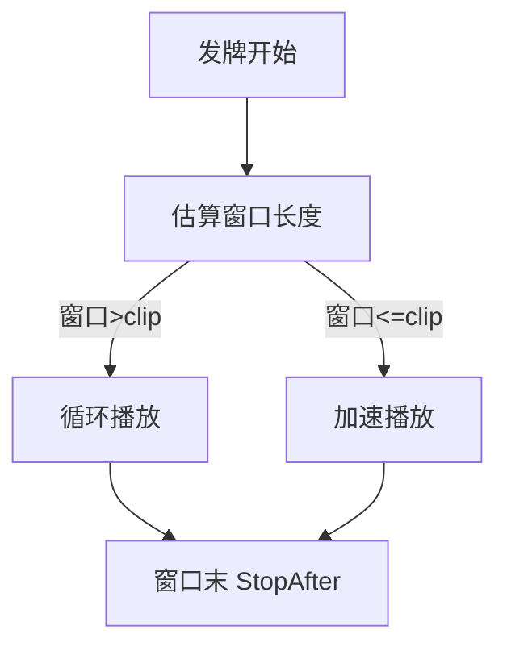
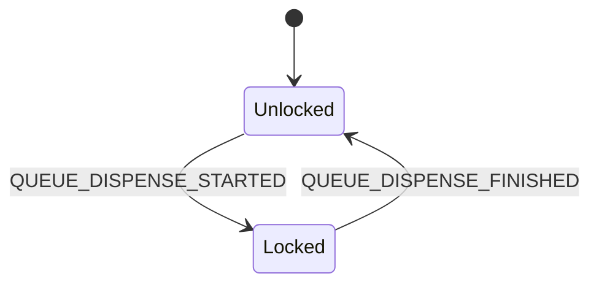
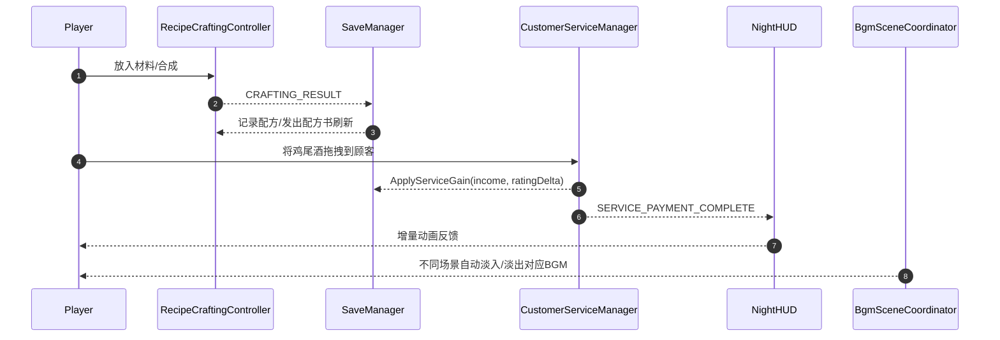
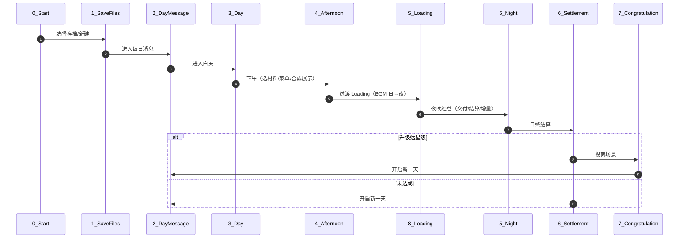

## 全项目程序开发文档（技术实现）

> 本文覆盖项目的整体架构、运行时各系统、数据/消息约定、关键脚本入口、构建规范与排障建议。配合各专题文档使用：AudioSystem_DevDoc.md、NightCustomerService_DevDoc.md、RecipeBookAndNightMenu_DevDoc.md、EditorTools_AndDiagnostics_DevDoc.md 等。

### 0. 目标与范围

- 统一开发者的系统认知与约定，降低耦合、提升可维护性。
- 提供端到端流程图、消息与数据清单、关键代码索引与排障方法。

### 1. 架构总览

### 1.1 玩法与系统映射总表

| 玩法要素             | 涉及系统/脚本                                | 关键消息                                            | 存档关键字段                                | 相关场景                                   |
| -------------------- | -------------------------------------------- | --------------------------------------------------- | ------------------------------------------- | ------------------------------------------ |
| 存档选择/新建        | SaveManager, SaveViewerWindow                | SAVE_LOADED / SAVE_COMPLETED                        | saveSlotID, saveSlotName                    | 1_SaveFilesScreen                          |
| 每日消息             | TimeSystemManager                            | PHASE_CHANGED                                       | currentDay, daySubPhase                     | 2_DayMessageScreen                         |
| 白天进货/准备        | SaveManager, Resources                       | MENU_REFRESH_REQUEST                                | todayPurchasedItems, todayStockingCompleted | 3_DayScreen                                |
| 下午合成配方         | RecipeCraftingController, AudioManager       | CRAFTING_RESULT, COCKTAIL_CRAFTED_DETAIL            | unlockedRecipes[*]                          | 4_AfternoonScreen                          |
| 下午—夜晚过渡 BGM    | BgmSceneCoordinator, AudioManager            | -                                                   | -                                           | S_LoadingScreen                            |
| 夜晚经营（顾客服务） | CustomerServiceManager, CustomerNpcView      | COCKTAIL_DELIVERED_DETAIL, SERVICE_PAYMENT_COMPLETE | currentMoney, todayIncome, cumulativeScore  | 5_NightScreen                              |
| 夜晚菜单展示         | NightMenuViewer, NightMenuItemView           | MENU_REFRESH_REQUEST                                | currentMenuRecipeIDs                        | 5_NightScreen                              |
| HUD 增量反馈         | NightHUD_EarningsAndReputation               | SERVICE_PAYMENT_COMPLETE                            | currentMoney, cumulativeScore               | 5_NightScreen                              |
| 日终结算与星级       | DayEndScreen, CongratulationScreenController | DAY_COMPLETED                                       | starRating, highestStarRatingAchieved       | 6_SettlementScreen, 7_CongratulationScreen |

> 配方书（AfternoonFormulaBookLoader/FormulaItemView）只展示 `unlockedRecipes` 中 `recorded=true` 的条目，并按 `orderIndex` 排序。

### 2. 目录结构概览（关键）

- `Scripts/0_General/...`：通用基础（消息、存档、时间、音频、卡牌系统等）。
- `Scripts/3_DayScreen`：白天（配方书等）。
- `Scripts/4_AfternoonScreen`：下午。
- `Scripts/5_NightScreen`：夜间（顾客、菜单、HUD）。
- `Scripts/6_SettlementScreen`：结算。
- `Scripts/7_CongratulationScreen`：祝贺场景。
- `Editor/*`：所有编辑器工具与窗口（确保位于 Editor 目录）。
- `Resources/*`：运行时加载的音频、预制、图片、表等。
- `Documents/*`：开发文档与设计说明。

### 3. 运行时系统详解

#### 3.1 消息系统（解耦总线）

- 核心：`MessageManager`、`MessageDefine`。
- 约定：字符串 Key 与类型通道并行；统一在 `MessageDefine` 增加 Key 常量。
- 关键消息（部分）：
  - 结算：`SERVICE_PAYMENT_COMPLETE(income:int, ratingDelta:int)`。
  - 配方：`CRAFTING_RESULT(Cocktail)`、`RECIPE_DISCOVERED(recipeId)`、`RECIPE_BOOK_REFRESH_REQUEST`。
  - 发牌：`QUEUE_DISPENSE_STARTED/FINISHED`。
  - 时间：`PHASE_CHANGED`、`DAY_COMPLETED`。

##### 3.1.1 事件流示意

##### 3.1.2 数据与消息关系图（精选）

#### 3.2 存档系统

- 核心：`SaveManager`、`SaveData`、`RecipeData`。
- 策略：结算实时累计并保存（money/rating/today stats），避免数据丢失；菜单每日清空；配方书仅保留“已合成过”的配方。
- 重要方法：
  - `ApplyServiceGain(income, ratingDelta)` 实时累加。
  - `DiscoverRecipe(CocktailCardSO)` 首次记录、分配 `orderIndex`、保存 UI 路径并广播刷新。

#### 3.3 时间/阶段系统

- 核心：`TimeSystemManager`。
- 功能：日/午/夜阶段推进；倒计时结束前 1s 触发 `CountdownEnd` 音效（暂停 → 播放完 → 推进下一阶段）。

#### 3.4 场景管理

- 核心：`GlobalSceneManager`（项目中已有）、`DayEndScreen`、`CongratulationScreenController`。
- 流程：Afternoon 结束 →Loading→Night；夜间结算 → 可能进入 `Congratulation`（新星级）→DayMessage 开启新一天。

#### 3.5 音频系统（BGM/SE）

- 核心：`AudioManager`、`GlobalAudio`、`BgmSceneCoordinator`（日夜 BGM 协调）。
- 能力：BGM 独立声道淡入淡出；SE 可控实例（音高、延时停止、淡出）。
- 典型触点：
  - 发牌：`CardQueueDispenser` 自适应长度的 `PlaceGlassBottle`。
  - 合成：`RecipeCraftingController` 首材料入槽 → 循环 `MixingDrink`；合成完成 → 淡出。
  - 交付：`CustomerServiceManager` 先 `ServeDrink`、2~3s 后一次 `Drinking`。

##### 3.5.1 BGM 协调流程（Afternoon→Loading→Night）

##### 3.5.2 发牌音效自适应（窗口长度）

#### 3.6 卡牌/发牌与交互锁

- 核心：`CardQueueDispenser`、`CardDispenseRuntime`、`CardInputLocker`、`SkipButtonLocker`。
- 约定：发牌期间全局 `IsLocked`；按钮与交互订阅队列消息控制显隐/禁用；结束自动显示。

##### 3.6.1 交互锁状态图

#### 3.7 合成系统

- 核心：`RecipeCraftingController`、`CocktailRecipeDatabase`（SO）。
- 事件：产出后发送 `CRAFTING_RESULT` 与 `COCKTAIL_CRAFTED_DETAIL`；驱动存档配方记录与配方书刷新。

#### 3.8 配方书（Afternoon）

- `AfternoonFormulaBookLoader` 读取 `unlockedRecipes(recorded=true)`，按 `orderIndex` 实例化 `Formula.prefab`。
- `FormulaItemView` 从 `RecipeData` 的路径加载图片与文案。

#### 3.9 夜晚菜单（Night）

- `NightMenuViewer` 解析 `SaveData.currentMenuRecipeIDs` 为 `CocktailCardSO`，以卡片预制显示；提供 `Show/Hide/Toggle`。
- `NightMenuItemView` 绑定图片、名称与 5 种状态数值（单独 TMP）。

#### 3.10 HUD（夜晚增量）

- `NightHUD_EarningsAndReputation` 监听 `SERVICE_PAYMENT_COMPLETE` 播放绿色增量动画；累计文本常显。

#### 3.11 顾客服务（夜间结算）

- 核心：`CustomerServiceManager`、`CustomerNpcView`。
- 策略：
  - 一帧延迟去重，避免重复结算。
  - 真实流程：上酒前奏（隐藏对话/播放上酒）→ 等待 → 饮用一次 → 结算 → 存档 →HUD。

### 4. 游戏循环（玩家操作 → 系统 → 存档 → 反馈）

### 4. ScriptableObject 概览

- `CocktailCardSO`、`MaterialCardSO`：配方与材料静态数据。
- `NpcCharacterData`：NPC 静态资料（身份倍率、状态、立绘路径等）。
- `RecipeData`（存档）：`recorded/orderIndex/图片路径/材料名与图片路径`。

### 5. 编辑器工具（简表）

| 工具                  | 菜单                             | 用途                               |
| --------------------- | -------------------------------- | ---------------------------------- |
| MessageSystemWindow   | 自制工具/消息系统/消息系统       | 订阅/发送/日志/导出                |
| RandomMonitorWindow   | 自制工具/随机系统/随机数监控器   | 每日/持久随机流、直方图、ES3 状态  |
| SaveViewerWindow      | 自制工具/保存系统/存档监控器     | 槽位视图、JSON、删除/清理          |
| CustomerMonitorWindow | 自制工具/人物设计/顾客到来监控器 | 队列/服务状态、强制入队、清 CD     |
| SceneSequenceWindow   | 自制工具/场景/场景顺序管理器     | BuildSettings 可视化与自动播放     |
| MissingScriptsScanner | 自制工具/诊断/扫描/清理缺失脚本  | 扫描所有场景与 Prefab/清理当前场景 |

> 详见 `EditorTools_AndDiagnostics_DevDoc.md`（包含样式与注意事项）。

### 6. 非策划技术文档合集（索引）

- 音频系统（BGM/SE/可控 SE/场景协同）：`Documents/AudioSystem_DevDoc.md`
- 夜间顾客服务与结算：`Documents/NightCustomerService_DevDoc.md`
- 配方书与夜晚菜单持久化：`Documents/RecipeBookAndNightMenu_DevDoc.md`
- 编辑器工具与诊断：`Documents/EditorTools_AndDiagnostics_DevDoc.md`
- 随机系统：`Documents/RandomSystem_DevDoc.md`
- 场景管理：`Documents/SceneManager_DevDoc.md`
- 存档系统：`Documents/SaveSystem_DevDoc.md`
- 消息系统：`Documents/MessageSystem_DevDoc.md`

### 6. 音频与资源规范

- 所有运行时音频置于 `Resources/Audio`，由 `GlobalAudio` 常量统一引用。
- 图片/Prefab 需可被 `Resources.Load` 定位（路径稳定、命名一致）。

### 7. 本地化与资源

- `I2Languages.asset` 已存在；后续文本请统一通过 I2 上屏。
- 配方书 UI 文案源自 `RecipeData` 或 `CocktailCardSO`。

### 8. 第三方插件（只罗列大类）

- `Easy Save 3`（ES3）、`DOTween`（Demigiant）、`I2 Localization`、`Febucci`、`ParadoxNotion`、`Infinity Code`、`Sirenix Odin`（可选）、`ConsolePro` 等。

### 9. 启动与流程（主干）

### 10. 消息与数据约定（精选）

- 结算：`SERVICE_PAYMENT_COMPLETE(int income, int ratingDelta)` → HUD 增量与 Save。
- 合成：`CRAFTING_RESULT(CocktailCardSO)` → Save.DiscoverRecipe → `RECIPE_BOOK_REFRESH_REQUEST`。
- 发牌：`QUEUE_DISPENSE_STARTED/FINISHED` → 锁交互/按钮显隐/发牌音效。
- 时间：`PHASE_CHANGED`，倒计时结束音效由 TimeSystem 管理。

### 11. 关键代码入口（索引）

- 消息：`Scripts/0_General/0_0_MessageSystem/*`
- 存档：`Scripts/0_General/0_7_SaveSystem/*`
- 时间：`Scripts/0_General/0_4_TimeSystem/TimeSystemManager.cs`
- 音频：`Scripts/0_General/0_8_AudioSystem/*`
- 发牌：`Scripts/0_General/0_11_Cardsystem/*`
- 合成：`Scripts/0_General/0_2_Card Drag&Drop/RecipeCraftingController.cs`
- 夜间：`Scripts/5_NightScreen/*`
- 配方书：`Scripts/3_DayScreen/*`
- 编辑器：`Editor/*`

### 12. 构建与发布规范

- 所有编辑器代码必须位于 `Editor/` 目录；运行时场景不得挂载 Editor-only 组件。
- 构建报错或卡在 Loading：
  1. 运行“自制工具/诊断/扫描缺失脚本”，清理场景中 Missing 组件；
  2. 确认 Build Settings 场景顺序完整；
  3. 打开 Player.log 检查异常栈；
  4. 复核关键管理器（Time/Audio/Scene/Service）是否在目标场景挂载。

### 13. 调试与排障建议

- 打开 `MessageSystemWindow` 观察关键消息是否按预期触发。
- 使用 `SaveViewerWindow` 实时查看存档字段变化（money/rating/today stats 等）。
- `RandomMonitorWindow` 验证每日流一致性、避免伪随机偏差。
- `CustomerMonitorWindow` 跟踪队列/服务状态与冷却池。

### 14. 编码与约定

- 命名：避免 1~2 字母名；函数动词短语、变量名名词短语；变量表达语义。
- 控制流：倾向卫语句与早返回；避免滥用 try/catch。
- 注释：只写维护关键点（非显而易见逻辑、边界/性能/安全点）。
- 资源路径：统一由 `GlobalAudio` 等常量管理，避免魔法字符串散落。

### 15. 文档索引

- 音频系统：`Documents/AudioSystem_DevDoc.md`
- 顾客服务与结算：`Documents/NightCustomerService_DevDoc.md`
- 配方书与夜晚菜单：`Documents/RecipeBookAndNightMenu_DevDoc.md`
- 编辑器工具与诊断：`Documents/EditorTools_AndDiagnostics_DevDoc.md`

### 16. 变更记录（摘）

- 引入发牌期间交互锁与发牌音效自适配；
- 结算即时落存并修复重复结算；
- BGM 独立声道与日夜淡入淡出；
- 配方书仅展示已记录配方并保持顺序；
- 编辑器窗口统一样式加载（Editor/→Scripts/Editor→Scripts/0_Editor 回退链）。
