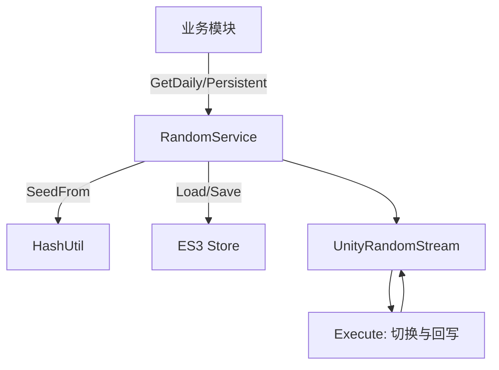
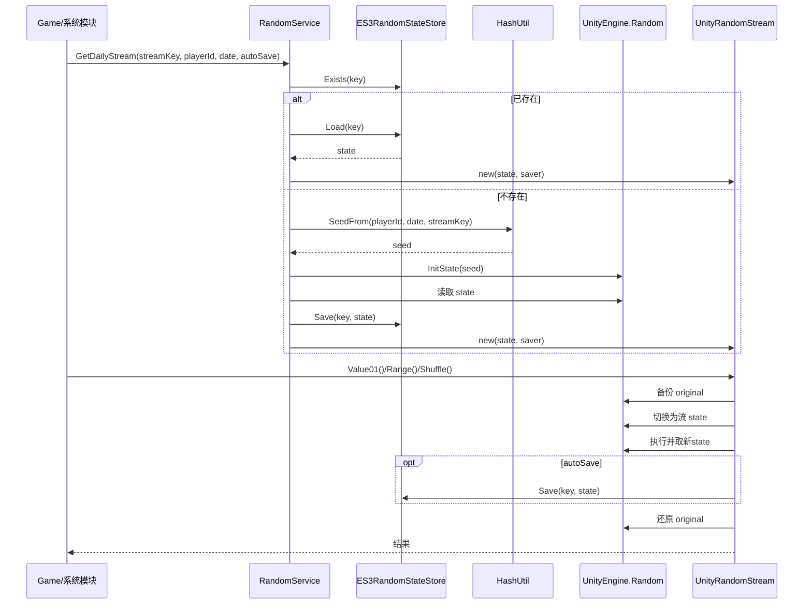
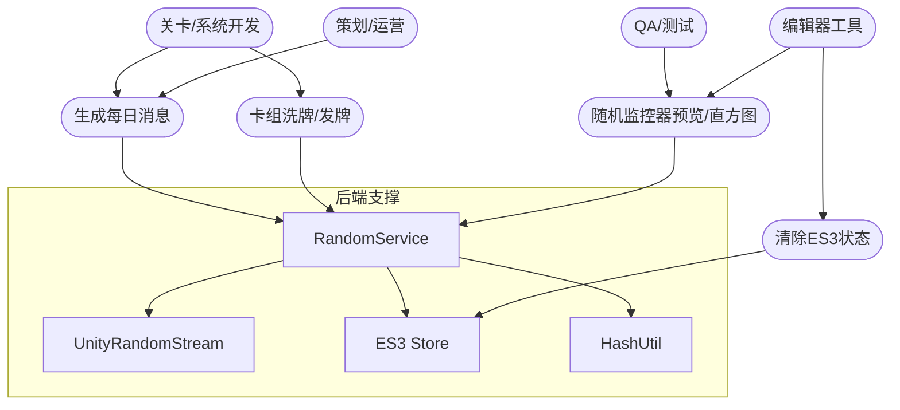
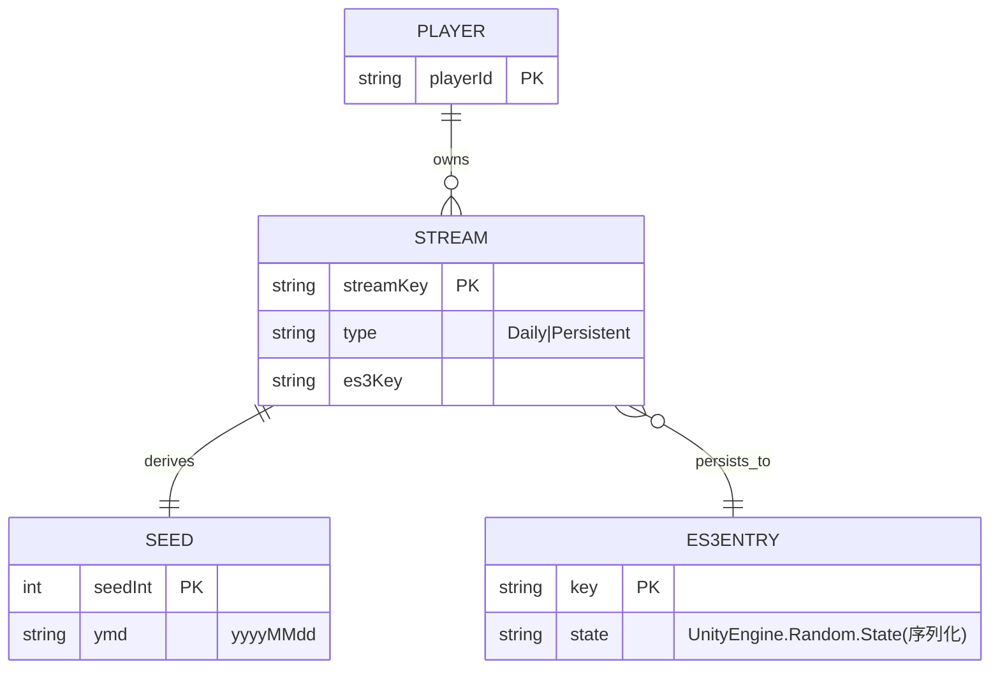

## 随机系统开发文档（Daily Stable + ES3 持久化）

### 目标与特性

- **每日稳定**: 按玩家 ID+日期+流 Key 生成稳定结果；跨天变化。
- **多流隔离**: 不同业务使用独立随机流，互不影响。
- **可持久化**: 使用 ES3 保存/恢复 `UnityEngine.Random.State`。
- **无全局污染**: 每次调用前后还原全局 `UnityEngine.Random.state`。
- **常用 API**: 区间取值、洗牌、发牌（无放回）、权重抽取。

### 架构图（逻辑）



### Mermaid 图例

#### 时序图：获取每日流并进行一次采样（含已存在/未存在分支）



#### 用例图：典型交互



#### ER 图：核心实体关系



### 关键数据结构

- **种子 Seed**: `SeedFrom(playerId, date, streamKey)` 生成 `int`。
- **State 存储 Key**:
  - 每日流: `rng/daily/{playerId}/{yyyyMMdd}/{streamKey}`
  - 持久流: `rng/persistent/{playerId}/{streamKey}`
- **状态类型**: `UnityEngine.Random.State`（Unity 可序列化结构）。

### 接口与实现（代码引用）

- IRandomSource（统一 API）

```1:18:Scripts/0_General/0_4_RandomSystem/IRandomSource.cs
namespace TabernaNoctis.RandomSystem
{
    public interface IRandomSource
    {
        int Range(int minInclusive, int maxExclusive);
        float Range(float minInclusive, float maxInclusive);
        float Value01();
        void Shuffle<T>(IList<T> list);
        List<T> Deal<T>(IList<T> deck, int count, bool removeFromSource = false);
        T PickOne<T>(IList<T> list);
        T PickWeighted<T>(IList<T> items, IList<float> weights);
    }
}
```

- RandomService（获取每日/持久流并处理 ES3）

```17:33:Scripts/0_General/0_4_RandomSystem/RandomService.cs
public IRandomSource GetDailyStream(string streamKey, string playerId, DateTime? date = null, bool autoSave = true)
{
    DateTime d = date ?? DateTime.Now;
    string es3Key = "rng/daily/" + (playerId ?? string.Empty) + "/" + d.ToString("yyyyMMdd") + "/" + (streamKey ?? string.Empty);

    if (_store.Exists(es3Key))
    {
        var st = _store.Load(es3Key);
        return new UnityRandomStream(st, autoSave ? (s => _store.Save(es3Key, s)) : null);
    }
    else
    {
        var st = CreateStateFromSeed(HashUtil.SeedFrom(playerId, d, streamKey));
        _store.Save(es3Key, st);
        return new UnityRandomStream(st, autoSave ? (s => _store.Save(es3Key, s)) : null);
    }
}
```

- HashUtil（FNV-1a 32-bit 简化）

```7:21:Scripts/0_General/0_4_RandomSystem/HashUtil.cs
public static int SeedFrom(string playerId, DateTime date, string streamKey)
{
    string s = (playerId ?? string.Empty) + "|" + date.ToString("yyyyMMdd") + "|" + (streamKey ?? string.Empty);
    unchecked
    {
        const uint offset = 2166136261u;
        const uint prime = 16777619u;
        uint hash = offset;
        for (int i = 0; i < s.Length; i++)
        {
            hash ^= s[i];
            hash *= prime;
        }
        return (int)hash;
    }
}
```

- UnityRandomStream（无全局污染执行）

```151:165:Scripts/0_General/0_4_RandomSystem/UnityRandomStream.cs
private void Execute(Action action)
{
    var original = UnityEngine.Random.state;
    try
    {
        UnityEngine.Random.state = _state;
        action();
        _state = UnityEngine.Random.state;
        _autoSaver?.Invoke(_state);
    }
    finally
    {
        UnityEngine.Random.state = original;
    }
}
```

- ES3 存取 `Random.State`

```7:20:Scripts/0_General/0_4_RandomSystem/ES3RandomStateStore.cs
public bool Exists(string key) { return ES3.KeyExists(key); }
public void Save(string key, UnityEngine.Random.State state) { ES3.Save(key, state); }
public UnityEngine.Random.State Load(string key) { return ES3.Load<UnityEngine.Random.State>(key); }
```

### 典型用法

- 每日消息（每日稳定）

```csharp
var rng = RandomService.Instance.GetDailyStream("DailyMessage", playerId);
var msg = rng.PickOne(messagePool);
```

- 卡组（持久流，跨会话连续）

```csharp
var rng = RandomService.Instance.GetPersistentStream("CardDeck", playerId, autoSave:true);
rng.Shuffle(deck);
var hand = rng.Deal(deck, 5, removeFromSource:true);
```

### UI 工具（编辑器监控器）

- 路径：`自制工具/随机系统/随机数监控器`
- 功能：加载/初始化流、未消耗/消耗预览、直方图、ES3 状态清除、UTC 切换。
- 样式：依赖 `Scripts/0_Editor/UITK/EditorColors.uss`，窗口 `RandomMonitorWindow.cs`。

### 设计要点与边界

- `UnityEngine.Random` 为静态且主线程限定；并行/Job 下建议扩展自定义 PRNG（可实现另一个 `IRandomSource`）。
- 浮点上限为“包含”；与 `System.Random` 不同（参考 Unity 文档）。
- 时区：默认本地日期；如需跨区一致性可改 UTC。
- 性能：`autoSave` 可按需关闭，集中保存。

### 测试

- 同一 `playerId + yyyyMMdd + streamKey` 在同一天输出一致；跨天或换 ID 输出不同。
- 多业务流并行调用，结果独立且互不干扰。
- 重启进程后，ES3 正确恢复并延续流状态。
- 洗牌均匀性、权重抽取正确性（可统计直方图）。

### 参考资料

- Unity 2022.3 Random API：`https://docs.unity3d.com/2022.3/Documentation/ScriptReference/Random.html`
