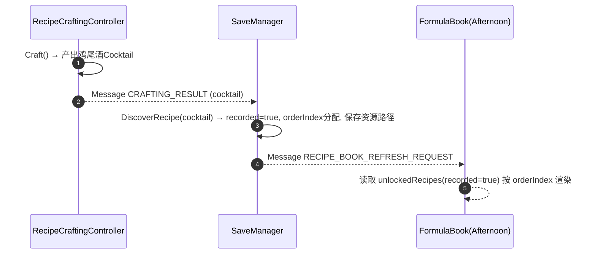
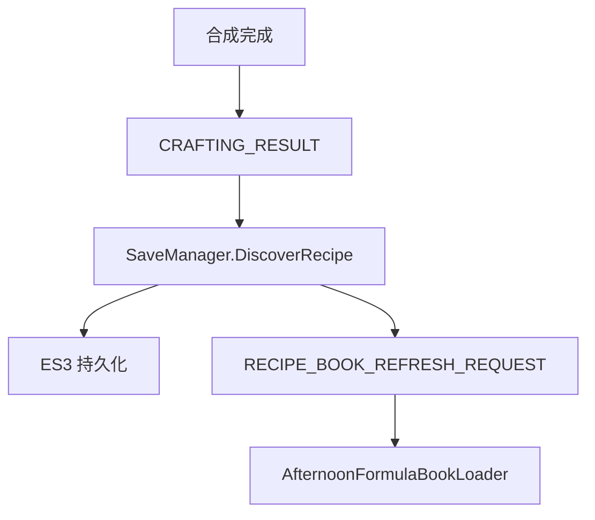

## 配方书与夜晚菜单持久化开发文档

### 1. 功能概述

- 仅展示玩家“已合成过”的鸡尾酒配方；记录顺序与 UI 所需资源路径，跨天持久化。
- 夜晚菜单读取当日选择的配方 ID 并以卡牌样式显示（图片/名称/五种状态参数）。

### 2. 数据模型

| 字段                | 类型     | 说明                                       |
| ------------------- | -------- | ------------------------------------------ |
| recipeId            | string   | `CocktailCardSO.id.ToString()` 作为稳定 ID |
| recorded            | bool     | 是否已记录（至少合成过一次）               |
| orderIndex          | int      | 在配方书中的显示顺序（解锁时分配）         |
| cocktailSpritePath  | string   | 鸡尾酒图片 Resources 路径                  |
| materialNames       | string[] | 三种材料名称（用于 UI）                    |
| materialSpritePaths | string[] | 三种材料图片 Resources 路径                |

> 注：上述字段定义于 `RecipeData`；集合存于 `SaveData.unlockedRecipes`。

### 3. 配方记录流程



#### 3.1 数据流图（合成 → 存档 → 配方书）



### 4. 配方书 UI（Afternoon）

- `AfternoonFormulaBookLoader`：
  - 从 `SaveManager` 取得 `unlockedRecipes`，过滤 `recorded=true`，按 `orderIndex` 排序。
  - 实例化 `Formula.prefab` 子项、挂 `FormulaItemView` 并调用 `Apply(RecipeData)`。
- `FormulaItemView`：
  - 使用 `Resources.Load<Sprite>(path)` 加载鸡尾酒/材料图片，填充 `Image` 与 `TMP_Text`。

### 5. 夜晚菜单 UI（Night）

- `NightMenuViewer`：
  - 从 `SaveData.currentMenuRecipeIDs` 解析 `CocktailCardSO`（通过直接目录或 `Resources.LoadAll`）。
  - 实例化 `NightMenu.cardItemPrefab`（含 `NightMenuItemView`）来显示卡牌项；支持面板 `Show/Hide/Toggle` 与 `refreshOnShow`。
- `NightMenuItemView`：
  - 绑定图片、名称、五个状态（Busy/Irritable/Melancholy/Picky/Friendly）到独立的 TMP 字段，使用 `FormatSigned` 渲染符号。

#### 5.1 菜单解析算法（步骤）

1. 从 `SaveData.currentMenuRecipeIDs` 取 ID 列表。
2. 尝试在 `cocktailCatalog` 直接映射 ID→`CocktailCardSO`；若为空，则 `Resources.LoadAll` 兜底。
3. 为每个 `CocktailCardSO` 实例化 `cardItemPrefab`，并调用 `NightMenuItemView.Apply` 填充字段。
4. 若 `refreshOnShow` 为真，`ShowMenuPanel()` 时先重新渲染列表。

#### 5.2 示例 JSON（片段）

```json
{
  "unlockedRecipes": [
    {
      "recipeId": "101",
      "recorded": true,
      "orderIndex": 0,
      "cocktailSpritePath": "Sprites/UI/Cocktails/Martini",
      "materialNames": ["Gin", "Vermouth", "Olive"],
      "materialSpritePaths": [
        "Sprites/UI/Materials/Gin",
        "Sprites/UI/Materials/Vermouth",
        "Sprites/UI/Materials/Olive"
      ]
    }
  ],
  "currentMenuRecipeIDs": ["101", "205", "307"]
}
```

### 6. 与存档的交互

- `SaveManager.DiscoverRecipe(CocktailCardSO)`：
  - 首次记录 `recorded=true`，分配 `orderIndex = unlockedRecipes.Count`。
  - 同时存储 UI 所需的图片路径与材料信息；保存后广播 `RECIPE_BOOK_REFRESH_REQUEST`。
- 当日菜单：
  - `SaveData.currentMenuRecipeIDs` 表示当日选中的配方；结算后清空，次日需重新选择。

### 7. 排错

- 第二天配方书为空：确认 CRAFTING_RESULT 是否发送；`DiscoverRecipe` 是否以 `cocktail.id.ToString()` 作为 ID；是否持久化 UI 资源路径。
- 图片缺失：校验 `cocktailSpritePath/materialSpritePaths` 是否为有效 Resources 路径；运行时 `Resources.Load<Sprite>()` 返回非空。
- 夜晚菜单仅显示编号：确保 `NightMenuViewer.cardItemPrefab` 为卡牌预制（含 `NightMenuItemView`），并正确绑定各 UI 字段。
