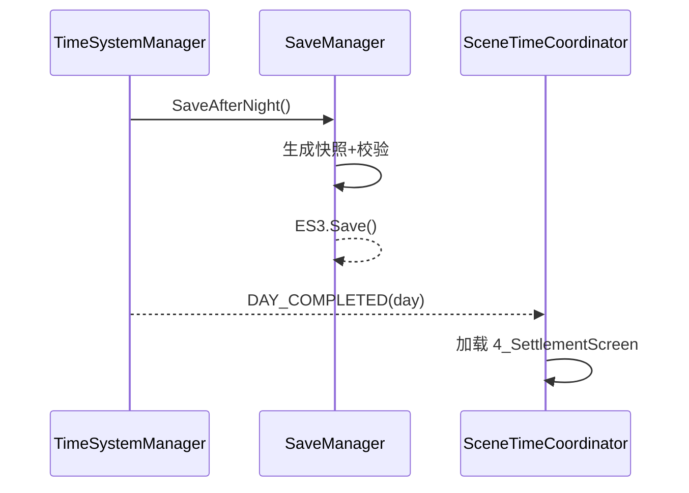
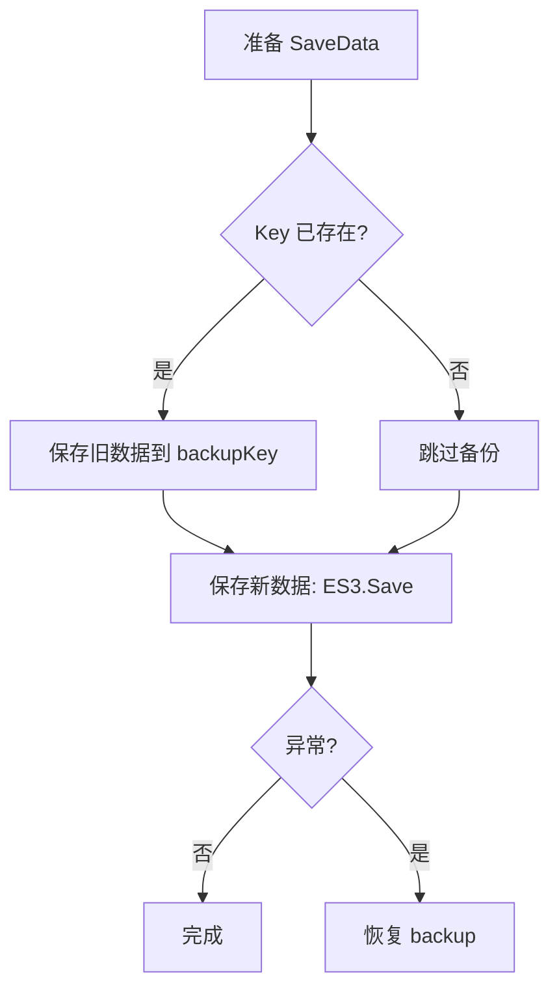
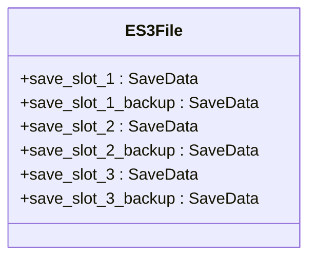
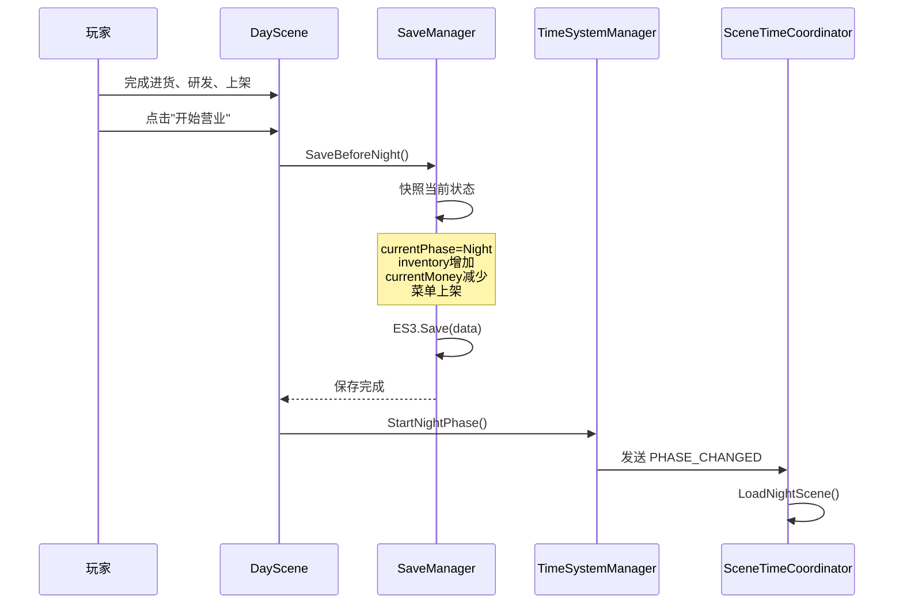
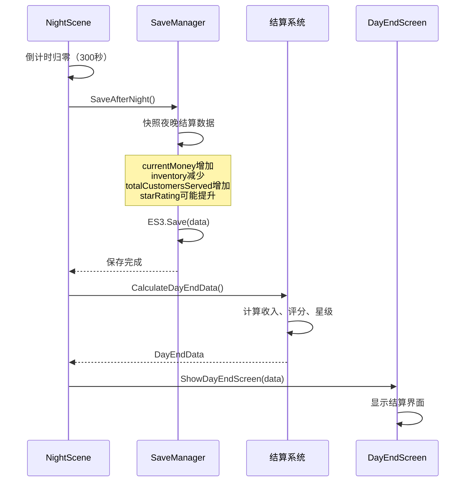
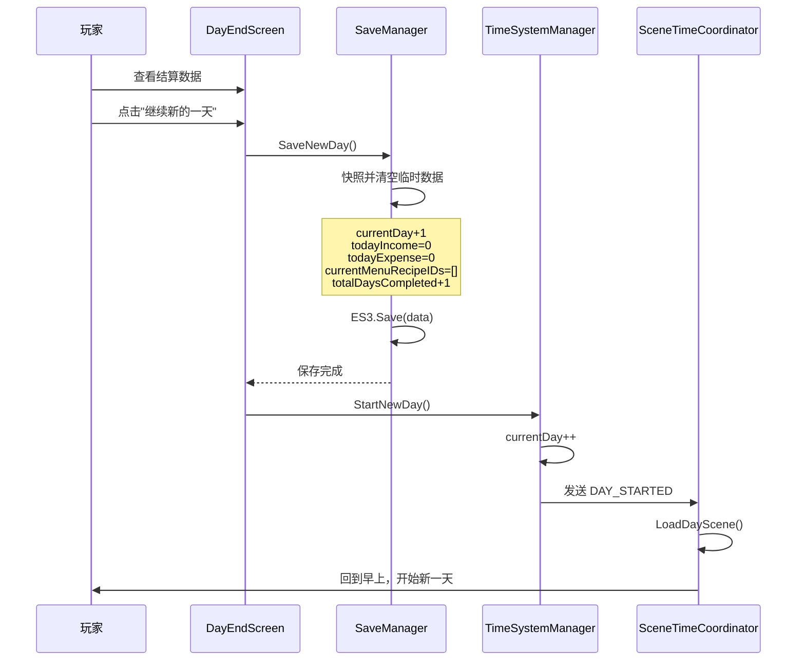

# 存档系统开发文档

**项目：Taberna Noctis（夜之小酒馆）**  
**版本：v1.0**  
**最后更新：2025-10-09**

---

## 功能综述

存档系统在白天结束、夜晚结束与新一天开始三个关键节点自动生成快照并持久化至 ES3，内置统一键命名、备份与回滚、版本升级和数据校验机制，既保证状态一致性又降低玩家操作成本；同时提供存档槽 UI 的关键信息展示与读写操作，并通过 SAVE_COMPLETED/SAVE_LOADED 等消息与其他系统解耦联动。

## 📋 目录

1. [系统概述](#系统概述)
2. [自动保存机制](#自动保存机制)
3. [存档数据结构](#存档数据结构)
4. [三个保存点详解](#三个保存点详解)
5. [数据变化追踪](#数据变化追踪)
6. [存档管理器设计](#存档管理器设计)
7. [存档 UI 设计](#存档-ui-设计)
8. [技术实现要点](#技术实现要点)
9. [实现清单](#实现清单)

---

## 系统概述

### 设计目标

- ✅ 完全自动保存，无需玩家手动操作
- ✅ 三个关键时机点自动保存（白天结束、夜晚结束、新一天开始）
- ✅ 存档数据完整性保证
- ✅ 支持多存档槽（3-5 个）
- ✅ 存档列表显示关键信息（天数、金钱、星级、游玩时长）
- ✅ 基于 Easy Save 3 持久化

### 核心理念

> **"无感存档，随时恢复"**  
> 玩家无需担心存档丢失，系统在关键节点自动保存进度，确保任何时刻退出游戏都能从合理位置恢复。

---

## 自动保存机制

### 三个自动保存时机点

```mermaid
flowchart TD
    A[DayScene 白天场景] -->|玩家完成白天操作| B[保存点1: 白天结束]
    B -->|自动保存| C{切换到 NightScene}
    C --> D[NightScene 夜晚场景]
    D -->|300 秒倒计时归零| E[保存点2: 夜晚结束]
    E -->|自动保存| F{显示结算界面}
    F --> G[玩家查看结算数据]
    G -->|点击"继续新的一天"| H[保存点3: 新一天开始]
    H -->|自动保存| I{Day+1, 切换回 DayScene}
    I --> A

    style B fill:#ff9,stroke:#f66,stroke-width:3px
    style E fill:#ff9,stroke:#f66,stroke-width:3px
    style H fill:#ff9,stroke:#f66,stroke-width:3px
```

### 附加图表

#### 1）保存调用时序（夜晚结束 → 结算）



#### 2）数据写入与备份流程



#### 3）槽位/键结构图



### 保存时机详细说明

| 保存点                     | 触发时机                                          | 场景状态                                       | 保存内容                                                                                 | 覆盖数据                                                                      |
| -------------------------- | ------------------------------------------------- | ---------------------------------------------- | ---------------------------------------------------------------------------------------- | ----------------------------------------------------------------------------- |
| **保存点 1**<br>白天结束   | 玩家点击"开始营业"按钮<br>DayScene → NightScene   | - 进货已完成<br>- 配方已研发<br>- 菜单已上架   | - 库存增加（进货）<br>- 金币减少（支出）<br>- 新配方解锁<br>- 菜单上架列表               | `currentPhase`<br>`inventory`<br>`currentMoney`<br>`unlockedRecipes`          |
| **保存点 2**<br>夜晚结束   | 夜晚倒计时归零（300 秒）<br>NightScene → 结算界面 | - 顾客服务完毕<br>- 收入已结算<br>- 评分已统计 | - 金币增加（收入）<br>- 库存减少（消耗）<br>- 顾客累计数<br>- 评分累积<br>- 星级可能提升 | `currentMoney`<br>`inventory`<br>`totalCustomersServed`<br>`starRating`       |
| **保存点 3**<br>新一天开始 | 点击"继续新的一天"<br>结算界面 → DayScene         | - 结算已查看<br>- 准备进入新天                 | - **Day+1**<br>- 所有 today\*字段归零<br>- 菜单清空<br>- 完成天数+1                      | **`currentDay`**<br>`todayIncome`<br>`todayExpense`<br>`currentMenuRecipeIDs` |

---

## 存档数据结构

### 完整数据结构（SaveData.cs）

```csharp
[System.Serializable]
public class SaveData
{
    // ========== 存档元信息 ==========
    public string saveSlotID;              // 存档槽唯一ID："save_slot_1"
    public string saveSlotName;            // 存档槽显示名称："存档1"
    public string lastSaveDateTime;        // 最后保存时间："2025-01-15 20:30:45"
    public double totalPlayTimeSeconds;    // 累计真实游玩时长（秒）
    public int saveVersion = 1;            // 存档版本号（兼容性检查）

    // ========== 时间线核心数据 ==========
    public int currentDay = 1;             // 当前第几天
    public TimePhase currentPhase;         // 当前时段
    public DaySubPhase daySubPhase;        // 白天子阶段
    public int clockHour;                  // 游戏时钟-时
    public int clockMinute;                // 游戏时钟-分
    public float phaseRemainingTime;       // 阶段剩余时间

    // ========== 经济数据 ==========
    public int currentMoney;               // 当前持有金币
    public int totalEarnedMoney;           // 累计赚取（含已花费）
    public int totalSpentMoney;            // 累计花费
    public int todayIncome;                // 今日收入
    public int todayExpense;               // 今日支出

    // ========== 评价系统 ==========
    public int starRating;                 // 当前星级（0-5）
    public float cumulativeScore;          // 累计评分总和
    public int totalCustomersServed;       // 累计服务顾客数
    public int todayCustomersServed;       // 今日服务顾客数
    public float todayAverageScore;        // 今日平均评分

    // ========== 库存数据 ==========
    public Dictionary<string, int> inventory;
    // 材料库存：{"GIN": 5, "VODKA": 3, ...}

    // ========== 配方数据 ==========
    public List<RecipeData> unlockedRecipes;   // 已解锁配方
    public List<string> currentMenuRecipeIDs;  // 当前上架菜单
    public int totalRecipesCreated;            // 累计研发配方数

    // ========== 当日临时数据（每天重置） ==========
    public List<string> todayPurchasedItems;   // 今日购买材料
    public int todayRecipesCreated;            // 今日研发数量
    public bool todayStockingCompleted;        // 进货完成标记
    public bool todayMenuSelected;             // 菜单上架标记

    // ========== 游戏进度标记 ==========
    public bool tutorialCompleted;             // 教学完成
    public int totalDaysCompleted;             // 已完成天数
    public int highestStarRatingAchieved;      // 历史最高星级

    // ========== 成就/解锁内容 ==========
    public List<string> unlockedAchievements;  // 已解锁成就
    public List<string> specialRecipes;        // 特殊配方（星级奖励）

    // ========== 统计数据 ==========
    public Dictionary<string, int> customerTypeCount;
    // 各类型顾客服务次数
    public int consecutivePerfectDays;         // 连续满分天数
    public int maxConsecutivePerfectDays;      // 历史最长连胜
}
```

### 数据分类图

```
SaveData 数据分类
├── 🔵 永久累积数据（只增不减）
│   ├── totalEarnedMoney          (累计赚取金币)
│   ├── totalSpentMoney           (累计花费金币)
│   ├── totalCustomersServed      (累计服务顾客)
│   ├── totalRecipesCreated       (累计研发配方)
│   ├── unlockedRecipes           (已解锁配方列表)
│   ├── unlockedAchievements      (已解锁成就)
│   └── maxConsecutivePerfectDays (历史最长连胜)
│
├── 🟢 游戏状态数据（持续变化）
│   ├── currentMoney              (当前金币余额)
│   ├── inventory                 (材料库存)
│   ├── starRating                (当前星级)
│   ├── currentDay                (当前天数)
│   ├── currentPhase              (当前时段)
│   └── clockHour/clockMinute     (游戏时钟)
│
└── 🟡 临时数据（每天重置）
    ├── todayIncome               (今日收入)
    ├── todayExpense              (今日支出)
    ├── todayCustomersServed      (今日服务人数)
    ├── todayAverageScore         (今日平均分)
    ├── todayPurchasedItems       (今日购买清单)
    ├── todayRecipesCreated       (今日研发数量)
    └── currentMenuRecipeIDs      (当前上架菜单)
```

---

## 三个保存点详解

### 保存点 1：白天结束 → 夜晚前

#### 触发条件

```csharp
// DaySceneController.cs
public void OnOpenShopClicked()
{
    // 1. 检查菜单是否上架
    if (!MenuManager.Instance.HasMenuSelected())
    {
        ShowWarning("请先上架至少一款饮品！");
        return;
    }

    // 2. 触发保存
    SaveManager.Instance.SaveBeforeNight();

    // 3. 切换到夜晚
    TimeSystemManager.Instance.StartNightPhase();
}
```

#### 数据变化表

| 数据字段                 | 变化类型     | 变化原因       | 示例                                        |
| ------------------------ | ------------ | -------------- | ------------------------------------------- |
| `currentPhase`           | ✅ 更新      | 准备进入 Night | Morning/Afternoon → Night                   |
| `clockHour`              | ✅ 更新      | 时钟跳转       | 18 → 19                                     |
| `clockMinute`            | ✅ 更新      | 分钟重置       | 任意值 → 0                                  |
| `currentMoney`           | ✅ 减少      | 进货支出       | 1000 → 750                                  |
| `inventory["GIN"]`       | ✅ 增加      | 购买材料       | 5 → 10                                      |
| `inventory["VODKA"]`     | ✅ 增加      | 购买材料       | 3 → 8                                       |
| `totalSpentMoney`        | ✅ 累加      | 记录支出       | 5000 → 5250                                 |
| `todayExpense`           | ✅ 填充      | 记录今日支出   | 0 → 250                                     |
| `unlockedRecipes`        | ✅ 可能新增  | 研发新配方     | [配方 1, 配方 2] → [配方 1, 配方 2, 配方 3] |
| `currentMenuRecipeIDs`   | ✅ 填充      | 上架菜单       | [] → ["recipe_1", "recipe_3"]               |
| `todayRecipesCreated`    | ✅ 填充      | 今日研发数     | 0 → 2                                       |
| `todayStockingCompleted` | ✅ 设为 true | 进货完成       | false → true                                |
| `todayMenuSelected`      | ✅ 设为 true | 菜单上架       | false → true                                |

#### 保存点 1 流程图



---

### 保存点 2：夜晚结束 → 结算前

#### 触发条件

```csharp
// NightPhaseController.cs
void Update()
{
    if (nightTimer <= 0 && !isNightEnding)
    {
        isNightEnding = true;
        EndNightPhase();
    }
}

private void EndNightPhase()
{
    // 1. 触发保存
    SaveManager.Instance.SaveAfterNight();

    // 2. 显示结算界面
    DayEndData endData = CalculateDayEndData();
    UIManager.Instance.ShowDayEndScreen(endData);
}
```

#### 数据变化表

| 数据字段                        | 变化类型    | 变化原因           | 示例           |
| ------------------------------- | ----------- | ------------------ | -------------- |
| `clockHour`                     | ✅ 更新     | 时钟推进到深夜     | 19 → 3         |
| `currentMoney`                  | ✅ 增加     | 夜晚收入           | 750 → 1200     |
| `inventory["GIN"]`              | ✅ 减少     | 制作饮品消耗       | 10 → 5         |
| `inventory["VODKA"]`            | ✅ 减少     | 制作饮品消耗       | 8 → 3          |
| `totalEarnedMoney`              | ✅ 累加     | 记录收入           | 10000 → 10450  |
| `todayIncome`                   | ✅ 填充     | 记录今日收入       | 0 → 450        |
| `totalCustomersServed`          | ✅ 增加     | 服务顾客累计       | 120 → 135      |
| `todayCustomersServed`          | ✅ 填充     | 今日服务人数       | 0 → 15         |
| `cumulativeScore`               | ✅ 累加     | 评分累积           | 850.5 → 965.8  |
| `todayAverageScore`             | ✅ 计算     | 今日平均分         | 0 → 7.68       |
| `starRating`                    | ✅ 可能提升 | 评分达标升星       | 2 → 3          |
| `customerTypeCount["公司职员"]` | ✅ 增加     | 统计顾客类型       | 45 → 52        |
| `consecutivePerfectDays`        | ✅ 更新     | 满分则+1，否则归零 | 2 → 3 或 2 → 0 |

#### 保存点 2 流程图



---

### 保存点 3：新一天开始

#### 触发条件

```csharp
// DayEndScreen.cs
public void OnContinueButtonClicked()
{
    // 1. 触发保存（Day+1，临时数据清空）
    SaveManager.Instance.SaveNewDay();

    // 2. 推进到新一天
    TimeSystemManager.Instance.StartNewDay();

    // 3. 关闭结算界面，加载DayScene
    CloseScreen();
}
```

#### 数据变化表（重点：重置与清空）

| 数据字段                 | 变化类型    | 变化原因       | 示例                          |
| ------------------------ | ----------- | -------------- | ----------------------------- |
| **`currentDay`**         | ✅ **+1**   | **进入新一天** | **5 → 6**                     |
| `currentPhase`           | ✅ 重置     | 回到早上       | Night → Morning               |
| `daySubPhase`            | ✅ 重置     | 回到进货       | 任意 → MorningStocking        |
| `clockHour`              | ✅ 重置     | 时钟归零       | 3 → 8                         |
| `clockMinute`            | ✅ 重置     | 分钟归零       | 任意 → 0                      |
| `phaseRemainingTime`     | ✅ 重置     | 早上完整时长   | 0 → 180                       |
| `todayIncome`            | ✅ **归零** | 清空今日数据   | 450 → 0                       |
| `todayExpense`           | ✅ **归零** | 清空今日数据   | 250 → 0                       |
| `todayCustomersServed`   | ✅ **归零** | 清空今日数据   | 15 → 0                        |
| `todayAverageScore`      | ✅ **归零** | 清空今日数据   | 7.68 → 0                      |
| `todayPurchasedItems`    | ✅ **清空** | 重置购买清单   | ["GIN", "VODKA"] → []         |
| `todayRecipesCreated`    | ✅ **归零** | 清空今日研发   | 2 → 0                         |
| `todayStockingCompleted` | ✅ 重置     | 重置标记       | true → false                  |
| `todayMenuSelected`      | ✅ 重置     | 重置标记       | true → false                  |
| `currentMenuRecipeIDs`   | ✅ **清空** | 清空上架菜单   | ["recipe_1", "recipe_3"] → [] |
| `totalDaysCompleted`     | ✅ **+1**   | 累计完成天数   | 4 → 5                         |

#### 保存点 3 流程图



---

## 数据变化追踪

### 数据覆盖矩阵表

| 数据字段                 | 保存点 1<br>白天 → 夜晚 | 保存点 2<br>夜晚 → 结算 | 保存点 3<br>结算 → 新天 | 数据类型 |
| ------------------------ | ----------------------- | ----------------------- | ----------------------- | -------- |
| **核心进度**             |                         |                         |                         |          |
| `currentDay`             | ❌ 不变 (5)             | ❌ 不变 (5)             | ✅ **+1** (5→6)         | 🔵 核心  |
| `totalDaysCompleted`     | ❌ 不变 (4)             | ❌ 不变 (4)             | ✅ **+1** (4→5)         | 🔵 核心  |
| `currentPhase`           | ✅ Morning→Night        | ✅ Night→ 结算          | ✅ 结算 →Morning        | 🔵 核心  |
| `clockHour`              | ✅ 18→19                | ✅ 19→3                 | ✅ 3→8                  | 🔵 核心  |
| **经济数据**             |                         |                         |                         |          |
| `currentMoney`           | ✅ 减少（支出）         | ✅ 增加（收入）         | ❌ 不变                 | 🟢 状态  |
| `totalEarnedMoney`       | ❌ 不变                 | ✅ 累加                 | ❌ 不变                 | 🔵 累积  |
| `totalSpentMoney`        | ✅ 累加                 | ❌ 不变                 | ❌ 不变                 | 🔵 累积  |
| `todayIncome`            | ❌ 为 0                 | ✅ 填充                 | ✅ **归零**             | 🟡 临时  |
| `todayExpense`           | ✅ 填充                 | ❌ 不变                 | ✅ **归零**             | 🟡 临时  |
| **库存数据**             |                         |                         |                         |          |
| `inventory`              | ✅ 增加（进货）         | ✅ 减少（消耗）         | ❌ 不变                 | 🟢 状态  |
| **配方数据**             |                         |                         |                         |          |
| `unlockedRecipes`        | ✅ 可能新增             | ❌ 不变                 | ❌ 不变                 | 🔵 累积  |
| `currentMenuRecipeIDs`   | ✅ 填充                 | ❌ 不变                 | ✅ **清空**             | 🟡 临时  |
| `totalRecipesCreated`    | ✅ 累加                 | ❌ 不变                 | ❌ 不变                 | 🔵 累积  |
| `todayRecipesCreated`    | ✅ 填充                 | ❌ 不变                 | ✅ **归零**             | 🟡 临时  |
| **评价数据**             |                         |                         |                         |          |
| `totalCustomersServed`   | ❌ 不变                 | ✅ 增加                 | ❌ 不变                 | 🔵 累积  |
| `todayCustomersServed`   | ❌ 为 0                 | ✅ 填充                 | ✅ **归零**             | 🟡 临时  |
| `cumulativeScore`        | ❌ 不变                 | ✅ 累加                 | ❌ 不变                 | 🔵 累积  |
| `starRating`             | ❌ 不变                 | ✅ 可能提升             | ❌ 不变                 | 🟢 状态  |
| **进度标记**             |                         |                         |                         |          |
| `todayStockingCompleted` | ✅ 设为 true            | ❌ 不变                 | ✅ 重置 false           | 🟡 临时  |
| `todayMenuSelected`      | ✅ 设为 true            | ❌ 不变                 | ✅ 重置 false           | 🟡 临时  |

### 数据生命周期图

```
┌──────────────────────────────────────────────────────┐
│           一天内数据的生命周期                        │
└──────────────────────────────────────────────────────┘

第5天开始 (保存点3)
    ↓
┌─────────────────────────────────────┐
│ todayIncome = 0                     │
│ todayExpense = 0                    │
│ todayCustomersServed = 0            │
│ currentMenuRecipeIDs = []           │
│ todayStockingCompleted = false      │
└─────────────────────────────────────┘
    ↓ 白天操作（进货、研发、上架）
    ↓
保存点1（白天结束）
    ↓
┌─────────────────────────────────────┐
│ todayExpense = 250                  │  ← 填充
│ currentMenuRecipeIDs = [配方1, 配方2]│  ← 填充
│ todayStockingCompleted = true       │  ← 更新
│ todayMenuSelected = true            │  ← 更新
│ inventory增加，currentMoney减少     │
└─────────────────────────────────────┘
    ↓ 夜晚操作（服务顾客）
    ↓
保存点2（夜晚结束）
    ↓
┌─────────────────────────────────────┐
│ todayIncome = 450                   │  ← 填充
│ todayCustomersServed = 15           │  ← 填充
│ todayAverageScore = 7.68            │  ← 计算
│ inventory减少，currentMoney增加     │
│ totalCustomersServed += 15          │  ← 累加
│ starRating可能提升                  │
└─────────────────────────────────────┘
    ↓ 查看结算
    ↓
保存点3（新一天开始，第6天）
    ↓
┌─────────────────────────────────────┐
│ currentDay = 6 (Day+1)              │  ← 关键！
│ todayIncome = 0                     │  ← 归零
│ todayExpense = 0                    │  ← 归零
│ todayCustomersServed = 0            │  ← 归零
│ currentMenuRecipeIDs = []           │  ← 清空
│ todayStockingCompleted = false      │  ← 重置
│ totalDaysCompleted = 5 (+1)         │  ← 累加
└─────────────────────────────────────┘
    ↓ 循环继续...
```

---

## 存档管理器设计

### SaveManager 核心架构

```csharp
public class SaveManager : MonoBehaviour
{
    public static SaveManager Instance;

    // === 配置 ===
    [SerializeField] private int maxSaveSlots = 3;
    private const string SAVE_KEY_PREFIX = "save_slot_";

    // === 当前活跃存档 ===
    private SaveData currentSaveData;
    private string currentSlotID;

    // === 核心方法 ===
    public void SaveBeforeNight();         // 保存点1
    public void SaveAfterNight();          // 保存点2
    public void SaveNewDay();              // 保存点3

    public void LoadSaveSlot(string slotID);
    public SaveData GenerateSaveData();
    public List<SaveSlotInfo> GetAllSaveSlots();
    public void DeleteSaveSlot(string slotID);
}
```

### 保存方法实现示例

```csharp
// 保存点1：白天结束
public void SaveBeforeNight()
{
    SaveData data = GenerateSaveData();

    // 确保时间线数据正确
    data.currentPhase = TimePhase.Night;
    data.clockHour = 19;
    data.clockMinute = 0;

    // 验证数据完整性
    Debug.Assert(data.todayExpense > 0, "白天应该有支出");
    Debug.Assert(data.currentMenuRecipeIDs.Count > 0, "应该已上架菜单");

    // 更新元信息
    data.lastSaveDateTime = DateTime.Now.ToString("yyyy-MM-dd HH:mm:ss");
    data.totalPlayTimeSeconds += TimeSystemManager.Instance.TotalPlayTime;

    // 保存到文件
    SaveToFile(data);

    // 发送消息
    MessageManager.Send(MessageDefine.SAVE_COMPLETED);
}

// 保存点2：夜晚结束
public void SaveAfterNight()
{
    SaveData data = GenerateSaveData();

    data.clockHour = 3;
    data.clockMinute = 0;

    // 验证数据
    Debug.Assert(data.todayIncome > 0, "夜晚应该有收入");
    Debug.Assert(data.todayCustomersServed > 0, "应该服务过顾客");

    data.lastSaveDateTime = DateTime.Now.ToString("yyyy-MM-dd HH:mm:ss");
    data.totalPlayTimeSeconds += TimeSystemManager.Instance.TotalPlayTime;

    SaveToFile(data);
    MessageManager.Send(MessageDefine.SAVE_COMPLETED);
}

// 保存点3：新一天开始
public void SaveNewDay()
{
    SaveData data = GenerateSaveData();

    // 重置时间线
    data.currentPhase = TimePhase.Morning;
    data.clockHour = 8;
    data.clockMinute = 0;
    data.phaseRemainingTime = 180f;

    // 清空今日临时数据
    data.todayIncome = 0;
    data.todayExpense = 0;
    data.todayCustomersServed = 0;
    data.todayAverageScore = 0;
    data.todayPurchasedItems.Clear();
    data.todayRecipesCreated = 0;
    data.todayStockingCompleted = false;
    data.todayMenuSelected = false;
    data.currentMenuRecipeIDs.Clear();

    // 累计进度
    data.totalDaysCompleted = data.currentDay - 1;

    data.lastSaveDateTime = DateTime.Now.ToString("yyyy-MM-dd HH:mm:ss");
    data.totalPlayTimeSeconds += TimeSystemManager.Instance.TotalPlayTime;

    SaveToFile(data);
    MessageManager.Send(MessageDefine.SAVE_COMPLETED);
}
```

### Easy Save 3 集成

```csharp
private void SaveToFile(SaveData data)
{
    string key = SAVE_KEY_PREFIX + currentSlotID;

    try
    {
        // 使用 Easy Save 3 保存
        ES3.Save(key, data);

        Debug.Log($"[SaveManager] 保存成功: {key}, Day={data.currentDay}, " +
                  $"Money={data.currentMoney}, Star={data.starRating}");
    }
    catch (System.Exception e)
    {
        Debug.LogError($"[SaveManager] 保存失败: {e.Message}");
    }
}

private SaveData LoadFromFile(string slotID)
{
    string key = SAVE_KEY_PREFIX + slotID;

    if (!ES3.KeyExists(key))
    {
        Debug.LogWarning($"[SaveManager] 存档不存在: {key}");
        return null;
    }

    try
    {
        SaveData data = ES3.Load<SaveData>(key);

        // 版本兼容性检查
        if (data.saveVersion < CURRENT_SAVE_VERSION)
        {
            data = UpgradeSaveData(data);
        }

        return data;
    }
    catch (System.Exception e)
    {
        Debug.LogError($"[SaveManager] 读取失败: {e.Message}");
        return null;
    }
}
```

---

## 存档 UI 设计

### 存档槽卡片布局

```
┌─────────────────────────────────────────────────────┐
│  存档1                               [已占用]        │
│  ━━━━━━━━━━━━━━━━━━━━━━━━━━━━━━━━━━━━━━━━━━━━━━━  │
│                                                     │
│  📅 第5天 夜晚 21:35                                │
│  ⏱️ 游玩时间：1小时23分                             │
│  💰 当前资金：1,250金币                             │
│  ⭐ 星级评价：★★★☆☆ (3星)                         │
│  📝 最后保存：2025-01-15 20:30                      │
│                                                     │
│  ┌──────────────┐  ┌──────────────┐               │
│  │  读取存档     │  │  删除存档     │               │
│  └──────────────┘  └──────────────┘               │
└─────────────────────────────────────────────────────┘
```

### SaveSlotUI 组件

```csharp
public class SaveSlotUI : MonoBehaviour
{
    [SerializeField] private TextMeshProUGUI slotNameText;
    [SerializeField] private TextMeshProUGUI dayText;
    [SerializeField] private TextMeshProUGUI playTimeText;
    [SerializeField] private TextMeshProUGUI moneyText;
    [SerializeField] private TextMeshProUGUI starText;
    [SerializeField] private TextMeshProUGUI lastSaveText;
    [SerializeField] private Button loadButton;
    [SerializeField] private Button deleteButton;

    private SaveData saveData;

    public void Initialize(SaveData data)
    {
        saveData = data;

        // 格式化显示
        dayText.text = FormatDayPhase();
        playTimeText.text = FormatPlayTime();
        moneyText.text = $"{saveData.currentMoney:N0}金币";
        starText.text = FormatStars();
        lastSaveText.text = saveData.lastSaveDateTime;

        loadButton.onClick.AddListener(OnLoadClicked);
        deleteButton.onClick.AddListener(OnDeleteClicked);
    }

    private string FormatDayPhase()
    {
        string phase = saveData.currentPhase switch
        {
            TimePhase.Morning => "早上",
            TimePhase.Afternoon => "下午",
            TimePhase.Night => "夜晚",
            _ => ""
        };
        return $"第{saveData.currentDay}天 {phase} " +
               $"{saveData.clockHour:D2}:{saveData.clockMinute:D2}";
    }

    private string FormatPlayTime()
    {
        TimeSpan time = TimeSpan.FromSeconds(saveData.totalPlayTimeSeconds);
        return $"{time.Hours}小时{time.Minutes}分";
    }

    private string FormatStars()
    {
        string filled = new string('★', saveData.starRating);
        string empty = new string('☆', 5 - saveData.starRating);
        return $"{filled}{empty} ({saveData.starRating}星)";
    }
}
```

---

## 技术实现要点

### 数据完整性校验

```csharp
public bool ValidateSaveData(SaveData data)
{
    // 1. 时间合法性
    if (data.clockHour < 0 || data.clockHour > 23)
    {
        Debug.LogError("时钟小时超出范围");
        return false;
    }

    // 2. 经济数据合理性
    if (data.currentMoney < 0)
    {
        Debug.LogError("金币不能为负数");
        return false;
    }

    // 3. 天数合理性
    if (data.currentDay < 1)
    {
        Debug.LogError("天数必须≥1");
        return false;
    }

    if (data.totalDaysCompleted >= data.currentDay)
    {
        Debug.LogError("完成天数不能≥当前天数");
        return false;
    }

    // 4. 星级范围
    if (data.starRating < 0 || data.starRating > 5)
    {
        Debug.LogError("星级超出范围");
        return false;
    }

    // 5. 库存非负
    foreach (var item in data.inventory)
    {
        if (item.Value < 0)
        {
            Debug.LogError($"材料{item.Key}数量为负");
            return false;
        }
    }

    return true;
}
```

### 存档备份机制

```csharp
private void SaveToFile(SaveData data)
{
    string key = SAVE_KEY_PREFIX + currentSlotID;
    string backupKey = key + "_backup";

    try
    {
        // 1. 先备份旧存档
        if (ES3.KeyExists(key))
        {
            SaveData oldData = ES3.Load<SaveData>(key);
            ES3.Save(backupKey, oldData);
        }

        // 2. 保存新存档
        ES3.Save(key, data);

        Debug.Log($"[SaveManager] 保存成功: {key}");
    }
    catch (System.Exception e)
    {
        Debug.LogError($"[SaveManager] 保存失败，尝试恢复备份: {e.Message}");

        // 3. 如果保存失败，恢复备份
        if (ES3.KeyExists(backupKey))
        {
            SaveData backup = ES3.Load<SaveData>(backupKey);
            ES3.Save(key, backup);
            Debug.Log("[SaveManager] 已恢复备份存档");
        }
    }
}
```

### 存档版本升级

```csharp
private const int CURRENT_SAVE_VERSION = 2;

private SaveData UpgradeSaveData(SaveData oldData)
{
    int oldVersion = oldData.saveVersion;

    // 版本1 → 版本2：添加新字段
    if (oldVersion < 2)
    {
        oldData.todayIncome = 0;
        oldData.todayExpense = 0;
        oldData.consecutivePerfectDays = 0;
        oldData.saveVersion = 2;

        Debug.Log($"[SaveManager] 存档升级: v{oldVersion} → v2");
    }

    // 未来版本升级逻辑...

    return oldData;
}
```

---

## 实现清单

### Phase 1：SaveData 数据结构

- [ ] **创建 SaveData.cs**

  - [ ] 定义所有字段
  - [ ] 添加 [System.Serializable] 标记
  - [ ] 编写数据验证方法 ValidateSaveData()

- [ ] **创建 RecipeData.cs**（配方数据结构）

  - [ ] 配方 ID、名称、材料列表、效果数值

- [ ] **创建 DayEndData.cs**（结算数据）
  - [ ] 今日收入、服务人数、平均评分、星级奖励

### Phase 2：SaveManager 核心

- [ ] **实现 SaveManager.cs**

  - [ ] 单例模式
  - [ ] Easy Save 3 集成
  - [ ] SaveBeforeNight() 方法
  - [ ] SaveAfterNight() 方法
  - [ ] SaveNewDay() 方法
  - [ ] GenerateSaveData() 快照生成
  - [ ] LoadSaveSlot() 读取存档
  - [ ] DeleteSaveSlot() 删除存档

- [ ] **存档备份机制**

  - [ ] 保存前备份旧数据
  - [ ] 保存失败自动恢复

- [ ] **版本兼容性**
  - [ ] 存档版本号管理
  - [ ] UpgradeSaveData() 升级逻辑

### Phase 3：存档 UI

- [ ] **创建 SaveSlotUI.cs**

  - [ ] 存档信息显示
  - [ ] 格式化天数、时间、金币、星级
  - [ ] 读取/删除按钮事件

- [ ] **创建 SaveSlotsScreen.cs**

  - [ ] 存档列表加载
  - [ ] 新建存档按钮
  - [ ] 存档槽上限管理

- [ ] **UI 美术资源**
  - [ ] 存档槽背景图
  - [ ] 星级图标（★/☆）
  - [ ] 按钮样式

### Phase 4：系统集成

- [ ] **TimeSystemManager 集成**

  - [ ] 在三个保存点触发 SaveManager

- [ ] **场景切换时保存**

  - [ ] DaySceneController 调用 SaveBeforeNight()
  - [ ] NightPhaseController 调用 SaveAfterNight()
  - [ ] DayEndScreen 调用 SaveNewDay()

- [ ] **消息系统扩展**

  - [ ] SAVE_REQUESTED
  - [ ] SAVE_COMPLETED
  - [ ] SAVE_LOADED

- [ ] **测试用例**
  - [ ] 保存 → 退出 → 读取 → 继续游戏
  - [ ] 多存档槽测试
  - [ ] 存档删除测试
  - [ ] 版本升级测试

---

## 附录

### 存档文件位置

**Windows**:

```
%APPDATA%/../LocalLow/YourCompany/TabernaNoctis/SaveFiles/
```

**Mac**:

```
~/Library/Application Support/YourCompany/TabernaNoctis/SaveFiles/
```

### 调试工具

```csharp
#if UNITY_EDITOR
[ContextMenu("Debug: 打印存档信息")]
private void DebugPrintSaveData()
{
    if (currentSaveData == null) return;

    Debug.Log($"========== 存档信息 ==========");
    Debug.Log($"天数: {currentSaveData.currentDay}");
    Debug.Log($"时段: {currentSaveData.currentPhase}");
    Debug.Log($"金币: {currentSaveData.currentMoney}");
    Debug.Log($"星级: {currentSaveData.starRating}");
    Debug.Log($"库存: {string.Join(", ", currentSaveData.inventory)}");
    Debug.Log($"============================");
}

[ContextMenu("Debug: 清空所有存档")]
private void DebugClearAllSaves()
{
    for (int i = 1; i <= maxSaveSlots; i++)
    {
        string key = SAVE_KEY_PREFIX + i;
        if (ES3.KeyExists(key))
        {
            ES3.DeleteKey(key);
        }
    }
    Debug.Log("[SaveManager] 已清空所有存档");
}
#endif
```

---
