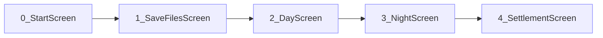
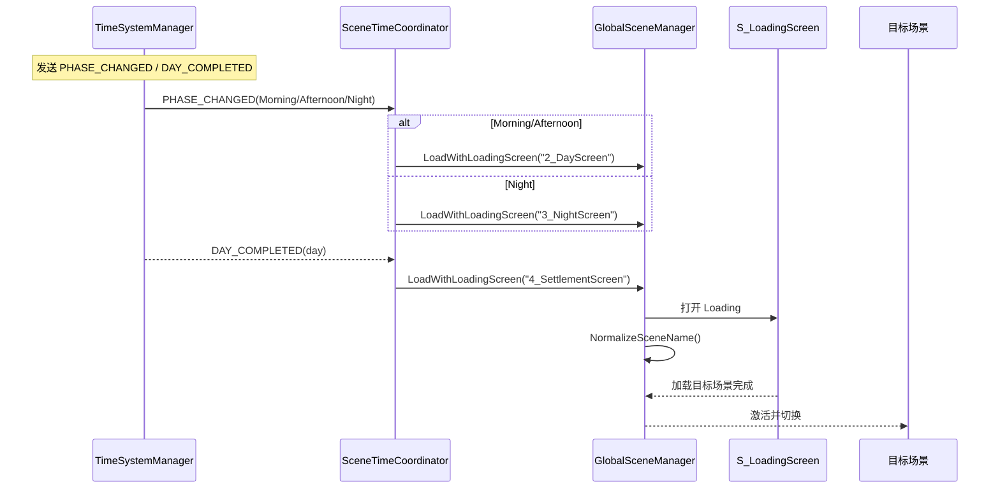
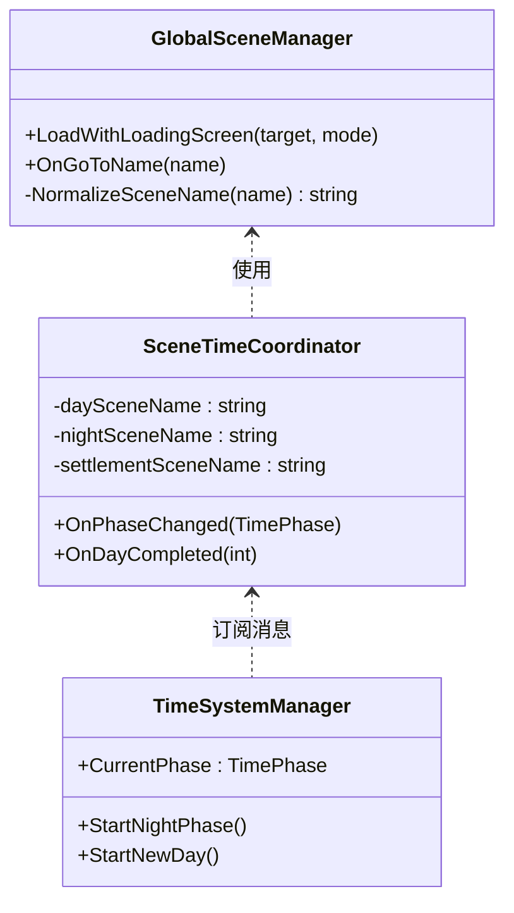
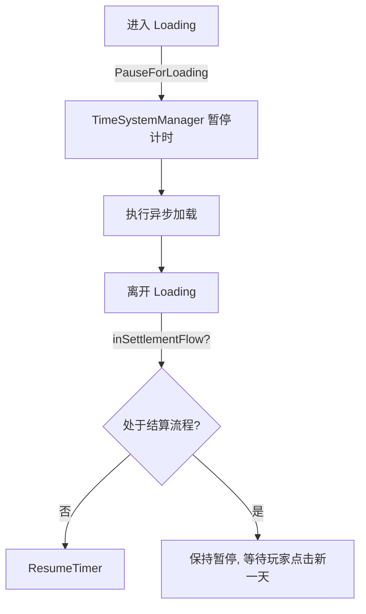

# 场景管理器开发文档

项目：Taberna Noctis（夜之小酒馆）  
版本：v1.0  
最后更新：2025-10-05

---

## 场景顺序与加载流程

- Loading 场景：`S_LoadingScreen`
- 旧名兼容：由 `GlobalSceneManager.NormalizeSceneName()` 将旧名映射为带编号的新名。

---

## 时序图：时间系统驱动场景切换

---

## 结构图：核心类与职责

---

## 加载期暂停/恢复协同

以上三类图表可直接嵌入到设计评审或 README。
