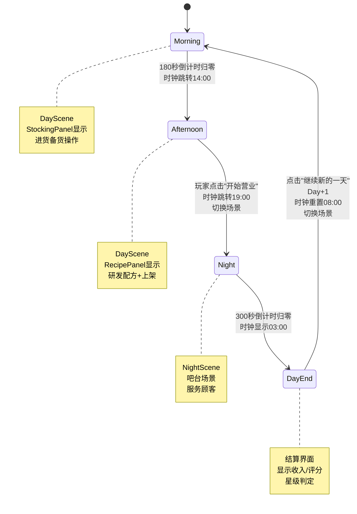

# 时间系统开发文档

**项目：Taberna Noctis（夜之小酒馆）**  
**版本：v1.0**  
**最后更新：2025-10-03**

---

## 📋 目录

1. [系统概述](#系统概述)
2. [时间线设计](#时间线设计)
3. [游戏时钟系统](#游戏时钟系统)
4. [场景切换机制](#场景切换机制)
5. [数据结构设计](#数据结构设计)
6. [核心脚本架构](#核心脚本架构)
7. [UI 显示组件](#ui显示组件)
8. [消息系统集成](#消息系统集成)
9. [实现清单](#实现清单)

---

## 系统概述

### 设计目标

- ✅ 实现完整的昼夜循环（早上 → 下午 → 夜晚 → 新一天）
- ✅ 两场景结构（DayScene + NightScene）
- ✅ 真实时间与游戏时间换算
- ✅ 自动阶段推进与场景切换
- ✅ 支持暂停/继续/存档恢复

### 核心循环流程图

```
┌─────────────────────────────────────────────────────────────┐
│                    游戏一天完整循环                          │
└─────────────────────────────────────────────────────────────┘

    DayScene (白天场景)
    ┌──────────────────────────────────────────────────┐
    │  早上阶段 (Morning)                              │
    │  • 真实时间：3分钟 (180秒)                       │
    │  • 游戏时间：08:00 → 12:00                      │
    │  • 玩家操作：进货备货                            │
    │  • UI面板：StockingPanel                        │
    └──────────────────────────────────────────────────┘
                        ↓ 倒计时归零（自动切换）
    ┌──────────────────────────────────────────────────┐
    │  下午阶段 (Afternoon)                            │
    │  • 真实时间：3分钟 (180秒)                       │
    │  • 游戏时间：14:00 → 18:00                      │
    │  • 玩家操作：研发配方 + 上架菜单                 │
    │  • UI面板：RecipePanel + MenuPanel              │
    └──────────────────────────────────────────────────┘
                        ↓ 完成后显示"开始营业"按钮
                        ↓ 玩家点击确认
                        ↓
                   LoadingScreen
              "第X天 夜晚 即将营业..."
                        ↓
    NightScene (夜晚场景)
    ┌──────────────────────────────────────────────────┐
    │  夜晚阶段 (Night)                                │
    │  • 真实时间：5分钟 (300秒)                       │
    │  • 游戏时间：19:00 → 次日03:00                  │
    │  • 玩家操作：服务顾客，提交饮品卡牌              │
    │  • 顾客生成：每25-35秒随机生成                  │
    └──────────────────────────────────────────────────┘
                        ↓ 倒计时归零
                        ↓
    ┌──────────────────────────────────────────────────┐
    │  结算界面 (DayEndScreen)                         │
    │  • 显示：今日收入、服务人数、平均评分           │
    │  • 判定：是否达到星级标准                        │
    │  • 奖励：星级奖励、特殊配方                      │
    └──────────────────────────────────────────────────┘
                        ↓ 点击"继续新的一天"
                        ↓ Day + 1
                        ↓
                   LoadingScreen
                "第X天 早上 准备中..."
                        ↓
              回到 DayScene (早上阶段)
                  循环继续...
```

---

## 时间线设计

### 时间换算表

| 阶段                 | 真实时长           | 游戏时间范围  | 游戏时长             | 时间流速比                              | 场景       |
| -------------------- | ------------------ | ------------- | -------------------- | --------------------------------------- | ---------- |
| **早上 (Morning)**   | 3 分钟<br>(180 秒) | 08:00 → 12:00 | 4 小时<br>(240 分钟) | 1 真实秒 = 80 游戏秒<br>(1.33 游戏分钟) | DayScene   |
| **下午 (Afternoon)** | 3 分钟<br>(180 秒) | 14:00 → 18:00 | 4 小时<br>(240 分钟) | 1 真实秒 = 80 游戏秒<br>(1.33 游戏分钟) | DayScene   |
| **夜晚 (Night)**     | 5 分钟<br>(300 秒) | 19:00 → 03:00 | 8 小时<br>(480 分钟) | 1 真实秒 = 96 游戏秒<br>(1.6 游戏分钟)  | NightScene |

**总计一天循环**：真实 11 分钟 = 游戏内 16 小时

**跳过时段**：

- 12:00-14:00（午休 2 小时）
- 18:00-19:00（晚餐准备 1 小时）

### 阶段状态机图



### 时间线枚举定义

```csharp
// 主时段枚举
public enum TimePhase
{
    Morning,      // 早上 08:00-12:00
    Afternoon,    // 下午 14:00-18:00
    Night         // 夜晚 19:00-03:00
}

// DayScene内部子阶段
public enum DaySubPhase
{
    MorningStocking,        // 早上-进货备货
    AfternoonRecipe,        // 下午-研发配方
    AfternoonMenu           // 下午-选择上架菜单
}
```

---

## 游戏时钟系统

### 时钟更新逻辑

```
┌─────────────────────────────────────────────────┐
│           GameClock 更新流程                     │
└─────────────────────────────────────────────────┘

每帧 Update():
    ┌────────────────────────────────┐
    │ 累积游戏时间                    │
    │ accumulatedSeconds +=           │
    │   Time.deltaTime * timeScale   │
    └────────────────────────────────┘
              ↓
    ┌────────────────────────────────┐
    │ 转换为游戏分钟                  │
    │ totalMinutes =                  │
    │   accumulatedSeconds / 60       │
    └────────────────────────────────┘
              ↓
    ┌────────────────────────────────┐
    │ 计算时、分                      │
    │ hour = startHour + (min / 60)  │
    │ minute = totalMinutes % 60     │
    └────────────────────────────────┘
              ↓
    ┌────────────────────────────────┐
    │ 处理跨天（夜晚19:00→03:00）     │
    │ if (hour >= 24) hour -= 24     │
    └────────────────────────────────┘
```

### 时钟显示示例

**早上阶段（180 秒）**：

```
真实时间  →  游戏时间
00:00     →  08:00
00:30     →  08:40
01:00     →  09:20
01:30     →  10:00
02:00     →  10:40
02:30     →  11:20
03:00     →  12:00 ✓ (阶段结束)
```

**夜晚阶段（300 秒）**：

```
真实时间  →  游戏时间
00:00     →  19:00
01:00     →  20:36
02:00     →  22:12
03:00     →  23:48
04:00     →  01:24
05:00     →  03:00 ✓ (阶段结束)
```

### GameClock 类结构

```csharp
public class GameClock
{
    // 公共属性
    public int Hour { get; private set; }       // 0-23
    public int Minute { get; private set; }     // 0-59

    // 内部字段
    private float accumulatedSeconds;           // 累积的游戏秒数
    private int startHour;                      // 阶段起始时
    private float timeScale;                    // 时间流速

    // 核心方法
    public void Initialize(int hour, int minute, float scale);
    public void Update(float deltaTime);
    public string GetTimeString();              // 返回 "08:35"
}
```

---

## 场景切换机制

### 场景结构

```
项目场景列表：
├── StartScreen          (开始菜单)
├── LoadingScreen        (过渡场景)
├── SaveFilesScreen      (存档选择，可选)
├── DayScreen            (白天场景)
└── NightScreen          (夜晚场景)
```

### DayScene 内部面板切换

```
DayScene GameObject 层级：
├── Canvas (Main UI)
│   ├── MorningPanel (CanvasGroup)
│   │   └── 进货界面 UI
│   ├── AfternoonPanel (CanvasGroup)
│   │   ├── RecipePanel (研发界面)
│   │   └── MenuPanel (上架界面)
│   └── OpenShopButton (开始营业按钮)
├── GameClockUI (左上角时间显示)
└── PhaseTimerUI (右上角倒计时)
```

**面板切换方式**：通过 `CanvasGroup.alpha` 和 `blocksRaycasts` 控制显示/隐藏

```csharp
// 平滑切换面板
public void ShowPanel(CanvasGroup targetPanel)
{
    morningPanel.alpha = (targetPanel == morningPanel) ? 1 : 0;
    morningPanel.blocksRaycasts = (targetPanel == morningPanel);

    afternoonPanel.alpha = (targetPanel == afternoonPanel) ? 1 : 0;
    afternoonPanel.blocksRaycasts = (targetPanel == afternoonPanel);

    // 使用 DOTween 平滑过渡
    targetPanel.DOFade(1f, 0.5f);
}
```

### 场景切换时序图

```mermaid
sequenceDiagram
    participant Player as 玩家
    participant TSM as TimeSystemManager
    participant STC as SceneTimeCoordinator
    participant Loading as LoadingScreen
    participant Scene as 目标场景

    Player->>TSM: 点击"开始营业"
    TSM->>TSM: StartNightPhase()
    TSM->>TSM: currentPhase = Night
    TSM->>TSM: gameClock跳转19:00
    TSM->>+STC: 发送 PHASE_CHANGED 消息
    STC->>STC: OnPhaseChanged(Night)
    STC->>Loading: 发送 LOADING_REQUEST
    Loading->>Loading: 显示 "第X天 夜晚 即将营业..."
    Loading->>Scene: 异步加载 NightScreen
    Scene-->>Loading: 加载完成
    Loading->>-Player: 场景激活，开始夜晚倒计时
```

---

## 数据结构设计

### TimeSystemData（可序列化）

```csharp
[System.Serializable]
public class TimeSystemData
{
    // 天数与时段
    public int currentDay = 1;
    public TimePhase currentPhase = TimePhase.Morning;
    public DaySubPhase daySubPhase = DaySubPhase.MorningStocking;

    // 游戏时钟快照
    public int clockHour = 8;
    public int clockMinute = 0;
    public float phaseRemainingTime = 180f;  // 当前阶段剩余真实秒数

    // 累计游玩时间
    public double totalPlayTimeSeconds = 0;

    // 进度标记
    public int totalDaysCompleted = 0;       // 已完成天数
    public bool tutorialCompleted = false;   // 教学完成标记
}
```

### TimePhaseConfig（阶段配置）

```csharp
[System.Serializable]
public class TimePhaseConfig
{
    public TimePhase phase;           // 阶段类型
    public float durationSeconds;     // 真实时长（秒）
    public int startHour;             // 游戏起始时
    public int startMinute;           // 游戏起始分
    public float timeScale;           // 时间流速（游戏秒/真实秒）
}

// Inspector 配置示例
Morning:   duration=180, startHour=8,  startMinute=0, timeScale=80
Afternoon: duration=180, startHour=14, startMinute=0, timeScale=80
Night:     duration=300, startHour=19, startMinute=0, timeScale=96
```

---

## 核心脚本架构

### 脚本层级关系图

```
TimeSystemManager (核心单例)
    ├── 管理天数、时段、游戏时钟
    ├── 倒计时管理
    ├── 阶段自动推进
    └── 发送消息通知
            ↓ 消息订阅
    ┌───────────────────────────────────┐
    │                                   │
SceneTimeCoordinator          DaySceneController
    ├── 监听阶段变化                    ├── DayScene内面板切换
    ├── 加载对应场景                    ├── "开始营业"按钮管理
    └── 配合LoadingScreen               └── UI状态管理
```

### TimeSystemManager 核心字段

```csharp
public class TimeSystemManager : MonoBehaviour
{
    public static TimeSystemManager Instance;

    // === 核心数据 ===
    private int currentDay = 1;
    private TimePhase currentPhase = TimePhase.Morning;
    private DaySubPhase daySubPhase = DaySubPhase.MorningStocking;

    // === 游戏时钟 ===
    private GameClock gameClock;

    // === 阶段计时器 ===
    private float phaseTimer;              // 已过去的真实秒数
    private float phaseDuration;           // 当前阶段总时长

    // === 累计游玩时间 ===
    private double totalPlayTime = 0;

    // === 配置数据 ===
    [SerializeField] private TimePhaseConfig[] phaseConfigs;

    // === 公共属性 ===
    public int CurrentDay => currentDay;
    public TimePhase CurrentPhase => currentPhase;
    public float PhaseRemainingTime => phaseDuration - phaseTimer;
}
```

### 核心方法流程图

```
┌──────────────────────────────────────────────────┐
│      TimeSystemManager.Update() 每帧执行          │
└──────────────────────────────────────────────────┘
                    ↓
    ┌─────────────────────────────────┐
    │ 更新累计游玩时间                 │
    │ totalPlayTime += deltaTime      │
    └─────────────────────────────────┘
                    ↓
    ┌─────────────────────────────────┐
    │ 更新游戏时钟                     │
    │ gameClock.Update(deltaTime)     │
    │ 发送 GAME_CLOCK_TICK 消息        │
    └─────────────────────────────────┘
                    ↓
    ┌─────────────────────────────────┐
    │ 更新阶段计时器                   │
    │ phaseTimer += deltaTime         │
    └─────────────────────────────────┘
                    ↓
    ┌─────────────────────────────────┐
    │ 检查阶段是否结束                 │
    │ if (phaseTimer >= phaseDuration)│
    └─────────────────────────────────┘
                    ↓ 是
    ┌─────────────────────────────────┐
    │ 推进到下一阶段                   │
    │ AdvanceToNextPhase()            │
    │ 发送 PHASE_CHANGED 消息          │
    └─────────────────────────────────┘
```

### 阶段推进逻辑

```csharp
private void AdvanceToNextPhase()
{
    switch (currentPhase)
    {
        case TimePhase.Morning:
            // 早上 → 下午
            currentPhase = TimePhase.Afternoon;
            daySubPhase = DaySubPhase.AfternoonRecipe;
            InitializePhase(TimePhase.Afternoon);
            MessageManager.Send(MessageDefine.PHASE_CHANGED, currentPhase);
            break;

        case TimePhase.Afternoon:
            // 下午结束，等待玩家点击"开始营业"
            // 显示按钮，暂停计时
            daySubPhase = DaySubPhase.AfternoonMenu;
            ShowOpenShopButton();
            break;

        case TimePhase.Night:
            // 夜晚 → 结算
            ShowDayEndSettlement();
            break;
    }
}

public void StartNightPhase()
{
    // 玩家点击"开始营业"后调用
    currentPhase = TimePhase.Night;
    InitializePhase(TimePhase.Night);
    MessageManager.Send(MessageDefine.PHASE_CHANGED, currentPhase);
}

public void StartNewDay()
{
    // 结算后进入新一天
    currentDay++;
    currentPhase = TimePhase.Morning;
    daySubPhase = DaySubPhase.MorningStocking;
    InitializePhase(TimePhase.Morning);

    MessageManager.Send(MessageDefine.DAY_STARTED, currentDay);
    MessageManager.Send(MessageDefine.PHASE_CHANGED, currentPhase);
}
```

---

## UI 显示组件

### GameClockUI（时钟显示）

**位置**：屏幕左上角  
**内容示例**：`"第5天 早上 09:42"`

```csharp
public class GameClockUI : MonoBehaviour
{
    [SerializeField] private TextMeshProUGUI clockText;

    void Update()
    {
        int day = TimeSystemManager.Instance.CurrentDay;
        string phase = GetPhaseText();
        string time = TimeSystemManager.Instance.GameClock.GetTimeString();

        clockText.text = $"第{day}天 {phase} {time}";
    }

    string GetPhaseText()
    {
        return TimeSystemManager.Instance.CurrentPhase switch
        {
            TimePhase.Morning => "早上",
            TimePhase.Afternoon => "下午",
            TimePhase.Night => "夜晚",
            _ => ""
        };
    }
}
```

### PhaseTimerUI（倒计时显示）

**位置**：屏幕右上角  
**内容示例**：`"剩余时间 02:35"`

```csharp
public class PhaseTimerUI : MonoBehaviour
{
    [SerializeField] private TextMeshProUGUI timerText;
    [SerializeField] private Image progressRing;  // 环形进度条

    void Update()
    {
        float remaining = TimeSystemManager.Instance.PhaseRemainingTime;
        int minutes = Mathf.FloorToInt(remaining / 60f);
        int seconds = Mathf.FloorToInt(remaining % 60f);

        timerText.text = $"剩余时间 {minutes:D2}:{seconds:D2}";

        // 更新进度环
        float progress = remaining / TimeSystemManager.Instance.PhaseDuration;
        progressRing.fillAmount = progress;

        // 时间<30秒变红色警告
        if (remaining < 30f)
        {
            timerText.color = Color.Lerp(Color.red, Color.yellow,
                Mathf.PingPong(Time.time, 1f));
        }
        else
        {
            timerText.color = Color.white;
        }
    }
}
```

### UI 布局示意图

```
┌──────────────────────────────────────────────────────┐
│  第5天 早上 09:42                   剩余时间 02:35 ◐ │  ← 顶部信息栏
├──────────────────────────────────────────────────────┤
│                                                       │
│                                                       │
│                   游戏主界面区域                      │
│                                                       │
│                                                       │
│                                                       │
│                                                       │
│                                                       │
│                ┌──────────────────┐                  │
│                │  开始营业 (按钮)  │                  │  ← 下午完成后显示
│                └──────────────────┘                  │
└──────────────────────────────────────────────────────┘
```

---

## 消息系统集成

### 消息定义（MessageDefine.cs 扩展）

```csharp
// 时间系统消息
public static readonly string TIME_SYSTEM_INITIALIZED = "TIME_SYSTEM_INITIALIZED";
public static readonly string DAY_STARTED = "DAY_STARTED";              // 携带 int 天数
public static readonly string PHASE_CHANGED = "PHASE_CHANGED";          // 携带 TimePhase
public static readonly string DAY_SUBPHASE_CHANGED = "DAY_SUBPHASE_CHANGED";
public static readonly string GAME_CLOCK_TICK = "GAME_CLOCK_TICK";      // 携带 string "08:35"
public static readonly string PHASE_TIME_WARNING = "PHASE_TIME_WARNING"; // 剩余<30秒
public static readonly string DAY_COMPLETED = "DAY_COMPLETED";          // 携带 DayEndData
```

### 消息订阅示例

```csharp
// 场景协调器订阅阶段变化
public class SceneTimeCoordinator : MonoBehaviour
{
    void Start()
    {
        MessageManager.Register<TimePhase>(
            MessageDefine.PHASE_CHANGED,
            OnPhaseChanged
        );
    }

    void OnPhaseChanged(TimePhase newPhase)
    {
        switch (newPhase)
        {
            case TimePhase.Morning:
            case TimePhase.Afternoon:
                LoadDayScene();
                break;
            case TimePhase.Night:
                LoadNightScene();
                break;
        }
    }
}
```

### 消息流向图

```
TimeSystemManager (消息发送者)
        │
        ├─→ PHASE_CHANGED
        │       ├─→ SceneTimeCoordinator (加载场景)
        │       ├─→ DaySceneController (切换面板)
        │       └─→ TutorialManager (教学模式响应)
        │
        ├─→ DAY_STARTED
        │       ├─→ 所有系统重置逻辑
        │       ├─→ 新闻系统生成今日新闻
        │       └─→ UI更新天数显示
        │
        ├─→ GAME_CLOCK_TICK
        │       └─→ GameClockUI (更新时间显示)
        │
        └─→ DAY_COMPLETED
                ├─→ 结算界面显示
                ├─→ 成就系统检查
                └─→ SaveManager 触发存档
```

---

## 实现清单

### Phase 1：核心时间管理器（第 1 周）

- [ ] **创建脚本文件夹结构**

  ```
  Scripts/0_General/0_0_TimeSystem/
  ```

- [ ] **实现 TimeEnums.cs**

  - [ ] TimePhase 枚举
  - [ ] DaySubPhase 枚举

- [ ] **实现 TimeSystemData.cs**

  - [ ] 数据结构定义
  - [ ] 序列化测试

- [ ] **实现 GameClock.cs**

  - [ ] Initialize() 方法
  - [ ] Update() 方法
  - [ ] GetTimeString() 方法
  - [ ] 跨天处理逻辑（19:00→03:00）

- [ ] **实现 TimePhaseConfig.cs**

  - [ ] ScriptableObject 配置类
  - [ ] 三个阶段配置资产创建

- [ ] **实现 TimeSystemManager.cs（核心）**
  - [ ] 单例模式 + DontDestroyOnLoad
  - [ ] 初始化 GameClock
  - [ ] Update() 主循环
  - [ ] AdvanceToNextPhase() 逻辑
  - [ ] StartNightPhase() 手动触发
  - [ ] StartNewDay() 天数推进
  - [ ] 暂停/继续功能
  - [ ] 消息发送集成

### Phase 2：场景协调与 UI（第 2 周）

- [ ] **扩展 MessageDefine.cs**

  - [ ] 添加时间系统消息常量

- [ ] **实现 SceneTimeCoordinator.cs**

  - [ ] 订阅 PHASE_CHANGED 消息
  - [ ] LoadDayScene() 方法
  - [ ] LoadNightScene() 方法
  - [ ] 配合 LoadingScreen 显示提示

- [ ] **实现 DaySceneController.cs**

  - [ ] MorningPanel / AfternoonPanel 切换
  - [ ] 订阅 PHASE_CHANGED 消息
  - [ ] ShowOpenShopButton() 逻辑
  - [ ] OnOpenShopClicked() 触发夜晚

- [ ] **实现 GameClockUI.cs**

  - [ ] TextMeshPro 组件引用
  - [ ] 实时更新显示
  - [ ] 格式化文字样式

- [ ] **实现 PhaseTimerUI.cs**
  - [ ] 倒计时文字显示
  - [ ] 环形进度条（Image.fillAmount）
  - [ ] 警告色变化（<30 秒）

### Phase 3：存档集成（第 3 周）

- [ ] **TimeSystemManager 存档接口**

  - [ ] GenerateTimeSystemData() 快照生成
  - [ ] LoadTimeSystemData() 状态恢复
  - [ ] 时钟状态恢复测试

- [ ] **存档触发点集成**
  - [ ] 白天结束时触发存档
  - [ ] 夜晚结束时触发存档
  - [ ] 新一天开始时触发存档

### Phase 4：测试与优化（第 4 周）

- [ ] **单元测试**

  - [ ] 时间换算正确性测试
  - [ ] 阶段切换逻辑测试
  - [ ] 存档/读档一致性测试

- [ ] **性能优化**

  - [ ] 减少每帧消息发送频率
  - [ ] UI 更新频率优化（每秒而非每帧）

- [ ] **边界情况处理**
  - [ ] 暂停菜单打开时停止计时
  - [ ] 场景切换中途退出游戏
  - [ ] 读取旧版本存档兼容性

---

## 附录

### 时间流速计算公式

```
时间流速 = 游戏时长（秒） / 真实时长（秒）

早上/下午：
    游戏时长 = 4小时 × 60分钟 = 240分钟 = 14400秒
    真实时长 = 180秒
    流速 = 14400 / 180 = 80 (游戏秒/真实秒)

夜晚：
    游戏时长 = 8小时 × 60分钟 = 480分钟 = 28800秒
    真实时长 = 300秒
    流速 = 28800 / 300 = 96 (游戏秒/真实秒)
```

### 调试技巧

1. **快速测试特定阶段**：

```csharp
// 在 Inspector 中添加测试按钮（仅编辑器）
#if UNITY_EDITOR
[Button("跳转到夜晚")]
private void DebugJumpToNight()
{
    currentPhase = TimePhase.Night;
    InitializePhase(TimePhase.Night);
}
#endif
```

2. **时间加速调试**：

```csharp
// 添加全局时间倍率（仅调试）
[SerializeField] private float debugTimeScale = 1f;

void Update()
{
    float deltaTime = Time.deltaTime * debugTimeScale;
    // 使用 deltaTime 替代 Time.deltaTime
}
```

3. **日志追踪**：

```csharp
private void AdvanceToNextPhase()
{
    Debug.Log($"[TimeSystem] Phase: {currentPhase} → NextPhase, " +
              $"Day: {currentDay}, Clock: {gameClock.GetTimeString()}");
    // ...
}
```

---
