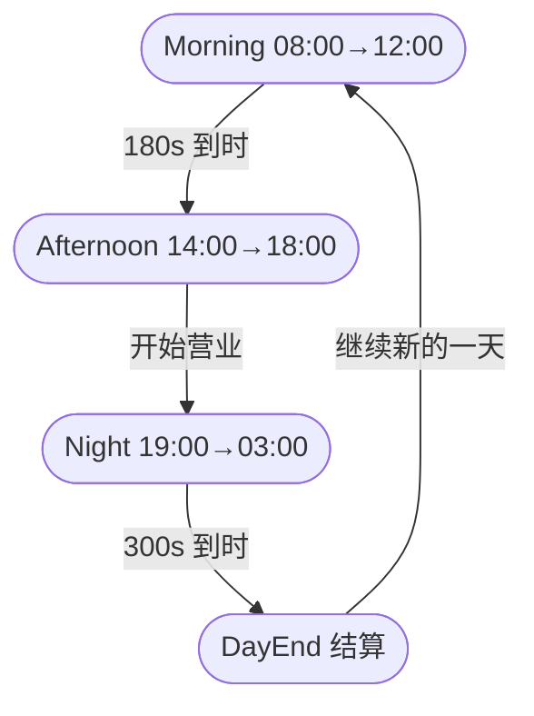
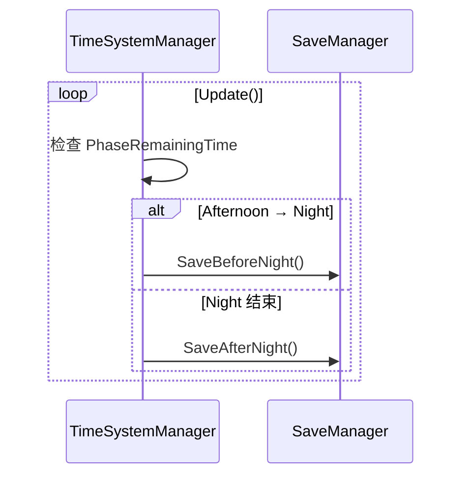
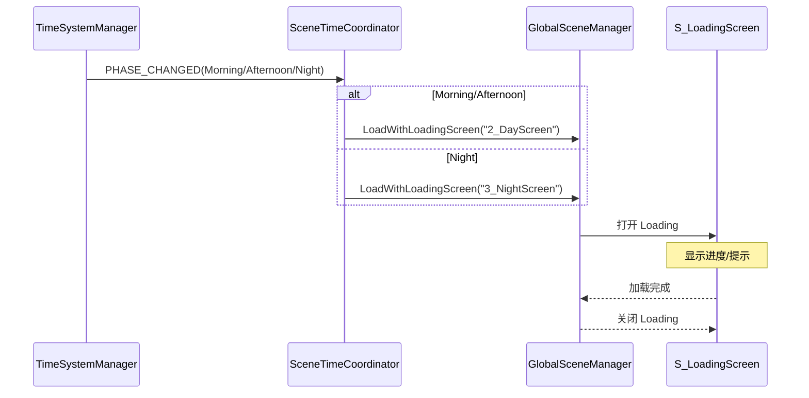
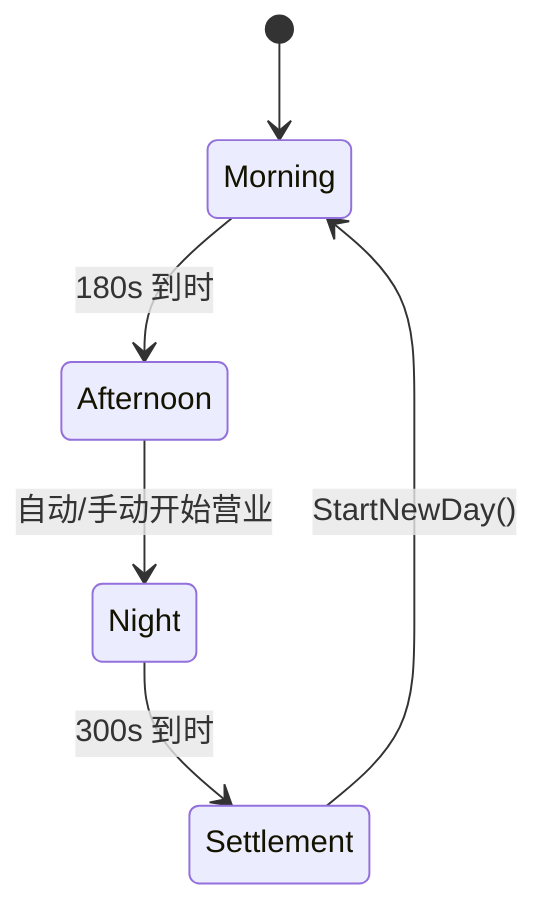
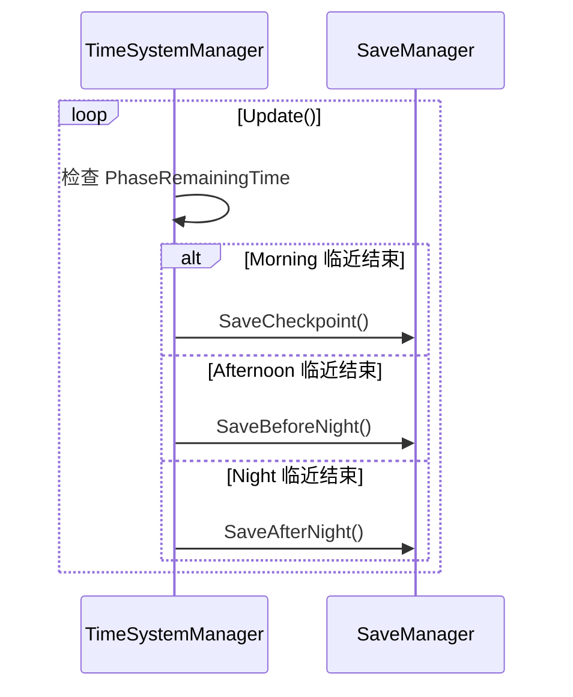
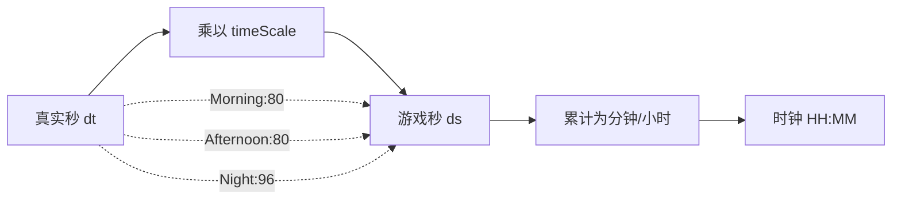

# 时间系统开发文档

**项目：Taberna Noctis（夜之小酒馆）**  
**版本：v1.0**  
**最后更新：2025-10-09**

---

## 📋 目录

1. [文档目的与范围](#1-文档目的与范围)
2. [时间线与阶段总览](#2-时间线与阶段总览)
3. [游戏时钟系统](#3-游戏时钟系统)
4. [场景切换机制](#4-场景切换机制)
5. [数据结构设计](#5-数据结构设计)
6. [核心脚本架构](#6-核心脚本架构)
7. [消息系统集成](#7-消息系统集成)
8. [实现清单](#8-实现清单)

---

## 1. 文档目的与范围

### 设计目标

- ✅ 实现完整的昼夜循环（早上 → 下午 → 夜晚 → 新一天）
- ✅ 两场景结构（DayScene + NightScene）
- ✅ 真实时间与游戏时间换算
- ✅ 自动阶段推进与场景切换
- ✅ 支持暂停/继续/存档恢复

### 核心循环流程图

```
┌─────────────────────────────────────────────────────────────┐
│                    游戏一天完整循环                          │
└─────────────────────────────────────────────────────────────┘

    DayScene (白天场景)
    ┌──────────────────────────────────────────────────┐
    │  早上阶段 (Morning)                              │
    │  • 真实时间：3分钟 (180秒)                       │
    │  • 游戏时间：08:00 → 12:00                      │
    │  • 玩家操作：进货备货                            │
    │  • UI面板：StockingPanel                        │
    └──────────────────────────────────────────────────┘
                        ↓ 倒计时归零（自动切换）
    ┌──────────────────────────────────────────────────┐
    │  下午阶段 (Afternoon)                            │
    │  • 真实时间：3分钟 (180秒)                       │
    │  • 游戏时间：14:00 → 18:00                      │
    │  • 玩家操作：研发配方 + 上架菜单                 │
    │  • UI面板：RecipePanel + MenuPanel              │
    └──────────────────────────────────────────────────┘
                        ↓ 完成后显示"开始营业"按钮
                        ↓ 玩家点击确认
                        ↓
                   LoadingScreen
              "第X天 夜晚 即将营业..."
                        ↓
    NightScene (夜晚场景)
    ┌──────────────────────────────────────────────────┐
    │  夜晚阶段 (Night)                                │
    │  • 真实时间：5分钟 (300秒)                       │
    │  • 游戏时间：19:00 → 次日03:00                  │
    │  • 玩家操作：服务顾客，提交饮品卡牌              │
    │  • 顾客生成：每25-35秒随机生成                  │
    └──────────────────────────────────────────────────┘
                        ↓ 倒计时归零
                        ↓
    ┌──────────────────────────────────────────────────┐
    │  结算界面 (DayEndScreen)                         │
    │  • 显示：今日收入、服务人数、平均评分           │
    │  • 判定：是否达到星级标准                        │
    │  • 奖励：星级奖励、特殊配方                      │
    └──────────────────────────────────────────────────┘
                        ↓ 点击"继续新的一天"
                        ↓ Day + 1
                        ↓
                   LoadingScreen
                "第X天 早上 准备中..."
                        ↓
              回到 DayScene (早上阶段)
                  循环继续...
```

---

## 2. 时间线与阶段总览

### 时间换算表

| 阶段                 | 真实时长           | 游戏时间范围  | 游戏时长             | 时间流速比                              | 场景       |
| -------------------- | ------------------ | ------------- | -------------------- | --------------------------------------- | ---------- |
| **早上 (Morning)**   | 3 分钟<br>(180 秒) | 08:00 → 12:00 | 4 小时<br>(240 分钟) | 1 真实秒 = 80 游戏秒<br>(1.33 游戏分钟) | DayScene   |
| **下午 (Afternoon)** | 3 分钟<br>(180 秒) | 14:00 → 18:00 | 4 小时<br>(240 分钟) | 1 真实秒 = 80 游戏秒<br>(1.33 游戏分钟) | DayScene   |
| **夜晚 (Night)**     | 5 分钟<br>(300 秒) | 19:00 → 03:00 | 8 小时<br>(480 分钟) | 1 真实秒 = 96 游戏秒<br>(1.6 游戏分钟)  | NightScene |

**总计一天循环**：真实 11 分钟 = 游戏内 16 小时

**跳过时段**：

- 12:00-14:00（午休 2 小时）
- 18:00-19:00（晚餐准备 1 小时）

### 阶段状态机图



### 时间线枚举定义

```csharp
// 主时段枚举
public enum TimePhase
{
    Morning,      // 早上 08:00-12:00
    Afternoon,    // 下午 14:00-18:00
    Night         // 夜晚 19:00-03:00
}

// DayScene内部子阶段
public enum DaySubPhase
{
    MorningStocking,        // 早上-进货备货
    AfternoonRecipe,        // 下午-研发配方
    AfternoonMenu           // 下午-选择上架菜单
}
```

---

## 3. 游戏时钟系统

### 时钟更新逻辑

```
┌─────────────────────────────────────────────────┐
│           GameClock 更新流程                     │
└─────────────────────────────────────────────────┘

每帧 Update():
    ┌────────────────────────────────┐
    │ 累积游戏时间                    │
    │ accumulatedSeconds +=           │
    │   Time.deltaTime * timeScale   │
    └────────────────────────────────┘
             ↓
    ┌────────────────────────────────┐
    │ 转换为游戏分钟                  │
    │ totalMinutes =                  │
    │   accumulatedSeconds / 60       │
    └────────────────────────────────┘
             ↓
    ┌────────────────────────────────┐
    │ 计算时、分                      │
    │ hour = startHour + (min / 60)  │
    │ minute = totalMinutes % 60     │
    └────────────────────────────────┘
             ↓
    ┌────────────────────────────────┐
    │ 处理跨天（夜晚19:00→03:00）     │
    │ if (hour >= 24) hour -= 24     │
    └────────────────────────────────┘
```

---

## 6. 核心脚本架构

```csharp
public sealed class TimeSystemManager : UnityEngine.MonoBehaviour
{
    public static TimeSystemManager Instance { get; private set; }

    public TimeSettings settings;                 // Scriptable 配置或 Inspector
    public TimePhase CurrentPhase { get; private set; }
    public float PhaseRemainingTime { get; private set; } // 真实秒
    public int ClockHour { get; private set; }
    public int ClockMinute { get; private set; }

    // 事件
    public System.Action<TimePhase> OnPhaseChanged;   // 广播 PHASE_CHANGED
    public System.Action<int> OnDayCompleted;         // 广播 DAY_COMPLETED(day)

    public void StartMorning() { SwitchToPhase(TimePhase.Morning); }
    public void StartNightPhase() { SwitchToPhase(TimePhase.Night); }
    public void StartNewDay() { SwitchToPhase(TimePhase.Morning); }

    private void SwitchToPhase(TimePhase phase)
    {
        CurrentPhase = phase;
        PhaseRemainingTime = GetConfig(phase).realSeconds;
        SetClockToPhaseStart(phase);
        OnPhaseChanged?.Invoke(phase);
    }

    private PhaseConfig GetConfig(TimePhase p)
    {
        return p == TimePhase.Morning ? settings.morning : (p == TimePhase.Afternoon ? settings.afternoon : settings.night);
    }

    private void SetClockToPhaseStart(TimePhase phase)
    {
        var cfg = GetConfig(phase);
        ClockHour = cfg.startHour;
        ClockMinute = 0;
    }
}
```

---

## 7. 消息系统集成

| 消息名              | 发送方              | 触发时机      | 负载                 |
| ------------------- | ------------------- | ------------- | -------------------- |
| `PHASE_CHANGED`     | `TimeSystemManager` | 切换阶段      | `TimePhase newPhase` |
| `DAY_COMPLETED`     | `TimeSystemManager` | 夜晚结束      | `int day`            |
| `SAVE_BEFORE_NIGHT` | `TimeSystemManager` | 下午 → 夜晚前 | -                    |
| `SAVE_AFTER_NIGHT`  | `TimeSystemManager` | 夜晚结束时    | -                    |



---

## 8. 实现清单

- PhaseConfig/TimeSettings 脚本化配置
- TimeSystemManager 基础切换与计时
- 与 SceneTimeCoordinator/SaveManager 的消息联动
- 单元测试：时间跳转/跨天/保存点

### 加载触发总览（时序）



---

## 5. 数据结构设计

```csharp
// 阶段配置（真实时长与时间倍率）
[System.Serializable]
public class PhaseConfig
{
    public TimePhase phase;               // Morning / Afternoon / Night
    public int realSeconds;               // 180 / 180 / 300
    public int startHour;                 // 8 / 14 / 19
    public int endHour;                   // 12 / 18 / 3 (次日)
    public float gameSecondsPerRealSec;   // 80 / 80 / 96
}

// 全局时间设置
[System.Serializable]
public class TimeSettings
{
    public PhaseConfig morning = new PhaseConfig{ phase = TimePhase.Morning, realSeconds = 180, startHour = 8, endHour = 12, gameSecondsPerRealSec = 80f };
    public PhaseConfig afternoon = new PhaseConfig{ phase = TimePhase.Afternoon, realSeconds = 180, startHour = 14, endHour = 18, gameSecondsPerRealSec = 80f };
    public PhaseConfig night = new PhaseConfig{ phase = TimePhase.Night, realSeconds = 300, startHour = 19, endHour = 3, gameSecondsPerRealSec = 96f };
}

// 运行时钟快照（用于存档/恢复）
[System.Serializable]
public struct ClockSnapshot
{
    public TimePhase currentPhase;        // 当前阶段
    public int hour;                      // 游戏时:分
    public int minute;
    public float phaseRemainingTime;      // 本阶段剩余真实秒
}
```

#### 1）阶段推进（简版）



#### 2）自动保存触发时序



#### 3）时间倍率与时钟换算


