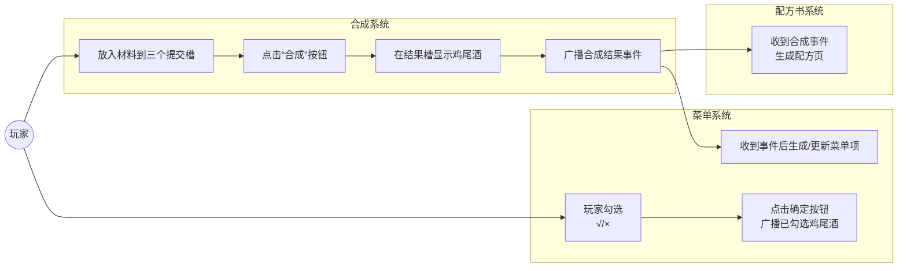
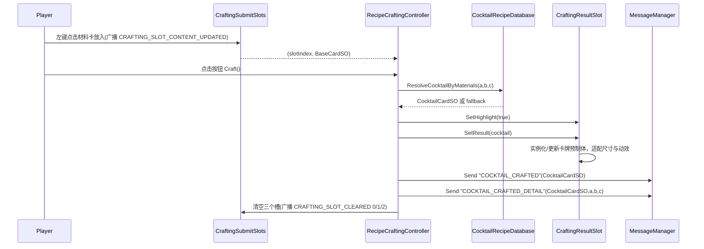
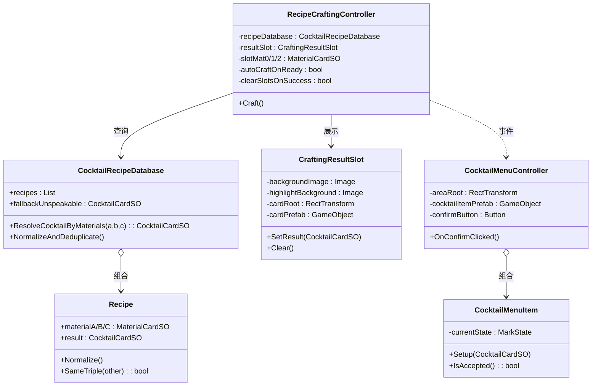
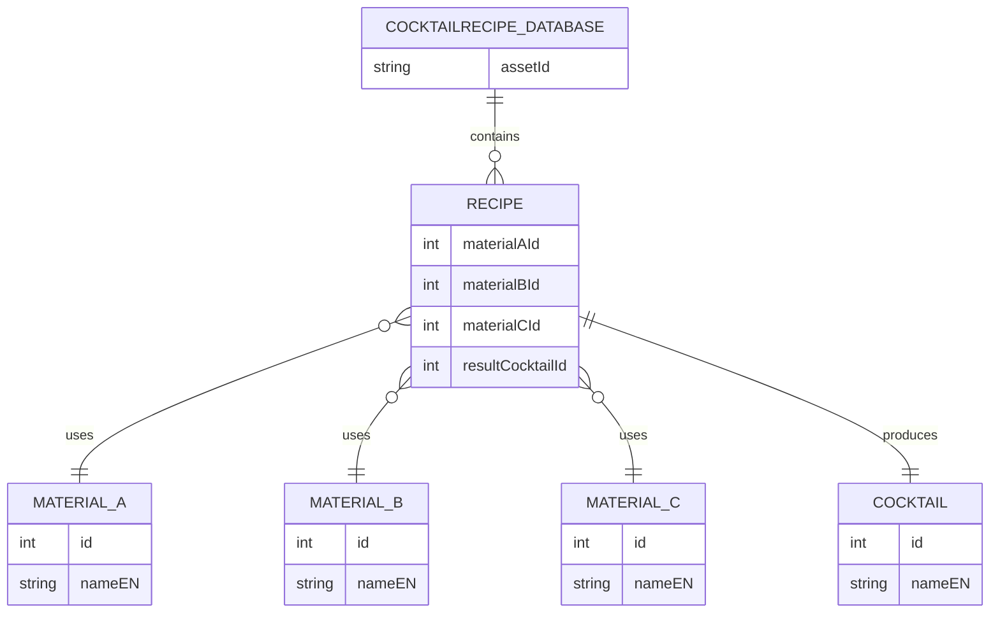

## 合成系统（Crafting System）设计文档

### 概览

- 目标：基于三个材料卡（MaterialCardSO）通过配方库（CocktailRecipeDatabase）匹配产出鸡尾酒卡（CocktailCardSO），并在结果槽（CraftingResultSlot）中展示；同时向其他系统广播消息（菜单/配方书等）。
- 组成：提交槽广播 → 合成控制器 → 配方数据库 → 结果槽展示 → 消息广播（COCKTAIL_CRAFTED/COCKTAIL_CRAFTED_DETAIL）。

### 功能综述

合成系统负责将三个材料卡通过配方数据库匹配生成鸡尾酒卡，并在结果槽安全、可控地展示结果；系统监听提交槽变化并由按钮触发 Craft()，支持保底配方、英文名与英文类别展示、尺寸自适配与飞向菜单动效，同时通过 COCKTAIL_CRAFTED/COCKTAIL_CRAFTED_DETAIL 事件向菜单与配方书等下游模块广播数据，实现端到端的研发—展示—入册联动。

### 用例图



### 时序图（一次合成）



### 类图（核心）



### ER 图（数据关系）



### 关键代码（代码引用）

- RecipeCraftingController.Craft：按钮触发合成、结果展示与消息广播

```77:127:Scripts/0_General/0_2_Card Drag&Drop/RecipeCraftingController.cs
    // 可绑定到UI按钮
    public void Craft()
    {
        if (recipeDatabase == null)
        {
            Debug.LogWarning("[RecipeCraftingController] 未指定配方数据库");
            return;
        }
        if (!AllFilled())
        {
            Debug.LogWarning("[RecipeCraftingController] 材料不足3个，无法合成");
            return;
        }

        var cocktail = recipeDatabase.ResolveCocktailByMaterials(slotMat0, slotMat1, slotMat2);
        if (cocktail == null)
        {
            Debug.LogWarning("[RecipeCraftingController] 未匹配到任何鸡尾酒，且未设置保底");
            return;
        }

        if (resultSlot != null)
        {
            resultSlot.SetHighlight(true);
            resultSlot.SetResult(cocktail);
        }
        Debug.Log($"[RecipeCraftingController] 合成结果: {cocktail.nameEN} (ID:{cocktail.id})");

        // 广播：合成成功（仅鸡尾酒）
        MessageManager.Send<CocktailCardSO>("COCKTAIL_CRAFTED", cocktail);
        // 广播：合成成功（含配方材料明细）
        MessageManager.Send<(CocktailCardSO cocktail, MaterialCardSO a, MaterialCardSO b, MaterialCardSO c)>(
            "COCKTAIL_CRAFTED_DETAIL",
            (cocktail, slotMat0, slotMat1, slotMat2)
        );
        // 控制台一句话
        var tags = (cocktail.tags != null && cocktail.tags.Length > 0) ? string.Join("/", cocktail.tags) : "-";
        Debug.Log($"[Crafted] {cocktail.nameEN} | Category={cocktail.category} | Tags={tags} | Price=${cocktail.price} | Cost=${cocktail.cost} | Profit=${cocktail.profit}");

        // 合成成功后按需清空三个槽
        if (clearSlotsOnSuccess)
        {
            MessageManager.Send<int>(MessageDefine.CRAFTING_SLOT_CLEARED, 0);
            MessageManager.Send<int>(MessageDefine.CRAFTING_SLOT_CLEARED, 1);
            MessageManager.Send<int>(MessageDefine.CRAFTING_SLOT_CLEARED, 2);
            // 同步本地记录
            slotMat0 = null;
            slotMat1 = null;
            slotMat2 = null;
        }
    }
```

- CocktailRecipeDatabase.ResolveCocktailByMaterials：三材料匹配、兜底返回

```93:115:Scripts/0_General/0_11_Cardsystem/CocktailRecipeDatabase.cs
    /// <summary>
    /// 依据3个材料SO查找鸡尾酒，找不到则返回fallback（可空）。
    /// </summary>
    public CocktailCardSO ResolveCocktailByMaterials(MaterialCardSO a, MaterialCardSO b, MaterialCardSO c)
    {
        int idA = a != null ? a.id : int.MaxValue;
        int idB = b != null ? b.id : int.MaxValue;
        int idC = c != null ? c.id : int.MaxValue;
        if (idA > idB) { (a, b) = (b, a); (idA, idB) = (idB, idA); }
        if (idB > idC) { (b, c) = (c, b); (idB, idC) = (idC, idB); }
        if (idA > idB) { (a, b) = (b, a); }

        for (int i = 0; i < recipes.Count; i++)
        {
            var r = recipes[i];
            if (r == null || r.result == null) continue;
            int ra = r.materialA != null ? r.materialA.id : -1;
            int rb = r.materialB != null ? r.materialB.id : -1;
            int rc = r.materialC != null ? r.materialC.id : -1;
            if (ra == idA && rb == idB && rc == idC)
            {
                return r.result;
            }
        }
        return fallbackUnspeakable;
    }
```

- CraftingResultSlot.SetResult：实例化/更新预制体、外部文本与动效

```93:118:Scripts/0_General/0_2_Card Drag&Drop/CraftingResultSlot.cs
    public void SetResult(CocktailCardSO cocktail)
    {
        currentCocktail = cocktail;
        if (cocktail == null)
        {
            HideCard();
            return;
        }

        EnsureCardInstance();
        ResetCardTransform();
        UpdateCardVisual(cocktail);
        ShowCard();
        FitCardWithinBackground();
        TryApplyBarMaterialOverride();

        // 外部名称文本（可选）
        if (resultNameText != null)
        {
            // 始终显示英文名
            resultNameText.text = cocktail.nameEN;
        }

        // 动效
        PlayFlyToMenuAnim();
    }
```

- CocktailMenuController.OnConfirmClicked：收集 √ 项并广播菜单确认

```149:167:Scripts/0_General/0_11_Cardsystem/CocktailMenuController.cs
    private void OnConfirmClicked()
    {
        if (areaRoot == null) return;
        var items = areaRoot.GetComponentsInChildren<CocktailMenuItem>(true);
        var list = new System.Collections.Generic.List<CocktailCardSO>();
        for (int i = 0; i < items.Length; i++)
        {
            var it = items[i];
            if (it != null && it.IsAccepted() && it.GetData() != null)
            {
                list.Add(it.GetData());
            }
        }
        if (list.Count > 0)
        {
            MessageManager.Send(System.String.Intern("COCKTAIL_MENU_CONFIRMED"), list);
            Debug.Log($"[CocktailMenu] 确认选择，共{list.Count} 项：" + string.Join(", ", list.ConvertAll(x => x.nameEN)));
        }
    }
```

- MessageDefine（相关消息键）

```45:52:Scripts/0_General/0_0_MessageSystem/MessageDefine.cs
    // ====== 卡牌交互/合成 ======
    public static readonly string CARD_CLICKED = "CARD_CLICKED";             // 携带 BaseCardSO
    public static readonly string CRAFTING_SLOT_FILLED = "CRAFTING_SLOT_FILLED"; // 携带 (int slotIndex, int materialId)
    public static readonly string CRAFTING_SLOT_CLEARED = "CRAFTING_SLOT_CLEARED"; // 携带 int slotIndex
    public static readonly string CRAFTING_READY = "CRAFTING_READY";         // 携带 List<int> 3个材料ID
    public static readonly string CRAFTING_RESULT = "CRAFTING_RESULT";       // 携带 CocktailCardSO
    public static readonly string CRAFTING_SLOT_CONTENT_UPDATED = "CRAFTING_SLOT_CONTENT_UPDATED"; // 携带 (int slotIndex, BaseCardSO card)
```

```56:58:Scripts/0_General/0_0_MessageSystem/MessageDefine.cs
    // ====== 菜单选择确认 ======
    public static readonly string COCKTAIL_MENU_CONFIRMED = "COCKTAIL_MENU_CONFIRMED"; // 携带 List<CocktailCardSO>
```

### 事件与载荷

- "COCKTAIL_CRAFTED": 载荷 CocktailCardSO
- "COCKTAIL_CRAFTED_DETAIL": 载荷 (CocktailCardSO cocktail, MaterialCardSO a, MaterialCardSO b, MaterialCardSO c)
- MessageDefine.CRAFTING_SLOT_CONTENT_UPDATED: 载荷 (int slotIndex, BaseCardSO card)
- MessageDefine.CRAFTING_SLOT_CLEARED: 载荷 int slotIndex
- MessageDefine.COCKTAIL_MENU_CONFIRMED: 载荷 List<CocktailCardSO>

### 场景接线（摘要）

- 在合成面板挂 `RecipeCraftingController`：绑定 `recipeDatabase`、`resultSlot`，勾选 `clearSlotsOnSuccess`。
- 创建按钮 `CraftButton` → OnClick 绑定 `RecipeCraftingController.Craft()`。
- 结果槽 `CraftingResultSlot`：配置背景、高亮、`cardRoot`、卡牌预制体或 Resources 路径。
- 菜单 `CocktailMenuController`：配置 `areaRoot`、`cocktailItemPrefab`、`confirmButton`。

### 常见问题（FAQ）

- 结果卡超出背景：在 `CraftingResultSlot` 启用“自动适配到背景尺寸内”。
- 背景色无效：优先使用卡牌预制体上的 `CardDisplay` 设置；若无则回退为手动应用主题色逻辑。
- 重复配方页：`FormulaBookController` 使用去重集合，确保唯一编号与奇偶页布局。
