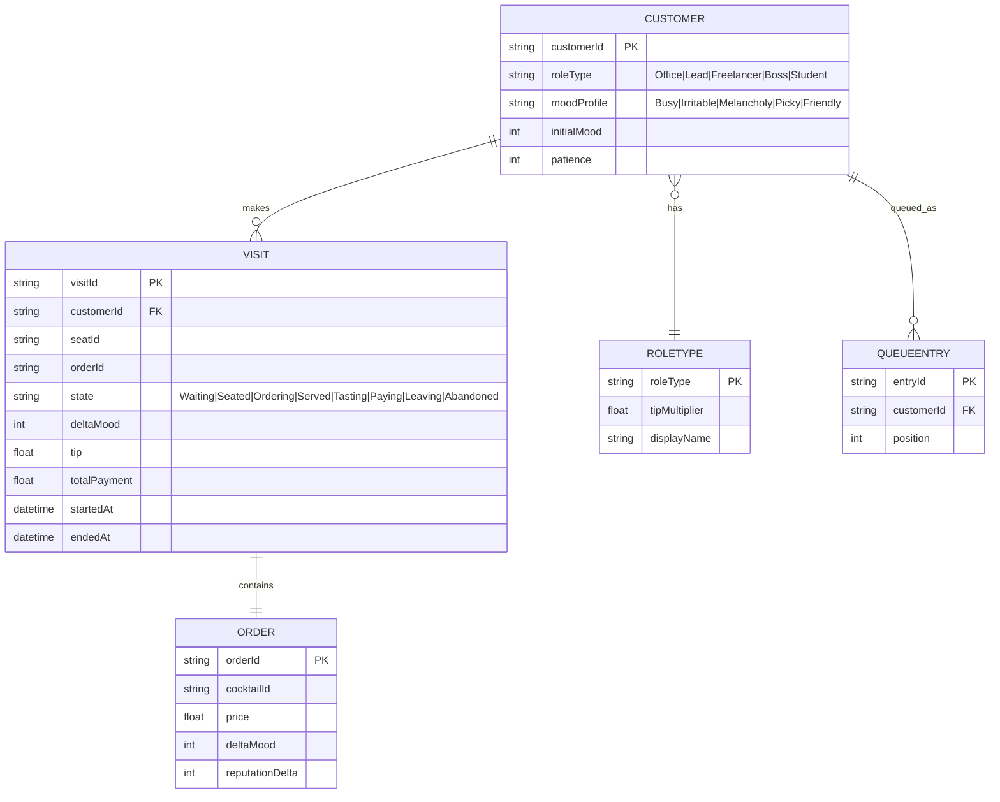
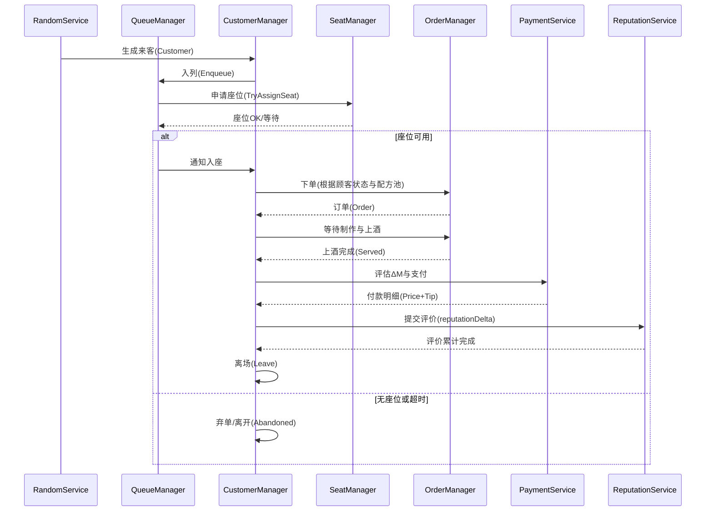
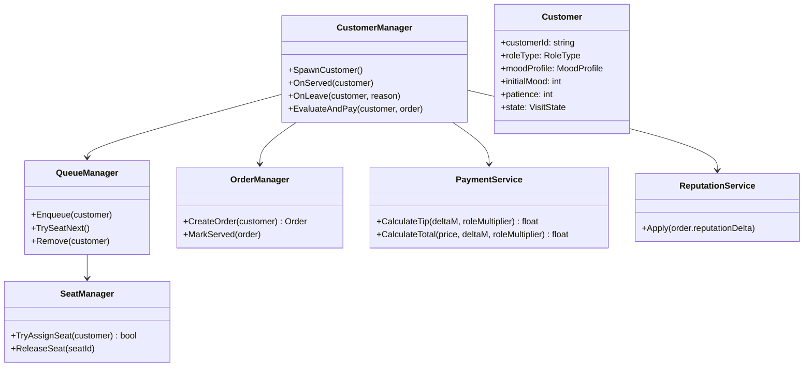
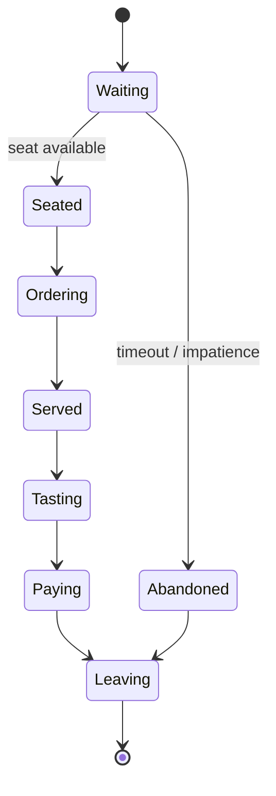
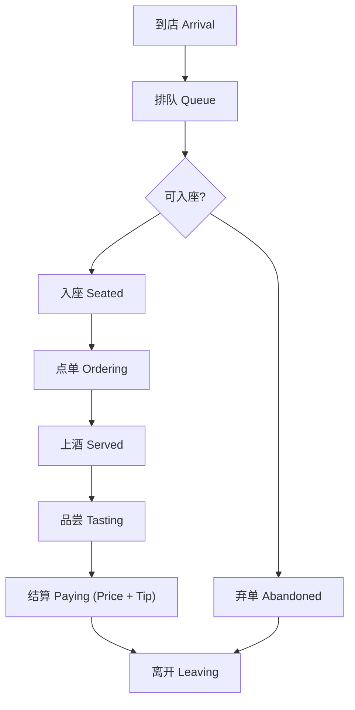

# 顾客系统开发文档（Customer System）

## 功能综述

顾客系统负责驱动“来客 → 排队 → 入座 → 点单/制作 → 上酒 → 品尝 → 结算 → 离开”完整生命周期，协同排队系统、卡牌/配方系统、结算与评价系统，并与随机系统与存档系统解耦对接。系统支持顾客五状态（Busy、Irritable、Melancholy、Picky、Friendly）、多身份倍率（Office Worker/Team Lead/Freelancer/Boss/College Student）、弃单/离场容错、与酒馆评价（Reputation）的双通路反馈。

---

## ER 图（数据实体关系）



---

## 时序图（核心交互：一次完整接待）



---

## 类图（核心类与职责）



---

## 状态图（Customer/Visit）



---

## 活动图（到店 → 结算）



---

## 代码片段与功能解析（C#）

> 说明：以下示例与现有数值文档一致，使用 Payment = DrinkPrice + max(0, ΔM × 1.2 × RoleMultiplier)。

```csharp
public sealed class PaymentService
{
    private readonly float tipBaseMultiplier = 1.2f; // 与文档一致

    public float CalculateTip(int deltaM, float roleMultiplier)
    {
        // 小费 = max(0, ΔM × 1.2 × 身份倍率)
        float tip = deltaM * tipBaseMultiplier * roleMultiplier;
        return tip > 0 ? tip : 0f;
    }

    public float CalculateTotal(float drinkPrice, int deltaM, float roleMultiplier)
    {
        return drinkPrice + CalculateTip(deltaM, roleMultiplier);
    }
}
```

- 功能要点：与卡牌/配方文档公式一致；小费不为负；身份倍率影响仅作用于小费。

```csharp
public sealed class CustomerManager : MonoBehaviour
{
    [SerializeField] private QueueManager queueManager;
    [SerializeField] private SeatManager seatManager;
    [SerializeField] private OrderManager orderManager;
    [SerializeField] private PaymentService paymentService;
    [SerializeField] private ReputationService reputationService;

    public Customer SpawnCustomer(CustomerArchetype archetype)
    {
        var c = CustomerFactory.Create(archetype);
        queueManager.Enqueue(c);
        seatManager.TryAssignSeat(c); // 成功则进入 Seated
        return c;
    }

    public void OnServed(Customer c)
    {
        var order = orderManager.GetActiveOrder(c);
        // 计算ΔM：由卡牌系统产出
        int deltaM = order.deltaMood;
        float roleMul = RoleConfig.GetMultiplier(c.roleType);
        float total = paymentService.CalculateTotal(order.price, deltaM, roleMul);
        Economy.AddMoney(total);
        reputationService.Apply(order.reputationDelta);
        c.state = VisitState.Paying;
    }
}
```

- 功能要点：
  - ΔM 来源于材料/配方系统；`order.reputationDelta` 累计到酒馆评价。
  - 解耦：`CustomerManager` 仅编排调用，不持有数值细节。

```csharp
public sealed class QueueManager
{
    private readonly Queue<Customer> line = new();

    public void Enqueue(Customer c)
    {
        line.Enqueue(c);
    }

    public bool TrySeatNext()
    {
        if (line.Count == 0) return false;
        var peek = line.Peek();
        if (SeatManager.Instance.TryAssignSeat(peek))
        {
            line.Dequeue();
            return true;
        }
        return false;
    }
}
```

- 功能要点：排队与入座分离；入座失败不出列；座位空出时再尝试。

---

## 与其他系统的对接

- 随机系统：通过 `RandomService` 生成来客流（每日稳定或真随机），不污染全局随机状态。
- 存档系统：在阶段切换与日终结算处序列化 `Visit` 汇总数据，便于恢复到稳定节点。
- 卡牌/配方系统：提供 `deltaMood`（ΔM）、`price` 与 `reputationDelta`。
- 评价系统：`ReputationService.Apply(reputationDelta)` 双通路影响长期发展。

---

## 配置与可调参数（建议）

- 身份倍率：Office 1.0、Lead 1.2、Freelancer 1.1、Boss 1.5、Student 0.9
- 心情五状态：Busy / Irritable / Melancholy / Picky / Friendly（用于配方选择与事件权重）
- 等待阈值/容忍度：影响弃单概率与满意度上限
- 并发座位数/服务站：影响系统吞吐

---

## 测试要点

- ΔM > 0 与 ΔM ≤ 0 的边界结算验证
- 弃单/入座竞争条件（同时空位与多人排队）
- 真随机/每日稳定模式下的来客一致性
- 存档恢复后顾客生命周期状态一致

---

**文档版本**：v1.0  
**最后更新**：2025-10-30
