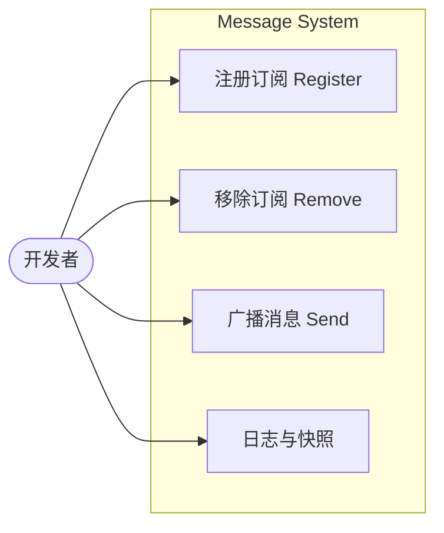
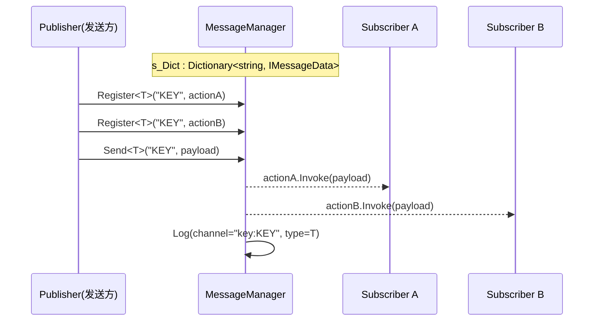
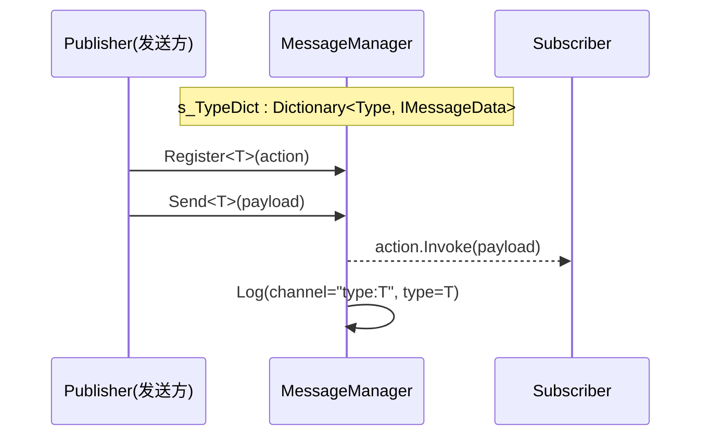
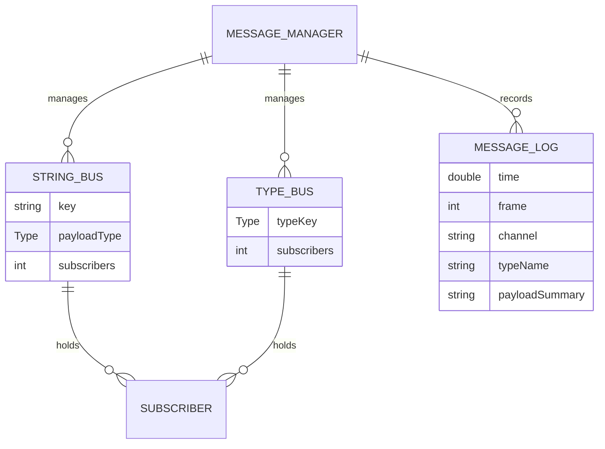
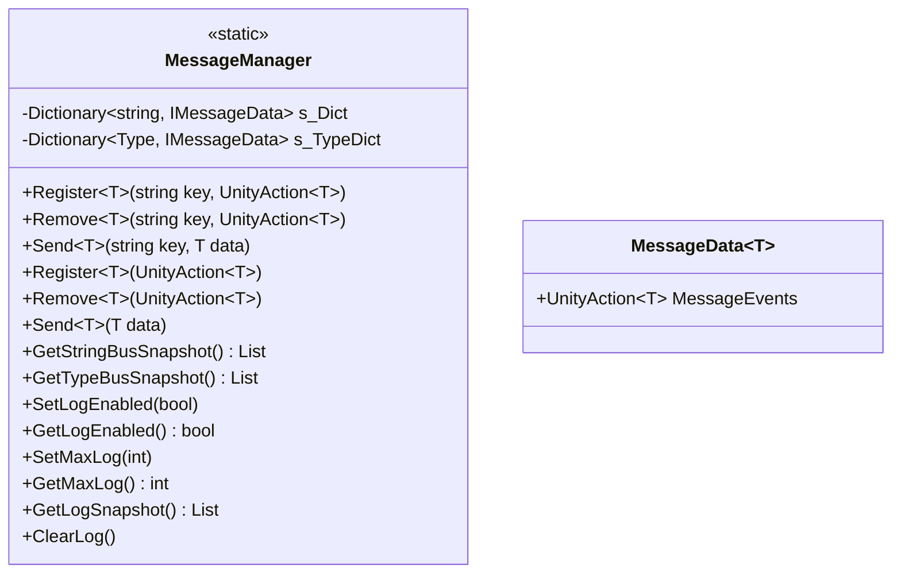

## 消息系统（Message System）开发文档

### 功能综述

消息系统提供基于字符串通道与类型通道的轻量级发布/订阅能力，采用 `MessageManager` 静态类集中管理注册、移除与广播，内部以线程安全的字典维护订阅关系，并内置环形日志记录每次消息发送（时间、帧号、通道、载荷类型与 ToString 摘要），为跨系统解耦（时间、存档、合成、菜单、配方书、UI 等）提供统一、可观测的事件总线。

### 用例图



### 时序图（字符串通道广播）



### 时序图（类型通道广播）



### ER 图（数据与通道关系）



### 类图（核心结构）



### 代码功能分析

- 注册/移除（字符串通道）：

```24:48:Scripts/0_General/0_0_MessageSystem/MessageManager.cs
    public static void Register<T>(string key, UnityAction<T> action)
    {
        if (string.IsNullOrEmpty(key) || action == null) return;
        lock (s_Lock)
        {
            if (s_Dict.TryGetValue(key, out var prev))
            {
                if (prev is MessageData<T> md)
                {
                    md.MessageEvents += action;
                }
                else
                {
                    // 类型不匹配则覆盖为新的泛型通道
                    s_Dict[key] = new MessageData<T>(action);
                }
            }
            else
            {
                s_Dict.Add(key, new MessageData<T>(action));
            }
        }
    }
```

- 广播（字符串通道）与日志：

```67:77:Scripts/0_General/0_0_MessageSystem/MessageManager.cs
    public static void Send<T>(string key, T data)
    {
        if (string.IsNullOrEmpty(key)) return;
        IMessageData prev;
        lock (s_Lock)
        {
            s_Dict.TryGetValue(key, out prev);
        }
        (prev as MessageData<T>)?.MessageEvents?.Invoke(data);
        Log("key:" + key, typeof(T), data);
    }
```

- 注册/移除/广播（类型通道）：

```144:196:Scripts/0_General/0_0_MessageSystem/MessageManager.cs
    public static void Register<T>(UnityAction<T> action) { /* 以 typeof(T) 为键加入 s_TypeDict */ }
    public static void Remove<T>(UnityAction<T> action) { /* 从 s_TypeDict 解除绑定 */ }
    public static void Send<T>(T data) { /* 根据 typeof(T) 找到委托并 Invoke；并写入日志 */ }
```

- 日志与快照（运维/调试）：

```198:246:Scripts/0_General/0_0_MessageSystem/MessageManager.cs
    public static void SetLogEnabled(bool on)
    public static bool GetLogEnabled()
    public static void SetMaxLog(int max)
    public static int GetMaxLog()
    public static List<MessageLogEntry> GetLogSnapshot()
    public static void ClearLog()
    // 内部: TrimLogIfNeeded 保持上限；Log 记录 frame/time/channel/type/payload
```

### 关键消息清单（示例）

- 合成相关：`COCKTAIL_CRAFTED`，`COCKTAIL_CRAFTED_DETAIL`，`CRAFTING_SLOT_CONTENT_UPDATED`，`CRAFTING_SLOT_CLEARED`
- 存档相关：`SAVE_REQUESTED`，`SAVE_COMPLETED`，`SAVE_LOADED`
- 时间相关：`PHASE_CHANGED`，`DAY_COMPLETED`
- UI/交互：`CARD_DRAG_STARTED`，`CARD_DRAG_ENDED`，`CARD_CLICKED`

### 设计要点与边界

- 线程安全：通过 `s_Lock` 与 `s_LogLock` 保护注册表与日志；仍建议主线程使用。
- 类型安全：通道以 `T` 泛型绑定载荷类型，避免装箱与转换错误。
- 容错策略：字符串通道类型不匹配时覆盖为新 `MessageData<T>`，保证后续一致性。
- 可观测性：提供日志开关、上限与快照导出，便于编辑器窗口/调试工具使用。
- 清理策略：支持 `Clear()` 与 `ClearKey()`，防止场景切换后残留订阅。

### 集成建议

- 尽量优先使用“类型通道”以获得编译期类型安全；需跨语言/弱类型场景再使用“字符串通道”。
- 对频繁广播的消息适当关闭日志或调低上限，避免 Editor 频繁分配。
- 在 OnEnable/OnDisable 成对注册/移除，避免悬空委托与重复订阅。
