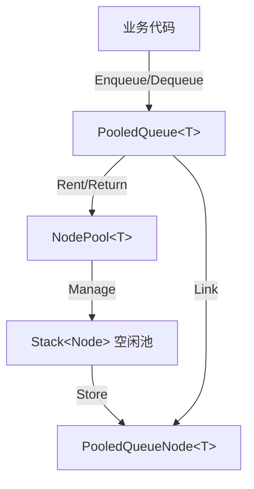

## 对象池队列系统开发文档（零 GC + 动态容量）

### 功能综述

对象池队列以可复用节点实现 O(1) 入队/出队与近零 GC 的高性能队列，支持预热与池统计，提供 Enqueue/TryDequeue/TryPeek/Clear/Count 等常用接口，能在事件、网络、命令等场景直接替换标准 Queue<T>，并通过运行时日志与 Profiler 校验便捷定位性能与泄漏问题。

### 目标与特性

- **零 GC**：基于对象池复用节点，避免频繁内存分配和回收
- **高性能**：O(1) 入队/出队操作，基于链表实现
- **动态容量**：无需预分配大数组,容量自动扩展
- **易用 API**：简洁的 Enqueue/TryDequeue/Clear 接口
- **统计监控**：内置节点池统计，便于性能分析
- **类型安全**：泛型设计，支持值类型和引用类型

### 架构图（逻辑）



### 核心组件

#### 1. PooledQueueNode<T>（链表节点）

**职责**：

- 存储队列元素值
- 维护链表的 Next 指针
- 提供 Reset 方法清理状态

**设计要点**：

- `sealed class` 避免虚方法调用开销
- `Reset()` 在归还池前调用，清除引用，防止内存泄漏

```csharp
internal sealed class PooledQueueNode<T>
{
    public T Value;
    public PooledQueueNode<T> Next;

    public void Reset()
    {
        Value = default;
        Next = null;
    }
}
```

#### 2. NodePool<T>（节点对象池）

**职责**：

- 管理节点的创建、租用、归还
- 预热机制减少运行时分配
- 统计信息（创建/租用/归还/峰值）

**核心 API**：

```csharp
PooledQueueNode<T> Rent()         // 从池获取节点
void Return(PooledQueueNode<T>)   // 归还节点
void Prewarm(int count)           // 预热：预创建节点
PoolStats GetStats()              // 获取统计信息
```

**关键实现**：

```23:48:Scripts/0_General/0_5_QueueSystem/NodePool.cs
// ... fields ...

/// <summary>
/// 构造节点池
/// </summary>
/// <param name="initialCapacity">初始容量（预热节点数）</param>
public NodePool(int initialCapacity = 16)
{
    _initialCapacity = initialCapacity;
    _pool = new Stack<PooledQueueNode<T>>(initialCapacity);
    Prewarm(initialCapacity);
}

/// <summary>
/// 从池中租用一个节点
/// - 如果池空，则创建新节点（动态扩展）
/// </summary>
public PooledQueueNode<T> Rent()
{
    _totalRented++;

    if (_pool.Count > 0)
    {
        return _pool.Pop();
    }

    // 池空，创建新节点（会产生一次 GC，但后续会被复用）
    _totalCreated++;
    return new PooledQueueNode<T>();
}
```

#### 3. PooledQueue<T>（队列主类）

**职责**：

- 维护链表的 head/tail 指针
- 提供队列操作 API
- 管理节点的生命周期

**核心 API**：

```csharp
void Enqueue(T item)              // O(1) 入队
bool TryDequeue(out T result)     // O(1) 出队
bool TryPeek(out T result)        // 查看队首
void Clear()                      // 清空队列
int Count { get; }                // 元素数量
bool IsEmpty { get; }             // 是否为空
```

**入队实现**（O(1)，零 GC）：

```43:65:Scripts/0_General/0_5_QueueSystem/PooledQueue.cs
/// <summary>
/// 入队：将元素添加到队尾
/// - 时间复杂度：O(1)
/// - 空间复杂度：O(1)（节点复用，几乎无 GC）
/// </summary>
public void Enqueue(T item)
{
    // 从池中租用节点
    var newNode = _nodePool.Rent();
    newNode.Value = item;
    newNode.Next = null;

    if (_tail != null)
    {
        // 队列非空，链接到尾部
        _tail.Next = newNode;
        _tail = newNode;
    }
    else
    {
        // 队列为空，新节点既是头也是尾
        _head = newNode;
        _tail = newNode;
    }

    _count++;
}
```

**出队实现**（O(1)，自动归还节点）：

```67:94:Scripts/0_General/0_5_QueueSystem/PooledQueue.cs
/// <summary>
/// 出队：尝试移除并返回队首元素
/// - 时间复杂度：O(1)
/// - 节点自动归还到池中
/// </summary>
/// <param name="result">出队的元素（如果成功）</param>
/// <returns>是否成功出队</returns>
public bool TryDequeue(out T result)
{
    if (_head == null)
    {
        // 队列为空
        result = default;
        return false;
    }

    // 取出队首元素
    result = _head.Value;
    var oldHead = _head;

    // 移动头指针
    _head = _head.Next;
    if (_head == null)
    {
        // 队列已空，清空尾指针
        _tail = null;
    }

    // 归还节点到池
    _nodePool.Return(oldHead);
    _count--;
    return true;
}
```

### 使用指南

#### 基本用法

```csharp
// 1. 创建队列（可选预热）
var queue = new PooledQueue<int>(initialPoolCapacity: 100);

// 2. 入队操作
queue.Enqueue(10);
queue.Enqueue(20);
queue.Enqueue(30);

// 3. 查看队首（不移除）
if (queue.TryPeek(out int value))
{
    Debug.Log($"队首: {value}"); // 输出 10
}

// 4. 出队操作（推荐：零 GC）
while (queue.TryDequeue(out int item))
{
    ProcessItem(item);
}

// 5. 清空队列
queue.Clear();
```

#### 性能优化技巧

**预热池（避免运行时分配）**：

```csharp
// 在场景加载时预热
var queue = new PooledQueue<PlayerAction>(initialCapacity: 50);
queue.PrewarmPool(additionalCapacity: 100); // 总共150个预热节点

// 后续入队/出队操作几乎无 GC
for (int i = 0; i < 100; i++)
{
    queue.Enqueue(new PlayerAction { ... });
}
```

**避免 foreach（使用 while 循环）**：

```csharp
// ❌ 不推荐：foreach 会产生迭代器 GC
foreach (var item in queue)
{
    Process(item);
}

// ✅ 推荐：零 GC
while (queue.TryDequeue(out var item))
{
    Process(item);
}
```

**批量操作模式**：

```csharp
// 适用场景：事件队列、命令队列、消息队列
public class EventQueue
{
    private PooledQueue<GameEvent> _events = new PooledQueue<GameEvent>(200);

    public void EnqueueEvent(GameEvent evt) => _events.Enqueue(evt);

    public void ProcessAllEvents()
    {
        // 零 GC 批量处理
        while (_events.TryDequeue(out var evt))
        {
            evt.Execute();
        }
    }
}
```

### 性能分析

#### 时间复杂度

| 操作       | 时间复杂度 | 说明             |
| ---------- | ---------- | ---------------- |
| Enqueue    | O(1)       | 链表尾部插入     |
| TryDequeue | O(1)       | 链表头部移除     |
| TryPeek    | O(1)       | 读取头节点值     |
| Clear      | O(n)       | 遍历所有节点归还 |
| Count      | O(1)       | 直接返回字段     |

#### GC 对比

**标准 Queue<T>（会产生 GC）**：

```csharp
var queue = new Queue<int>();
for (int i = 0; i < 1000; i++)
{
    queue.Enqueue(i); // 内部数组扩容时触发 GC
}
// Profiler: GC.Alloc ≈ 8KB+
```

**PooledQueue<T>（零 GC）**：

```csharp
var queue = new PooledQueue<int>(1000); // 预热
for (int i = 0; i < 1000; i++)
{
    queue.Enqueue(i); // 节点复用，无扩容
}
// Profiler: GC.Alloc ≈ 0B（预热后）
```

#### 统计信息查看

```csharp
var stats = queue.GetPoolStats();
Debug.Log(stats);
// 输出示例：
// [NodePool] 当前池大小: 95, 总创建: 100, 总租用: 250, 总归还: 245, 峰值: 100, 活跃节点: 5
```

### 典型应用场景

#### 1. 游戏事件队列

```csharp
public class GameEventQueue
{
    private PooledQueue<IGameEvent> _eventQueue = new PooledQueue<IGameEvent>(50);

    public void EnqueueEvent(IGameEvent evt) => _eventQueue.Enqueue(evt);

    public void Update()
    {
        // 每帧处理所有事件（零 GC）
        while (_eventQueue.TryDequeue(out var evt))
        {
            evt.Execute();
        }
    }
}
```

#### 2. 网络消息缓冲

```csharp
public class NetworkMessageBuffer
{
    private PooledQueue<NetworkPacket> _receiveQueue = new PooledQueue<NetworkPacket>(200);

    public void OnReceive(NetworkPacket packet)
    {
        _receiveQueue.Enqueue(packet); // 网络线程入队
    }

    public void ProcessMessages()
    {
        // 主线程批量处理（零 GC）
        int processedCount = 0;
        const int maxPerFrame = 10;

        while (processedCount < maxPerFrame && _receiveQueue.TryDequeue(out var packet))
        {
            HandlePacket(packet);
            processedCount++;
        }
    }
}
```

#### 3. 对象池回收队列

```csharp
public class EntityRecycler
{
    private PooledQueue<Entity> _recycleQueue = new PooledQueue<Entity>(100);

    public void ScheduleRecycle(Entity entity)
    {
        _recycleQueue.Enqueue(entity);
    }

    public void LateUpdate()
    {
        // 延迟回收（避免删除迭代冲突）
        while (_recycleQueue.TryDequeue(out var entity))
        {
            entity.ReturnToPool();
        }
    }
}
```

### 注意事项与边界

#### 线程安全

- ⚠️ **非线程安全**：PooledQueue 不支持多线程并发访问
- 如需多线程，请使用 `lock` 或 `ConcurrentQueue<T>`（会有额外 GC）

```csharp
// 多线程安全包装（示例）
public class ThreadSafePooledQueue<T>
{
    private PooledQueue<T> _queue = new PooledQueue<T>();
    private readonly object _lock = new object();

    public void Enqueue(T item)
    {
        lock (_lock) { _queue.Enqueue(item); }
    }

    public bool TryDequeue(out T result)
    {
        lock (_lock) { return _queue.TryDequeue(out result); }
    }
}
```

#### 内存管理

- **预热容量**：根据峰值需求设置，避免运行时扩容
- **清理时机**：场景卸载时调用 `Clear()`，归还所有节点
- **节点泄漏检测**：通过 `GetPoolStats().ActiveNodes` 检查未归还节点

```csharp
// 场景卸载时清理
private void OnDestroy()
{
    var stats = _queue.GetPoolStats();
    if (stats.ActiveNodes > 0)
    {
        Debug.LogWarning($"队列存在 {stats.ActiveNodes} 个未归还节点，可能存在内存泄漏");
    }
    _queue.Clear();
}
```

#### 性能权衡

- **预热 vs 动态扩展**：
  - 预热：启动时一次性 GC，后续零分配
  - 动态：按需分配，初始内存占用低，但会有少量 GC
- **建议**：高频队列（如事件、消息）使用预热，低频队列可动态扩展

### 编辑器工具

#### 运行时监控（可选）

```csharp
#if UNITY_EDITOR
[ContextMenu("输出队列详细信息")]
public void LogDebugInfo()
{
    Debug.Log($"队列状态: {_queue}");
    Debug.Log($"节点池: {_queue.GetPoolStats()}");
}
#endif
```

#### Profiler 集成

在 Unity Profiler 中查看：

- **Memory.GC.Alloc**：应为 0（预热后）
- **自定义标记**：使用 `Profiler.BeginSample("PooledQueue.Enqueue")` 标记

### 测试与验证

#### 单元测试（示例）

```csharp
[Test]
public void PooledQueue_EnqueueDequeue_ShouldMaintainOrder()
{
    var queue = new PooledQueue<int>(10);

    queue.Enqueue(1);
    queue.Enqueue(2);
    queue.Enqueue(3);

    Assert.IsTrue(queue.TryDequeue(out int v1));
    Assert.AreEqual(1, v1);
    Assert.IsTrue(queue.TryDequeue(out int v2));
    Assert.AreEqual(2, v2);
    Assert.IsTrue(queue.TryDequeue(out int v3));
    Assert.AreEqual(3, v3);
    Assert.IsFalse(queue.TryDequeue(out _));
}

[Test]
public void PooledQueue_BatchOperations_ShouldHaveZeroGC()
{
    var queue = new PooledQueue<int>(1000);
    queue.PrewarmPool(1000);

    long gcBefore = GC.GetTotalMemory(true);

    for (int i = 0; i < 1000; i++)
    {
        queue.Enqueue(i);
    }
    while (queue.TryDequeue(out _)) { }

    long gcAfter = GC.GetTotalMemory(false);
    long allocated = gcAfter - gcBefore;

    Assert.IsTrue(allocated < 100, $"预期零 GC，实际分配: {allocated}B");
}
```

### 参考资料

- Unity Collections: `https://docs.unity3d.com/Packages/com.unity.collections@latest`
- Object Pooling Pattern: `https://en.wikipedia.org/wiki/Object_pool_pattern`
- C# Stack<T> 文档: `https://docs.microsoft.com/en-us/dotnet/api/system.collections.generic.stack-1`
