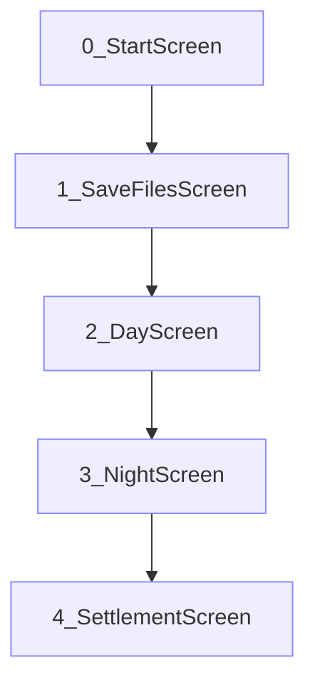
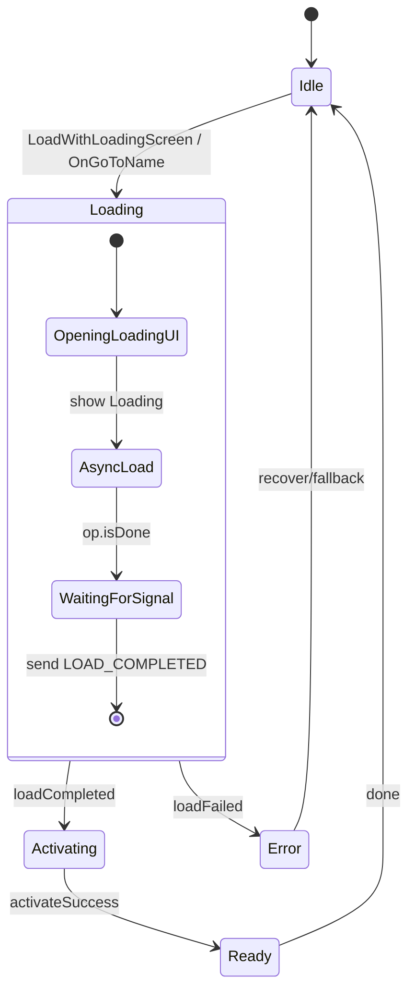
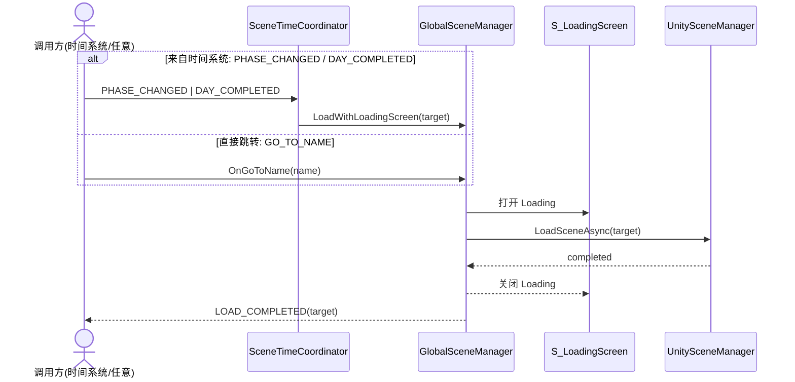
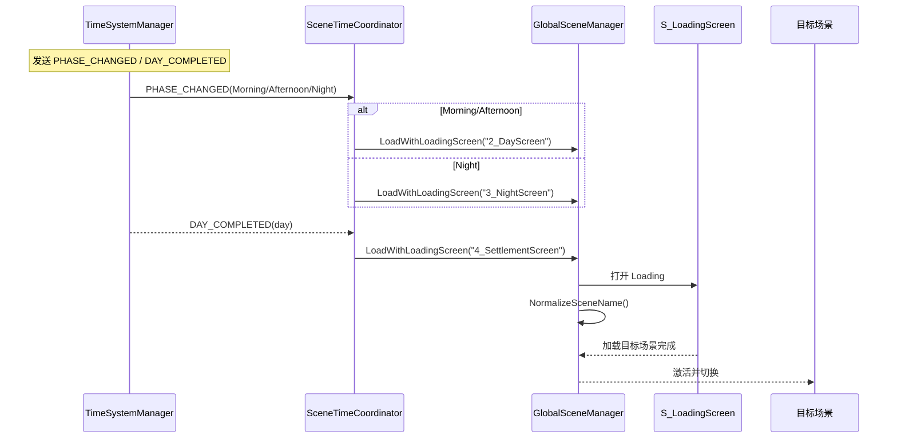
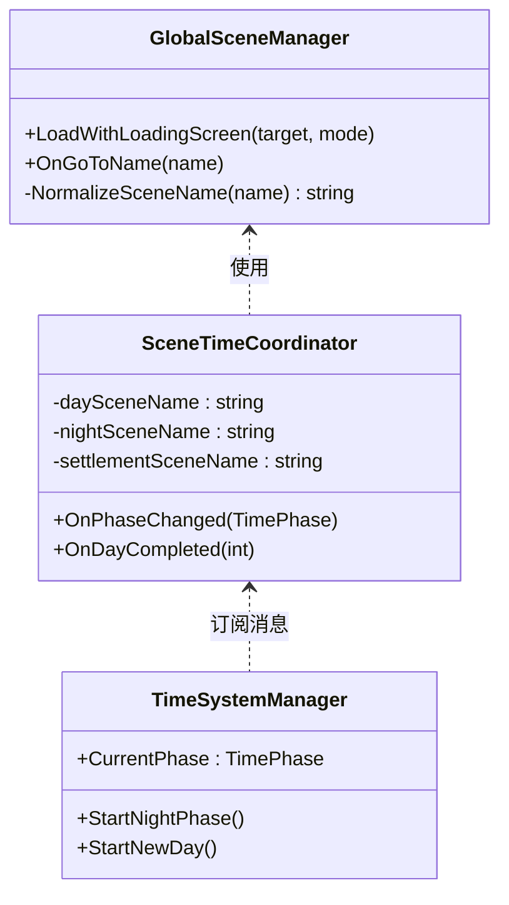
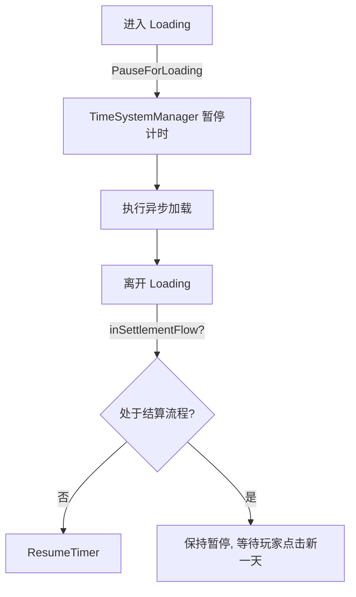

# 场景管理器开发文档

项目：Taberna Noctis（夜之小酒馆）  
版本：v1.0  
最后更新：2025-10-09

---

## 功能综述

场景管理器统一负责场景命名规范化与按名路由，协同 Loading 场景完成异步加载与激活，并响应时间系统的阶段消息执行 Day/Night/Settlement 的切换；在此过程中提供加载重入保护与错误回退的最小契约，支持 Single/Additive 模式与 `SceneTimeCoordinator` 协作，作为全局场景流切换的可靠中转站。

## 1. 文档目的与范围

- 定义 `GlobalSceneManager` 与 `SceneTimeCoordinator` 的职责边界与协作方式。
- 给出加载状态机与关键时序，统一命名规范与跳转契约。
- 提供最小可落地的数据结构与接口签名示例。

---

## 2. 命名规范与场景顺序



- Loading 场景：`S_LoadingScreen`
- 旧名兼容：由 `GlobalSceneManager.NormalizeSceneName()` 将旧名映射为带编号的新名。

---

## 3. 状态机：GlobalSceneManager 加载状态



---

## 4. Sequence diagram: Overview of loading timing



---

## 5. Sequence diagram: The time system drives scene switchingA



---

## 6. 结构图：核心类与职责



---

## 7. 加载期暂停/恢复协同



---

## 8. 数据结构与类型定义

---

## 9. 数据结构与类型定义

```csharp
// 场景时段（与时间系统一致）
public enum TimePhase
{
    Morning = 0,
    Afternoon = 1,
    Night = 2,
    Settlement = 3,
}

// 统一的场景命名常量与规范化
public static class SceneNames
{
    public const string Start = "0_StartScreen";
    public const string SaveFiles = "1_SaveFilesScreen";
    public const string Day = "2_DayScreen";
    public const string Night = "3_NightScreen";
    public const string Settlement = "4_SettlementScreen";
    public const string Loading = "S_LoadingScreen";

    // 旧名兼容，如 "DayScreen" → "2_DayScreen"
    public static string Normalize(string name)
    {
        if (string.IsNullOrEmpty(name)) return Day;
        if (name == "StartScreen" || name == "0_StartScreen") return Start;
        if (name == "SaveFilesScreen" || name == "1_SaveFilesScreen") return SaveFiles;
        if (name == "DayScreen" || name == "2_DayScreen") return Day;
        if (name == "NightScreen" || name == "3_NightScreen") return Night;
        if (name == "SettlementScreen" || name == "4_SettlementScreen") return Settlement;
        return name;
    }
}

// 加载请求的最小载体
public struct LoadRequest
{
    public string targetScene;            // 目标场景名（已规范化）
    public UnityEngine.SceneManagement.LoadSceneMode mode; // Single/Additive
    public bool showLoading;              // 是否展示 Loading 场景
    public bool inSettlementFlow;         // 是否处于结算流程（决定暂停/恢复策略）
}

// 场景路由规划（供 SceneTimeCoordinator 配置）
public sealed class RoutePlan
{
    public string daySceneName = SceneNames.Day;
    public string nightSceneName = SceneNames.Night;
    public string settlementSceneName = SceneNames.Settlement;
}
```

---

## 10. 消息与负载

| 消息名           | 发送方              | 触发时机       | 负载                 | 接收方                 | 说明                       |
| ---------------- | ------------------- | -------------- | -------------------- | ---------------------- | -------------------------- |
| `PHASE_CHANGED`  | `TimeSystemManager` | 早/午/晚切换   | `TimePhase newPhase` | `SceneTimeCoordinator` | 决定加载 Day 或 Night 场景 |
| `DAY_COMPLETED`  | `TimeSystemManager` | 夜晚计时结束   | `int day`            | `SceneTimeCoordinator` | 进入结算场景               |
| `GO_TO_NAME`     | 任意                | 需要直达某场景 | `string name`        | `GlobalSceneManager`   | 通过规范化方法进行兼容跳转 |
| `LOAD_COMPLETED` | `S_LoadingScreen`   | 加载完成       | `string targetScene` | `GlobalSceneManager`   | 关闭 Loading，激活目标场景 |

---

## 11. 接口签名与契约

```csharp
public sealed class GlobalSceneManager : UnityEngine.MonoBehaviour
{
    public static GlobalSceneManager Instance { get; private set; }

    // 统一入口：带 Loading 的加载（默认 Single）
    public UnityEngine.AsyncOperation LoadWithLoadingScreen(
        string target,
        UnityEngine.SceneManagement.LoadSceneMode mode = UnityEngine.SceneManagement.LoadSceneMode.Single,
        bool inSettlementFlow = false);

    // 按名称跳转（兼容旧名与无编号名）
    public void OnGoToName(string name);

    // 旧名 → 新名
    internal string NormalizeSceneName(string name);
}

public sealed class SceneTimeCoordinator : UnityEngine.MonoBehaviour
{
    public string daySceneName = SceneNames.Day;
    public string nightSceneName = SceneNames.Night;
    public string settlementSceneName = SceneNames.Settlement;

    // 订阅 PHASE_CHANGED
    public void OnPhaseChanged(TimePhase phase);

    // 订阅 DAY_COMPLETED
    public void OnDayCompleted(int day);
}
```

### 契约要点

- `LoadWithLoadingScreen` 必须总是先激活 `S_LoadingScreen`，再进行异步加载，最后在收到 `LOAD_COMPLETED` 后切换目标场景；
- `NormalizeSceneName` 不改变合法的“已编号”场景名；无法识别时回退到 `2_DayScreen`；
- 处于结算流程时（`inSettlementFlow=true`）不得自动恢复计时，等待玩家点击“继续新的一天”。

---

## 12. 错误处理与边界

- 目标场景不存在：记录错误日志并回退到 `2_DayScreen`；
- 重入加载保护：若已有加载在进行，新的请求排队或丢弃（按产品策略选择其一）；
- Additive 模式：仅用于调试/叠加 UI 的开发阶段，正式版默认 Single；
- Mobile 平台：切场景前暂停昂贵的后台任务（粒子/音频混音等）。

---

## 13. 单元测试

```csharp
[NUnit.Framework.Test]
public void NormalizeSceneName_MapsLegacyNames()
{
    NUnit.Framework.Assert.AreEqual(SceneNames.Day, SceneNames.Normalize("DayScreen"));
    NUnit.Framework.Assert.AreEqual(SceneNames.Night, SceneNames.Normalize("3_NightScreen"));
}
```
