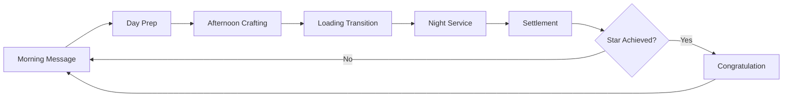
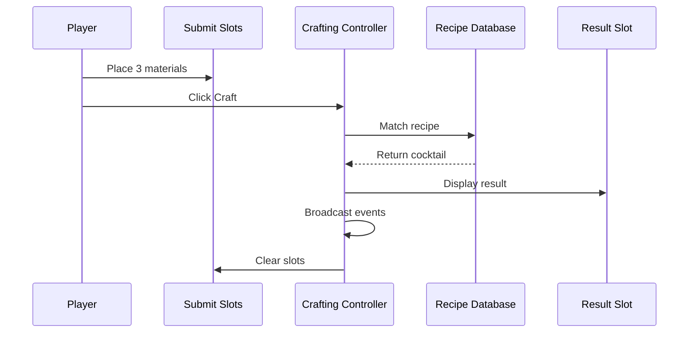
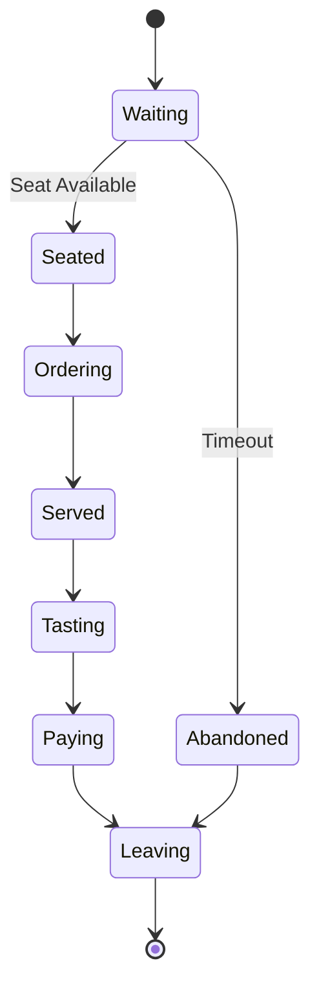
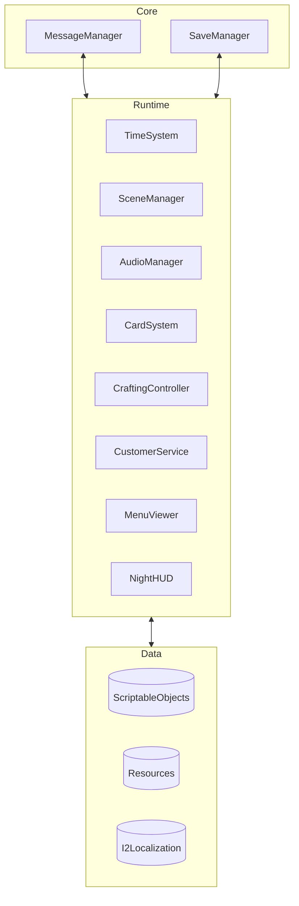

<div align="center">

# Taberna Noctis

**A Unity-Based Cocktail Bar Management Game**

[](https://unity.com/)
[](https://docs.microsoft.com/en-us/dotnet/csharp/)
[](LICENSE)

*Master the art of mixology, manage customer moods, and build your bar's reputation in this strategic cocktail crafting experience.*

[Features](#-features) • [Gameplay](#-gameplay-systems) • [Architecture](#-architecture) • [Documentation](#-documentation) • [Getting Started](#-getting-started)

</div>

---

## Overview

**Taberna Noctis** is a sophisticated bar management simulation where players craft cocktails, serve diverse customers, and navigate the delicate balance of customer satisfaction and business success. Built with Unity, the game features a robust card-based crafting system, dynamic customer mood mechanics, and a reputation-driven progression system.

### Core Concept

- **3-Material Crafting**: Combine three ingredients to create classic cocktails
- **Customer Psychology**: Manage five distinct mood states (Busy, Irritable, Melancholy, Picky, Friendly)
- **Economic Strategy**: Balance material costs, cocktail pricing, and customer satisfaction
- **Reputation System**: Build your bar's prestige through quality service and recipe mastery

---

## Features

### Card-Based Crafting System
- **16 Material Cards**: Base spirits, liqueurs, bitters, and fresh ingredients
- **8 Classic Cocktails**: Martini, Manhattan, Old Fashioned, Negroni, Margarita, Daiquiri, Moscow Mule, Cuba Libre
- **Fallback Recipe**: "Unspeakable" cocktail for incorrect combinations (with severe penalties)
- **Recipe Discovery**: Unlock and record successful recipes in your formula book

### Dynamic Customer System
- **5 Customer Roles**: Office Worker, Team Lead, Freelancer, Boss, College Student
- **5 Mood States**: Each affecting customer behavior and satisfaction
- **Role Multipliers**: Different payment scales (0.9x - 1.5x)
- **Queue Management**: Real-time customer arrival, seating, and service flow

### Economic & Reputation Systems
- **Dual Feedback Loop**:
  - **Mood System**: Affects immediate tips and revenue
  - **Reputation System**: Drives long-term bar rating and customer quality
- **Strategic Pricing**: Balance material costs vs. cocktail prices
- **Profit Optimization**: Range from $14 (Daiquiri) to $31 (Negroni) per drink

### Audio & Atmosphere
- **Dynamic BGM**: Seamless day-to-night transitions with fade effects
- **Adaptive Sound Effects**: Context-aware dealing, mixing, and serving sounds
- **Scene Coordination**: `BgmSceneCoordinator` manages audio across gameplay phases

### Developer Tools
- **Message System Window**: Subscribe, send, log, and export game events
- **Random Monitor**: Track RNG streams with histogram visualization
- **Save Viewer**: Inspect and manage save slots with JSON preview
- **Customer Monitor**: Real-time queue and service state tracking
- **Scene Sequence Manager**: Visualize and autoplay build settings

---

## Gameplay Systems

### Daily Cycle Flow



### Crafting Workflow



### Customer Service Flow



---

## Architecture

### System Overview



### Key Technologies

- **Unity Engine**: Core game framework
- **Easy Save 3**: Persistent data management
- **DOTween**: Animation and tweening
- **I2 Localization**: Multi-language support
- **Message Bus Pattern**: Decoupled system communication
- **ScriptableObjects**: Data-driven design

### Directory Structure

````
Assets/
├── Scripts/
│   ├── 0_General/          # Core systems (messages, save, audio, cards)
│   ├── 3_DayScreen/        # Day phase (formula book)
│   ├── 4_AfternoonScreen/  # Afternoon crafting
│   ├── 5_NightScreen/      # Night service (customers, menu, HUD)
│   ├── 6_SettlementScreen/ # Day-end settlement
│   └── 7_CongratulationScreen/
├── Editor/                 # Editor tools and windows
├── Resources/              # Runtime-loaded assets
└── Documents/              # Development documentation
```

---

## Documentation

Comprehensive technical documentation is available in the `Documents/EN/` folder:

### Core Systems
- **[Project Development Guide](Documents/EN/Project_DevDoc.en.md)** - Complete architecture and workflow
- **[Card System Parameters](Documents/EN/CardSystem_Parameters.en.md)** - All material and cocktail data
- **[Cocktail Recipe System](Documents/EN/CocktailRecipe_System.en.md)** - Recipe design and mechanics

### Specialized Systems
- **[Crafting System Design](Documents/EN/CraftingSystem_Design.en.md)** - Material matching and result display
- **[Customer System](Documents/EN/CustomerSystem_DevDoc.en.md)** - Lifecycle, moods, and settlement
- **[Audio System](Documents/EN/AudioSystem_DevDoc.en.md)** - BGM coordination and adaptive SE
- **[Queue System](Documents/EN/QueueSystem_DevDoc.en.md)** - Customer arrival and seating
- **[Save System](Documents/EN/SaveSystem_DevDoc.en.md)** - Persistence and data management
- **[Random System](Documents/EN/RandomSystem_DevDoc.en.md)** - RNG streams and monitoring

### Tools & Utilities
- **[Editor Tools & Diagnostics](Documents/EN/EditorTools_AndDiagnostics_DevDoc.en.md)** - Development utilities
- **[Recipe Book & Night Menu](Documents/EN/RecipeBookAndNightMenu_DevDoc.en.md)** - UI persistence
- **[Card Drag & Drop Guide](Documents/EN/CardDragDrop_Guide.en.md)** - Interaction system

---

## Getting Started

### Prerequisites

- **Unity 2022.3+** (LTS recommended)
- **Visual Studio 2022** or **Rider**
- **Git** for version control

### Installation

1. **Clone the repository**
   ```bash
   git clone https://github.com/yourusername/Taberna-Noctis.git
   cd Taberna-Noctis
   ```

2. **Open in Unity**
   - Launch Unity Hub
   - Click "Add" and select the project folder
   - Open with Unity 2022.3 or later

3. **Import Dependencies**
   - Easy Save 3
   - DOTween (Free or Pro)
   - I2 Localization
   - Other packages (see `Packages/manifest.json`)

4. **Build Settings**
   - Open `File > Build Settings`
   - Verify scene order matches `SceneSequenceWindow`
   - Select target platform and build

### Quick Start

1. **Start Scene**: `0_Start`
2. **Create/Load Save**: `1_SaveFilesScreen`
3. **Play Through Cycle**: Morning → Day → Afternoon → Night → Settlement
4. **Use Editor Tools**: `自制工具` menu for debugging and monitoring

---

## Gameplay Tips

### Recipe Mastery
- **Start Simple**: Cuba Libre (★☆☆☆☆) - White Rum + Cola + Lime
- **Learn Classics**: Old Fashioned (★★★☆☆) - Bourbon + Simple Syrup + Angostura Bitters
- **Master Complex**: Negroni (★★★★★) - Gin + Campari + Sweet Vermouth

### Customer Strategy
- **Boss Customers (1.5x)**: Serve high-reputation cocktails (Negroni +5, Martini +4)
- **Picky Customers**: Use Gin, Dry Vermouth, Sweet Vermouth, Campari
- **Melancholy Customers**: Serve Moscow Mule (+3) or Cuba Libre (+2)
- **Avoid Mismatches**: Don't serve Moscow Mule (-5) to Busy customers

### Economic Optimization
- **High Profit**: Negroni ($31), Manhattan ($27), Martini ($24)
- **Best Value**: Old Fashioned ($19 profit, $38 cost)
- **Safe Choice**: Daiquiri (Friendly +3, low cost $29)

---

## Development

### Coding Conventions
- **Naming**: Expressive names; functions as verbs, variables as nouns
- **Control Flow**: Guard clauses and early returns
- **Comments**: Only for non-obvious maintenance-critical notes
- **Asset Paths**: Centralized constants (e.g., `GlobalAudio`)

### Message System
Key events for system integration:
- `CRAFTING_RESULT(CocktailCardSO)` - Cocktail crafted
- `SERVICE_PAYMENT_COMPLETE(income, ratingDelta)` - Customer paid
- `RECIPE_BOOK_REFRESH_REQUEST` - Update formula book
- `QUEUE_DISPENSE_STARTED/FINISHED` - Card dealing state

### Testing Checklist
- All recipes produce correct cocktails
- Fallback "Unspeakable" for invalid combinations
- Customer mood calculations accurate
- Payment formula: `Price + max(0, ΔM × 1.2 × RoleMultiplier)`
- Reputation system updates correctly
- Save/Load preserves game state

---

## Contributing

Contributions are welcome! Please follow these guidelines:

1. **Fork** the repository
2. **Create** a feature branch (`git checkout -b feature/AmazingFeature`)
3. **Commit** your changes (`git commit -m 'Add AmazingFeature'`)
4. **Push** to the branch (`git push origin feature/AmazingFeature`)
5. **Open** a Pull Request

### Development Workflow
- Follow existing code style and conventions
- Add/update documentation for new features
- Test thoroughly before submitting
- Use editor tools for debugging

---

## License

This project is licensed under the MIT License - see the [LICENSE](LICENSE) file for details.

---

## Acknowledgments

### Third-Party Assets
- **Easy Save 3** - Persistent data management
- **DOTween** (Demigiant) - Animation framework
- **I2 Localization** - Multi-language support
- **Febucci** - Text animation effects
- **ParadoxNotion** - Behavior framework
- **Sirenix Odin** - Inspector enhancements
- **ConsolePro** - Enhanced debugging

### Special Thanks
- Unity community for tools and resources
- All contributors and testers

---

<div align="center">

**Made with ❤️ and 🍸**

[Report Bug](https://github.com/yourusername/Taberna-Noctis/issues) • [Request Feature](https://github.com/yourusername/Taberna-Noctis/issues) • [Documentation](Documents/EN/)

</div>
