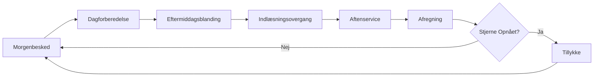
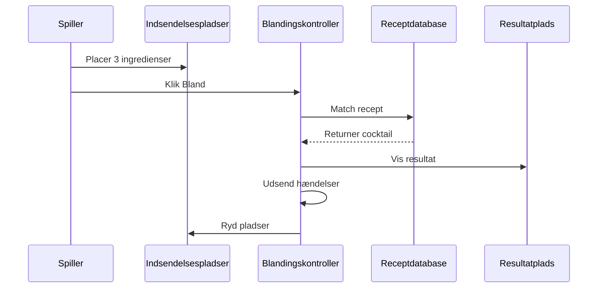
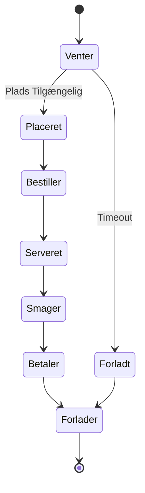
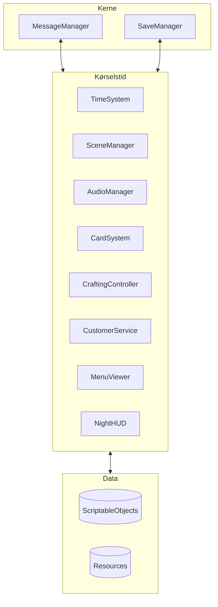

<div align="center">

# 🍸 Taberna Noctis

**Et Unity-baseret Cocktailbar Styringsspil**

[](https://unity.com/)
[](https://docs.microsoft.com/en-us/dotnet/csharp/)
[](LICENSE)

*Mestre kunsten at mixe drinks, styr kundernes humør og byg din bars omdømme i denne strategiske cocktailblandingsoplevelse.*

**Language / Sprog**: [English](README.md) | [中文](README_ZH.md) | [Suomi](README_FI.md) | [Svenska](README_SV.md) | [Dansk](#)

[Funktioner](#-funktioner) • [Spilsystemer](#-spilsystemer) • [Arkitektur](#-arkitektur) • [Dokumentation](#-dokumentation) • [Kom I Gang](#-kom-i-gang)

</div>

---

## 📖 Oversigt

**Taberna Noctis** er en sofistikeret barstyringssimulering, hvor spillere blander cocktails, serverer forskellige kunder og navigerer den følsomme balance mellem kundetilfredshed og forretningssucces. Bygget med Unity har spillet et robust kortbaseret blandingssystem, dynamiske kundehumørmekanikker og et omdømmedrevet progressionssystem.

### 🎯 Kernekoncept

- **3-Ingrediens Blanding**: Kombiner tre ingredienser for at skabe klassiske cocktails
- **Kundepsykologi**: Håndter fem distinkte humørtilstande (Travl, Irritabel, Melankolsk, Kræsen, Venlig)
- **Økonomisk Strategi**: Balancer ingrediensomkostninger, cocktailprissætning og kundetilfredshed
- **Omdømmesystem**: Byg din bars prestige gennem kvalitetsservice og receptmestring

---

## ✨ Funktioner

### 🎴 Kortbaseret Blandingssystem
- **16 Ingredienskort**: Basisspiritus, likører, bittere og friske ingredienser
- **8 Klassiske Cocktails**: Martini, Manhattan, Old Fashioned, Negroni, Margarita, Daiquiri, Moscow Mule, Cuba Libre
- **Reserve Recept**: "Unspeakable" cocktail til forkerte kombinationer (med alvorlige straffe)
- **Receptopdagelse**: Lås op og gem succesfulde opskrifter i din receptbog

### 👥 Dynamisk Kundesystem
- **5 Kunderroller**: Kontormedarbejder, Teamleder, Freelancer, Chef, Universitetsstuderende
- **5 Humørtilstande**: Hver påvirker kundens adfærd og tilfredshed
- **Rollemultiplikatorer**: Forskellige betalingsskalaer (0.9x - 1.5x)
- **Køstyring**: Realtidskundeankomst, placering og serviceflow

### 💰 Økonomi- og Omdømmesystemer
- **Dobbelt Feedbackloop**:
  - **Humørsystem**: Påvirker øjeblikkelige drikkepenge og indtægter
  - **Omdømmesystem**: Driver langsigtet barvurdering og kundekvalitet
- **Strategisk Prissætning**: Balancer ingrediensomkostninger vs. cocktailpriser
- **Profitoptimering**: Varierer fra $14 (Daiquiri) til $31 (Negroni) pr. drink

### 🎵 Lyd og Atmosfære
- **Dynamisk BGM**: Problemfri dag-nat overgang med fade-effekter
- **Adaptive Lydeffekter**: Kontekstbevidste uddelings-, blandnings- og serveringslyde
- **Scenekoordinering**: `BgmSceneCoordinator` styrer lyd på tværs af spilfaser

### 🛠️ Udviklerværktøjer
- **Beskedsystemvindue**: Abonner, send, log og eksporter spilhændelser
- **Tilfældighedsmonitor**: Spor RNG-strømme med histogramvisualisering
- **Gem Viser**: Inspicer og administrer gempladser med JSON-forhåndsvisning
- **Kundemonitor**: Realtidskø- og servicestatussporing
- **Scenesekvensmanager**: Visualiser og autospil byggeindstillinger

---

## 🎮 Spilsystemer

### Daglig Cyklusflow



### Blandingsarbejdsgang



### Kundeserviceflow



---

## 🏗️ Arkitektur

### Systemoversigt



### Nøgleteknologier

- **Unity Engine**: Kernespilramme
- **Easy Save 3**: Vedvarende datastyring
- **DOTween**: Animation og tweening
- **Beskedbusmønster**: Afkoblet systemkommunikation
- **ScriptableObjects**: Datadrevet design

### Mappestruktur

```
Assets/
├── Scripts/
│   ├── 0_General/          # Kernesystemer (beskeder, gem, lyd, kort)
│   ├── 3_DayScreen/        # Dagfase (receptbog)
│   ├── 4_AfternoonScreen/  # Eftermiddagsblanding
│   ├── 5_NightScreen/      # Aftenservice (kunder, menu, HUD)
│   ├── 6_SettlementScreen/ # Dagsafslutning afregning
│   └── 7_CongratulationScreen/
├── Editor/                 # Editorværktøjer og vinduer
├── Resources/              # Kørselstidsindlæste ressourcer
└── Documents/              # Udviklingsdokumentation
```

---

## 📚 Dokumentation

Omfattende teknisk dokumentation er tilgængelig i `Documents/EN/` mappen:

### Kernesystemer
- **[Projektudviklingsguide](Documents/EN/Project_DevDoc.en.md)** - Komplet arkitektur og arbejdsgang
- **[Kortsystemparametre](Documents/EN/CardSystem_Parameters.en.md)** - Alle ingrediens- og cocktaildata
- **[Cocktailreceptsystem](Documents/EN/CocktailRecipe_System.en.md)** - Receptdesign og mekanik

### Specialiserede Systemer
- **[Blandingssystemdesign](Documents/EN/CraftingSystem_Design.en.md)** - Ingrediensmatching og resultatvisning
- **[Kundesystem](Documents/EN/CustomerSystem_DevDoc.en.md)** - Livscyklus, humør og afregning
- **[Lydsystem](Documents/EN/AudioSystem_DevDoc.en.md)** - BGM-koordinering og adaptiv SE
- **[Køsystem](Documents/EN/QueueSystem_DevDoc.en.md)** - Kundeankomst og placering
- **[Gemsystem](Documents/EN/SaveSystem_DevDoc.en.md)** - Vedholdenhed og datastyring
- **[Tilfældighedssystem](Documents/EN/RandomSystem_DevDoc.en.md)** - RNG-strømme og overvågning

### Værktøjer og Hjælpeprogrammer
- **[Editorværktøjer og Diagnostik](Documents/EN/EditorTools_AndDiagnostics_DevDoc.en.md)** - Udviklingshjælpeprogrammer
- **[Receptbog og Aftenmenu](Documents/EN/RecipeBookAndNightMenu_DevDoc.en.md)** - UI-vedholdenhed
- **[Korttræk og Slip Guide](Documents/EN/CardDragDrop_Guide.en.md)** - Interaktionssystem

---

## 🚀 Kom I Gang

### Forudsætninger

- **Unity 2022.3+** (LTS anbefales)
- **Visual Studio 2022** eller **Rider**
- **Git** til versionskontrol

### Installation

1. **Klon repositoriet**
   ```bash
   git clone https://github.com/yourusername/Taberna-Noctis.git
   cd Taberna-Noctis
   ```

2. **Åbn i Unity**
   - Start Unity Hub
   - Klik "Add" og vælg projektmappen
   - Åbn med Unity 2022.3 eller senere

3. **Importer Afhængigheder**
   - Easy Save 3
   - DOTween (Gratis eller Pro)
   - Andre pakker (se `Packages/manifest.json`)

4. **Byggeindstillinger**
   - Åbn `File > Build Settings`
   - Verificer at scenerækkefølgen matcher `SceneSequenceWindow`
   - Vælg målplatform og byg

### Hurtig Start

1. **Startscene**: `0_Start`
2. **Opret/Indlæs Gem**: `1_SaveFilesScreen`
3. **Spil Gennem Cyklus**: Morgen → Dag → Eftermiddag → Aften → Afregning
4. **Brug Editorværktøjer**: `自制工具` menu til fejlfinding og overvågning

---

## 🎯 Spiltips

### Receptmestring
- **Start Simpelt**: Cuba Libre (★☆☆☆☆) - Hvid Rom + Cola + Lime
- **Lær Klassikere**: Old Fashioned (★★★☆☆) - Bourbon + Sukkersirup + Angostura Bitters
- **Mestre Komplekse**: Negroni (★★★★★) - Gin + Campari + Sød Vermouth

### Kundestrategi
- **Chefkunder (1.5x)**: Server højomdømme cocktails (Negroni +5, Martini +4)
- **Kræsne Kunder**: Brug Gin, Tør Vermouth, Sød Vermouth, Campari
- **Melankolske Kunder**: Server Moscow Mule (+3) eller Cuba Libre (+2)
- **Undgå Fejlmatch**: Server ikke Moscow Mule (-5) til travle kunder

### Økonomisk Optimering
- **Høj Profit**: Negroni ($31), Manhattan ($27), Martini ($24)
- **Bedste Værdi**: Old Fashioned ($19 profit, $38 omkostning)
- **Sikkert Valg**: Daiquiri (Venlig +3, lav omkostning $29)

---

## 🛠️ Udvikling

### Kodningskonventioner
- **Navngivning**: Udtryksfulde navne; funktioner som verber, variabler som substantiver
- **Kontrolflow**: Vagtsætninger og tidlig retur
- **Kommentarer**: Kun til ikke-indlysende vedligeholdelseskritiske noter
- **Ressourcestier**: Centraliserede konstanter (f.eks. `GlobalAudio`)

### Beskedsystem
Nøglehændelser til systemintegration:
- `CRAFTING_RESULT(CocktailCardSO)` - Cocktail blandet
- `SERVICE_PAYMENT_COMPLETE(income, ratingDelta)` - Kunde betalte
- `RECIPE_BOOK_REFRESH_REQUEST` - Opdater receptbog
- `QUEUE_DISPENSE_STARTED/FINISHED` - Kortuddelingstilstand

### Testtjekliste
- ✅ Alle opskrifter producerer korrekte cocktails
- ✅ Reserveopskrift "Unspeakable" til ugyldige kombinationer
- ✅ Kundehumørberegninger nøjagtige
- ✅ Betalingsformel: `Pris + max(0, ΔM × 1.2 × Rollemultiplikator)`
- ✅ Omdømmesystem opdateres korrekt
- ✅ Gem/Indlæs bevarer spiltilstand

---

## 🤝 Bidrag

Bidrag er velkomne! Følg venligst disse retningslinjer:

1. **Fork** repositoriet
2. **Opret** en funktionsgren (`git checkout -b feature/AmazingFeature`)
3. **Commit** dine ændringer (`git commit -m 'Add AmazingFeature'`)
4. **Push** til grenen (`git push origin feature/AmazingFeature`)
5. **Åbn** en Pull Request

### Udviklingsarbejdsgang
- Følg eksisterende kodestil og konventioner
- Tilføj/opdater dokumentation for nye funktioner
- Test grundigt før indsendelse
- Brug editorværktøjer til fejlfinding

---

## 📝 Licens

Dette projekt er licenseret under MIT-licensen - se [LICENSE](LICENSE) filen for detaljer.

---

## 🙏 Anerkendelser

### Tredjepartsressourcer
- **Easy Save 3** - Vedvarende datastyring
- **DOTween** (Demigiant) - Animationsramme
- **Febucci** - Tekstanimationseffekter
- **ParadoxNotion** - Adfærdsramme
- **Sirenix Odin** - Inspector-forbedringer
- **ConsolePro** - Forbedret fejlfinding

### Særlig Tak
- Unity-fællesskabet for værktøjer og ressourcer
- Alle bidragydere og testere

---

<div align="center">

**Lavet med ❤️ og 🍸**

[Rapporter Fejl](https://github.com/yourusername/Taberna-Noctis/issues) • [Anmod Om Funktion](https://github.com/yourusername/Taberna-Noctis/issues) • [Dokumentation](Documents/EN/)

</div>
