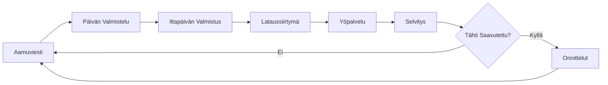
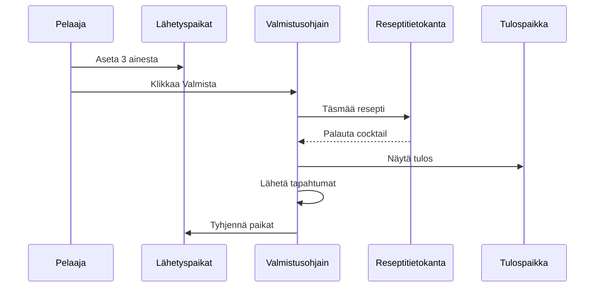
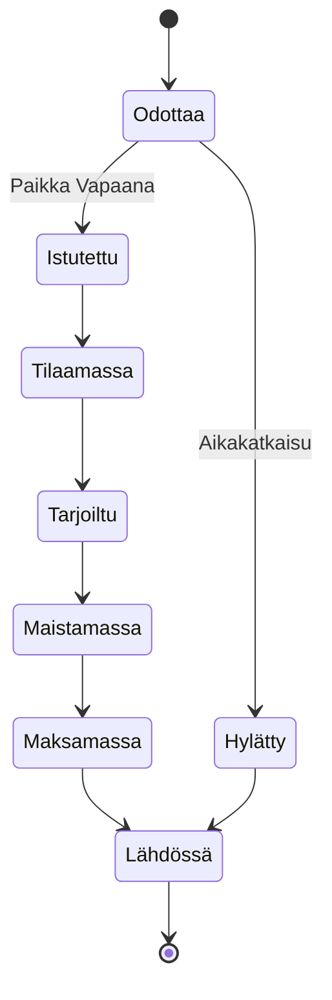
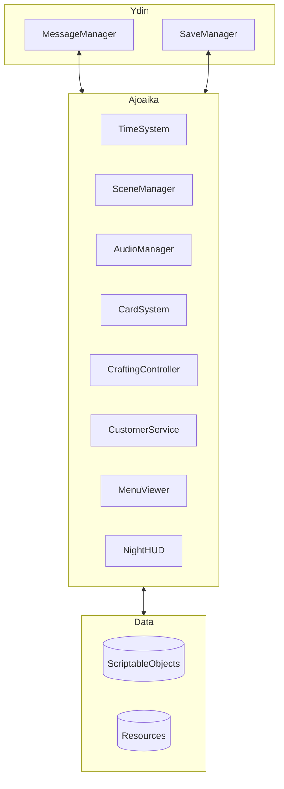

<div align="center">

# 🍸 Taberna Noctis

**Unity-pohjainen Cocktailbaarin Hallintapeli**

[](https://unity.com/)
[](https://docs.microsoft.com/en-us/dotnet/csharp/)
[](LICENSE)

*Hallitse miksologian taide, hallinnoi asiakkaiden mielialoja ja rakenna baarisi mainetta tässä strategisessa cocktailten valmistuskokemuksessa.*

**Language / 语言版本 / Kieli / Språk**: [English](README.md) | [中文](README_ZH.md) | [Suomi](#) | [Svenska](README_SV.md) | [Dansk](README_DA.md)

[Ominaisuudet](#-ominaisuudet) • [Pelisysteemit](#-pelisysteemit) • [Arkkitehtuuri](#-arkkitehtuuri) • [Dokumentaatio](#-dokumentaatio) • [Aloitus](#-aloitus)

</div>

---

## 📖 Yleiskatsaus

**Taberna Noctis** on hienostunut baarinhallinnan simulaatiopeli, jossa pelaajat valmistavat cocktaileja, palvelevat erilaisia asiakkaita ja navigoivat asiakastyytyväisyyden ja liiketoiminnan menestyksen välillä. Unity-pohjaisessa pelissä on vankka korttipohjainen valmistusjärjestelmä, dynaamiset asiakkaiden mielialamekaniikat ja mainepohjainen etenemissysteemi.

### 🎯 Ydinkonsepti

- **3-Ainesosa Valmistus**: Yhdistä kolme ainesta luodaksesi klassisia cocktaileja
- **Asiakaspsykologia**: Hallinnoi viittä erilaista mielialatilaa (Kiireinen, Ärtynyt, Melankolinen, Nirso, Ystävällinen)
- **Talousstrategia**: Tasapainota ainesosien kustannukset, cocktailhinnoittelu ja asiakastyytyväisyys
- **Mainejärjestelmä**: Rakenna baarisi arvostus laadukkaan palvelun ja reseptien hallinnan kautta

---

## ✨ Ominaisuudet

### 🎴 Korttipohjainen Valmistusjärjestelmä
- **16 Ainesosakorttia**: Perusviinoja, liköörejä, katkeruusaineita ja tuoreita ainesosia
- **8 Klassista Cocktailia**: Martini, Manhattan, Old Fashioned, Negroni, Margarita, Daiquiri, Moscow Mule, Cuba Libre
- **Vararesepti**: "Unspeakable" cocktail virheellisille yhdistelmille (vakavilla rangaistuksilla)
- **Reseptien Löytäminen**: Avaa ja tallenna onnistuneet reseptit reseptikirjaasi

### 👥 Dynaaminen Asiakasjärjestelmä
- **5 Asiakasroolia**: Toimistotyöntekijä, Tiimipäällikkö, Freelancer, Pomo, Opiskelija
- **5 Mielialatilaa**: Jokainen vaikuttaa asiakkaan käyttäytymiseen ja tyytyväisyyteen
- **Roolikertoimet**: Erilaiset maksuskaala (0.9x - 1.5x)
- **Jonohallinta**: Reaaliaikainen asiakkaiden saapuminen, istuttaminen ja palveluvirta

### 💰 Talous- ja Mainejärjestelmät
- **Kaksinkertainen Palautesilmukka**:
  - **Mielialajärjestelmä**: Vaikuttaa välittömiin juomarahoihin ja tuloihin
  - **Mainejärjestelmä**: Ohjaa pitkän aikavälin baariarvostelua ja asiakkaiden laatua
- **Strateginen Hinnoittelu**: Tasapainota ainesosien kustannukset vs. cocktailhinnat
- **Voiton Optimointi**: Vaihtelee $14:stä (Daiquiri) $31:een (Negroni) juomaa kohden

### 🎵 Ääni ja Tunnelma
- **Dynaaminen BGM**: Saumaton päivä-yö siirtymä häivytysefekteillä
- **Mukautuvat Ääniefektit**: Kontekstitietoiset jakelu-, sekoitus- ja tarjoiluäänet
- **Kohtauskoordinaatio**: `BgmSceneCoordinator` hallinnoi ääntä pelivalheissa

### 🛠️ Kehittäjätyökalut
- **Viestijärjestelmäikkuna**: Tilaa, lähetä, kirjaa ja vie pelitapahtumia
- **Satunnaislukumonitori**: Seuraa RNG-virtoja histogrammin visualisoinnilla
- **Tallennuskatselin**: Tarkastele ja hallinnoi tallennuspaikkoja JSON-esikatselulla
- **Asiakasmonitori**: Reaaliaikainen jono- ja palvelutilan seuranta
- **Kohtaussekvenssihallinta**: Visualisoi ja automaattitoista rakennusasetukset

---

## 🎮 Pelisysteemit

### Päivittäinen Sykli



### Valmistustyönkulku



### Asiakaspalveluvirta



---

## 🏗️ Arkkitehtuuri

### Järjestelmäyleiskatsaus



### Keskeiset Teknologiat

- **Unity Engine**: Ydinpelialusta
- **Easy Save 3**: Pysyvä tiedonhallinta
- **DOTween**: Animaatio ja välianimaatio
- **Viestiväyläkuvio**: Irrotettu järjestelmäviestintä
- **ScriptableObjects**: Dataohjattu suunnittelu

### Hakemistorakenne

```
Assets/
├── Scripts/
│   ├── 0_General/          # Ydinjärjestelmät (viestit, tallennus, ääni, kortit)
│   ├── 3_DayScreen/        # Päivävaihe (reseptikirja)
│   ├── 4_AfternoonScreen/  # Iltapäivän valmistus
│   ├── 5_NightScreen/      # Yöpalvelu (asiakkaat, menu, HUD)
│   ├── 6_SettlementScreen/ # Päivän lopun selvitys
│   └── 7_CongratulationScreen/
├── Editor/                 # Editorityökalut ja ikkunat
├── Resources/              # Ajoaikana ladattavat resurssit
└── Documents/              # Kehitysdokumentaatio
```

---

## 📚 Dokumentaatio

Kattava tekninen dokumentaatio on saatavilla `Documents/EN/` kansiossa:

### Ydinjärjestelmät
- **[Projektin Kehitysopas](Documents/EN/Project_DevDoc.en.md)** - Täydellinen arkkitehtuuri ja työnkulku
- **[Korttijärjestelmän Parametrit](Documents/EN/CardSystem_Parameters.en.md)** - Kaikki ainesosa- ja cocktaildata
- **[Cocktailreseptijärjestelmä](Documents/EN/CocktailRecipe_System.en.md)** - Reseptisuunnittelu ja mekaniikka

### Erikoistuneet Järjestelmät
- **[Valmistusjärjestelmän Suunnittelu](Documents/EN/CraftingSystem_Design.en.md)** - Ainesosien täsmäys ja tulosnäyttö
- **[Asiakasjärjestelmä](Documents/EN/CustomerSystem_DevDoc.en.md)** - Elinkaari, mielialat ja selvitys
- **[Äänijärjestelmä](Documents/EN/AudioSystem_DevDoc.en.md)** - BGM-koordinaatio ja mukautuva SE
- **[Jonojärjestelmä](Documents/EN/QueueSystem_DevDoc.en.md)** - Asiakkaiden saapuminen ja istuttaminen
- **[Tallennusjärjestelmä](Documents/EN/SaveSystem_DevDoc.en.md)** - Pysyvyys ja tiedonhallinta
- **[Satunnaisjärjestelmä](Documents/EN/RandomSystem_DevDoc.en.md)** - RNG-virrat ja seuranta

### Työkalut ja Apuohjelmat
- **[Editorityökalut ja Diagnostiikka](Documents/EN/EditorTools_AndDiagnostics_DevDoc.en.md)** - Kehitysapuohjelmat
- **[Reseptikirja ja Yömenu](Documents/EN/RecipeBookAndNightMenu_DevDoc.en.md)** - UI-pysyvyys
- **[Kortin Vedä ja Pudota Opas](Documents/EN/CardDragDrop_Guide.en.md)** - Vuorovaikutusjärjestelmä

---

## 🚀 Aloitus

### Edellytykset

- **Unity 2022.3+** (LTS suositeltu)
- **Visual Studio 2022** tai **Rider**
- **Git** versionhallintaan

### Asennus

1. **Kloonaa repositorio**
   ```bash
   git clone https://github.com/yourusername/Taberna-Noctis.git
   cd Taberna-Noctis
   ```

2. **Avaa Unityssä**
   - Käynnistä Unity Hub
   - Klikkaa "Add" ja valitse projektikansio
   - Avaa Unity 2022.3:lla tai uudemmalla

3. **Tuo Riippuvuudet**
   - Easy Save 3
   - DOTween (Ilmainen tai Pro)
   - Muut paketit (katso `Packages/manifest.json`)

4. **Rakennusasetukset**
   - Avaa `File > Build Settings`
   - Varmista, että kohtausjärjestys vastaa `SceneSequenceWindow`ia
   - Valitse kohdealusta ja rakenna

### Pika-aloitus

1. **Aloituskohtaus**: `0_Start`
2. **Luo/Lataa Tallennus**: `1_SaveFilesScreen`
3. **Pelaa Läpi Sykli**: Aamu → Päivä → Iltapäivä → Yö → Selvitys
4. **Käytä Editorityökaluja**: `自制工具` menu debuggaukseen ja seurantaan

---

## 🎯 Pelivinkit

### Reseptien Hallinta
- **Aloita Yksinkertaisesta**: Cuba Libre (★☆☆☆☆) - Valkoinen Rommi + Cola + Lime
- **Opi Klassikoita**: Old Fashioned (★★★☆☆) - Bourbon + Sokerisiirappi + Angostura Bitters
- **Hallitse Monimutkaisia**: Negroni (★★★★★) - Gin + Campari + Makea Vermutti

### Asiakasstrategia
- **Pomoasiakkaat (1.5x)**: Tarjoile korkean maineen cocktaileja (Negroni +5, Martini +4)
- **Nirsoasiakkaat**: Käytä Giniä, Kuivaa Vermuttia, Makeaa Vermuttia, Camparia
- **Melankoliset Asiakkaat**: Tarjoile Moscow Mule (+3) tai Cuba Libre (+2)
- **Vältä Epäsopivuuksia**: Älä tarjoile Moscow Mulea (-5) kiireisille asiakkaille

### Talouden Optimointi
- **Korkea Voitto**: Negroni ($31), Manhattan ($27), Martini ($24)
- **Paras Arvo**: Old Fashioned ($19 voitto, $38 kustannus)
- **Turvallinen Valinta**: Daiquiri (Ystävällinen +3, matala kustannus $29)

---

## 🛠️ Kehitys

### Koodauskäytännöt
- **Nimeäminen**: Ilmaisevat nimet; funktiot verbeillä, muuttujat substantiiveilla
- **Ohjausvirta**: Vartijalausekkeet ja varhainen palautus
- **Kommentit**: Vain ei-ilmeisille ylläpito-kriittisille huomautuksille
- **Resurssipolut**: Keskitetyt vakiot (esim. `GlobalAudio`)

### Viestijärjestelmä
Keskeiset tapahtumat järjestelmäintegraatioon:
- `CRAFTING_RESULT(CocktailCardSO)` - Cocktail valmistettu
- `SERVICE_PAYMENT_COMPLETE(income, ratingDelta)` - Asiakas maksoi
- `RECIPE_BOOK_REFRESH_REQUEST` - Päivitä reseptikirja
- `QUEUE_DISPENSE_STARTED/FINISHED` - Korttien jakotila

### Testauslista
- ✅ Kaikki reseptit tuottavat oikeat cocktailit
- ✅ Vararesepti "Unspeakable" virheellisille yhdistelmille
- ✅ Asiakkaiden mielialanlaskenta tarkkaa
- ✅ Maksukaava: `Hinta + max(0, ΔM × 1.2 × Roolikerroin)`
- ✅ Mainejärjestelmä päivittyy oikein
- ✅ Tallennus/Lataus säilyttää pelitilan

---

## 🤝 Osallistuminen

Osallistuminen on tervetullutta! Noudata näitä ohjeita:

1. **Forkkaa** repositorio
2. **Luo** ominaisuushaara (`git checkout -b feature/AmazingFeature`)
3. **Commitoi** muutoksesi (`git commit -m 'Add AmazingFeature'`)
4. **Pushaa** haaraan (`git push origin feature/AmazingFeature`)
5. **Avaa** Pull Request

### Kehitystyönkulku
- Noudata olemassa olevaa koodityyliä ja käytäntöjä
- Lisää/päivitä dokumentaatio uusille ominaisuuksille
- Testaa perusteellisesti ennen lähettämistä
- Käytä editorityökaluja debuggaukseen

---

## 📝 Lisenssi

Tämä projekti on lisensoitu MIT-lisenssillä - katso [LICENSE](LICENSE) tiedosto yksityiskohdista.

---

## 🙏 Kiitokset

### Kolmannen Osapuolen Resurssit
- **Easy Save 3** - Pysyvä tiedonhallinta
- **DOTween** (Demigiant) - Animaatiokehys
- **Febucci** - Tekstianimaatioefektit
- **ParadoxNotion** - Käyttäytymiskehys
- **Sirenix Odin** - Inspector-parannukset
- **ConsolePro** - Parannettu debuggaus

### Erityiskiitokset
- Unity-yhteisö työkaluista ja resursseista
- Kaikki osallistujat ja testaajat

---

<div align="center">

**Tehty ❤️:llä ja 🍸:llä**

[Ilmoita Bugista](https://github.com/yourusername/Taberna-Noctis/issues) • [Pyydä Ominaisuutta](https://github.com/yourusername/Taberna-Noctis/issues) • [Dokumentaatio](Documents/EN/)

</div>
