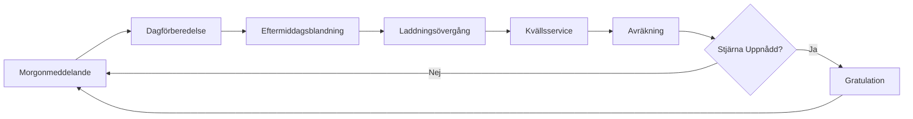
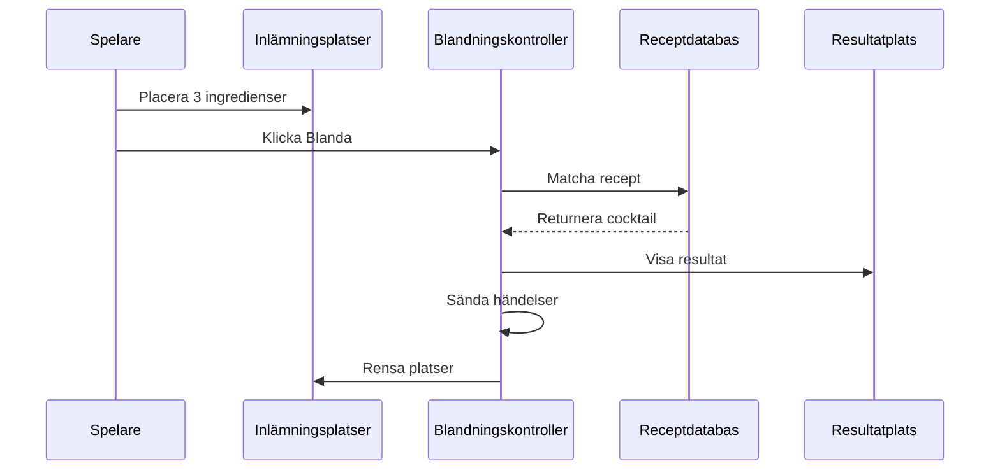
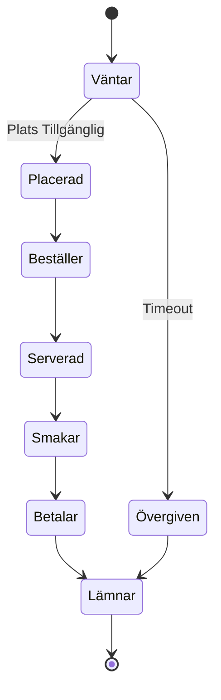
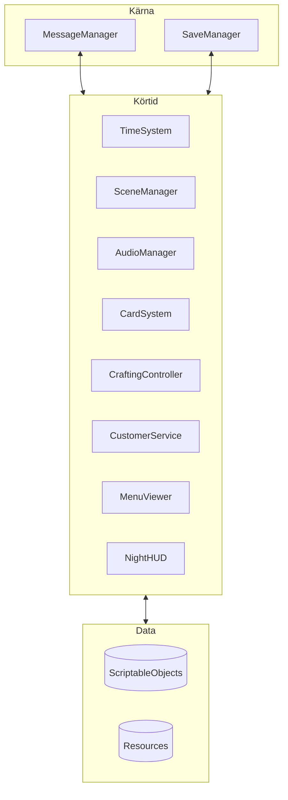

<div align="center">

# 🍸 Taberna Noctis

**Ett Unity-baserat Cocktailbar Hanteringsspel**

[](https://unity.com/)
[](https://docs.microsoft.com/en-us/dotnet/csharp/)
[](LICENSE)

*Bemästra konsten att mixa drinkar, hantera kundernas humör och bygg din bars rykte i denna strategiska cocktailblandningsupplevelse.*

**Language / Språk**: [English](README.md) | [中文](README_ZH.md) | [Suomi](README_FI.md) | [Svenska](#) | [Dansk](README_DA.md)

[Funktioner](#-funktioner) • [Spelsystem](#-spelsystem) • [Arkitektur](#-arkitektur) • [Dokumentation](#-dokumentation) • [Komma Igång](#-komma-igång)

</div>

---

## 📖 Översikt

**Taberna Noctis** är en sofistikerad barhanteringssimulering där spelare blandar cocktails, serverar olika kunder och navigerar den känsliga balansen mellan kundnöjdhet och affärsframgång. Byggt med Unity har spelet ett robust kortbaserat blandningssystem, dynamiska kundhumörmekaniker och ett ryktesdrivet progressionssystem.

### 🎯 Kärnkoncept

- **3-Ingrediens Blandning**: Kombinera tre ingredienser för att skapa klassiska cocktails
- **Kundpsykologi**: Hantera fem distinkta humörtillstånd (Upptagen, Irriterad, Melankolisk, Kräsen, Vänlig)
- **Ekonomisk Strategi**: Balansera ingredienskostnader, cocktailprissättning och kundnöjdhet
- **Ryktessystem**: Bygg din bars prestige genom kvalitetsservice och receptbehärskning

---

## ✨ Funktioner

### 🎴 Kortbaserat Blandningssystem
- **16 Ingredienskort**: Bassprit, likörer, bittrar och färska ingredienser
- **8 Klassiska Cocktails**: Martini, Manhattan, Old Fashioned, Negroni, Margarita, Daiquiri, Moscow Mule, Cuba Libre
- **Reservrecept**: "Unspeakable" cocktail för felaktiga kombinationer (med allvarliga straff)
- **Receptupptäckt**: Lås upp och spara framgångsrika recept i din receptbok

### 👥 Dynamiskt Kundsystem
- **5 Kundroller**: Kontorsarbetare, Teamledare, Frilansare, Chef, Universitetsstudent
- **5 Humörtillstånd**: Varje påverkar kundens beteende och tillfredsställelse
- **Rollmultiplikatorer**: Olika betalningsskalor (0.9x - 1.5x)
- **Köhantering**: Realtidskundankomst, placering och serviceflöde

### 💰 Ekonomi- och Ryktessystem
- **Dubbel Återkopplingsloop**:
  - **Humörsystem**: Påverkar omedelbara dricks och intäkter
  - **Ryktessystem**: Driver långsiktig barbetyg och kundkvalitet
- **Strategisk Prissättning**: Balansera ingredienskostnader vs. cocktailpriser
- **Vinstoptimering**: Varierar från $14 (Daiquiri) till $31 (Negroni) per drink

### 🎵 Ljud och Atmosfär
- **Dynamisk BGM**: Sömlös dag-natt övergång med fade-effekter
- **Adaptiva Ljudeffekter**: Kontextmedvetna utdelnings-, blandnings- och serveringsljud
- **Scenkoordinering**: `BgmSceneCoordinator` hanterar ljud över spelfaser

### 🛠️ Utvecklarverktyg
- **Meddelandesystemfönster**: Prenumerera, skicka, logga och exportera spelhändelser
- **Slumpmonitor**: Spåra RNG-strömmar med histogramvisualisering
- **Sparvisare**: Inspektera och hantera sparplatser med JSON-förhandsgranskning
- **Kundmonitor**: Realtidskö- och servicestatusspårning
- **Scenssekvenhanterare**: Visualisera och autospela bygginställningar

---

## 🎮 Spelsystem

### Daglig Cykelflöde



### Blandningsarbetsflöde



### Kundserviceflöde



---

## 🏗️ Arkitektur

### Systemöversikt



### Nyckelteknologier

- **Unity Engine**: Kärnspelramverk
- **Easy Save 3**: Beständig datahantering
- **DOTween**: Animation och tweening
- **Meddelandebussmönster**: Frikopplad systemkommunikation
- **ScriptableObjects**: Datadriven design

### Katalogstruktur

```
Assets/
├── Scripts/
│   ├── 0_General/          # Kärnsystem (meddelanden, sparning, ljud, kort)
│   ├── 3_DayScreen/        # Dagfas (receptbok)
│   ├── 4_AfternoonScreen/  # Eftermiddagsblandning
│   ├── 5_NightScreen/      # Kvällsservice (kunder, meny, HUD)
│   ├── 6_SettlementScreen/ # Dagsavslut avräkning
│   └── 7_CongratulationScreen/
├── Editor/                 # Editorverktyg och fönster
├── Resources/              # Körtidsladdade resurser
└── Documents/              # Utvecklingsdokumentation
```

---

## 📚 Dokumentation

Omfattande teknisk dokumentation finns tillgänglig i `Documents/EN/` mappen:

### Kärnsystem
- **[Projektutvecklingsguide](Documents/EN/Project_DevDoc.en.md)** - Komplett arkitektur och arbetsflöde
- **[Kortsystemparametrar](Documents/EN/CardSystem_Parameters.en.md)** - All ingrediens- och cocktaildata
- **[Cocktailreceptsystem](Documents/EN/CocktailRecipe_System.en.md)** - Receptdesign och mekanik

### Specialiserade System
- **[Blandningssystemdesign](Documents/EN/CraftingSystem_Design.en.md)** - Ingrediensmatchning och resultatvisning
- **[Kundsystem](Documents/EN/CustomerSystem_DevDoc.en.md)** - Livscykel, humör och avräkning
- **[Ljudsystem](Documents/EN/AudioSystem_DevDoc.en.md)** - BGM-koordinering och adaptiv SE
- **[Kösystem](Documents/EN/QueueSystem_DevDoc.en.md)** - Kundankomst och placering
- **[Sparsystem](Documents/EN/SaveSystem_DevDoc.en.md)** - Beständighet och datahantering
- **[Slumpsystem](Documents/EN/RandomSystem_DevDoc.en.md)** - RNG-strömmar och övervakning

### Verktyg och Hjälpprogram
- **[Editorverktyg och Diagnostik](Documents/EN/EditorTools_AndDiagnostics_DevDoc.en.md)** - Utvecklingshjälpprogram
- **[Receptbok och Kvällsmeny](Documents/EN/RecipeBookAndNightMenu_DevDoc.en.md)** - UI-beständighet
- **[Kortdrag och Släpp Guide](Documents/EN/CardDragDrop_Guide.en.md)** - Interaktionssystem

---

## 🚀 Komma Igång

### Förutsättningar

- **Unity 2022.3+** (LTS rekommenderas)
- **Visual Studio 2022** eller **Rider**
- **Git** för versionskontroll

### Installation

1. **Klona repositoriet**
   ```bash
   git clone https://github.com/yourusername/Taberna-Noctis.git
   cd Taberna-Noctis
   ```

2. **Öppna i Unity**
   - Starta Unity Hub
   - Klicka "Add" och välj projektmappen
   - Öppna med Unity 2022.3 eller senare

3. **Importera Beroenden**
   - Easy Save 3
   - DOTween (Gratis eller Pro)
   - Andra paket (se `Packages/manifest.json`)

4. **Bygginställningar**
   - Öppna `File > Build Settings`
   - Verifiera att scenordningen matchar `SceneSequenceWindow`
   - Välj målplattform och bygg

### Snabbstart

1. **Startscen**: `0_Start`
2. **Skapa/Ladda Sparning**: `1_SaveFilesScreen`
3. **Spela Genom Cykel**: Morgon → Dag → Eftermiddag → Kväll → Avräkning
4. **Använd Editorverktyg**: `自制工具` meny för felsökning och övervakning

---

## 🎯 Speltips

### Receptbehärskning
- **Börja Enkelt**: Cuba Libre (★☆☆☆☆) - Vit Rom + Cola + Lime
- **Lär Klassiker**: Old Fashioned (★★★☆☆) - Bourbon + Sockersirap + Angostura Bitters
- **Bemästra Komplexa**: Negroni (★★★★★) - Gin + Campari + Söt Vermouth

### Kundstrategi
- **Chefkunder (1.5x)**: Servera högryktes cocktails (Negroni +5, Martini +4)
- **Kräsna Kunder**: Använd Gin, Torr Vermouth, Söt Vermouth, Campari
- **Melankoliska Kunder**: Servera Moscow Mule (+3) eller Cuba Libre (+2)
- **Undvik Felmatchningar**: Servera inte Moscow Mule (-5) till upptagna kunder

### Ekonomisk Optimering
- **Hög Vinst**: Negroni ($31), Manhattan ($27), Martini ($24)
- **Bästa Värde**: Old Fashioned ($19 vinst, $38 kostnad)
- **Säkert Val**: Daiquiri (Vänlig +3, låg kostnad $29)

---

## 🛠️ Utveckling

### Kodningskonventioner
- **Namngivning**: Uttrycksfulla namn; funktioner som verb, variabler som substantiv
- **Kontrollflöde**: Vaktklausuler och tidig retur
- **Kommentarer**: Endast för icke-uppenbara underhållskritiska noteringar
- **Resursvägar**: Centraliserade konstanter (t.ex. `GlobalAudio`)

### Meddelandesystem
Nyckelhändelser för systemintegration:
- `CRAFTING_RESULT(CocktailCardSO)` - Cocktail blandad
- `SERVICE_PAYMENT_COMPLETE(income, ratingDelta)` - Kund betalade
- `RECIPE_BOOK_REFRESH_REQUEST` - Uppdatera receptbok
- `QUEUE_DISPENSE_STARTED/FINISHED` - Kortutdelningstillstånd

### Testchecklista
- ✅ Alla recept producerar korrekta cocktails
- ✅ Reservrecept "Unspeakable" för ogiltiga kombinationer
- ✅ Kundhumörberäkningar korrekta
- ✅ Betalningsformel: `Pris + max(0, ΔM × 1.2 × Rollmultiplikator)`
- ✅ Ryktessystem uppdateras korrekt
- ✅ Spara/Ladda bevarar speltillstånd

---

## 🤝 Bidra

Bidrag är välkomna! Följ dessa riktlinjer:

1. **Forka** repositoriet
2. **Skapa** en funktionsgren (`git checkout -b feature/AmazingFeature`)
3. **Commita** dina ändringar (`git commit -m 'Add AmazingFeature'`)
4. **Pusha** till grenen (`git push origin feature/AmazingFeature`)
5. **Öppna** en Pull Request

### Utvecklingsarbetsflöde
- Följ befintlig kodstil och konventioner
- Lägg till/uppdatera dokumentation för nya funktioner
- Testa noggrant innan inlämning
- Använd editorverktyg för felsökning

---

## 📝 Licens

Detta projekt är licensierat under MIT-licensen - se [LICENSE](LICENSE) filen för detaljer.

---

## 🙏 Erkännanden

### Tredjepartsresurser
- **Easy Save 3** - Beständig datahantering
- **DOTween** (Demigiant) - Animationsramverk
- **Febucci** - Textanimationseffekter
- **ParadoxNotion** - Beteenderamverk
- **Sirenix Odin** - Inspector-förbättringar
- **ConsolePro** - Förbättrad felsökning

### Särskilt Tack
- Unity-gemenskapen för verktyg och resurser
- Alla bidragsgivare och testare

---

<div align="center">

**Gjord med ❤️ och 🍸**

[Rapportera Bugg](https://github.com/yourusername/Taberna-Noctis/issues) • [Begär Funktion](https://github.com/yourusername/Taberna-Noctis/issues) • [Dokumentation](Documents/EN/)

</div>
