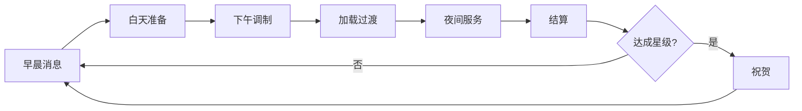
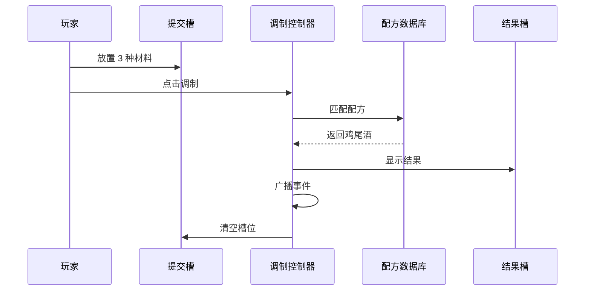
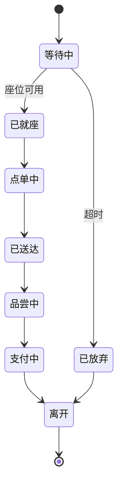
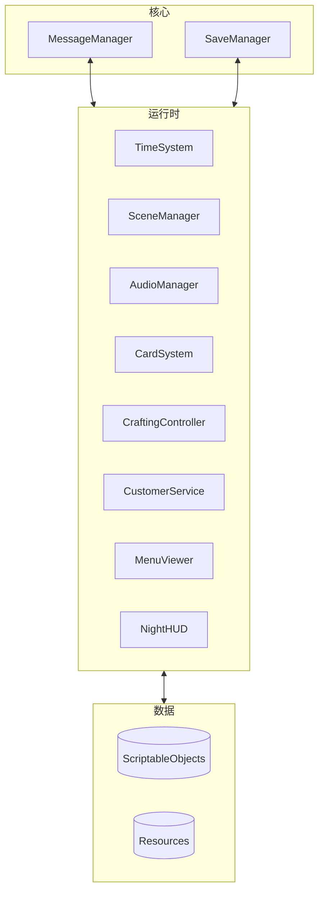

<div align="center">

# 🍸 Taberna Noctis

**基于 Unity 的鸡尾酒酒吧管理游戏**

[](https://unity.com/)
[](https://docs.microsoft.com/en-us/dotnet/csharp/)
[](LICENSE)

*掌握调酒艺术，管理顾客情绪，打造酒吧声誉的策略性鸡尾酒制作体验。*

**Language / 语言版本 / Kieli / Språk**: [English](README.md) | [中文](#) | [Suomi](README_FI.md) | [Svenska](README_SV.md) | [Dansk](README_DA.md)

[功能特性](#-功能特性) • [游戏系统](#-游戏系统) • [架构设计](#-架构设计) • [文档](#-文档) • [快速开始](#-快速开始)

</div>

---

## 📖 概述

**Taberna Noctis** 是一款精致的酒吧管理模拟游戏，玩家需要调制鸡尾酒、服务不同的顾客，并在顾客满意度和商业成功之间寻找微妙的平衡。游戏基于 Unity 构建，具有强大的卡牌制作系统、动态顾客情绪机制和声誉驱动的进度系统。

### 🎯 核心概念

- **3 材料调制**：组合三种材料创造经典鸡尾酒
- **顾客心理**：管理五种不同的情绪状态（忙碌、易怒、忧郁、挑剔、友好）
- **经济策略**：平衡材料成本、鸡尾酒定价和顾客满意度
- **声誉系统**：通过优质服务和配方掌握建立酒吧声望

---

## ✨ 功能特性

### 🎴 卡牌制作系统
- **16 种材料卡**：基酒、利口酒、苦精和新鲜食材
- **8 款经典鸡尾酒**：马天尼、曼哈顿、古典、尼格罗尼、玛格丽特、戴基里、莫斯科骡子、自由古巴
- **兜底配方**："不可描述之物"鸡尾酒（错误组合会受到严重惩罚）
- **配方发现**：在配方书中解锁并记录成功的配方

### 👥 动态顾客系统
- **5 种顾客角色**：上班族、组长、自由职业者、老板、大学生
- **5 种情绪状态**：每种都影响顾客行为和满意度
- **角色倍率**：不同的支付比例（0.9x - 1.5x）
- **队列管理**：实时顾客到达、就座和服务流程

### 💰 经济与声誉系统
- **双重反馈循环**：
  - **情绪系统**：影响即时小费和收入
  - **声誉系统**：驱动长期酒吧评级和顾客质量
- **策略定价**：平衡材料成本与鸡尾酒价格
- **利润优化**：从 $14（戴基里）到 $31（尼格罗尼）不等

### 🎵 音频与氛围
- **动态 BGM**：昼夜无缝过渡，带淡入淡出效果
- **自适应音效**：情境感知的发牌、混合和服务声音
- **场景协调**：`BgmSceneCoordinator` 管理游戏阶段的音频

### 🛠️ 开发者工具
- **消息系统窗口**：订阅、发送、记录和导出游戏事件
- **随机数监控器**：跟踪 RNG 流，带直方图可视化
- **存档查看器**：检查和管理存档槽，带 JSON 预览
- **顾客监控器**：实时队列和服务状态跟踪
- **场景序列管理器**：可视化和自动播放构建设置

---

## 🎮 游戏系统

### 每日循环流程



### 调制工作流程



### 顾客服务流程



---

## 🏗️ 架构设计

### 系统概览



### 核心技术

- **Unity 引擎**：核心游戏框架
- **Easy Save 3**：持久化数据管理
- **DOTween**：动画和补间
- **消息总线模式**：解耦系统通信
- **ScriptableObjects**：数据驱动设计

### 目录结构

```
Assets/
├── Scripts/
│   ├── 0_General/          # 核心系统（消息、存档、音频、卡牌）
│   ├── 3_DayScreen/        # 白天阶段（配方书）
│   ├── 4_AfternoonScreen/  # 下午调制
│   ├── 5_NightScreen/      # 夜间服务（顾客、菜单、HUD）
│   ├── 6_SettlementScreen/ # 日终结算
│   └── 7_CongratulationScreen/
├── Editor/                 # 编辑器工具和窗口
├── Resources/              # 运行时加载资源
└── Documents/              # 开发文档
```

---

## 📚 文档

`Documents/EN/` 文件夹中提供了全面的技术文档：

### 核心系统
- **[项目开发指南](Documents/EN/Project_DevDoc.en.md)** - 完整架构和工作流程
- **[卡牌系统参数](Documents/EN/CardSystem_Parameters.en.md)** - 所有材料和鸡尾酒数据
- **[鸡尾酒配方系统](Documents/EN/CocktailRecipe_System.en.md)** - 配方设计和机制

### 专业系统
- **[调制系统设计](Documents/EN/CraftingSystem_Design.en.md)** - 材料匹配和结果显示
- **[顾客系统](Documents/EN/CustomerSystem_DevDoc.en.md)** - 生命周期、情绪和结算
- **[音频系统](Documents/EN/AudioSystem_DevDoc.en.md)** - BGM 协调和自适应音效
- **[队列系统](Documents/EN/QueueSystem_DevDoc.en.md)** - 顾客到达和就座
- **[存档系统](Documents/EN/SaveSystem_DevDoc.en.md)** - 持久化和数据管理
- **[随机系统](Documents/EN/RandomSystem_DevDoc.en.md)** - RNG 流和监控

### 工具与实用程序
- **[编辑器工具与诊断](Documents/EN/EditorTools_AndDiagnostics_DevDoc.en.md)** - 开发实用工具
- **[配方书与夜间菜单](Documents/EN/RecipeBookAndNightMenu_DevDoc.en.md)** - UI 持久化
- **[卡牌拖放指南](Documents/EN/CardDragDrop_Guide.en.md)** - 交互系统

---

## 🚀 快速开始

### 前置要求

- **Unity 2022.3+**（推荐 LTS 版本）
- **Visual Studio 2022** 或 **Rider**
- **Git** 版本控制

### 安装步骤

1. **克隆仓库**
   ```bash
   git clone https://github.com/yourusername/Taberna-Noctis.git
   cd Taberna-Noctis
   ```

2. **在 Unity 中打开**
   - 启动 Unity Hub
   - 点击"添加"并选择项目文件夹
   - 使用 Unity 2022.3 或更高版本打开

3. **导入依赖**
   - Easy Save 3
   - DOTween（免费版或专业版）
   - 其他包（参见 `Packages/manifest.json`）

4. **构建设置**
   - 打开 `文件 > 构建设置`
   - 验证场景顺序与 `SceneSequenceWindow` 匹配
   - 选择目标平台并构建

### 快速启动

1. **开始场景**：`0_Start`
2. **创建/加载存档**：`1_SaveFilesScreen`
3. **完整游戏循环**：早晨 → 白天 → 下午 → 夜晚 → 结算
4. **使用编辑器工具**：`自制工具` 菜单用于调试和监控

---

## 🎯 游戏技巧

### 配方掌握
- **从简单开始**：自由古巴（★☆☆☆☆）- 白朗姆 + 可乐 + 青柠
- **学习经典**：古典（★★★☆☆）- 波本威士忌 + 糖浆 + 安格斯图拉苦精
- **掌握复杂**：尼格罗尼（★★★★★）- 金酒 + 金巴利 + 甜味美思

### 顾客策略
- **老板顾客（1.5x）**：提供高声誉鸡尾酒（尼格罗尼 +5，马天尼 +4）
- **挑剔顾客**：使用金酒、干味美思、甜味美思、金巴利
- **忧郁顾客**：提供莫斯科骡子（+3）或自由古巴（+2）
- **避免不匹配**：不要给忙碌顾客提供莫斯科骡子（-5）

### 经济优化
- **高利润**：尼格罗尼（$31）、曼哈顿（$27）、马天尼（$24）
- **最佳性价比**：古典（$19 利润，$38 成本）
- **安全选择**：戴基里（友好 +3，低成本 $29）

---

## 🛠️ 开发

### 编码规范
- **命名**：表达性名称；函数用动词，变量用名词
- **控制流**：守卫子句和早期返回
- **注释**：仅用于非显而易见的维护关键注释
- **资源路径**：集中常量（例如 `GlobalAudio`）

### 消息系统
系统集成的关键事件：
- `CRAFTING_RESULT(CocktailCardSO)` - 鸡尾酒已调制
- `SERVICE_PAYMENT_COMPLETE(income, ratingDelta)` - 顾客已支付
- `RECIPE_BOOK_REFRESH_REQUEST` - 更新配方书
- `QUEUE_DISPENSE_STARTED/FINISHED` - 发牌状态

### 测试清单
- ✅ 所有配方产生正确的鸡尾酒
- ✅ 无效组合的兜底"不可描述之物"
- ✅ 顾客情绪计算准确
- ✅ 支付公式：`价格 + max(0, ΔM × 1.2 × 角色倍率)`
- ✅ 声誉系统正确更新
- ✅ 存档/加载保留游戏状态

---

## 🤝 贡献

欢迎贡献！请遵循以下指南：

1. **Fork** 仓库
2. **创建**功能分支（`git checkout -b feature/AmazingFeature`）
3. **提交**更改（`git commit -m 'Add AmazingFeature'`）
4. **推送**到分支（`git push origin feature/AmazingFeature`）
5. **打开** Pull Request

### 开发工作流程
- 遵循现有代码风格和约定
- 为新功能添加/更新文档
- 提交前彻底测试
- 使用编辑器工具进行调试

---

## 📝 许可证

本项目采用 MIT 许可证 - 详见 [LICENSE](LICENSE) 文件。

---

## 🙏 致谢

### 第三方资源
- **Easy Save 3** - 持久化数据管理
- **DOTween**（Demigiant）- 动画框架
- **Febucci** - 文本动画效果
- **ParadoxNotion** - 行为框架
- **Sirenix Odin** - Inspector 增强
- **ConsolePro** - 增强调试

### 特别感谢
- Unity 社区提供的工具和资源
- 所有贡献者和测试人员

---

<div align="center">

**用 ❤️ 和 🍸 制作**

[报告 Bug](https://github.com/yourusername/Taberna-Noctis/issues) • [请求功能](https://github.com/yourusername/Taberna-Noctis/issues) • [文档](Documents/EN/)

</div>
